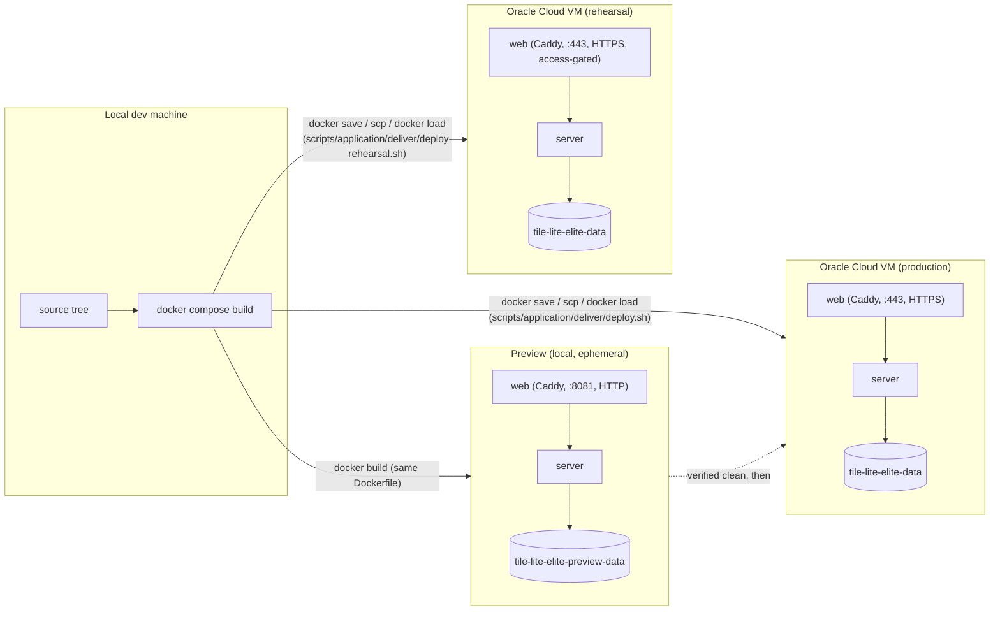

# Architecture

## System Overview

A server and two clients:

```text
Server (Axum, port 3000)   ←→   Web client (WASM in the browser; dev port 8080)
                           ←→   Desktop client (native window)
```

The server owns all game state, rule enforcement, scoring and persistence;
the clients are presentation layers that call its API. The components and the
main interactions are [1.2](1.2-components-and-interactions.md); what runs in
each environment is [4.1](4.1-configuration.md#environments).

**Deployment view** ([what that means](diagrams/README.md#which-view-a-diagram-takes-and-saying-so)) — which containers run in which environment.



One `Dockerfile` builds every image in every environment; they differ only in
configuration (`docker-compose.preview.yml` against `docker-compose.yml`) and
where they run. The commands are [3.3](3.3-testing-ci-and-release.md) and
[3.4](3.4-production-environment.md).

## Guiding Principles

**The server is authoritative.** Game state, scoring, move validation, turn
order, endgame and the word lists are decided by the server. The same rules
code is compiled into the clients so they can preview a move's legality and
score before it is submitted; the server revalidates every move.

**Rules and engine are separate.** Board state, racks, move history and
word-list lookups are the rules layer (`rules-shared`). Search, heuristics
and move selection are the engine layer (`engine-core`), which depends on the
rules and not the other way round.

**Free to host.** Simple deployment, low operational overhead, and nothing that
needs a paid managed service: a single server, SQLite, and lightweight clients
([1.3](1.3-technology-decisions.md)).

## Main Roles

**The game's creator** creates a game, chooses its edition and move time
limit, fills its seats with players, open or emailed invitations or engines,
manages the roster before the start, starts it, and may abort it or
force-resign an unresponsive player ([2.7](2.7-authentication-and-invitations.md)).

**A participant** places tiles, passes, exchanges or resigns, chats, and sees
the game's current state and history, reconnecting to a game in progress.

## Clients

| client | state |
| --- | --- |
| web | built: the WASM build of `crates/ui`, served by Caddy |
| desktop | built: the native build of the same crate |
| mobile | not built; the mobile client project is #423 |

Both clients share the rules library for previews and own no canonical state.

## Engines

Engines run on the server, in-process, never in a client. A seat is given to an
engine when it is filled; the server asks the engine for a move and applies it
through the same validation as a player's ([2.3](2.3-engine-interface.md)).

## Crates

| crate | holds |
| --- | --- |
| `rules-shared` | the rules: board, validation, scoring, move generation, dictionaries and word lists |
| `engine-core` | the engine trait and the Greedy engine |
| `server-game` | the server: game lifecycle, turns, persistence, accounts, the API |
| `api` | the request and response types shared by the server and the clients |
| `ui` | the web and desktop clients |
| `admin-cli` | the operator's command-line tool |
| `wordlist-tools` | importing and generating word lists |

Which workstream owns each is [5.2](5.2-workstreams.md).

## Persistence

The server keeps canonical game state in one SQLite database per environment,
with `-wal` and `-shm` sidecar files in normal operation. Games, moves,
accounts and ratings are persisted; clients' state and engine search state are
not ([2.4](2.4-persistence.md)).
