# 1.5 Work in progress

**What is in flight, drawn from the issues.** Regenerate with:

```bash
./scripts/roadmap-diagram.py --write docs/1.5-work-in-progress.md
```

Everything between the markers is generated and will be overwritten. Nothing
here is maintained by hand, so it cannot disagree with GitHub — the same
reasoning as [4.9](4.9-delivery-log.md)'s *change history is derived from git*.

Solid arrows are **blocked by**, dotted lines are **parent**, and the italic
line under each title is its **Phase**.

**A flowchart rather than a Gantt.** `Q1`–`Q3` order the work without dates, so
a Gantt would need dates invented, which is exactly what that ordering avoids.

```mermaid
flowchart LR
  n355(["#355 #214 delivery 2: one tooling across every env…<br/><i>Scope</i>"])
  n10["#10 Bot client harness: run an engine as an exter…<br/><i>Scope</i>"]
  n272(["#272 #71 work package: Undo and Redo<br/><i>Q3</i>"])
  n271(["#271 #71 work package: Additional Client UI<br/><i>Q3</i>"])
  n300["#300 The rules-shared data structures: board size,…<br/><i>Q2</i>"]
  n296["#296 Account states: leaving, and being stopped fr…<br/><i>Q2</i>"]
  n293["#293 The desktop client: a product with somewhere …<br/><i>Q2</i>"]
  n270(["#270 #71 work package: Additional Game Lifecycle<br/><i>Q2</i>"])
  n269(["#269 #71 work package: Core Client UI<br/><i>Q2</i>"])
  n241["#241 Nobody has ever rebuilt this instance, and re…<br/><i>Q2</i>"]
  n292["#292 The word lists: one greylist for every editio…<br/><i>Q1</i>"]
  n291["#291 Capacity planning: what is consumed, against …<br/><i>Q1</i>"]
  n290(["#290 #71 work package: the client is a major versi…<br/><i>Q1</i>"])
  n268(["#268 #71 work package: Core Game Lifecycle<br/><i>Q1</i>"])
  n71["#71 #71 MAIN PROJECT: One Game Model<br/><i>Q1</i>"]
  n353(["#353 #344 delivery 2: the four process diagrams<br/><i>Design and Test Approach</i>"])
  n344["#344 Release branches: a release stabilises on its…<br/><i>Design and Test Approach</i>"]
  n224["#224 Monitoring and alarming: report what we did, …<br/><i>Design and Test Approach</i>"]
  n214["#214 One deployment path, three environments, one …<br/><i>Design and Test Approach</i>"]
  n301["#301 Display names have no length or character rul…<br/><i>Development</i>"]
  n297["#297 Nothing tells us when a dependency has moved …<br/><i>Development</i>"]
  n295["#295 Admin CLI: sign an account out, so the delete…<br/><i>User testing</i>"]
  n310["#310 A post-deployment check that waits for a rele…<br/><i>Post-deployment</i>"]
  n288["#288 A build does not state its own contents<br/><i>Post-deployment</i>"]
  n252["#252 Test accounts have no suite or run, and are i…<br/><i>Post-deployment</i>"]
  n214 -.- n355
  n344 -.- n353
  n71 -.- n290
  n71 -.- n272
  n71 -.- n271
  n71 -.- n270
  n71 -.- n269
  n71 -.- n268
  n71 --> n10
```

<!-- roadmap-diagram:start -->



<!-- roadmap-diagram:end -->

## Reading it

A node with no arrow into it is startable now. A cluster hanging off one dotted
parent is a project and its work packages — [#71](https://github.com/delphside/tile-lite-elite/issues/71)
is the large one.

**If there are no solid arrows at all**, no `blocked by` relationships are
recorded on the issues, and the diagram is showing structure only. The script
says so on stderr when it happens.
