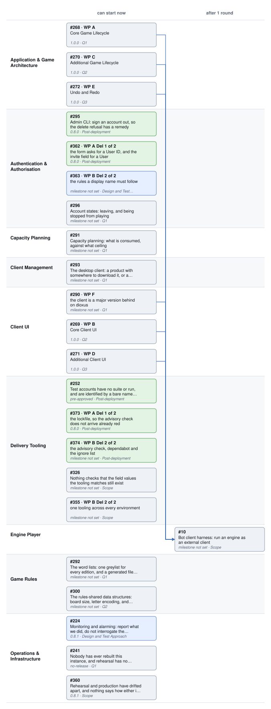

# 1.5 Work in progress

**What is in flight, drawn from the issues.** Regenerate with:

```bash
./scripts/roadmap-diagram.py --write docs/1.5-work-in-progress.md
```

Everything between the markers is generated and will be overwritten. Nothing
here is maintained by hand, so it cannot disagree with GitHub — the same
reasoning as [4.9](4.9-delivery-log.md)'s *change history is derived from git*.

**A Gantt without dates.** Swimlanes are **workstreams** and sequencing runs
left to right: a bar sits to the right of everything recorded as blocking it,
and anything with nothing recorded against it starts at the left. A column is a
position in the sequence, not a month — `Q1`–`Q3` order the work without dates,
and inventing dates is exactly what that ordering avoids.

Each bar is a **delivery**: a work package or a standalone project, which is to
say an issue that carries a delivery milestone. A parent project delivers
nothing and so has no bar; its work packages do. Arrows are **blocked by**, as
GitHub records them — the project board has no column that can show these,
which is why they are drawn here. The italic line under each title is its
milestone and Phase, and the shading is the Phase band.

The chart is `docs/diagrams/roadmap.svg`, generated from the board rather than
drawn by hand — the command above rewrites both it and the block below. It is
SVG rather than an inline Mermaid block because Mermaid has no swimlane
primitive; [`diagrams/README.md`](diagrams/README.md) says what was tried.

<!-- roadmap-diagram:start -->



*23 deliveries in 9 workstreams. 1 dependency recorded and drawn as 6 arrows, so 22 can start now.*

*No dates: a column is a position in the sequence, not a month. Bars are all one width because a Gantt bar's width means duration, and this chart has none. Shading is Phase: planned, designing, building, landed.*

*A dependency on a parent project is drawn against each delivery it makes, because that is what waiting for a parent means: #71 → #10.*

<!-- roadmap-diagram:end -->

## Reading it

A bar in the first column is startable now: nothing recorded stands in front of
it. A bar further right is waiting, and the arrows say what for.

**If almost everything sits in the first column**, that is the honest picture
rather than a drawing fault — dependencies are recorded on issues by hand, and
most have none. The script says so on stderr when it finds none at all. Adding
one to an issue in GitHub is what moves a bar right; nothing else does, and
Phase deliberately does not.

**A dependency recorded against a parent project** is drawn against every
delivery that parent makes, because a parent has no bar of its own and waiting
for a parent means waiting for all of it. The caption lists any that were
lifted this way.
