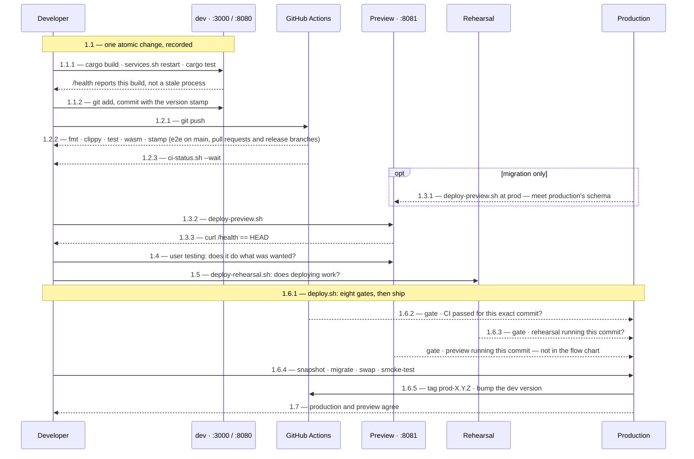

# Testing, CI & Release

Verifying a change and shipping it, end to end. Four environments, each
answering a different question:

| | asks |
| --- | --- |
| **dev** | does the code I am writing work? |
| **preview** | does the change do what was wanted? |
| **rehearsal** | does *deploying* it work? |
| **production** | — |

Plus CI, which asks whether anything that used to work still does.

**Three parts, and you probably want one of them.**

| part | for | holds |
| --- | --- | --- |
| **[What to type](#1-what-to-type)** | executing the process | the diagram, the steps, the exact commands, and what proves each one worked |
| **[The process, and why it is shaped this way](#2-the-process-and-why-it-is-shaped-this-way)** | understanding it | the environments, the three axes, the rules, and what each is for |
| **[Notes and incidents](#3-notes-and-incidents)** | when something surprises you | the failures that produced each rule, and the traps |

Nothing in part 1 explains itself; nothing in parts 2 and 3 is needed to ship a
change. Material is repeated between them where repeating it saves a jump.

## 1 What to type

Commands only. Every step says where it runs, what to type, and what proves it
worked. The reasoning is in [The process, and why it is shaped this
way](#2-the-process-and-why-it-is-shaped-this-way); the failures that produced
each rule are in [Notes and incidents](#3-notes-and-incidents) — steps 1.1 to
1.6 each have one, under [3.1 Notes on shipping a
change](#31-notes-on-shipping-a-change).

**Where these run.** Everything below runs on the development machine, in the
repository root, unless it says otherwise:

```bash
cd ~/tile-lite-elite
```

The exceptions are the two that reach a running box. They are the *only* way to
see container logs or the live database — `scripts/admin.sh` deliberately does
not reach production:

```bash
ssh tile-lite-elite            && cd ~/tile-lite-elite   # production VM
ssh tile-lite-elite-rehearsal  && cd ~/tile-lite-elite   # rehearsal VM
```

**The pipeline at a glance.** The same seven steps twice: once by **place**,
once by **time**.

**Three levels, and only two of them are headings.** The leading `1` is this
document's **part 1**, so `§1.2` already means *part 1, step 2* — there is no
extra digit hiding at the front.

| | | |
| --- | --- | --- |
| `1` | `## 1 What to type` | the part |
| `1.2` | `### 1.2 Push, and let CI judge it` | the step — a real heading |
| `1.2.3` | an arrow in both diagrams | the third part of that step. **No heading, deliberately** |

So a diagram and the text are read together on the first two digits, and the
third orders what happens inside one step: `1.1.1`–`1.1.2` are things you do,
`1.6.1`–`1.6.5` are what one command does on your behalf. **Both diagrams use
the same numbers as each other.**




**The steps, one line each.**

**Shipping a change** — seven steps, in order:

| | step | one line |
| --- | --- | --- |
| **1.1** | record the change | build, restart dev, unit-test, commit with the version stamp |
| **1.2** | push | CI's verdict is a deploy gate, not a signal |
| **1.3** | deploy to the preview environment | the same images production will get, locally |
| **1.4** | user testing | the one judgement no script makes |
| **1.5** | rehearse the release, and run the technical tests | the only test of the release *mechanism*, and where a claim no person can judge is asserted by a script |
| **1.6** | ship it | `deploy.sh` — eight gates, then snapshot, migrate, swap, smoke-test, tag, bump |
| **1.7** | verify what is live | production and preview report the same version |

**A release branch** — normal, and only where changes are grouped:

| | step | one line |
| --- | --- | --- |
| **1.8** | keep a release branch current | forward-merge after every release, and at scope close |
| **1.8.1** | merge a project into a release branch | `merge-to-release.sh`, which judges the incoming run **and** the tip |
| **1.9** | release a release branch | merge first, fast-forward, then 1.3 – 1.7 |
| **1.10** | delete a branch once its change is live | merged means done, not deployed |

**When something is wrong** — not part of a normal release:

| | step | one line |
| --- | --- | --- |
| **1.11** | roll back production | go back to a release that worked |
| **1.12** | roll back across a migration | database and images together, or the container will not boot |
| **1.13** | ship an emergency change | only when going back cannot help |

**Asking a question**, changing nothing:

| | step | one line |
| --- | --- | --- |
| **1.14** | diagnostics | what is where, what is outstanding, what is broken |

### Which steps apply — the four flavours

#### First, the route

**`Route` is a field on the issue**, and it decides how a change reaches its
users. Defined in [3.6 §2.15](3.6-change-lifecycle.md#215-classifying-a-change);
here is what each one means for the steps below:

| route | |
| --- | --- |
| **Production Release** — anything built into the image | takes a semver, and needs the full lap to production |
| **Repository Change** — anything else in the repository | live on `origin/main`, so it never deploys |
| **Other** — a host, a console, preview or rehearsal | whatever applying it takes, recorded in [4.9](4.9-delivery-log.md) |

**The routes are read in that order.** A production release changes the
repository too, so *Repository Change* means **anything else** in it — the route
is the heaviest one a change touches, not the first that fits.

#### Then the shape

**A change comes in one of four shapes**, decided by fields already recorded
rather than by judgement: the `Route` above, the milestone, and how many
projects the release carries.

| | `Route` | milestone | branch | pull request | delivery log |
| --- | --- | --- | --- | --- | --- |
| **A · pre-approved change** | Repository Change · Other | `pre-approved` | none | none | no row |
| **B · repository change with a branch** | Repository Change | previous semver plus a letter | one project branch | yes | a row |
| **C · project release** | Production Release | a semver | one project branch | yes | a row |
| **D · multi-project release** | Production Release | a semver | a release branch, and one per project | one each, plus one for the release | a row |

**Which steps each uses**, and the numbers are section numbers rather than an
order — C and D run 1.9 in the middle:

| | steps |
| --- | --- |
| **A** | 1.1 → 1.2. The push to `main` **is** the delivery |
| **B** | 1.1 → 1.2 → **1.9** merge → 1.10 delete. No deploy: it is live when it lands |
| **C** | 1.1 → 1.2 → 1.3 → 1.4 → 1.5 → **1.9** merge → 1.6 → 1.7 → 1.10 |
| **D** | 1.1 → 1.2 per project → **1.8.1** merge each in → **1.8** sync with `main` → 1.3 → 1.4 → 1.5 → **1.9** merge → 1.6 → 1.7 → 1.10 |

**A release is always C or D.** Never A, and never a Production Release
committed straight to `main`: `main` is what gets deployed, so an unproven
release commit there blocks every other release until it is proven or removed.
That rule is [3.6 §2.2](3.6-change-lifecycle.md#22-when-to-branch-and-what-pre-approved-means),
and it is why 1.9 sits *before* 1.6 in both.

**The difference between C and D is only where the merging happens.** One
project fast-forwards `main` directly; several are gathered on a release branch
first, each merge gated by 1.8.1, and the branch tip is what is proven and then
fast-forwarded. Everything from 1.3 onwards is identical.

#### What a release branch is, and the rule that keeps it rebuildable

**A release branch is for a release built from more than one development
branch.** It is not needed when a release comes from a single branch. The use
cases are a release taking changes from multiple projects, and a large project
with multiple work packages.

**Changes are only made on the development branches, never on the release
branch directly**, so the release branch can always be rebuilt from the source
branches. The scope can be changed by rebuilding it from a different subset of
them — which is the property that makes dropping a project from a release
cheap, and it is lost the moment something is committed to the release branch
alone.

**Rollbacks and Emergency Changes**  If there is a problem following a release then it can
be rolled-back quickly as described in step 1.11.  This is the preferred solution.
However if required an emergency change can be made bypassing the full process and
deploying straight to production.  This is described in 1.13.  Emergency changes are
considered to be part of the *Production Release route* with permission to miss out parts of
the normal process.

### 1.1 Record the change

**Where:** development machine, repository root.

One atomic change per commit, with the version stamp first. Build, run and
unit-test before committing — that is part of making the change, not a stage
after it.

```bash
cargo build --workspace
./scripts/services.sh restart          # refreshes server *and* web client
cargo test --workspace
git add -A
git commit -m "app 0.6.3 api 2.13: what it does, and why"
```

Every subject starts `app <X.Y.Z> api <M.N>:`, matching that commit's own
`Cargo.toml` and `API_VERSION`. CI fails a commit without it; check before
pushing:

```bash
./scripts/check-commit-stamp.sh origin/main..HEAD
```

Use `Refs #N` in the body, and `Closes #N` only where the change never leaves
the repository — [3.6 §2.5](3.6-change-lifecycle.md#25-tracking-a-change-to-production)
says why.

**Proved by:** `cargo test --workspace` exits 0, `./scripts/check-commit-stamp.sh`
exits 0, and dev is running what you just built rather than a stale process:

```bash
curl -s http://127.0.0.1:3000/health
```

### 1.2 Push, and let CI judge it

**Where:** development machine.

```bash
git push origin main                   # or the branch
```

You need not watch it — `deploy.sh` refuses a commit whose run has not passed.
To ask early:

```bash
./scripts/ci-status.sh --run push:<branch> --wait
```

**Proved by:** the command exits 0. `check` runs on every push; `e2e` runs only
on `main`, pull requests and manual runs.

### 1.3 Deploy to the preview environment

**Where:** development machine. Preview answers on `http://localhost:8081`.

```bash
./scripts/deploy-preview.sh            # build a fresh checkout of HEAD
```

**Testing a migration**, seed preview from production's live commit first, so
the migration meets production's schema rather than an empty volume:

```bash
./scripts/deploy-preview.sh at prod    # wipe, then build production's commit
./scripts/deploy-preview.sh            # then build HEAD on top of it
```

**Proved by:** the script exits 0, and `curl -s localhost:8081/health` reports
`app_version` equal to `HEAD`.

### 1.4 User testing

**Where:** a browser, at `http://localhost:8081`.

Use the change and decide whether it does what was wanted. If something is
wrong, fix it and start again from 1.1 — the new commit invalidates the
rehearsal host, and the deploy will refuse until it is redeployed.

**Proved by:** nothing mechanical. This is the judgement no script makes, and
`deploy.sh` can only check that the commit was *deployed* to preview, never
that anybody looked at it.

**When user testing is finished, the build that ships is a new one** — the
release commit, not the one that was tested. It goes round again in order:
preview (1.3), then rehearsal (1.5), then production (1.6). That is not
ceremony: the gates compare commits, so a release whose preview and rehearsal
hosts hold an earlier commit is refused, and the thing tested is genuinely not
the thing shipped once a merge or a version bump has happened since.

### 1.5 Rehearse the release, and run the technical tests

**Where:** development machine; it deploys to the rehearsal VM.

Two questions, and they are not the same one. Preview answered *does it do what
was wanted?* Rehearsal answers *does deploying it work?* and *does it behave
correctly on hardware like production's?*

#### 1.5.1 Does deploying work?

```bash
./scripts/deploy-rehearsal.sh
```

Same script and same steps production gets, against a machine built to match it.
Nothing here is a release: no `prod-*` tag, no version bump, no milestone closed.

**Proved by:** exit 0, and `deploy.sh`'s gate agreeing — it reads the rehearsal
host's `/health` and requires the exact commit being shipped.

#### 1.5.2 Does it behave correctly on production-like hardware?

**Every release answers two testing questions**, and they are answered
independently: *does this involve functional changes that require user testing?*
— which is step 1.4, on preview — and *does this involve technical changes that
require technical testing?*, which is here.

Technical testing is where a claim no person can judge by using the site is
asserted by a script, on hardware that matches production:

```bash
./scripts/check-rate-limits.sh                       # limits still refuse, and still serve everybody else
cargo run --release --example rate_limit_load        # where they trip, on rehearsal's hardware
./scripts/bench-rehearsal.sh                         # engine timings, beside the last run on the same host
```

**The benchmark runs here because a release is the trigger it was missing.**
Benchmarking at a known performance change already happened — the tiered
dictionary was measured on production the day it landed, 0.77 ms median before
and 0.50 ms after. What had no trigger was the release: 0.7.0 and 0.7.1 both
shipped with no production-class number between 30 July and 3 September.
Attaching the run to a step that happens anyway is what closes that (#291 R7).

**It is a check and never fails a release.** Timings move for reasons that are
not regressions, and a threshold failing a release on a noisy p99 would be
routed around within two releases. It prints the new row beside the previous one
for the same host; a person decides.

**A development machine says nothing about a 2 vCPU box**, which is why these
cannot move earlier. Limits, timing, memory and headers are the shape of it.

**Both answers can be *no*, and that is the one worth catching**: a change nobody
can show works has not been tested, it has been deployed hopefully. `yes/no`
sends it to preview alone, `no/yes` to rehearsal alone, `yes/yes` to both.

**The two answers are two task lists in the project's test approach**, under
headings matched literally by tooling:

| heading | answers | run at |
| --- | --- | --- |
| `### Functional user tests — Preview` | does it do what was wanted? | 1.4 |
| `### Technical tests — Rehearsal` | does it behave correctly on production-like hardware? | 1.5.2 |

`verify.sh` counts the unticked boxes and names any project in the release
milestone with tests outstanding. It **reports**; it does not refuse — #240
shipped with its `revoke` test unrun, which was harmless, and a gate would have
refused a correct release. What was missing was being told. #289.

**Proved by:** each script exiting 0, against the rehearsal host.

### 1.6 Ship it

**Where:** development machine. **Run it bare** — piping into `tail` reports
the *pipe's* exit status, not the script's.

```bash
./scripts/deploy.sh                    # HEAD
./scripts/deploy.sh <commit-ish>       # a specific commit — see 1.11
```

Read the milestone before deploying, because the deploy closes **every open
issue in it**, shipped or not:

```bash
gh issue list --milestone X.Y.Z --state open --json number,title,issueType
```

**The gate now says what each one is, and how many commits mention it** —
`#229  Project  … (7 commits)`. Two things follow from the type. An issue that is
not a `Project` raises a warning, because a milestone is a release and a release
is made of project deliveries (§1.1); a requirement is closed when it folds into
a project, so it should not be carrying a milestone at all. And the count
replaced a boolean that could not report success — see §3.3.2.

Two escape hatches, each meaning something specific:

| | |
| --- | --- |
| `DEPLOY_SKIP_PREVIEW=1` | there was nothing for a person to look at — not "I did not look" |
| `DEPLOY_SKIP_CI=1` | GitHub itself is the problem — not a way around a failing test |

**Proved by:** exit 0. It refuses on nine counts, and on the way through it
snapshots the database, applies migrations as their own step, swaps the
containers, smoke-tests the public URL for the exact version, tags the commit
`prod-<version>`, publishes a **GitHub Release** on that tag, and moves the dev
version one patch ahead. If migrations or
the smoke test fail it calls `rollback.sh` itself.

When it fails and the reason is not on the terminal:

```bash
ssh tile-lite-elite
cd ~/tile-lite-elite && docker compose logs --tail=50 server
```

### 1.7 Verify what is live

**Where:** development machine.

```bash
./scripts/deploy-preview.sh verify     # preview and production report the same version
./scripts/verify.sh                    # or assert the whole world, exit non-zero if not
./scripts/verify.sh --quick            # three seconds
```

**Proved by:** exit 0. `verify.sh` counts a check it could not run as a
failure, so an absent answer never reads like a passing one.

### 1.8 Keep a release branch current

*A release branch exists only where a release combines more than one development
branch — see the routes above. Nothing has needed one yet.*

**Where:** development machine. **After every release, and once more when the
release's scope closes.** Merges flow one way — from the faster queue into the
slower ones:

```bash
git checkout 0.7.0
git merge main
git push
```

The version line conflicts every time. **Keep the branch's**:

```text
<<<<<<< HEAD
version = "0.7.0"
=======
version = "0.6.4"
>>>>>>> main
```

**Proved by:** `git merge` exiting 0 with `Cargo.toml` still reading the
branch's version.

#### 1.8.1 Merge a project into a release branch

**Where:** development machine. **Project pull requests target the release
branch**, not `main` — `gh pr edit <n> --base release/X.Y.Z`.

```bash
./scripts/merge-to-release.sh <pr-number>
```

**It asks two things, and the second is the one that gets forgotten:**

1. the pull request's own run is green — that is the run which exercises `e2e`
   for a branch;
2. the **release branch's current tip** is green — otherwise a good change is
   merged onto rubble and inherits the blame.

**No pull request's run ever tests the combination.** It tests its branch
against its base at that moment; two projects merged together are a state
nothing has run. So (2) is not belt and braces, it is the only thing between
*each part was fine* and *the whole is fine* — and the rehearsal at 1.5 is what
finally proves the combination.

**A missing run is refused, not passed.** `--allow-missing-run` overrides it and
still says so. *No run found* reading as success is what let 0.5.0 through.

**Deploy is the last responsible moment; merge is the cheapest one** — the
change is still in one person's head and nothing has been built on top. `e2e`
went red on `0cc012e` and `ea8ff8e` was merged over it two days later, because a
branch's own push runs were green when `e2e` had not run.

**Two `ci.yml` rules make this work**:

- `e2e` runs on a **push** to `release/*`, not only on a pull request, so the
  tip has a real verdict rather than a green one that skipped the job.
- `cancel-in-progress` excludes `release/*` as well as `main`. Two merges in
  quick succession would otherwise cancel the first run and leave the commit it
  judged with no verdict — the same failure as 0.5.0's, reached by merging
  rather than by deploying.

**Proved by:** the suite in `scripts/tests/merge-to-release.test.sh`, and by the
gate refusing a red tip, which is the case a blunt implementation misses.

### 1.9 Merge a branch into `main`

**Where:** development machine. **The same command for a project branch and a
release branch**, because the question is identical: `main` must receive a
commit that has already been proven.

**Prove it first, then move `main`.** Steps 1.3 – 1.5 run against the branch
tip; only when they have passed does `main` move to it:

```bash
git rebase origin/main          # so the merge below can fast-forward
git push --force-with-lease     # the branch now carries the commit that will land
#   ... 1.3 preview · 1.4 user testing · 1.5 rehearsal, against that commit ...
git checkout main
git merge --ff-only <branch>
git push origin main
#   ... then 1.6 ship it, and 1.7, from `main` ...
```

**This order is the reason a release takes a branch at all.** `main` is what
gets deployed, so a release commit sitting there unproven blocks every other
release until it is proven or removed — [`CLAUDE.md`](../CLAUDE.md), and
[3.6 §2.2](3.6-change-lifecycle.md#22-when-to-branch-and-what-pre-approved-means).
Merging first and rehearsing afterwards puts exactly that commit on `main`.

**Corrected 2026-09-07.** This step used to read *"the merge comes before the
deploy… then 1.3 – 1.7 as normal, from `main`"*, which contradicted its own
failure path below — *start the preview and rehearsal lap again* only makes
sense if that lap happened before the merge. The failure path had the right
model and the happy path did not.

If `--ff-only` fails, `main` has moved: rebase again and start the preview and
rehearsal lap again, because the rebased commit is a commit nothing has tested.

**Proved by:** `git merge --ff-only` exiting 0 — which is also the proof that
the commit tested is the commit released, byte for byte. **The rebase is where
the SHA changes; the merge is where it must not.**

**Never merge this one with GitHub's button.** Its three methods are merge
commit, squash and rebase, and **none of them is a fast-forward**: each either
adds a commit nothing has tested or rewrites the SHA, and either destroys the
guarantee above. A release may have a pull request — for the combined diff and
a place to comment — but it is merged with the command above and pushed;
GitHub sees its head commit land on `main` and marks it merged.

**The same trap applies to `gh pr merge --rebase`**, which rebases at merge time
and never writes the result to the branch. The commit that ships then exists
nowhere until the merge creates it. That is fine when the deploy follows the
merge, and wrong whenever the branch was rehearsed first — which, on a release
branch, it always is.

### 1.10 Delete a branch once its change is live

**Where:** development machine. "Live" means merged into whatever it will ship
from, not deployed.

```bash
git branch --merged main                       # the candidates
git branch -d issue-79-last-move-highlight     # -d, not -D: refuses if unmerged
```

A release branch is merged locally, so GitHub never sees it and both halves are
manual:

```bash
git push origin --delete 0.7.0
git branch -d 0.7.0
```

**Proved by:** `verify.sh` reporting no merged-and-remote-deleted branches left
behind.

### 1.11 Roll back production

**Where:** development machine. Needs no preparation of your working tree — it
can be done mid-change.

```bash
./scripts/deploy-preview.sh at prod-0.6.1    # re-stage it first — always
./scripts/deploy.sh prod-0.6.1               # ship it
```

**Production only ever moves to the commit preview currently holds**, and the
rehearsal gate enforces it, so skipping the re-stage fails the deploy rather
than shipping something untested.

In a crisis, when there is no time to re-stage, the faster form is a retag and
a database restore on the VM — seconds, no build, no gates:

```bash
./scripts/rollback.sh                        # list snapshots and the :previous image
./scripts/rollback.sh pre-0.6.2-1c8275f-20260817T133553Z.tgz
```

Listing is what it does with no arguments; the destructive form has to be named,
and it then asks you to type that name again. **A snapshot named
`pre-<version>-<commit>` was taken immediately *before* that commit was
deployed**, so restoring it returns you to whatever was live before it — not to
that commit.

**Proved by:** exit 0, then 1.7.

### 1.12 Roll back across a migration

**Where:** development machine.

An older image will not boot against a newer database — `sqlx` validates on
startup and refuses. `deploy.sh` checks for this and stops rather than shipping
a container that would die. To go back past a migration, restore the database
and the images together:

```bash
./scripts/rollback.sh                          # list snapshots and the :previous image
./scripts/rollback.sh pre-0.6.2-...tgz         # database + images back, in one step
./scripts/rollback.sh --db-only pre-0.6.2-...tgz   # database only, images untouched
```

**This discards everything written since the snapshot** — every game, move and
account. It is for a rollback minutes after a release, not a way to recover
last week.

**Proved by:** exit 0, and `/health` reporting both the old version and a
schema the image knows.

### 1.13 Ship an emergency change

**Where:** development machine. In order:

```bash
./scripts/rollback.sh                                            # 1. go back to what worked
DEPLOY_EMERGENCY="logins 500 since 14:20" ./scripts/deploy.sh    # 2. only if 1 cannot help
```

The reason is not decoration — it goes into the retrospective issue `deploy.sh`
raises for itself. `DEPLOY_EMERGENCY=1` works and records "(no reason given at
the time)", because a deploy must never be blocked on paperwork.

It skips the preview and rehearsal gates and **nothing else**: CI including
e2e, the commit being on a remote branch, and the schema check all still apply.
The tag and version bump happen as normal; the milestone and its issues are
**not** closed — close what actually shipped by hand once things are calm.

**Proved by:** exit 0, then 1.7 — and a retrospective issue appearing on
GitHub.

### 1.14 Diagnostics and occasional commands

**Where:** development machine. None of these changes anything.

| | |
| --- | --- |
| `./scripts/status.sh` | where every open change is, and what each environment is running |
| `./scripts/verify.sh` | **assert** everything is in place; exit non-zero if not |
| `./scripts/inbox.sh [days]` | what has been said on GitHub since you last looked |
| `./scripts/ci-status.sh --run push:<branch> --wait` | ask CI's verdict early |
| `./scripts/deploy-preview.sh at <ref>` | wipe preview and build a specific commit |
| `./scripts/deploy-preview.sh at prod` | seed preview from production's live commit |
| `./scripts/deploy-preview.sh verify` | confirm preview and production match |
| `./scripts/deploy-preview.sh down` / `reset` | stop it, keeping or wiping its data |
| `./scripts/rollback.sh` | list snapshots and the rollback image |
| `./scripts/check-commit-stamp.sh origin/main..HEAD` | check version stamps before pushing |
| `./scripts/check-rate-limits.sh` | assert the throttle's shape against a running host |

Running one crate's tests rather than the workspace:

```bash
cargo test -p rules-shared          # rules, scoring, validation
cargo test -p server-game           # HTTP-level integration against the real router
cargo test -p tile-lite-elite-ui    # move composer, seat presets
cargo test -p engine-core           # engine
```

On a running box, where a question can only be answered there:

```bash
ssh tile-lite-elite
cd ~/tile-lite-elite
docker compose logs --tail=50 server
docker compose exec server tile-lite-elite-admin users list
```

## 2 The process, and why it is shaped this way

Why each step exists, what each environment answers, and the rules the tooling
enforces. The commands themselves are in [What to type](#1-what-to-type).

### 2.1 Why each step exists

**The seven steps are three stages running at different rates.** Recording and
pushing happen many times a day; standing it up and looking at it happens per
change; rehearsing and shipping happen per release.

**CI answers *is this commit good?*; the scripts answer *is the system in the
state I think it is?*** Neither substitutes for the other, which is why a green
CI run does not let a deploy skip its gates.

#### 2.1.1 Deployments build a commit, never the working tree

**Every deploy builds a clean `git worktree` at the target commit.** Since #214
it builds it once and every environment loads the same artefact.

**That is what makes roll-forward and rollback the same operation**: both name a
commit and deploy it. Nothing about a rollback is a special path.

**Preview is always in the sequence**, even where there is visibly nothing to
look at — `DEPLOY_SKIP_PREVIEW=1` says so deliberately rather than by omission.

**Preview runs on the laptop, never on the production VM**, so looking at
something never competes with the live service for the machine.

### 2.2 The four environments

| | runs | for | reached by |
| --- | --- | --- | --- |
| **dev** | `cargo run` and `dx serve` on the laptop | building, and fast feedback | `./scripts/services.sh` |
| **preview** | the real images in Docker, on the laptop | *looking at it* — user testing | `./scripts/deploy-preview.sh` |
| **rehearsal** | the real images on an Oracle VM matching production | the production clone: does deploying work, and does it behave on that hardware | `./scripts/deploy-rehearsal.sh` |
| **production** | the same, on the live VM | users | `./scripts/deploy.sh` |

**Only rehearsal gates a release.** `deploy.sh` refuses a production deploy whose
commit rehearsal is not running. Preview is gated too, but only for a release,
and `DEPLOY_SKIP_PREVIEW=1` says there is nothing for a person to look at.

**Rehearsal is a production clone, not merely a deploy rehearsal.** It is the
only place a claim about production hardware can be tested — timing, memory,
limits — which is why the technical tests run there and not in preview.

**Preview runs on the laptop, never on the production VM**, so looking at
something cannot compete with the live service for the machine.

**Deploys build a commit, never the working tree** — see [2.1.1](#211-deployments-build-a-commit-never-the-working-tree).

### 2.3 The environments, and the steps between them

*Which step moves code where is the diagram in [1 What to type](#1-what-to-type).
The rules it illustrates are in [2.2](#22-the-four-environments) — what each
environment is for — and [2.1.1](#211-deployments-build-a-commit-never-the-working-tree):
both deployment arrows start at git, not at the working tree.*

### 2.4 Running Tests

```bash
cargo test --workspace
```

Runs every crate's tests, including the `old-crates/*` prototypes (harmless — see [1.4 Roadmap](1.4-roadmap.md)'s "CLI Prototype" step). To run just one crate:

```bash
cargo test -p rules-shared    # rules/scoring/validation unit tests
cargo test -p server-game     # HTTP-level integration tests against the real Axum router
cargo test -p tile-lite-elite-ui     # move-composer logic, game-creation seat presets
cargo test -p engine-core     # engine tests
```

No coverage for the WASM target specifically — `cargo test` always runs against the host target, not `wasm32-unknown-unknown`; see [Development](3.2-development.md#manual-web-client) for how to sanity-check a WASM build compiles.

#### 2.4.1 How the tests are shaped

**Tests build their own world.** No server, database or container needs to be
running: each creates a throwaway SQLite file and constructs the Axum router
in-process. That is why CI runs them on a bare runner, and why one test's
state never reaches another.

Two depths, chosen by what each can reach:

- **In-process.** Hand a `Request` to the router with `tower`'s `oneshot` and
  read the `Response`. Routing, extractors, handlers and status codes all run;
  no socket exists. Fast, and a failure points at the handler.
- **Over a socket.** Bind `127.0.0.1:0` and serve, for the few things a
  function call cannot reach. `require_loopback` reads `ConnectInfo`, which
  only a real connection populates — so in-process tests inject
  `loopback_peer()`, while a socket test gets `127.0.0.1` from the kernel.

**Testing a binary**: `cargo test` builds the package's binaries and supplies
their paths as `CARGO_BIN_EXE_<name>`, so a test can spawn the real
executable — freshly built, never stale, no install step. It must live in
that package's own `tests/` directory; the variable is not set elsewhere.

`crates/admin-cli/tests/user_deletion.rs` is both at once, and the only test
that needs to be: it hosts a server on a loopback port and spawns the real
admin binary against it. Everything the CLI adds — resolving a name to an
account, the exit code, the message — has no other route to a test, and
neither does the `into_make_service_with_connect_info` wiring that
`require_loopback` depends on.

**Prefer a walk to a point check.** `crates/server-game/src/app/`
`tests_account_lifecycle.rs` is the worked example: rather than asserting one
state, each test builds an attachment, watches an action refused, removes the
reason, and watches the same action succeed. Proving only the refusal would
pass against code that refused everything, and every defect that module has
found was a sequence rather than a state — resign then abort, invite then add
a seat. Its header says why it covers more than its name suggests.

#### 2.4.2 A new check is shown to fail before it ships

**Write the check, then break the thing it watches, and see it go red.** Only
then wire it in. A check that has never fired cannot tell *nothing to do* from
*not looking*, and both look identical in a green run.

The `scripts/tests/*.test.sh` suites are built this way: each stubs `gh`, feeds
the script a world where the answer is known, and includes the **quiet case** —
the run where the check should say nothing — because that is the case a broken
check passes by accident. `deploy-milestone.test.sh` earned it: an early version
matched the API call by name, so a malformed mutation passed the test and would
have failed the deploy.

D37, decided 2026-09-01.

#### 2.4.3 How a test design specification is built

The section above is about the shape of test *code*. This one is about the
document written before it, for a change big enough that "write some tests"
would not have said what to write.

**On the name.** We called this a *test plan* until 2026-08-21. The standards
reserve that for a management document — scope, schedule, resources, risks — and
call what we actually write a **test design specification**: techniques, test
conditions and pass/fail criteria. We do not write a test plan in that sense and
should not start; one developer and no schedule to coordinate. The three terms,
so a reader who knows them is not misled:

| term | what it means | ours |
| --- | --- | --- |
| **test strategy** | the test levels performed and the testing within them, holding across every change | [2.4](#24-running-tests) and this section |
| **test approach** | the strategy applied to one project: environment, tools, what is measured against what criteria | a project's *test approach* heading, or §8 of its design specification |
| **test design specification** | techniques, conditions, pass/fail criteria — the detail | this document |
| *test plan* | scope, schedule, resources, risks for one project's testing | **we do not write one** |

Two are in the repo, and they are the reference rather than this description:

- [Deleting a user](changes/41-user-deletion-test-design.md) (#41) — functional,
  user-testable, and the one that established the method.
- [Rate limiting](changes/25-rate-limiting-test-design.md) (#25) — non-functional,
  with nothing for a person to look at, so a script on the rehearsal host makes
  the judgement instead.

**A plan lives with its change, in `docs/changes/`, and stays after it ships.**
It is the documentation for the regression tests it produced — what they cover,
and why they cover it — which no amount of reading the test file recovers. The
user-deletion plan spent its first months as a comment on an issue, and was
nearly lost.

**Why write one at all.** The user-deletion plan found about as many gaps in the
requirements as in the tests, several in behaviour that had already shipped.
That is the return: working through what can happen is what surfaces the
questions nobody has answered, and the requirement gaps were the more valuable
half. It is cheaper to find them at a desk than in production.

##### 2.4.3.1 The parts

**The ten parts are the template's own headings** — `docs/templates/test-design-specification.md`.
Copy it rather than reading a description of it.

What the shape is for, which the template does not say:

**Rules first, checked before anything derives from them.** Conditions, outcomes
and scenarios are all built on the rules, so a wrong rule is wrong everywhere.

**Every refusal is followed by a success.** A test that only watches something be
refused passes when the feature is broken in a way that refuses everything.

**Coverage is written both ways** — every rule to a scenario, and every scenario
back to rules — because each direction finds a different gap.

**Tests are named for the behaviour, never for a scenario number**, so the name
still means something when the specification is rewritten.

**Gaps are recorded as gaps**, each saying what would make the missing test fail.
A gap nobody wrote down is indistinguishable from coverage.

##### 2.4.3.2 The rigour is the point

The method is heavier than the change usually looks like it deserves, and that
is the trade being made deliberately. Its value is not the tests at the end but
the questions it forces on the way through — which conditions can actually
co-occur, what the operator sees, which rule this behaviour is even serving.
Both plans changed the requirements before they changed any code.

### 2.5 Continuous Integration

**Two workflows.** `ci.yml` is the gate; `docs.yml` carries the one check CI
cannot make, because it is about the pull request rather than the code.

`.github/workflows/ci.yml`, **three** jobs:

| job | runs on | does |
| --- | --- | --- |
| **`check`** · *fmt · clippy · test · wasm · docs* | every push, every pull request, and on demand | `check-docs.sh`, `cargo fmt --check`, the shell suites, `clippy -D warnings`, `cargo test --workspace`, the log-hygiene suite against [4.7](4.7-log-events.md), and the wasm build |
| **`stamp`** · *commit stamp (app/api versions)* | the same | refuses a commit whose subject does not carry both versions |
| **`e2e`** · *Playwright · preview stack* | pull requests, on demand, and pushes to `main` — after `check` | builds the preview stack in Docker and runs the Playwright suite against it |

`.github/workflows/docs.yml`, **one** job:

| job | runs on | does |
| --- | --- | --- |
| **`review-checklist`** | every pull request that is not a draft | fails while any box under a review heading in the body is unticked |

**`docs.yml` deliberately runs no lint, link or placement check** — `check`
already runs `scripts/check-docs.sh` on every push, and a second copy would be
the same check twice and two places to change it.

**It has no `paths:` filter**, since a review checklist is about the pull
request *body*, not about which files changed. It had one until 2026-09-07,
left over from when this file did run the document checks — so a pull request
touching only `crates/` or `scripts/` got no run at all.

**CI is a deploy gate, not a signal.** `deploy.sh` refuses a commit whose
push-to-`main` run has not passed, via `scripts/ci-status.sh` — so the check made
by hand and the one the release enforces are the same code.

**`e2e` is conditional because it builds an image**, so a lint failure never
burns a Docker build. It is also why `e2e` is `needs: check` rather than
parallel.

**`RUSTC_WRAPPER=""`** disables the sccache wrapper `.cargo/config.toml` sets for
local dev: sccache is not on the runner and is incompatible with wasm.

#### 2.5.2 What GitHub does on its own

**2.5 says which jobs there are and what they do. This says exactly when they
run, and what GitHub does whether or not we ask.** Several of these have caused
defects. Read off the workflows rather than remembered.

| | fires on |
| --- | --- |
| `ci.yml` — the whole workflow | `push` (**any** branch), `pull_request`, `workflow_dispatch` |
| its `e2e` job, within that | `pull_request`, `workflow_dispatch`, or a push to **`main` or `release/*`** |
| `ci.yml` concurrency | group `ci-<ref>`. A newer run **cancels** an in-progress one, **except** on `main` and `release/*`, where it **queues** behind it instead |
| `docs.yml` | `pull_request` — opened · edited · synchronize · reopened · ready_for_review. No path filter, so every pull request gets it |

**Ticking a box is an `edited` event**, which is why the checklist goes green
without anybody re-running anything.

**Six behaviours of GitHub itself**, each of which the process works around:

| | |
| --- | --- |
| **a `skipped` job still concludes the run `success`** | why a gate names a run *and* requires a job — `ci-status.sh --run push:main --require e2e`. The commit released as 0.5.0 had three green runs and one failed `e2e` |
| **no fast-forward merge** | the button offers merge-commit, squash and rebase. Each adds an untested commit or rewrites the SHA, so a release is merged with `git merge --ff-only` — [1.9](#19-merge-a-branch-into-main) |
| **pushing a pull request's head commit to its base marks it merged** | which is how 1.9 closes the pull request without using the button |
| **`Closes #N` fires when the commit reaches the default branch** | *written*, not *shipped*. So commits say `Refs #N`, and the milestone means "in production" — the deploy is what closes them |
| **`issue_comment` workflows run the copy on the default branch** | never the pull request's, so a change to comment handling takes effect only after it merges |
| **an unknown `--reviewer` login warns on stderr and creates the pull request anyway** | four pull requests requested nobody before it was noticed on 2026-09-07. The owner's login is recorded in [4.8](4.8-artefacts.md) |

**Branch protection on `main`** requires the `check` job, and the owner and the
machine account bypass it — which is what lets `deploy.sh` push the version
bump, and why every push to `main` reports *"Bypassed rule violations"*.

### 2.6 Preview Environment

**Preview is where you look at something**, not a step towards production.
`deploy-preview.sh at <ref>` builds any ref, so *show me this on my phone* and
*stand up the release candidate* are separate acts sharing an environment.

| | |
| --- | --- |
| `deploy-preview.sh` | build and deploy `HEAD` |
| `at <git-ref>` | the same for any ref, **wiping the preview volume first** |
| `at prod` | the same, finding the ref by reading production's `app_version` |
| `down` | stop it, keeping the data |
| `reset` | wipe the database |

**The volume persists between runs**, which is why `at` wipes it: a ref from
before a migration would otherwise meet a database from after one.

### 2.7 Version numbers: which to bump, and when

Three separate checks, easy to conflate and each with a different rule.
Run through them before every commit — the third is the one that has
actually been missed in practice.

**The answers, for when you are committing rather than reading.**

| check | the answer, nearly always |
| --- | --- |
| **1. Subject stamp** | `app <X.Y.Z> api <M.N>: subject`, both read out of the tree rather than from memory — the two commands are below |
| **2. App version** | **It does not move.** `deploy.sh` bumps it once per production release. A minor or major is *branched to*, not bumped into. |
| **3. API version** | Moves only if the **wire contract** changed, in the same commit as the change: breaking → **major**, additive (including a newly accepted *value*) → **minor**, anything a client cannot observe → **none**. A change to `crates/ui` alone moves nothing. |

```bash
grep -m1 '^version' Cargo.toml                             # app
grep -m1 'API_VERSION: ApiVersion' crates/api/src/lib.rs   # api
```

Everything below is why each rule is that way, and the case that produced it.

#### 2.7.1 Check the commit subject carries both versions

Every commit subject starts `app <X.Y.Z> api <M.N>:` — the same `app`/`api`
words `GET /health` reports, so a commit and a running server speak one
vocabulary. Read both straight out of the tree rather than from memory:

```bash
grep -m1 '^version' Cargo.toml                        # app — the workspace version
grep -m1 'API_VERSION: ApiVersion' crates/api/src/lib.rs   # api — major/minor
```

Both are the *working tree's* values, which is what you are about to
commit — not what production is currently running. The app version leads
production by one — `deploy.sh` moves it there itself, at step 6.

#### 2.7.2 Decide whether the app version moves

Usually it doesn't. The app version is bumped **once per production
release**, and `deploy.sh` does it for you the moment a deploy succeeds —
not per commit, and not at the start of a change. That is what keeps the
working tree permanently one ahead of production, so no commit is ever
built carrying a version number that is already live.

The automatic bump is a patch, and that is right, because the patch line is
what `main` is for — the isolated path, and the only one that releases from
`main` directly. **A minor or major version is not bumped into, it is branched
to**, and the number is chosen when the branch is created, with the scope in
front of you rather than remembered afterwards. See
[How a change reaches production](3.6-change-lifecycle.md#1-the-flow-how-a-change-reaches-production) below.

**The bump is skipped after a rollback**, because the tree is already ahead of
what just went live and bumping again would leave a version number nothing was
ever built at. `deploy.sh` decides this by asking whether the commit it shipped
is the branch tip, not by being told it was a rollback, so a deploy of any
earlier commit skips it too.

Until that changed, the rule here was "edit `Cargo.toml` yourself afterwards
for a minor". Nobody ever did, across every functional release the project has
had. A default that is usually right and silently wrong the rest of the time
is not a rule, it is a trap.

#### 2.7.3 Decide whether the API version moves

Bump it in the same commit as the change it describes, never afterwards.

**The API version describes the wire contract. It does not deliver client
updates** — a hash of the built bundle does that, see [How a client learns
there is a new build](#274-how-a-client-learns-there-is-a-new-build) below.

| change | bump |
| --- | --- |
| breaking route/DTO change — an old client cannot continue | **major** |
| additive, non-breaking — old clients still work, without the new thing | **minor** |
| anything a client cannot observe on the wire | none |

**"Additive" includes a new accepted *value*.** Adding an edition to the
registry means `variant` accepts something an older client has never heard
of, which is a capability that client can now use. That is the case that has
been missed: 0.4.13 shipped the `spicy` edition at api 2.5 unchanged.

**A change to `crates/ui` alone moves nothing.** A client bug fix is not a
contract change, and until 0.4.17 it had to pretend to be one, because api
skew was the only thing that made a tab reload. That is what publishing the
build id replaced.

Record the reasoning in the comment block above `API_VERSION` while it is
fresh. Those comments are the only place the judgement calls survive.

The name is worth reading past. It was introduced on the assumption that a
client update implied an API behaviour change, and that turned out to be
false — which is why the two signals are now separate. Renaming
`API_VERSION` / `HealthDto.api_version` / the `api M.N` in commit subjects
is a wire change, so it is left alone deliberately.

#### 2.7.4 How a client learns there is a new build

One id, the **build id**, published by both containers — see
[4.1's versioning table](4.1-configuration.md#versioning) for how it sits
alongside the api and app versions.

- the **server** stamps `x-build-id` on every response
- the **web container** serves it as `/version.txt`, written into its image
- the **client** has it compiled in, so it knows its own

Every deploy moves it, including server-only ones: the Dockerfile compiles
`TILE_LITE_ELITE_BUILD_ID` into the wasm as well as the server, so a new commit
is new client code whatever the change was.

**A tab therefore knows three ids and needs only equality.** The header is the
trigger — free, on traffic already happening — and it can only say the *server*
moved. Confirming takes the web container, which is the sole thing that knows
what is actually being served:

| observation | what it does |
| --- | --- |
| web ≠ server | a deploy is in flight — wait |
| client = web | up to date — nothing to do |
| otherwise | reload |

The middle case is why the header cannot decide alone. During a deploy the two
containers are briefly on different commits, and a tab reloading then fetches
the old bundle, sees the header again, and loops.

The id is validated as plain hex before use: Caddy's SPA fallback answers a
missing `/version.txt` with **index.html and a 200**, and treating that as an id
would reload forever. A dev build sets no id at all, writes no `version.txt`
and sends no header — every comparison then answers "cannot tell", and the
client declines to reload, which is the behaviour to preserve.

**`/version.txt` used to hold a hash of the built files.** That only ever
changed because the build id was inside the wasm being hashed, so it was an
indirection over the commit that could not name the commit it meant — and it
made the deploy window something to survive by polling rather than something a
tab could recognise.

Desktop is unaffected — it has no bundle to re-fetch, so the api version
still drives its mandatory/optional update prompts.

### 2.8 The change lifecycle

**Moved to [3.5 The change lifecycle](3.6-change-lifecycle.md)** on 2026-08-21 —
the terms, the three-stage flow, how a release is shaped, and the rules that
govern all of it.

Owner: *"3.3 has become a lifecycle document from requirement being raised to
production delivery. Which is fine, but perhaps the lifecycle rules and the
environmental technical stuff should be separated."*

**This document holds the mechanisms; 3.5 holds the rules.** The environments,
continuous integration, the deploy script, rollback, and the runbook of what to
type are here. What a project is, when to branch, how a release is assembled and
what each step owes are there.

### 2.10 The diagnostic tools

**Listed in [3.0](3.0-tools.md), which is the register.** What matters here is
which question each answers:

| | |
| --- | --- |
| `status.sh` | where every open change is, what each environment runs, how far behind `main` |
| `inbox.sh` | what changed on GitHub since you last looked |
| `actions.py` | what is waiting on a person, grouped by workstream |
| `verify.sh` | is the process in the state it should be — run after a deploy, and trust its exit status |
| `roadmap-diagram.py` | what is in flight and what depends on what, into [1.5](1.5-work-in-progress.md) |

**What none of them answers is *what is in each release*.** The milestone is the
shipping list, and [4.9](4.9-delivery-log.md) records what each delivery carried.

#### 2.10.1 Checking a bundled asset in production

**A bare asset path answers 200 whether the asset is there or not.** Caddy's SPA
fallback returns `index.html` for every unmatched path, so `curl -sI` on a name
that does not exist looks exactly like success — the same trap as the missing
`/version.txt` in 2.7.4.

**The name to check is the hashed one, and it is in the wasm.** `asset!` emits a
content-hashed filename into the bundle, so `file_server` serves a real file
before the fallback is reached and the bare path is never requested. To find it:

```bash
wasm=$(curl -s https://tileliteelite.com/ | grep -o '/assets/[^"]*\.wasm' | head -1)
curl -s "https://tileliteelite.com$wasm" | strings -a | grep -o '<name>-[0-9a-f]*\.<ext>'
```

Then check *that* path, and confirm the content type is what the asset is rather
than `text/html`.

**The served HTML is not where to look.** `document::Link` elements are injected
after the wasm boots, so the icon, and anything else declared that way, is absent
from the page a `curl` returns. Only a real browser sees them.

### 2.11 Rolling back

Deploying an earlier release is the same command with a ref, and needs no
preparation of your working tree — you can do it mid-change:

```bash
./scripts/deploy-preview.sh at prod-0.4.12   # re-stage it first — always
./scripts/deploy.sh prod-0.4.12              # ship it
```

**Re-deploy preview first, always** — even for a commit that has been staged
before. **Production only ever moves to the commit preview currently holds.**
[1](#32-notes-on-rolling-back) [2](#32-notes-on-rolling-back)

**This is aimed at production.** `DEPLOY_ENV=rehearsal` works, and exists for
the same reason `deploy-rehearsal.sh` does — so the rollback can be *rehearsed*
before it is needed, rather than performed for the first time during an
incident. It was proven end to end that way in the 2026-08-01 drill.

#### 2.11.1 Rolling back across a migration

**Migrations only run forward, and an older image will not start against a newer
schema.** So a rollback across one is not an image change but a data one.

**The mechanism is the snapshot** `deploy.sh` takes before every deploy, restored
alongside the older image.

**It discards everything written since** — every game, move and message. That is
the cost, and it is why `deploy.sh` tells you before it bites: it compares the
schema the target commit knows with the one the database is on, and says so
rather than failing at startup.

### 2.12 Emergency changes

Three kinds of change reach production, and they differ in what may be assumed
rather than in how urgent they feel:

| | what it is | path |
| --- | --- | --- |
| **normal** | anything planned | branch, look at it, merge, release |
| **standard** | pre-approved and repeatable | deploy and smoke-test |
| **emergency** | production is broken now | this section |

**In a crisis, in order:**

```bash
./scripts/rollback.sh                                     # 1. go back to what worked
DEPLOY_EMERGENCY="logins 500 since 14:20" ./scripts/deploy.sh   # 2. only if 1 cannot help
```

Everything below is why, and what the second one gives up.

#### 2.12.1 Roll back first

The first question is not "how do I ship a fix". It is **"can I go back to
what was working"**, and usually the answer is yes:

```bash
./scripts/rollback.sh
```

It is a retag and a database restore — seconds, no build, no transfer — and it
has no gates at all, because it only ever moves production to something that
was already running there. It was proven end to end in the 2026-08-01 drill.

Restoring the database discards writes made since the snapshot, which is the
accepted trade and the reason to do it promptly rather than after an
investigation. Read [Rolling back](#211-rolling-back) before you need it, not
during.

Fixing forward is for when going back cannot help: a bug that has been live for
a week, so there is no good version to return to, or an outage caused by
something outside the image.

#### 2.12.2 The emergency deploy

```bash
DEPLOY_EMERGENCY="logins 500 for everyone since 14:20" ./scripts/deploy.sh
```

The reason is not decoration — it goes into the retrospective issue, and it is
the sentence you will not want to reconstruct tomorrow. `DEPLOY_EMERGENCY=1`
works and records "(no reason given at the time)", because a deploy should
never be blocked on paperwork.

**What it skips, and why only these two:**

| skipped | what it costs normally |
| --- | --- |
| the preview gate | an image build, plus standing it up locally |
| the rehearsal gate | an image build, a transfer, and a deploy to the rehearsal host |

Those are the slow parts. Everything else in the pipeline is automated and
quick, and a check that takes seconds is not worth the risk of skipping.

**What it does not skip:**

- **CI, including e2e.** One complete run is the check worth waiting for — it
  is the only thing between here and production that has actually exercised
  the change. `DEPLOY_SKIP_CI` still exists and still means what it always
  did: *GitHub itself is unreachable*. That is a different problem from
  production being down, and treating them as one would let an emergency ship
  something nothing had run.
- **The commit is on a remote branch.** Bypass it and production runs something
  that exists only on one laptop — nothing to roll back to, and nothing to
  reason about afterwards. A `git push` costs a second.
- **The schema check.** Physics, not policy: an image the database has outrun
  does not boot, so skipping this turns a bug into an outage.

#### 2.12.3 What it still does, and what it deliberately does not

The tag and the version bump happen as normal. Those are *facts* about what is
running, and letting production and the repository disagree would outlast the
emergency.

The milestone and its issues are **not** closed. That is a *claim* that a scope
completed the normal process, which is exactly what did not happen. Close what
actually shipped by hand, once things are calm.

#### 2.12.4 The retrospective is the price

`deploy.sh` raises an issue itself, recording the version, the tag, the reason
given, and what was bypassed. It is raised rather than suggested because a
reminder printed at the worst moment of the week is a reminder that does not
happen — and an emergency change is *retrospectively reviewed*, not unreviewed.
Without that review the emergency path quietly becomes the normal one.

The issue arrives with no type and no release attribute, deliberately: what it turns into is
a judgement. Its checklist separates the two questions this whole section is
built around — **restore service** and **understand the cause** — because
answering the first makes it tempting never to answer the second.

### 2.13 How `deploy.sh` ships an image

**Eight gates, each refusing rather than warning**: the commit is on
`origin/main`; CI passed for it; a pull request run passed where one exists; the
schema the commit knows is not behind the database; the version is readable; the
milestone carries only built work; preview is running this commit; rehearsal is
running this commit.

**Then the sequence** — see [2.13.3](#2133-gating-on-a-particular-run) for what
each step is for and why the order matters.

**Asking without deploying**: `DEPLOY_GATES_ONLY=1 ./scripts/deploy.sh` runs
every gate and stops before the first thing that changes anything. It is also
what makes the gates testable at all.

#### 2.13.1 One build per commit, shared by every environment

**`deploy.sh` builds a commit once.** The images are saved to
`artifacts/<full sha>.tar.gz` in the working copy, git-ignored, and a build runs
only when that file is absent. Rehearsal builds it; production finds it and
loads the same bytes.

It used not to. `deploy-rehearsal.sh` is this script with a different host, so a
rehearsed release built twice from one commit, and Docker builds are not
bit-reproducible: base tags move, apt mirrors move, the toolchain resolves at
build time. Rehearsal proved *a* build of commit X and production shipped
*another*. #214 R1.

| | |
| --- | --- |
| where | `artifacts/<sha>.tar.gz`, plus a `.sha256` and a `.manifest` beside it |
| when it builds | only when that file is absent |
| what proves sameness | the digest, printed on every deploy — `sha256:` in the export line |
| retention | the newest `ARTIFACT_KEEP` (5), pruned after a successful deploy |
| if one is lost | it rebuilds from the commit. It is a cache, not a record |

#### 2.13.2 What is in a build, said by the build

***Is this change in the build?* is answered from the artefact, not
from a plan describing it.** `artifacts/<sha>.manifest` is written beside the
tarball, from git alone — no `gh`, no network, because a manifest that cannot be
written when GitHub is unreachable would be missing exactly when a deploy is
most interesting.

| line | what it says |
| --- | --- |
| `digest` | **the bytes it describes**, so the two cannot be separated by being copied apart — R2 |
| `since` | the newest `prod-*` tag that is an **ancestor** of this commit, which is what the range is measured from |
| the commits | each one in that range, with `*` against those that reach the image, by [`shipping-paths.sh`](../scripts/shipping-paths.sh) |
| the issues | those **claimed** by a `Refs`/`Closes` trailer in that range, and whether any of their commits reach the image |

**Claimed, not mentioned.** A commit citing an issue in prose is not shipping
it — the distinction that refused the 0.7.2 release before D40 corrected it.

**And one disagreement is reported after a successful deploy**: an issue whose
commits reach the image and which carries **no milestone**. The milestone gate
already asks the opposite question — an issue in the milestone that no commit
built — so only the direction nothing else covers is checked here. A
**Requirement** is never asked for one: §1.1 of [3.6](3.6-change-lifecycle.md)
puts milestones on project deliveries, not requirements.

A check, never a gate, and it runs after production is live: a missing milestone
is a record to correct, not a reason to withhold a release that has shipped.

**The digest is the check, not the version.** A rebuild of one commit stamps the
same version, so `/health` cannot tell two builds apart — which is why the
version string could never have caught the thing this fixes. Compare the
`sha256:` from the rehearsal deploy with the one from the production deploy: the
same twelve characters mean the same object.

**A corrupted artefact is refused rather than shipped.** The digest is recorded
at build time and re-checked before every transfer, so a file truncated by a
full disk fails the deploy instead of loading half an image.

#### 2.13.3 Gating on a particular run

**A gate names the run it depends on, and consults nothing else.** One commit can
have several CI runs — a branch push, a pull request, the push to `main` — and
they do not answer the same question.

| the deploy asks | the run |
| --- | --- |
| production | the **push-to-`main`** run for this exact commit, `e2e` included |
| production, where a pull request exists | that run too |
| rehearsal | any passing run for the commit — it exercises a commit that has not reached `main` yet, so requiring the `main` run would make rehearsal impossible |

**`main` is exempt from `cancel-in-progress`**, so a run that a deploy depends on
is never killed by the next push.

**The sequence, once the gates pass**, and the ordering is the point — everything
destructive happens after everything that can refuse:

1. build the artefact, or reuse the one for this commit
2. transfer it and load the images
3. snapshot the database
4. run migrations **separately**, so a failure there is not an outage
5. start the new version
6. smoke-test `/health` for the **exact version**, not merely a 200 — a container
   that never restarted also answers 200
7. tag the commit, and bump the dev version when rolling forward

**If a migration or the smoke test fails, `deploy.sh` rolls back on its own**,
by calling `scripts/rollback.sh --yes` with the snapshot it took at step 3 — the
same code you would run by hand, so the automatic recovery and the manual one
cannot drift apart. If that rollback also fails it says so loudly and names the
snapshot to restore.

## 3 Notes and incidents

The reasoning that does not fit beside a rule: the failures each rule came from,
the alternatives rejected, and the traps that cost an evening. Referenced from
the parts above; never required by them.

### 3.1 Notes on shipping a change

The failures and judgements behind [What to type](#1-what-to-type)'s first seven
steps. Nothing here is needed to execute the process.

#### 3.1.1 Why the steps are written down at all

Three rules, in this order, because anyone can forget a step:

1. **Make sure the steps are accurate.** A step that describes something the
   system no longer does is worse than no step, because it is followed.
2. **Make sure the tooling enforces them.** A gate that checks the world —
   what the rehearsal host is actually running — beats one that asks whether
   you remembered.
3. **Follow the steps.**

Each layer catches what the one before it misses, and only the first can be
checked by reading.

The division of testing is the reason the shape holds:

| | where | what it answers |
| --- | --- | --- |
| unit tests | while making the change | does the piece I wrote work |
| technical + regression | CI, after the push | did I break anything that used to work |
| user testing | preview, step 4 | does it do what was actually wanted |
| the release mechanism | rehearsal, step 5 | does deploying it actually work |

#### 3.1.2 Why the dev restart matters

`services.sh restart` kills whatever holds `:3000`/`:8080`, including an
orphan the PID file doesn't know about. A stale server is silent and
costly: a rebuilt client against an old one fails with cryptic wire-type
errors that look like a code bug and aren't.

#### 3.1.3 Why the look happens on preview rather than in dev

This is the functional pass, and it is the one thing no script can do.
Correctness and regressions were CI's job and are already answered. It
happens on preview rather than in dev because preview is the last point
where what you are looking at is certainly what ships — same container,
same build, same migration path.

#### 3.1.4 What rehearsal actually tests

The same script and the same steps production gets, against a machine built to
match it. This is not another look at the change — that was step 1.4. It is the
only test of the **mechanism**: `docker save`, the transfer, `docker load`, the
`:previous` retag, the database snapshot, migrations as their own step, the
smoke test. It is also where the technical tests run (step 1.5.2), for the
claims a development machine cannot settle.

##### The same commit, not yet the same image

**Until #134, production builds its own image.** Rehearsal proves the mechanism
against this commit; `deploy.sh` then builds the commit *again* for production.
The two agree in practice because the build is hermetic in everything we
control — but the base tags are not pinned. `rust:1-bookworm`,
`debian:bookworm-slim` and `caddy:2-alpine` all float, so a Caddy minor release
landing between the two builds would mean rehearsal tested a web server
production does not run.

**And the gate cannot see it.** `TILE_LITE_ELITE_BUILD_ID` is the target SHA, so
a rebuild stamps the *same* version string: rehearsal and production report
identical `/health` output while running different bytes. That is not a weak
gate, it is a blind one — which is why *"they have always agreed"* is not
evidence of anything.

**#134 closes it**, and needs no change to the image: the artefact is already
host-agnostic, since the client is built with `TILE_LITE_ELITE_API_BASE_URL=""`
and the Caddyfile takes its hostnames from `{$SITE_ADDRESS}` at run time. Only
`deploy.sh` changes — keep the `docker save` tarball built for rehearsal and ship
*that file* to production, and have the gate compare image digests rather than
version strings.

#### 3.1.5 Where a change with nothing to look at gets tested

Step 3 asks
a person whether the change does what was wanted; some changes have no answer
to that. Rate limiting is the worked example — preview can show that limiting
happens, that the error is decent and that `/health` still answers, but it
runs on a development machine, and numbers checked there say nothing about the
2 vCPU box they protect.

So the judgement moves here and becomes a script:

```bash
./scripts/check-rate-limits.sh              # against the rehearsal host
```

It asserts the shape — refused rather than queued, per caller rather than
globally, health exempt — and deliberately not the numbers, which need real
load rather than a handful of requests. Write the equivalent for any change
whose correctness depends on conditions preview cannot reproduce, and run it
here, where the machine matches.

**`deploy.sh` refuses without it.** The gate reads the rehearsal host's
`/health` and requires the exact commit you are about to ship. Skipping this
step does not produce a riskier release; it produces a release that stops at
the gate.

#### 3.1.6 The gate that is easy to overlook

**Eight gates, counted from `deploy.sh`'s own `note_gate` calls**: `on-remote`,
`ci`, `pull-request`, `schema`, `version`, `milestone`, `preview`, `rehearsal`.
The document said nine until 2026-09-03, which is what a count maintained by
hand does.

**The schema gate is the one that is easy to overlook.** The others ask about
this commit; that one asks about the *database* — whether it has moved past the
schema this build knows. A deploy that passes everything else and fails here is
a rollback that would not start, caught before anything is touched.

#### 3.1.7 It reads the stack, not a browser

The commit comes from preview's own
`/health`, server-side, so what a tab happens to be displaying is irrelevant to
it. Worth knowing because the two can disagree: a browser holding an old bundle
shows an old version while preview is serving the new one, which looks exactly
like the gate having failed to run. It has not — the tab is stale, and #67 is
why.

#### 3.1.8 Run it bare, and why that is not fussiness

Piping into `tail` or `head`
reports the pipe's exit status rather than the script's, so a deploy that
stopped halfway reads as one that finished — which is how a release once tagged
and went live while its version bump and milestone closure silently never ran.
Let it print.

### 3.2 Notes on rolling back

**[1] Why the re-stage has no exceptions.** This is the [B/C stage
split](#21-why-each-step-exists) in practice: stage Andy, stage
Brian, decide Brian needs rework and Andy should ship. Andy was already
rehearsed, so a second pass proves nothing new — but a rule with no exceptions
is worth more than the two minutes it costs. The alternative is a judgement
call ("do I need to re-stage *this* one?") whose wrong answer is silent.

**[2] And it is enforced, not trusted.** The rehearsal gate compares `/health`
against the commit you asked for, so skipping the re-stage fails the deploy
rather than shipping something untested.

It is also not merely ceremonial when moving backwards — see [Rolling back
across a migration](#2111-rolling-back-across-a-migration) for what `at` does
that a plain re-run would not.

The gates are the same ones, applied to that commit. Two behave differently
on the way back, both deliberately:

**CI may have to be re-run for the target commit.** CI's
`cancel-in-progress` concurrency rule cancels a run when a newer push
supersedes it, and a cancelled run is not a pass — the commit was never
judged. Releases you actually deployed will have passed (that was gate two
at the time), but an arbitrary older commit may not have. `ci-status.sh`
accepts a success from *any* run for the commit, not just the newest, so
re-running is the fix; it prints the exact `gh run rerun` command when it
hits this.

**The version bump is skipped.** After a rollback your branch tip is
already ahead of what is now in production, and bumping again would claim a
release that never happened — the version to move on from is the newest
one, not the one just redeployed. The script says which case it took:

```text
==> Deployed 0.4.12 from an earlier commit, so leaving the version alone.
    Your branch (main) is already ahead of what's now in production.
```

The `prod-*` tag is still written, since a rollback is a deploy and belongs
in the deployment log. If that version already carries a tag, a UTC
timestamp is appended rather than moving the existing one — the first
deploy of that version is a fact worth keeping.

### 3.3 Notes on the GitHub Release, and on a gate that stayed silent

**Moved to [3.5 The change lifecycle](3.6-change-lifecycle.md#3-notes-on-release-scope-and-version-numbers)**,
with the sections they annotate.

### 3.3.1 The GitHub Release, and what it is not

**Added 2026-08-27**, from #206's last open question. `deploy.sh` runs
`gh release create` on the tag it has just pushed, with `--generate-notes`, so
GitHub writes the changelog from the pull requests merged since the previous
release. Nobody types it, which is the point: a changelog somebody has to
remember to write is a changelog that stops being written.

**`--notes-start-tag` is passed** when a predecessor exists. Without it GitHub
walks back to the first commit, so the first release ever published would carry
the entire history as its notes. The predecessor is the newest `prod-X.Y.Z`
tag other than this one — matched by a regular expression rather than a glob,
because a redeploy tag carries a timestamp suffix and would otherwise compete.

**It is never fatal.** Production is already serving the new version by the time
this runs. A release that fails to publish prints the command to run by hand and
the deploy still exits 0 — making a green deploy look red is the worse failure.

**Only a first-time tag gets one.** A redeploy of a version already released
would claim a changelog that already exists.

**It does not replace [4.9](4.9-delivery-log.md).** A Release hangs off a git
tag, so the five deliveries of `0.7.0a` to `0.7.0e` — which shipped no code —
can never have one. They are different questions: a Release answers *what
shipped to players in this version*, the delivery log answers *what did we put
in front of anyone, and when*. Owner, 2026-08-27: *"add `gh release create` to
`deploy.sh` and continue to maintain 4.9 as now."*

**And it is where desktop builds would go**, if #38 ever wants a download site:
a Release takes file attachments, which is a download site with no hosting to
run.

### 3.3.2 The gate that could not report success

**A boolean that could only ever say no.** From #194 and #207, fixed 2026-08-28.
The milestone gate asked whether any commit being shipped mentions each open
issue, so it cannot close one claiming it shipped when nothing built it. It asked
like this:

```bash
git log --oneline "$ref" --grep="#${num}\b" | grep -q .
```

`grep -q` exits on its first match. `git log` is still writing, takes **SIGPIPE**
and dies with **141**. The script runs under `set -o pipefail`, so the
*pipeline's* status is 141 and the `if` takes the else branch — reporting
**"NO COMMIT MENTIONS THIS"** precisely because it found one.

| | `git log` | `grep -q` | pipeline under `pipefail` | the gate said |
| --- | --- | --- | --- | --- |
| **matches exist** | killed, 141 | 0 | **141** | not mentioned |
| no matches | 0 | 1 | 1 | not mentioned |

**It is deterministic, not intermittent** — and it depends on volume, which is
why it survived so long. Measured 2026-08-28 from `d2adc63`, where fifty commits
mention #174: **ten runs out of ten** report failure. From `HEAD` the same
command succeeds, which is how an earlier attempt to reproduce it concluded,
wrongly, that it was gone.

**`git rev-list --count` has no pipe**, so there is no race to lose, and it
answers with a number rather than a boolean — which is more use in the message
the gate prints.

**It lived in [`scripts/issue-mentions.sh`](../scripts/issue-mentions.sh)
afterwards, sourced by both callers.** `verify.sh` carried the identical line,
untouched, because it carried an identical *copy* — one defect in two places for
one reason. `scripts/tests/issue-mentions.test.sh` covers it with real commits
from this repository's history, because a fixture with **one** matching commit
passes against the broken code, which is exactly why this survived to fire on a
production release. One of its cases asserts that the old pipeline still fails,
so nobody reintroduces it believing it worked.

### 3.3.3 What a release settles, and what an emergency does not

**Three ways through, and the middle one is why it is a function.** From #207's
R3, 2026-08-28. After a production deploy, `deploy.sh` closes the milestone it
shipped and opens the next; a **rehearsal or preview** deploy settles nothing
because it has not reached users; an **emergency** settles nothing on purpose.

**The emergency case is a deliberate asymmetry.** The tag and the version bump
still happen — those are facts about what is running, and letting production and
the repository disagree would be worse than the emergency. Closing a milestone is
a different kind of statement: that a scope completed the normal process, which
is exactly what did not happen. The retrospective issue carries the record
instead.

**This code was unreachable by any test until it became a function**, because it
runs after a deploy has finished — so exercising it meant deploying. That is how
the defect in #150 survived: the normal-release path sat *inside* the emergency
branch, so a normal release fell off the end of the `if` in silence, and 0.6.0's
eleven issues and its milestone were closed by hand afterwards. Nothing noticed
for a release and a half.

`scripts/tests/deploy-milestone.test.sh` now covers all three paths with a `gh`
that records what it was asked to do. Verified by reintroducing #150's shape —
inverting the emergency test — which fails five of its cases.

### 3.4 Keeping this document honest

**Read it at the process step, not from memory.** A summary goes stale silently;
this does not, because the tooling is checked against it.

**Fill a gap here when it is found**, and change this document as part of
deciding a process change rather than afterwards.

**The numbers are addresses**: every heading is numbered so a rule can be cited.
Renumbering breaks anchors, so `check-docs.sh` verifies them on every commit.

**Where a rule can be checked by tooling, check it there.** A rule that lives
only in a document is one somebody has to remember.
