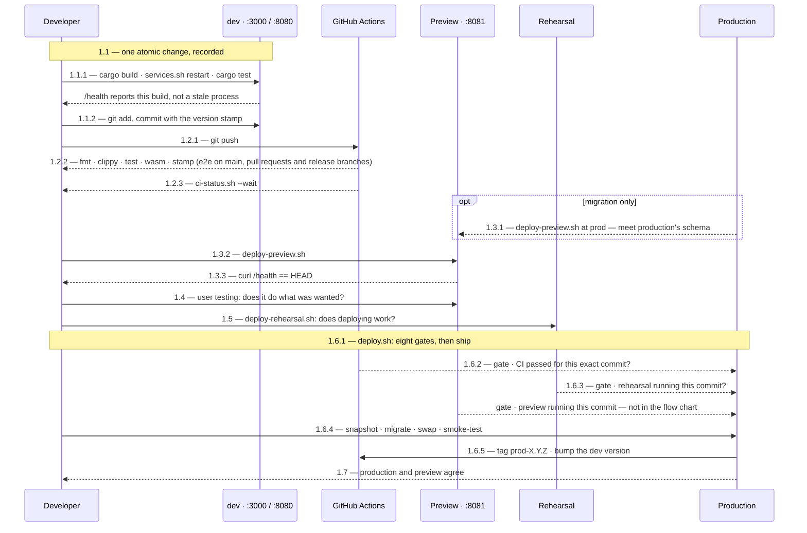
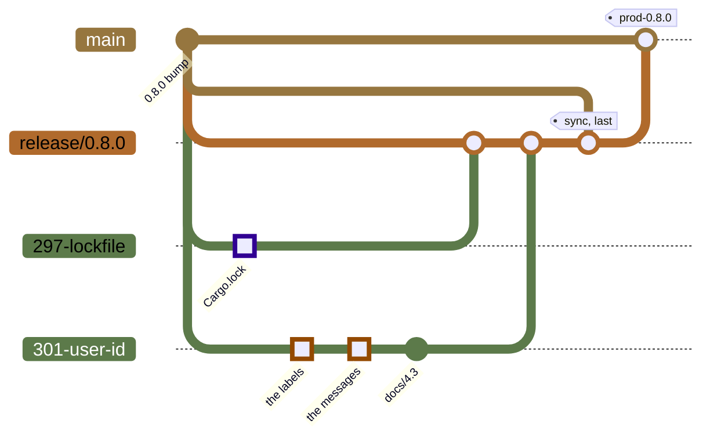

# Testing, CI & Release

What to type to verify a change and ship it. The rules those steps serve are in
[3.6](3.6-change-lifecycle.md). Four environments, each answering a different
question:

| environment | asks |
| --- | --- |
| dev | does the code I am writing work? |
| preview | does the change do what was wanted? |
| rehearsal | does deploying it work, and does it behave on production's hardware? |
| production | none: it serves users |

CI asks whether anything that used to work still does.

Part 1 is the steps: where each runs, the commands, and what proves it worked.
Part 2 is reference for the mechanisms behind them.

## 1 What to type

**Where these run.** On the development machine, in the repository root, unless
the step says otherwise:

```bash
cd ~/tile-lite-elite
```

A running box is reached by ssh, the only way to see its container logs or
database; `scripts/admin.sh` does not reach production:

```bash
ssh tile-lite-elite            && cd ~/tile-lite-elite   # production VM
ssh tile-lite-elite-rehearsal  && cd ~/tile-lite-elite   # rehearsal VM
```

**The pipeline**, by place and then by time. A step's number is its heading
(`1.2`); a third digit (`1.2.3`) is an arrow in the diagrams, with no heading,
ordering what happens inside the step.



```mermaid
sequenceDiagram
    participant Dev as Developer
    participant Loc as dev · :3000 / :8080
    participant GH as GitHub Actions
    participant Prev as Preview · :8081
    participant Reh as Rehearsal
    participant Prod as Production

    Note over Dev,Loc: 1.1 — one atomic change, recorded
    Dev->>Loc: 1.1.1 — cargo build · services.sh restart · cargo test
    Loc-->>Dev: /health reports this build, not a stale process
    Dev->>Loc: 1.1.2 — git add, commit with the version stamp
    Dev->>GH: 1.2.1 — git push
    GH-->>Dev: 1.2.2 — fmt · clippy · test · wasm · stamp (e2e on main, pull requests and release branches)
    GH-->>Dev: 1.2.3 — ci-status.sh --wait
    opt migration only
        Prod-->>Prev: 1.3.1 — deploy-preview.sh at prod — meet production's schema
    end
    Dev->>Prev: 1.3.2 — deploy-preview.sh
    Prev-->>Dev: 1.3.3 — curl /health == HEAD
    Dev->>Prev: 1.4 — user testing: does it do what was wanted?
    Dev->>Reh: 1.5 — deploy-rehearsal.sh: does deploying work?
    Note over Dev,Prod: 1.6.1 — deploy.sh: eight gates, then ship
    GH-->>Prod: 1.6.2 — gate · CI passed for this exact commit?
    Reh-->>Prod: 1.6.3 — gate · rehearsal running this commit?
    Prev-->>Prod: gate · preview running this commit — not in the flow chart
    Dev->>Prod: 1.6.4 — snapshot · migrate · swap · smoke-test
    Prod->>GH: 1.6.5 — tag prod-X.Y.Z · bump the dev version
    Prod-->>Dev: 1.7 — production and preview agree
```

**Shipping a change**, seven steps in order:

| | step | one line |
| --- | --- | --- |
| **1.1** | record the change | build, restart dev, unit-test, commit with the version stamp |
| **1.2** | push | CI's verdict is a deploy gate, not a signal |
| **1.3** | deploy to the preview environment | the same images production will get, locally |
| **1.4** | user testing | the one judgement no script makes |
| **1.5** | rehearse the release, and run the technical tests | the only test of the release *mechanism*, and where a claim no person can judge is asserted by a script |
| **1.6** | ship it | `deploy.sh` — eight gates, then snapshot, migrate, swap, smoke-test, tag, bump |
| **1.7** | verify what is live | production and preview report the same version |

**Branches**:

| | step | one line |
| --- | --- | --- |
| **1.8** | keep a release branch current | merge `main` in after every release, and at scope close |
| **1.8.1** | merge a project into a release branch | `merge-to-release.sh`, which judges the incoming run **and** the tip |
| **1.9** | merge a branch into `main` | prove its tip with 1.3 to 1.5, then fast-forward |
| **1.10** | delete a branch once its change is live | merged means done, not deployed |

**When something is wrong**:

| | step | one line |
| --- | --- | --- |
| **1.11** | roll back production | go back to a release that worked |
| **1.12** | roll back across a migration | database and images together, or the container will not boot |
| **1.13** | ship an emergency change | only when going back cannot help |

**Asking a question**, changing nothing:

| | step | one line |
| --- | --- | --- |
| **1.14** | diagnostics | what is where, what is outstanding, what is broken |

### Which steps each shape runs

The shapes of a delivery, and when each is used, are
[3.6 §1.0](3.6-change-lifecycle.md#10-the-shape-of-a-delivery). Four pass
through git and are below; an Other delivery is applied by hand. The numbers are
section numbers, not an order: a release merges (1.9) before it ships (1.6).

| shape | steps | diagram |
| --- | --- | --- |
| straight to `main` | 1.1, 1.2. The push is the delivery | [flavour-a-pre-approved](diagrams/flavour-a-pre-approved.svg) |
| tooling with a branch | 1.1, 1.2, 1.9 merge, 1.10. Live when it lands | [flavour-b-repository-change](diagrams/flavour-b-repository-change.svg) |
| single-delivery release | 1.1, 1.2, 1.3, 1.4, 1.5, 1.9 merge, 1.6, 1.7, 1.10 | [flavour-c-single-delivery-release](diagrams/flavour-c-single-delivery-release.svg) |
| release branch | 1.1 and 1.2 per project, 1.8.1 merge each in, 1.8 sync with `main`, 1.3, 1.4, 1.5, 1.9, 1.6, 1.7, 1.10 | [flavour-d-multi-delivery-release](diagrams/flavour-d-multi-delivery-release.svg) |

The last two differ only in where the merging happens: one delivery
fast-forwards `main` directly; several are merged on a release branch first,
each gated by 1.8.1, and its tip is proven and fast-forwarded. From 1.3 on they
are identical. A work package owns its branch; a parent takes none.

A release branch, drawn from `0.8.0`:


```mermaid
---
config:
  themeVariables:
    git0: "#96763f"
    git1: "#b06a2c"
    git2: "#5c7a4a"
    git3: "#5c7a4a"
---
gitGraph
   commit id: "0.8.0 bump"
   branch "release/0.8.0"
   checkout main
   branch "297-lockfile"
   commit id: "Cargo.lock" type: HIGHLIGHT
   checkout main
   branch "301-user-id"
   commit id: "the labels" type: HIGHLIGHT
   commit id: "the messages" type: HIGHLIGHT
   commit id: "docs/4.3"
   checkout "release/0.8.0"
   merge "297-lockfile"
   merge "301-user-id"
   merge main tag: "sync, last"
   checkout main
   merge "release/0.8.0" tag: "prod-0.8.0"
```

A square is a commit that changes the image, a circle one that does not.
Project branches come off `main` and are merged in, not rebased onto each other,
so one can be dropped by cutting the release branch again. `main` moves twice:
the version bump before the branch is cut, and the fast-forward at the end.

Diagram sources are the `.mmd` beside each; [diagrams/README](diagrams/README.md)
has the command that re-renders them.

### 1.1 Record the change

**Where:** development machine, repository root.

One atomic change per commit, with the version stamp first. Build, run and
unit-test before committing:

```bash
cargo build --workspace
./scripts/services.sh restart          # refreshes server *and* web client
cargo test --workspace
git add -A
git commit -m "app 0.6.3 api 2.13: what it does, and why"
```

`services.sh restart` kills whatever holds `:3000` and `:8080`, including an
orphan the PID file does not know about; a rebuilt client against a stale server
fails with wire-type errors that look like a code bug.

Every subject starts `app <X.Y.Z> api <M.N>:`, matching that commit's own
`Cargo.toml` and `API_VERSION` ([2.4](#24-version-numbers-which-to-bump-and-when)).
CI fails a commit without it; check before pushing:

```bash
./scripts/check-commit-stamp.sh origin/main..HEAD
```

Use `Refs #N` in the body, and `Closes #N` only where the change never leaves
the repository ([3.6 §2.5](3.6-change-lifecycle.md#25-tracking-a-change-to-production)).

**Proved by:** `cargo test --workspace` and `check-commit-stamp.sh` exit 0, and
dev reports what you just built:

```bash
curl -s http://127.0.0.1:3000/health
```

### 1.2 Push, and let CI judge it

**Where:** development machine.

```bash
git push origin main                   # or the branch
./scripts/ci-status.sh --run push:<branch> --wait   # optional: deploy.sh asks anyway
```

**Proved by:** `ci-status.sh` exits 0. `check` runs on every push; `e2e` on
`main`, `release/*`, pull requests and manual runs ([2.3](#23-continuous-integration)).

### 1.3 Deploy to the preview environment

**Where:** development machine. Preview answers on `http://localhost:8081`,
runs the real images in Docker on the laptop, and never competes with
production for its machine.

```bash
./scripts/deploy-preview.sh            # build a fresh checkout of HEAD
```

| command | does |
| --- | --- |
| `deploy-preview.sh` | build and deploy `HEAD` |
| `deploy-preview.sh at <ref>` | the same for any ref, wiping the preview volume first |
| `deploy-preview.sh at prod` | the same, for the commit production reports |
| `deploy-preview.sh verify` | confirm preview and production report the same version |
| `deploy-preview.sh down` | stop it, keeping the data |
| `deploy-preview.sh reset` | wipe the database |

The volume persists between runs, which is why `at` wipes it: a ref from before
a migration would otherwise meet a database from after it. To test a migration,
seed preview from production's commit first, so it meets production's schema:

```bash
./scripts/deploy-preview.sh at prod    # wipe, then build production's commit
./scripts/deploy-preview.sh            # then build HEAD on top of it
```

**Proved by:** exit 0, and `curl -s localhost:8081/health` reporting
`app_version` equal to `HEAD`. The gate reads preview's `/health` server-side,
so a browser tab showing an old version is a stale tab, not a failed gate.

### 1.4 User testing

**Where:** a browser, at `http://localhost:8081`.

Use the change and decide whether it does what was wanted. If something is
wrong, fix it on the branch and start again from 1.1: the new commit
invalidates preview and rehearsal, and the deploy refuses until both are
redeployed.

**Proved by:** nothing mechanical. `deploy.sh` checks that the commit was
deployed to preview, never that anybody looked.

The commit that ships is the one tested: any merge or version bump since makes
a new commit, which goes round preview, rehearsal and production again.

### 1.5 Rehearse the release, and run the technical tests

**Where:** development machine; it deploys to the rehearsal VM, which matches
production's hardware.

Two tests share this machine and differ in scope:

| | answers | scope | when |
| --- | --- | --- | --- |
| 1.5.1 rehearsal deployment | does deploying work? | the whole release | once, after `main` is assembled |
| 1.5.2 technical testing | does it behave correctly on production-like hardware? | one change | before that change merges to `main` |

A release is one deployment to production and one rehearsal deployment before
it, whatever it carries. Post-deployment checks are still answered per work
package.

#### 1.5.1 Does deploying work?

```bash
./scripts/deploy-rehearsal.sh
```

The same script and steps production gets. It is the only test of the
mechanism: `docker save`, the transfer, `docker load`, the `:previous` retag,
the snapshot, migrations, the smoke test. Nothing here is a release: no
`prod-*` tag, no version bump, no milestone closed.

**Proved by:** exit 0, and `deploy.sh`'s rehearsal gate agreeing: it reads the
rehearsal host's `/health` and requires the exact commit being shipped.

#### 1.5.2 Does it behave correctly on production-like hardware?

Where a claim no person can judge by using the site is asserted by a script:

```bash
./scripts/check-rate-limits.sh                       # limits still refuse, and still serve everybody else
cargo run --release --example rate_limit_load        # where they trip, on rehearsal's hardware
./scripts/bench-rehearsal.sh                         # engine timings, beside the last run on the same host
```

Write the equivalent for any change whose correctness depends on conditions
preview cannot reproduce: limits, timing, memory, headers. The benchmark runs
at every release; it is a check, printing the new row beside the previous one
for the same host, and never fails a release.

**A project's test approach holds three task lists**, under headings matched
literally by tooling:

| heading | answers | whose | run at |
| --- | --- | --- | --- |
| `### Unit tests` | the scenarios covered, not every boundary case | Claude, always present | the test suite, to [2.2.4](#224-what-a-unit-test-is-expected-to-cover)'s standard |
| `### Functional user tests — Preview` | does it do what was wanted? what a browser proves and unit tests do not | the owner | 1.4 |
| `### Technical tests — Rehearsal` | does it behave correctly on production-like hardware? | Claude | here |

Preview and Rehearsal are answered yes or no independently; both no means
nothing shows the change works. Every box is labelled with whose move it is;
`board-check.py` reports one that is not. A technical test run somewhere other
than rehearsal says what narrower question it answered and why that was
enough; a local check made while writing the fix is an extra line, not a
replacement.

`verify.sh` names any project in the release milestone with boxes unticked. It
reports and does not refuse.

**Proved by:** each script exiting 0, against the rehearsal host.

### 1.6 Ship it

**Where:** development machine, from `main`. **Run it bare**: piping into
`tail` reports the pipe's exit status, not the script's.

```bash
DEPLOY_GATES_ONLY=1 ./scripts/deploy.sh   # the gates alone, changing nothing
./scripts/deploy.sh                       # HEAD
./scripts/deploy.sh <commit-ish>          # a specific commit: see 1.11
```

Read the milestone first, because the deploy closes every open issue in it,
shipped or not:

```bash
gh issue list --milestone X.Y.Z --state open --json number,title,issueType
```

The gate lists each with its type and how many commits claim it; one that is
not a `Project` is warned about, because a requirement does not carry a
release milestone.

**Eight gates, each refusing**, named as `deploy.sh`'s `note_gate` calls name
them:

| gate | refuses unless |
| --- | --- |
| `on-remote` | the commit is on a remote branch |
| `ci` | the push-to-`main` run for this commit passed, `e2e` included |
| `pull-request` | a pull request's run passed, where one exists |
| `schema` | the database is not ahead of the schema this build knows; an image the database has outrun does not boot |
| `version` | the version is readable |
| `milestone` | every issue in the milestone has a commit claiming it |
| `preview` | preview runs this commit |
| `rehearsal` | rehearsal runs this commit |

Two escape hatches, each meaning something specific:

| | |
| --- | --- |
| `DEPLOY_SKIP_PREVIEW=1` | there was nothing for a person to look at, not "I did not look" |
| `DEPLOY_SKIP_CI=1` | GitHub itself is unreachable, not a way around a failing test |

A production deploy using tooling that is not on `main`, or has uncommitted
changes under `scripts/`, warns and asks; without a terminal it refuses.

Then it snapshots the database, applies migrations as their own step, swaps
the containers, smoke-tests the public URL for the exact version, tags the
commit `prod-<version>`, publishes a GitHub Release, closes the milestone and
moves the dev version one patch ahead ([2.5](#25-how-deploysh-ships-an-image)).
If migrations or the smoke test fail it calls `rollback.sh` itself.

**Proved by:** exit 0. Exit `3` means production is live and a step after the
swap failed; the output names each and what it needs.

When it fails and the reason is not on the terminal:

```bash
ssh tile-lite-elite
cd ~/tile-lite-elite && docker compose logs --tail=50 server
```

### 1.7 Verify what is live

**Where:** development machine.

```bash
./scripts/deploy-preview.sh verify     # preview and production report the same version
./scripts/verify.sh                    # or assert the whole world, exit non-zero if not
./scripts/verify.sh --quick            # three seconds
```

**Proved by:** exit 0. `verify.sh` counts a check it could not run as a
failure.

### 1.8 Keep a release branch current

**Where:** development machine. After every release, and once more when the
release's scope closes:

```bash
git checkout release/0.7.0
git merge main
git push
```

The version line conflicts every time. **Keep the branch's**; taking `main`'s
turns the release into a patch, which `check-release-version.sh` then refuses:

```text
<<<<<<< HEAD
version = "0.7.0"
=======
version = "0.6.4"
>>>>>>> main
```

`check-commit-stamp.sh` reads each commit's version from its own tree, so older
commits on the branch are correct about themselves, and merge commits are
skipped.

**Proved by:** `git merge` exiting 0 with `Cargo.toml` still reading the
branch's version.

#### 1.8.1 Merge a project into a release branch

**Where:** development machine. Project pull requests target the release
branch: `gh pr edit <n> --base release/X.Y.Z`.

```bash
./scripts/merge-to-release.sh <pr-number>
```

It requires two green runs: the pull request's own, which is the one running
`e2e` for a branch, and the **release branch's current tip**, so a good change
is not merged onto a broken one. No pull request's run tests the combination;
rehearsal at 1.5.1 does. A missing run is refused; `--allow-missing-run`
overrides it and says so.

**It merges rather than rebases.** A merge keeps each commit's own tree, so the
tested commit is the landed commit and the version stamps stay true. Each
project branch stays on `main`, independent of the others, and a package is
dropped by cutting the release branch again without it. The cost is a merge
commit, which `--ff-only` at 1.9 does not mind.

`ci.yml` runs `e2e` on a push to `release/*`, and exempts `release/*` from
`cancel-in-progress`, so the tip always has a real verdict.

**Proved by:** `scripts/tests/merge-to-release.bats`, including the case of a
red tip.

### 1.9 Merge a branch into `main`

**Where:** development machine. The same for a project branch and a release
branch: `main` receives a commit already proven.

```bash
git rebase origin/main          # so the merge below can fast-forward
./scripts/document-map.py --write   # the map of this branch's headings; commit it if it changed
git push --force-with-lease     # the branch now carries the commit that will land
#   ... 1.3 preview · 1.4 user testing · 1.5 rehearsal, against that commit ...
git checkout main
git merge --ff-only <branch>    # the post-merge hook moves the work package's Phase on
git push origin main
#   ... then 1.6 and 1.7, from main, now or with a later release ...
```

**Nothing else goes onto `main` between the rebase and the fast-forward.** A
commit landing in that window makes `--ff-only` refuse, and the branch has to be
rebased and tested again. Hold such commits until the merge, or land them first
and rebase once.

The rebase is where the SHA changes; the merge is where it must not. If
`--ff-only` fails, `main` has moved: rebase and run 1.3 to 1.5 again.

**Never with GitHub's merge button, nor `gh pr merge`.** None of their methods
is a fast-forward: each adds a commit nothing tested or rewrites the SHA.
Pushing the branch's head to `main` marks the pull request merged.

`.githooks/post-merge` sees the merge and runs `scripts/board-merged.py`, which
moves a Production Release package to *Deployment* and a tooling one to
*Post-deployment*, found from the pull request. Anything it cannot do it
prints, with what to set by hand.

**Proved by:** `git merge --ff-only` exiting 0.

### 1.10 Delete a branch once its change is live

**Where:** development machine. Live means merged into whatever it ships from,
not deployed.

```bash
git branch --merged main                       # the candidates
git branch -d 79-last-move-highlight           # -d, not -D: refuses if unmerged
```

A pull request's merge cleans up its remote branch. A release branch is merged
locally, so both halves are by hand:

```bash
git push origin --delete release/0.7.0
git branch -d release/0.7.0
```

**Proved by:** `verify.sh` reporting no merged branches left behind. It is a
note, not a failure.

### 1.11 Roll back production

**Where:** development machine. Needs no preparation of the working tree.

**Rolling back is deploying an earlier commit**, through the same gates:

```bash
./scripts/deploy-preview.sh at prod-0.6.1    # re-stage it first, always
./scripts/deploy.sh prod-0.6.1               # ship it
```

Production only moves to the commit preview holds, so the re-stage has no
exceptions, and skipping it fails the rehearsal gate rather than shipping
something untested. On the way back:

- **CI may need re-running** for the target commit: a run cancelled by a later
  push is not a pass. `ci-status.sh` accepts a success from any run for the
  commit and prints the `gh run rerun` command when it finds none.
- **The version bump is skipped**, because the tree is already ahead of what is
  now live. `deploy.sh` decides this by whether the commit is the branch tip.
- **The `prod-*` tag is still written.** If that version already has one, a UTC
  timestamp is appended rather than moving it.

`DEPLOY_ENV=rehearsal` rolls back rehearsal the same way, so a rollback can be
practised before it is needed.

**In a crisis**, the faster form is a retag and a database restore on the VM:
seconds, no build, and no gates, because it only returns production to
something that was already running there:

```bash
./scripts/rollback.sh                        # list snapshots and the :previous image
./scripts/rollback.sh pre-0.6.2-1c8275f-20260817T133553Z.tgz
```

The destructive form has to be named, and then typed again. A snapshot named
`pre-<version>-<commit>` was taken just before that commit was deployed, so
restoring it returns to whatever was live before it.

**Proved by:** exit 0, then 1.7.

### 1.12 Roll back across a migration

**Where:** development machine.

Migrations only run forward, and an older image will not boot against a newer
schema: `sqlx` validates on startup. `deploy.sh` compares the schemas and stops
before shipping a container that would die. To go back past a migration,
restore the database and the images together from the snapshot taken before the
deploy:

```bash
./scripts/rollback.sh                          # list snapshots and the :previous image
./scripts/rollback.sh pre-0.6.2-...tgz         # database + images back, in one step
./scripts/rollback.sh --db-only pre-0.6.2-...tgz   # database only, images untouched
```

**This discards everything written since the snapshot**: every game, move and
account. It is for minutes after a release, not for recovering last week.

**Proved by:** exit 0, and `/health` reporting the old version and a schema the
image knows.

### 1.13 Ship an emergency change

**Where:** development machine. In order:

```bash
./scripts/rollback.sh                       # 1. go back to what worked: seconds, no build

# 2. only if 1 cannot help. Cut from what production is running, not from main.
git switch --detach "$(git tag -l 'prod-*' --sort=-v:refname | head -1)"
git switch -c emergency-<what>
# ... the one fix, committed ...
git push -u origin emergency-<what>
DEPLOY_EMERGENCY="logins 500 since 14:20" ./scripts/deploy.sh emergency-<what>
```

Fix forward only when going back cannot help: a bug live long enough that
there is no good version to return to, or an outage from outside the image.

**From the last `prod-*` tag, never from `main`**, which carries tested but
unshipped changes that would ship beside the fix. The walk against rehearsal
took about 12 minutes, 6 of them CI, which is not skipped; that is why
`rollback.sh` comes first.

**It skips the preview and rehearsal gates and nothing else.** CI including
`e2e`, the commit being on a remote branch, and the schema check still apply.
`DEPLOY_SKIP_CI` still means only that GitHub is unreachable.

The tag and version bump happen, because they are facts about what is running.
The milestone and its issues are **not** closed, because that claims the normal
process was followed; close what shipped by hand once things are calm.

The reason goes into the retrospective issue `deploy.sh` raises for itself,
untyped, with a checklist separating *restore service* from *understand the
cause*. `DEPLOY_EMERGENCY=1` works and records "(no reason given at the
time)".

**Afterwards**, merge the fix into `main`, which does not have it:

```bash
git switch main && git merge emergency-<what>
```

Merge, not rebase and not cherry-pick. A rebase rewrites `main` and orphans
every `artifacts/<sha>.tar.gz` built from it; a cherry-pick leaves production on
a commit that is not an ancestor of `main`, so `verify.sh` reports a change
production already has.

**Proved by:** exit 0, then 1.7, and a retrospective issue on GitHub.

### 1.14 Diagnostics and occasional commands

**Where:** development machine. None of these changes anything. The register of
every script is [3.0](3.0-tools.md) and
[5.0](5.0-programme-tooling.md).

| | |
| --- | --- |
| `./scripts/board-status.py` | where every open change is, and what each environment runs |
| `./scripts/board-inbox.py` | what has been said on GitHub since you last looked |
| `./scripts/board-actions.py` | what is waiting on a person |
| `./scripts/verify.sh` | assert everything is in place; exit non-zero if not |
| `./scripts/roadmap-diagram.py` | what is in flight and what depends on what, into [1.5](1.5-work-in-progress.md) |
| `./scripts/ci-status.sh --run push:<branch> --wait` | ask CI's verdict early |
| `./scripts/rollback.sh` | list snapshots and the rollback image |
| `./scripts/check-commit-stamp.sh origin/main..HEAD` | check version stamps before pushing |
| `./scripts/check-rate-limits.sh` | assert the throttle's shape against a running host |

What is in each release is the milestone, and [4.9](4.9-delivery-log.md) records
what each delivery carried.

One crate's tests rather than the workspace:

```bash
cargo test -p rules-shared          # rules, scoring, validation
cargo test -p server-game           # HTTP-level integration against the real router
cargo test -p tile-lite-elite-ui    # move composer, seat presets
cargo test -p engine-core           # engine
```

On a running box, where a question can only be answered there. Production
reads are the owner's to run:

```bash
ssh tile-lite-elite
cd ~/tile-lite-elite
docker compose logs --tail=50 server
docker compose exec server tile-lite-elite-admin users list
```

**Checking a bundled asset in production.** A bare asset path answers 200
whether the asset exists or not, because Caddy's SPA fallback serves
`index.html`. `asset!` puts a content-hashed name in the wasm, so find that and
check it, expecting the asset's content type rather than `text/html`:

```bash
wasm=$(curl -s https://tileliteelite.com/ | grep -o '/assets/[^"]*\.wasm' | head -1)
curl -s "https://tileliteelite.com$wasm" | strings -a | grep -o '<name>-[0-9a-f]*\.<ext>'
```

`document::Link` elements are injected after the wasm boots, so they are absent
from the HTML `curl` returns.

## 2 The mechanisms

Reference for what the steps in part 1 rely on.

### 2.1 The environments

| | runs | for | reached by |
| --- | --- | --- | --- |
| dev | `cargo run` and `dx serve` on the laptop | building, and fast feedback | `./scripts/services.sh` |
| preview | the real images in Docker, on the laptop | looking at it: user testing | `./scripts/deploy-preview.sh` |
| rehearsal | the real images on an Oracle VM matching production | does deploying work, and does it behave on that hardware | `./scripts/deploy-rehearsal.sh` |
| production | the same, on the live VM | users | `./scripts/deploy.sh` |

A production deploy requires preview and rehearsal to be running its commit.
Rehearsal is the only place a claim about production's hardware can be tested,
which is why technical tests run there.

The layers of testing answer different questions, not the same one with more
confidence:

| layer | where | answers |
| --- | --- | --- |
| unit tests | while making the change | does the piece I wrote work? |
| CI | after the push | did I break anything that used to work? |
| user testing | preview, 1.4 | does it do what was wanted? |
| the release mechanism | rehearsal, 1.5 | does deploying it work? |

CI answers whether a commit is good; the scripts answer whether the system is in
the state you think it is. A green run does not let a deploy skip its gates.

#### 2.1.1 Deployments build a commit, never the working tree

Every deploy builds a clean `git worktree` at the target commit, once, and every
environment loads the same artefact ([2.5.1](#251-one-build-per-commit-shared-by-every-environment)).
So rolling forward and rolling back are the same operation: both name a commit
and deploy it.

### 2.2 Running tests

```bash
cargo test --workspace                              # every crate, the old-crates prototypes included
bats scripts/tests                                  # the shell tooling
python3 -m unittest discover -s scripts -t scripts  # the Python tooling
```

`cargo test` runs against the host target, never `wasm32-unknown-unknown`;
[3.2](3.2-development.md#manual-web-client) has how to check a wasm build
compiles. One crate at a time is in [1.14](#114-diagnostics-and-occasional-commands).

The tooling's tests use each language's standard runner:

| | runner |
| --- | --- |
| shell scripts, hooks | [bats-core](https://bats-core.readthedocs.io/) with bats-support and bats-assert; apt packages `bats`, `bats-support`, `bats-assert` |
| the Python tooling: `scripts/board/tests/`, and checks of the repository's own files in `scripts/tests/test_*.py` | `unittest`, in the standard library |

#### 2.2.1 How the tests are shaped

**Tests build their own world.** No server, database or container needs to be
running: each creates a throwaway SQLite file and constructs the Axum router
in-process, so CI runs them on a bare runner and no test's state reaches another.

Two depths:

- **In-process.** Hand a `Request` to the router with `tower`'s `oneshot` and
  read the `Response`. Routing, extractors, handlers and status codes all run;
  no socket exists.
- **Over a socket.** Bind `127.0.0.1:0` and serve, for what a function call
  cannot reach. `require_loopback` reads `ConnectInfo`, which only a real
  connection populates, so in-process tests inject `loopback_peer()`.

**Testing a binary**: `cargo test` supplies each of the package's binaries as
`CARGO_BIN_EXE_<name>`, freshly built, to tests in that package's own `tests/`
directory. `crates/admin-cli/tests/user_deletion.rs` does both: it hosts a
server on a loopback port and spawns the real admin binary against it.

**Prefer a walk to a point check.** Build the state, watch an action refused,
remove the reason, and watch the same action succeed; a refusal alone passes
against code that refuses everything. `crates/server-game/src/app/tests_account_lifecycle.rs`
is the example.

#### 2.2.2 A new check is shown to fail before it ships

Write the check, break the thing it watches, and see it go red; only then wire
it in. A check that has never fired cannot tell *nothing to do* from *not
looking*. The `scripts/tests/*.bats` suites stub `gh`, feed the script a world
whose answer is known, and include the quiet case, where the check should say
nothing, because that is the case a broken check passes by accident (D37).

#### 2.2.3 How a test design specification is built

For a change big enough that "write some tests" would not say what to write,
a test design specification comes first: techniques, test conditions and
pass/fail criteria. The terms, as the standards use them:

| term | means | ours |
| --- | --- | --- |
| test strategy | the test levels, holding across every change | [2.2](#22-running-tests) and this section |
| test approach | the strategy applied to one project | a project's *Test approach* heading |
| test design specification | techniques, conditions, pass/fail criteria | this, for a large change |
| test plan | scope, schedule, resources, risks | not written |

Copy `docs/templates/test-design-specification.md`; its ten headings are the
parts. [Deleting a user](changes/41-user-deletion-test-design.md) (#41,
functional) and [rate limiting](changes/25-rate-limiting-test-design.md) (#25,
non-functional, judged by a script on rehearsal) are the examples. A
specification lives with its change in `docs/changes/` and stays after it
ships, as the documentation of the regression tests it produced.

What the shape is for:

- rules first, checked before anything derives from them, since a wrong rule is
  wrong everywhere;
- every refusal followed by a success;
- coverage written both ways, rule to scenario and scenario to rule, since each
  finds a different gap;
- tests named for the behaviour, never for a scenario number;
- gaps recorded as gaps, each saying what would make the missing test fail.

Its return is the questions it forces: both examples changed their requirements
before they changed any code.

#### 2.2.4 What a unit test is expected to cover

[RIGHT-BICEP](https://www.oreilly.com/library/view/pragmatic-unit-testing/9781680500769/f_0051.html)
and its Boundary expansion,
[CORRECT](https://www.oreilly.com/library/view/pragmatic-unit-testing/9781680500769/f_0060.html),
from *[Pragmatic Unit Testing](https://media.pragprog.com/titles/utj/StandaloneSummary.pdf)*
(Langr, Koskela, Loyer). Each is considered for every change; not every one
applies.

- **Right**: the results are correct, not merely returned
- **Boundary**, CORRECT: **C**onformance to the expected format; **O**rdering;
  **R**ange (min, max, zero, negative); **R**eference to anything outside the
  code's control; **E**xistence (non-null, non-zero, present); **C**ardinality;
  **T**ime (ordering and timing)
- **Inverse**: relationships checked in reverse where one exists (encode and
  decode, save and load)
- **Cross-check**: the result checked by a second, independent route, where
  one exists
- **Error** conditions forced and confirmed handled, every path reached
- **Performance** checked where the code has a characteristic worth a test

It is not listed per project: a project's `### Unit tests` heading summarises the
scenarios covered. `.claude/skills/unit-test-checklist/` brings it up when unit
tests are written or reviewed.

### 2.3 Continuous Integration

`.github/workflows/ci.yml`, three jobs:

| job | runs on | does |
| --- | --- | --- |
| `check` · *fmt · clippy · test · wasm · docs* | every push, every pull request, and on demand | `check-docs.sh`, `cargo fmt --check`, the Python and bats tooling tests, `clippy -D warnings`, `cargo test --workspace`, the log-hygiene suite against [4.7](4.7-log-events.md), and the wasm build |
| `stamp` · *commit stamp (app/api versions)* | the same | refuses a commit whose subject does not carry both versions |
| `e2e` · *Playwright · preview stack* | pull requests, on demand, and pushes to `main` and `release/*`; after `check` | builds the preview stack in Docker and runs the Playwright suite |

`.github/workflows/docs.yml`, one job:

| job | runs on | does |
| --- | --- | --- |
| `review-checklist` | every pull request that is not a draft | fails while any box under a review heading in the body is unticked |

`docs.yml` runs no document checks and has no `paths:` filter: `check` already
runs `check-docs.sh`, and a review checklist is about the body, not the files.

**CI is a deploy gate, not a signal.** `deploy.sh` asks `scripts/ci-status.sh`,
the same code used by hand. `e2e` waits for `check` so a lint failure never
costs a Docker build. `RUSTC_WRAPPER=""` disables the local sccache wrapper,
which the runner lacks and wasm cannot use.

#### 2.3.1 The advisory check, and why it denies warnings

`.github/workflows/advisories.yml` runs `cargo audit` nightly and on demand. It
is a check: it blocks nothing, and a failing run opens one untriaged issue, or
updates the open one.

**It refuses on reachability, not severity.** `Cargo.lock` lists every crate any
feature combination could pull in, so most findings are against crates in no
build graph, and severity does not predict which. So the run is
`--deny warnings`, and `.cargo/audit.toml` holds the ignore list, whose single
criterion is that the crate cannot reach us. Every entry carries the reason and
how it was established.

`.github/dependabot.yml` watches the pinned actions weekly, and not the crates:
newness and advisories are kept apart.

#### 2.3.2 What GitHub does on its own

When each workflow runs, read off the workflows:

| | fires on |
| --- | --- |
| `ci.yml`, the whole workflow | `push` (any branch), `pull_request`, `workflow_dispatch` |
| its `e2e` job | `pull_request`, `workflow_dispatch`, or a push to `main` or `release/*` |
| `ci.yml` concurrency | group `ci-<ref>`. A newer run cancels an in-progress one, except on `main` and `release/*`, where it queues |
| `docs.yml` | `pull_request`: opened, edited, synchronize, reopened, ready_for_review |
| `advisories.yml` | `schedule` at 06:15 UTC, and `workflow_dispatch` |
| `context.yml` | `schedule` at 06:30 UTC daily, and `workflow_dispatch`. Rewrites the context header on any open project whose facts changed |
| `programme-activities.yml` | `schedule` at 07:00 UTC on Mondays, and `workflow_dispatch` |

Ticking a box is an `edited` event, so the checklist goes green without a
re-run.

GitHub's own behaviours the process works around:

| behaviour | so |
| --- | --- |
| a `skipped` job still concludes the run `success` | a gate names a run and requires a job: `ci-status.sh --run push:main --require e2e` |
| no fast-forward merge in the button | a merge to `main` is `git merge --ff-only` ([1.9](#19-merge-a-branch-into-main)) |
| pushing a pull request's head commit to its base marks it merged | 1.9 closes the pull request without the button |
| `Closes #N` fires when the commit reaches the default branch, not when it ships | commits say `Refs #N`; the deploy closes the milestone |
| `issue_comment` workflows run the default branch's copy | a change to comment handling takes effect only after it merges |
| an unknown `--reviewer` login warns and creates the pull request anyway | `scripts/create-pr.sh` defaults to the owner's login, recorded in [5.5](5.5-github-project-board.md#what-is-held-in-github) |

**Branch protection on `main`** requires the `check` job; the owner and the
machine account bypass it, which lets `deploy.sh` push the version bump and is
why every push to `main` reports "Bypassed rule violations".

### 2.4 Version numbers: which to bump, and when

| check | the answer, nearly always |
| --- | --- |
| subject stamp | `app <X.Y.Z> api <M.N>: subject`, both read from the tree |
| app version | does not move: `deploy.sh` bumps the patch after each production release. A release carrying functional change is at least a minor, set on `main` before the release lap |
| API version | moves only if the wire contract changed, in the same commit: breaking is major, additive is minor, unobservable is none. A change to `crates/ui` alone moves nothing |

```bash
grep -m1 '^version' Cargo.toml                             # app
grep -m1 'API_VERSION: ApiVersion' crates/api/src/lib.rs   # api
```

The three versions and the build id are defined in
[4.1](4.1-configuration.md#versioning).

#### 2.4.1 Check the commit subject carries both versions

Every subject starts `app <X.Y.Z> api <M.N>:`, the same words `GET /health`
reports. Both come from the working tree, which leads production by one: the
app version is what the next release will be.

#### 2.4.2 Decide whether the app version moves

The app version moves once per production release, when `deploy.sh` bumps the
patch after a successful deploy, so no commit is built carrying a version that
is already live.

**The default is a patch, and a functional release is at least a minor.** When
any package in the release's milestone is typed `functional`, the version is
raised to the next minor on `main` before the release lap, in a commit of
version lines alone, and the milestone renamed to match.
`check-release-version.sh` refuses a patch release whose milestone carries
functional change; `DEPLOY_GATES_ONLY=1 ./scripts/deploy.sh` shows it early.

**The bump is skipped after a rollback**: `deploy.sh` bumps only when the
commit it shipped is the branch tip.

#### 2.4.3 Decide whether the API version moves

The API version describes the wire contract; it does not deliver client
updates ([2.4.4](#244-how-a-client-learns-there-is-a-new-build) does). Bump it
in the same commit as the change.

| change | bump |
| --- | --- |
| breaking: an old client cannot continue | major |
| additive: old clients still work without the new thing | minor |
| a newly accepted value, such as a new edition | minor |
| a status changed on a path that already existed | minor |
| anything a client cannot observe on the wire | none |

A changed status is minor, not major, because an old client still receives a
status it understands. **Bump per wire change, even when production skips
versions**: each environment can run any committed version, so each change
keeps its own increment and a comparison of `api_version` means what it says. Record the reasoning in the comment block above
`API_VERSION`. The name `API_VERSION` is kept although it no longer drives
client reloads, because renaming it is itself a wire change.

#### 2.4.4 How a client learns there is a new build

By the build id, not the API version: every deploy moves it, and a tab reloads
when the web container is serving a build other than its own
([4.1](4.1-configuration.md#how-a-tab-learns-there-is-a-new-build)).

### 2.5 How `deploy.sh` ships an image

The eight gates are in [1.6](#16-ship-it). `DEPLOY_GATES_ONLY=1` runs them and
stops before anything changes, which is also what makes them testable.

Once the gates pass, everything destructive happens after everything that can
refuse:

1. build the artefact, or reuse the one for this commit
2. transfer it and load the images
3. snapshot the database
4. run migrations separately, so a failure there is not an outage
5. start the new version
6. smoke-test `/health` for the exact version, not merely a 200
7. tag the commit, publish the GitHub Release, settle the milestone, and bump
   the dev version when rolling forward

If a migration or the smoke test fails, `deploy.sh` calls
`scripts/rollback.sh --yes` with the snapshot from step 3, the same code run by
hand. If that fails too it says so and names the snapshot.

#### 2.5.1 One build per commit, shared by every environment

| | |
| --- | --- |
| where | `artifacts/<sha>.tar.gz` in the working copy, git-ignored, with a `.sha256` and a `.manifest` beside it |
| when it builds | only when that file is absent. Rehearsal builds it; production loads the same bytes |
| what proves sameness | the digest, printed on every deploy as `sha256:` in the export line |
| retention | the newest `ARTIFACT_KEEP` (5), pruned after a successful deploy |
| if one is lost | it rebuilds from the commit; it is a cache, not a record |

**The digest is the check, not the version.** A rebuild of a commit stamps the
same version but can differ in bytes, because base images and mirrors move. Do
not replace the digest comparison with a version comparison: it would pass
every test, because the failure it catches is one where the versions agree. The
digest is re-checked before every transfer, so a truncated file fails the
deploy.

#### 2.5.2 What is in a build, said by the build

`artifacts/<sha>.manifest` is written from git alone, so it exists when GitHub
is unreachable:

| line | says |
| --- | --- |
| `digest` | the bytes it describes |
| `since` | the newest `prod-*` tag that is an ancestor of this commit |
| the commits | each in that range, with `*` against those reaching the image by [`board/shipping.py`](../scripts/board/shipping.py) |
| the issues | those claimed by a `Refs` or `Closes` trailer in that range, and whether any of their commits reach the image |

A commit citing an issue in prose does not claim it. After a successful deploy,
an issue whose commits reach the image and which carries no milestone is
reported; a requirement is never asked for one. It is a check, not a gate.

#### 2.5.3 Gating on a particular run

A gate names the run it depends on:

| the deploy | requires |
| --- | --- |
| production | the push-to-`main` run for this exact commit, `e2e` included |
| production, where a pull request exists | that run too |
| rehearsal | any passing run for the commit, since it has not reached `main` yet |

`main` is exempt from `cancel-in-progress`, so a run a deploy depends on is
never killed by the next push.

#### 2.5.4 The GitHub Release

`deploy.sh` runs `gh release create` on the tag it pushed, with
`--generate-notes` and, where a predecessor exists, `--notes-start-tag` set to
the newest other `prod-X.Y.Z` tag (matched by regular expression, so a
redeploy's timestamped tag is not taken). Only a first-time tag gets one. A
failure prints the command to run by hand and does not fail the deploy.

It does not replace [4.9](4.9-delivery-log.md): a Release hangs off a tag, so a
delivery that ships no code can never have one.

#### 2.5.5 What a release settles

| deploy | settles |
| --- | --- |
| production | closes the milestone it shipped and opens the next |
| rehearsal or preview | nothing: it has not reached users |
| emergency | nothing, deliberately; the tag and bump still happen, and the retrospective issue is the record |

`scripts/tests/deploy-milestone.bats` covers all three.
