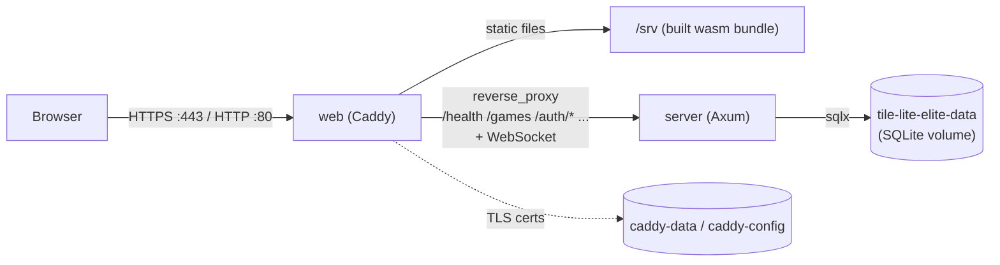
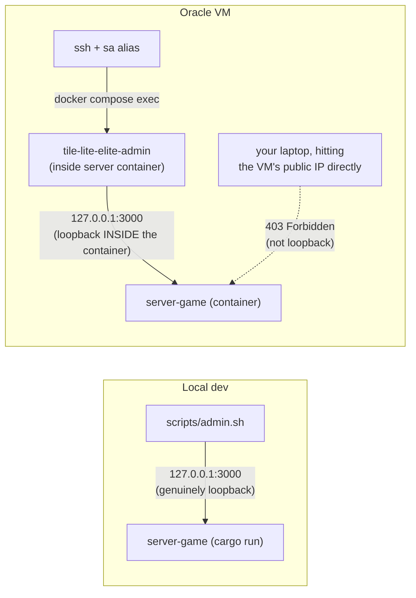

# Production Environment & Operations

The live production system: what actually runs, and how you inspect and
maintain it once a release is out. The release *procedure* that puts a version
here — test → stage → push → deploy → verify, and the `deploy.sh` machinery
under the hood — lives in
[Testing, CI & Release](3.3-testing-ci-and-release.md#1-what-to-type);
this doc is the steady state after that, not a second copy of it. Part of the
lifecycle series — see [docs/README.md](README.md) for the full sequence.
Follows [Testing, CI & Release](3.3-testing-ci-and-release.md).

## Container Topology

`Dockerfile`, `docker-compose.yml`, and `Caddyfile` at the repo root run the app as two containers:

- **`server`** — the Axum backend (`server-game`), release-built. Not published to the host; only reachable from `web` over the compose network, and via `docker compose exec`.
- **`web`** — Caddy, serving the release web build (`dx build --platform web --release`) as static files, reverse-proxying API/WebSocket paths to `server`, and handling automatic HTTPS. Published on `:80` and `:443`.



Same-origin end to end: the browser only ever talks to Caddy, which serves the static bundle *and* proxies the API/WebSocket from the same origin — see "Why one image serves both" below for why that matters.

SQLite lives on a named volume (`tile-lite-elite-data`, mounted at `/data` in `server`) — it survives `docker compose down` and rebuilds, but not `docker compose down -v`. See [Backups](#backups) for backing it up and [Inspecting the database](#inspecting-the-database) for reading it.

Caddy's obtained TLS certificate lives on its own named volumes (`caddy-data`, `caddy-config`) for the same reason — losing them means a fresh certificate request on next start, not a functional problem, just unnecessary churn against Let's Encrypt's rate limits.

**The three base images (`rust:1-bookworm`, `debian:bookworm-slim`, `caddy:2-alpine`) are pinned by digest, and the compiler is pinned by `rust-toolchain.toml`** — #360. Before this, all four floated: the image built without a commit saying so, and the developer machine, CI and the release build each tracked "stable" independently, agreeing only because of a habit of updating them together rather than because anything required it. Bumping either now is an ordinary, diffable commit: `.github/dependabot.yml`'s `docker` ecosystem opens a pull request when a base moves, and `rust-toolchain.toml` is what `rustup` reads on a developer machine, in CI (`.github/workflows/ci.yml` pins the same version explicitly, since `dtolnay/rust-toolchain` does not read a project's toolchain file itself) and inside the `rust:1-bookworm` builder stage alike. **What this does not buy**: `Dockerfile`'s `apt-get install` still resolves whatever Debian is serving at build time, so the image is reproducible from a commit only at the base-layer digest, not byte-for-byte — full reproducibility would need a dated snapshot or pinned package versions, a larger step #360 left for a separate decision.

**The kernel and Docker daemon on the VMs themselves are a separate, unsettled question** — #360 R1/R4/R5, still open. Nothing here changes how or when either host updates.

**Why one image serves both, same-origin**: the web build is compiled with `TILE_LITE_ELITE_API_BASE_URL=""` (explicitly empty, not unset — see the [Configuration table](4.1-configuration.md#environment-variables)), which makes the client derive its API/WebSocket target from whatever origin actually served the page (`crates/ui/src/app.rs`'s `websocket_url`/`same_origin_websocket_url`). That's what lets the same compiled wasm bundle work regardless of the host's IP or domain, with no rebuild needed if either changes — and it sidesteps CORS entirely, since Caddy serves both the static assets and the proxied API from one origin.

**Setting `RESEND_API_KEY`**: `docker-compose.yml` reads it via `${RESEND_API_KEY:-}` substitution, which Compose fills in from a `.env` file it auto-loads from the same directory — *not* from the `environment:` block itself, so the real key never goes anywhere near git. Create it once on the VM (`scripts/deploy.sh` only ever scps `docker-compose.yml` and the image tarball, never `.env`, so this survives every future redeploy untouched — same handling as the deploy SSH key):

```bash
ssh tile-lite-elite
cat > ~/tile-lite-elite/.env <<'EOF'
RESEND_API_KEY=re_your_real_key_here
EOF
cd ~/tile-lite-elite && docker compose up -d   # picks up the new .env immediately
```

Leaving `.env` absent (or `RESEND_API_KEY` unset within it) is a supported, fully-functional state — see `RESEND_API_KEY`'s row in the [Configuration table](4.1-configuration.md#environment-variables).

## Admin CLI

The admin CLI — crate `crates/admin-cli`, binary/command name `tile-lite-elite-admin` — is operator tooling for a running server: list/delete users, reset a password, list/delete/force-end games, read the daily record of what the database holds (`sa size`), and see when each scheduled job last finished a pass and how many items errored on it (`sa scheduler-health`). It's a thin HTTP client against `server-game`'s `/admin/*` endpoints, not a separate implementation, so it can't drift from what the server actually does (cascading deletes, password hashing, etc. all stay server-side). Output is a table by default and JSON under `--json` — see [Reading the output](#reading-the-output) below.

**There's no admin account or token.** The `/admin/*` endpoints only accept requests whose peer address is loopback (`127.0.0.1`/`::1`), regardless of what `TILE_LITE_ELITE_BIND` is set to — running the CLI *from the server's own terminal* is the access control. This matters specifically because `TILE_LITE_ELITE_BIND=0.0.0.0:3000` (see [Development](3.2-development.md#manual-backend-only)'s LAN-play example) would otherwise expose these endpoints to the whole LAN, not just the machine running the server. In the container deployment it means the same thing: `/admin/*` stays loopback-only, and a request proxied in from the `web` container isn't a loopback connection, so the server rejects it the same as it would over a LAN. Where you run `tile-lite-elite-admin` *from* isn't a preference, it's the only thing that determines whether it works at all — the two cases below are genuinely different, not interchangeable:

**Local dev server** (running directly on this machine, not in a container):

```bash
./scripts/admin.sh users list
./scripts/admin.sh users reset-password <player_id>          # prints a generated password
./scripts/admin.sh users reset-password <player_id> --password 'a specific one'
./scripts/admin.sh users sign-out <player_id>                # ends every session it has
./scripts/admin.sh users delete <player_id>

./scripts/admin.sh games list
./scripts/admin.sh games list --status waiting               # waiting | active | finished | aborted
./scripts/admin.sh games list --older-than-days 30
./scripts/admin.sh games delete <game_id>
./scripts/admin.sh games force-end <game_id>

./scripts/admin.sh scheduler-health                          # each job's last pass, UTC to the second

./scripts/admin.sh --json games list | jq '.[] | select(.status == "waiting")'
```

`scripts/admin.sh` builds `admin-cli` in **release** mode and runs that binary — a plain `cargo run -p admin-cli` builds and runs a *debug* binary instead, which still works but is worth avoiding out of habit now that a script exists to do the right thing by default.

### Reading the output

Both listings are aligned tables, sized to the data rather than to fixed column widths. Timestamps are **UTC** — stated once in the column header, not repeated per row — and deliberately not converted to the machine's local time, which on a deployment VM is an accident of provisioning; they also line up that way with `--older-than-days`, which the server evaluates in absolute seconds, and with the raw values if you go looking in [the database](#inspecting-the-database).

`users list` shows each account's rating and how many rated games produced it. A rating of `-` means the account has never *finished* a rated game — distinct from an account sitting at the starting 1500, which is what makes "registered but never really played" visible at a glance. `last seen` is real activity (see `players.last_seen_at` in [4.2 Database Schema](4.2-database-schema.md#players)), refreshed on authenticated requests, not profile edits.

`games list`'s seats column marks what an operator triaging a stuck game needs: `[bot]` for an engine seat, `[unclaimed]` for a human seat nobody has taken (otherwise indistinguishable from a player named "Open seat"), `[out]` for a seat that resigned, was force-resigned, or timed out. Scores appear once a game has started.

`--json` prints the server's own records instead of a table — the full DTO, timestamps left as the epoch seconds the server sent — for piping into `jq`. It works on every command, including the mutations, which emit a small confirmation object.

**A delete refused for a live session has a remedy**: `users sign-out <player_id>` ends every session the account has and nothing else, after which the delete goes ahead (#295). The refusal used to offer only a wait — 48 hours idle, 10 days absolute — which is true and is not an action. Signing out removes nothing the account would have kept: it leaves it exactly as its own session expiry would have, which is what makes it safe to reach for. Signing out an account that is already signed out succeeds quietly, so it can be run as a precaution without checking first.

Two behaviors worth knowing before you need them: `games force-end` is **refused** (400) on a game that has already finished or been aborted, rather than overwriting its result — so a mistyped game id is safe. And `games delete`/`users delete` have no confirmation prompt and no undo; they are the one genuinely irreversible pair here. `users delete` keeps the player's games, unclaiming their seat rather than deleting the history; see [Retention and Deletion](4.2-database-schema.md#retention-and-deletion) for exactly what each removes.

**The Oracle VM's (or any container deployment's) server**: `scripts/admin.sh` can't reach it — it always targets `127.0.0.1`, and that's a different loopback than the VM's, by design (see above; pointing `--server`/`TILE_LITE_ELITE_API_BASE_URL` at the VM's public address from your own machine just gets a 403, it isn't a workaround). Run it *inside* the server container instead, where `127.0.0.1` genuinely is that container. An alias `sa` has been set up on the VM so it can be called from any directory.

**The dev machine has the same two shortcuts**, written into `~/.bashrc` by
`scripts/setup-dev-environment.sh` — the split is because dev and preview run
the server differently, not as a convenience:

| alias | environment | why |
| --- | --- | --- |
| `sadev` | dev | the server runs natively on `:3000`, which is the CLI's default, so this is `scripts/admin.sh` — which also rebuilds the CLI if it is stale |
| `sapre` | preview | the server is in a container, and the host's `127.0.0.1` is not the container's, so `admin.sh` gets a 403; this runs the CLI inside |

```bash
sadev users list
sapre size
```

Re-running the setup script rewrites both lines rather than appending, so they
cannot drift out of date or accumulate.

```bash
ssh -i ~/.ssh/oracle_tile_lite_elite ubuntu@129.151.69.246
sa games list
sa size            # what the database has held, a row per day
cd ~/tile-lite-elite
docker compose exec server tile-lite-elite-admin games list
```



That binary is the release build baked into the `runtime-server` image by the `Dockerfile` — there's nothing extra to build or configure on the VM itself.

Deleting a user unclaims their seats (`player_id` set to null on `game_participants`) rather than deleting their games — game history and other players' records survive.

## Inspecting the database

For anything the admin CLI doesn't cover — an ad-hoc query, checking a column
value, confirming a migration applied — read the SQLite file directly. Use the
aliases; they exist so this is one word rather than a remembered incantation:

```bash
dbprod                       # production, over ssh
dbpre                        # preview
dbdev                        # dev
dbpre "select count(*) from games;"    # or one query, non-interactively
```

All three are `-readonly`: an inspection session cannot write, whichever
environment it lands in, and production is one keystroke away from preview.
`scripts/setup-dev-environment.sh` writes them into `~/.bashrc`.

### Notes on reading the database

**Why a container at all.** The database lives on a Docker volume
(`tile-lite-elite-data`, `/data` inside `server`), not on the host.

**`dbpre`/`dbprod` run inside the already-running `server` container**, via
`docker compose exec` — the same mechanism `sapre`/`sa` use for the admin CLI.
`sqlite3` has been baked into the `runtime-server` image since `0.7.0` (#174),
so this needs no separate container and creates nothing that could be left
holding the volume — the failure mode #356 removed. `docker compose exec`
allocates a pseudo-tty by default; `dbpre` passes `-T` to drop it when a query
is given, so `dbpre "select ..."` works in a pipeline as well as
interactively.

**If the stack is stopped**, `exec` has no running container to reach. Fall
back to a throwaway container against the volume directly:

```bash
docker run --rm -v tile-lite-elite-preview-data:/data alpine sh -c \
  'apk add --no-cache sqlite >/dev/null 2>&1 && exec sqlite3 -readonly /data/tile-lite-elite.sqlite3'
```

Swap in `tile-lite-elite-data` for production. This is what `dbpre`/`dbprod`
themselves did before #356; kept here as the recipe for the one case
`docker compose exec` cannot reach, rather than wired into the shortcuts.
`--rm` only protects a container that exits — an interactive session that
never does (terminal closed, ssh dropped) leaves it running and holding the
volume, which is how #356 was found in the first place. Exit interactive
sessions; `docker ps` on the VM is worth a glance occasionally.

**Do not reach for the volume's host path** (`/var/lib/docker/volumes/...`): it
is root-owned, so it needs `sudo`, and the container needs neither that nor a
copy. If you do copy the database out to read it with the host's own `sqlite3`,
take the `-wal` and `-shm` files with it — preview's WAL routinely holds more
than a megabyte the `.sqlite3` file does not yet contain, so copying one file
gives a silently stale answer.

**Dev** keeps its database as an ordinary file in the checkout rather than in a
volume, so the host's own `sqlite3` reads it with no container at all:

```bash
sqlite3 -readonly data/tile-lite-elite.sqlite3
```

### Shortcuts on the dev machine

`scripts/setup-dev-environment.sh` writes `dbdev`, `dbpre` and `dbprod` into
`~/.bashrc` alongside the admin ones. Each is `-readonly`, which matters most
for the third: production is one keystroke from preview, and neither can write.

```bash
dbdev                                  # interactive
dbpre "select count(*) from games;"    # or a query as an argument
dbprod
```

`dbpre` and `dbprod` run `sqlite3` inside the **already-running `server`
container**, via `docker compose exec` — see [Notes on reading the
database](#notes-on-reading-the-database) above for why, and the fallback for
a stopped stack.

`-readonly` is deliberate: it guarantees an inspection session can't accidentally write. Reading while the live `server` container is running is safe — the database is in **WAL** mode (see [4.1 Configuration](4.1-configuration.md#sqlite)), so a reader never blocks the server's writes or vice versa. Useful starting points once at the `sqlite>` prompt:

```sql
.tables                                          -- list tables
.schema games                                    -- one table's DDL
.headers on
.mode column
select id, status, turn_number from games order by created_at desc limit 10;
select version, description from _sqlx_migrations order by version;  -- migrations applied
PRAGMA journal_mode; PRAGMA foreign_keys;        -- confirm runtime pragmas
```

Prefer not to touch production at all? Restore a [backup](#backups) into a local volume (or just `tar xzf` it somewhere) and point a local `sqlite3` at the copy — same queries, zero risk to the live file. Remember the authoritative game state is the `snapshot_json` blob, not the flat columns (see [4.4 snapshot_json Schema](4.4-snapshot-json-schema.md) and [4.5 Data Dictionary](4.5-data-dictionary.md)) — the columns are queryable projections of it.

## Logging

`server-game` uses `tracing`, not `eprintln!`. Application-level events (registration, login success/failure, game created/started/finished, invitations, admin actions, move-time-limit retirement) log at `info` by default; per-HTTP-request spans (method, path, status, latency) from `tower-http`'s `TraceLayer` log at `debug` and are off by default to keep normal output readable.

```bash
# Default verbosity — app events, no per-request noise
cargo run -p server-game

# See per-request HTTP tracing too
RUST_LOG=server_game=info,tower_http=debug cargo run -p server-game

# Everything, very verbose
RUST_LOG=debug cargo run -p server-game
```

Admin actions (`admin_delete_user`, `admin_reset_password`, `admin_delete_game`, `admin_force_end_game`) log at `warn` specifically so they stand out as an audit trail even at default verbosity.

### Identifiers only, and how that is kept true

**No display name, no email address, no token, no password reaches the log** (#174). `player_id` and `game_id` are enough to diagnose, and `scripts/admin.sh` resolves an id to a person on the rare occasion somebody needs to know who it was. A failed login carries the *reason* and nothing else — it may not correspond to an account at all, so there is nobody to identify.

`player_id` is **pseudonymous, not anonymous**: we hold the table that resolves it. That makes a leaked log worth much less; it does not put the log outside data protection.

**The rule is checked, not trusted.** [4.7 Log Events](4.7-log-events.md) declares every field each event may carry, and `scripts/check-log-hygiene.py` validates a stream of lines against it — no address in any field, nothing the document does not declare, and `additionalProperties: false` asserted on the schema itself so it cannot quietly stop guarding. Two streams feed it:

| | |
| --- | --- |
| **CI** | the regression suite's own output. It drives registration, login, invitations and the whole password-reset family, including the rare branches a week of production would not show |
| **the host, nightly** | that day's journal. It reads and writes an exception log; it drives nothing |

### journald, not the container

Both services log through the **journald** driver, so the store belongs to the host and survives the container recreation that used to discard everything on every deploy.

**It survives a deploy. It does not survive the VM.** The journal lives on the
instance and nowhere else — capped at 100M and seven days, and **nothing copies
it off**. `/data` is the only thing backed up; see *The nightly copy that leaves
the VM*, which is about the database and not about these.

So losing the instance loses every log it holds, **including the ones covering
whatever destroyed it**. That is a known gap rather than an oversight, and
whether it is acceptable is #225's to decide. It is stated here because
*"belongs to the host and survives"* reads as a stronger claim than it is: the
design note for #174 had to correct exactly this misreading once already.

```bash
journalctl CONTAINER_TAG=tle-server -o cat            # the server, as written
journalctl CONTAINER_TAG=tle-server -o cat | jq .     # readable
journalctl CONTAINER_TAG=tle-server -o cat | jq -r 'select(.level=="WARN")'
journalctl CONTAINER_TAG=tle-web --since today        # the web container
```

The lines are JSON, one object per line, so *"how many games did that player start today"* is a `jq` question rather than a `grep`-and-hope one. A human rendering is a reading-time concern:

```bash
journalctl CONTAINER_TAG=tle-server -o cat \
  | jq -r '"\(.timestamp[11:19]) \(.level) \(.message)"'
```

#### Reading an email out of preview's log

Preview sets `TILE_LITE_ELITE_LOG_EMAIL_BODIES=1`, so with no provider configured
it logs the whole message — which is how an invitation or reset link is read
while testing a flow there.

```bash
journalctl CONTAINER_TAG=tle-preview-server -o cat \
  | jq -r 'select(.message | startswith("email not sent")) | .text_body' | tail -1

# just the link
journalctl CONTAINER_TAG=tle-preview-server -o cat \
  | jq -r 'select(.text_body) | .text_body' | grep -oE 'https?://[^ ]+' | tail -1
```

**Production sets nothing**, takes the other branch, and logs the message kind
alone. `check-log-hygiene.py --source production` fails if that event ever
appears on a production journal — a release build cannot emit it without the
variable, so its presence would mean somebody set it.

**Retention is set on the host, not in the repository** — the driver belongs to the deployment and the policy belongs to the machine:

```ini
# /etc/systemd/journald.conf.d/zz-tile-lite-elite.conf
[Journal]
SystemMaxUse=100M
MaxRetentionSec=7d
```

100 M is a backstop rather than a target: seven days needs about 100 KB, and the size cap binding before the age rule is how retention silently drops below what it says. There is an older `50-cap.conf` on the host from 2026-07-30 which is raised to match — 50 M would bind first.

## Monitoring and alerting

Four things watch production. All publish to one OCI Notifications topic,
`tile-lite-elite-alerts`, which emails the owner.

| what | fires when |
| --- | --- |
| `tile-lite-elite-production-health-success-rate` | two of three external probes cannot get `/health`, for 3 minutes |
| `CPU 90%` | mean CPU above 90% for 5 minutes |
| `Memory 90%` | mean memory above 90% for 5 minutes |
| `Stopped` | the instance's status changes to stopped |

The external probe is an OCI **Health Check**,
`tile-lite-elite-production-health`: HTTPS `GET https://tileliteelite.com/health`
on port 443, every 60s with a 10s timeout, from three vantage points (AWS West
EU 3, São Paulo, Tokyo). Its alarm reads `oci_healthchecks` / `HTTP.isHealthy`,
`mean()` with `grouping()`, filtered to that monitor's `resourceId`, firing
below **0.5**.

The three host alarms read `oci_computeagent` on the instance named
`instance-20260712-1225-production`. Nothing was installed to make this work —
the Oracle Cloud Agent is present on the VM and its Compute Instance Monitoring
plugin was already publishing.

All of it was created in the OCI console. There is no code and nothing in this
repo builds it.

### Notes on monitoring

**Why the external probe is the one that matters.** The three host alarms are
published by an agent running on the host they report about, so if the VM goes
away, silence looks exactly like health. `RESEND_API_KEY` lives on that same VM,
so anything we wrote ourselves would have died with the thing it was meant to
report. Oracle's probes and alarms run outside it — which is the whole argument
for using their tooling here rather than writing our own.

**Why the alarm threshold is 0.5 and not 1.** With three vantage points the
mean is a vote: 1.0 all well, 0.67 one point down, 0.33 two down. Below 0.5
means at least two of three agree, so a single probe with a bad network path
does not page anyone.

**Two traps, both nearly shipped.** The Health Check's target must be the
**hostname**, not the instance the dropdown offers — probing the bare IP over
HTTPS fails the TLS handshake outright, since no certificate exists for an IP,
and a monitor built that way reports DOWN forever. And `grouping()` needs the
`resourceId` dimension filter: without it the alarm averages *every* stream in
the namespace, so adding a rehearsal health check later would give three
production streams at 0 against three rehearsal streams at 1 — exactly 0.5,
which is not *less than* 0.5. Production down, and silence.

**What is deliberately not monitored.** Filesystem free space: `oci_computeagent`
publishes disk I/O but not free space, and Oracle has no built-in metric for it,
so it would need a custom metric or paid Stack Monitoring. Deferred at 13% used.
Error rates, latency and request volume: there is no traffic baseline, and a
threshold picked from nothing produces noise, which is how monitoring comes to
be ignored. The test each of these fails is that **an alert wants a response** —
availability passes it, a rate does not yet.

**Memory is the one with a trajectory.** Every game ever played is held in RAM
and leaves only when deleted, so the number tracks the size of the table rather
than activity. It was 141MB of 954 when this was set up.

**Rehearsal is not monitored.** It is a clone for testing, not a service, and an
alert about it would want no response.

## Changing production configuration

**A configuration change to production is a change to production, and gets the
same care as code.** Not less, because it reaches users the same way; and in
practice more, because none of the machinery that protects a code change applies
to it.

What is in this category: the VM's `.env` (`SITE_ADDRESS`), anything set in the
OCI console (alarms, notification topics, health checks, instance settings), DNS
records, and firewall rules.

Before changing it:

- **Raise an issue**, as for any change. It is the only record that will exist.
- **Try it on rehearsal first** where the same setting exists there. Rehearsal
  has its own `.env`, and its own OCI instance.
- **Keep what you are replacing.** `cp .env .env.bak-$(date +%Y%m%d-%H%M%S)`
  costs nothing and is the only rollback there is.
- **Check the order of operations** where one change depends on another —
  adding a hostname to `SITE_ADDRESS` before its DNS record resolves makes Caddy
  fail certificate issuance, and repeated failures risk a Let's Encrypt rate
  limit.

After changing it:

- **Write it down here**, in the section it belongs to. Nothing else records it.
- **Close the issue by hand.** No commit trailer and no milestone can do it,
  because there is no commit and no release.

### Notes on why this needs saying

**Every gate that protects a code change is absent.** A code change is compiled,
tested by CI, looked at in preview, rehearsed against a production clone, gated
five ways by `deploy.sh`, smoke-tested on arrival, and rolled back automatically
if the smoke test fails. A console click has none of that: no review, no test,
no staging, no gate, no smoke test, no rollback, and no record that it happened.

So the discipline that is automated for code has to be deliberate here. The
steps above are that discipline written down, because nothing enforces them.

**It is also invisible afterwards.** `git log` will not show it, `status.sh`
will not show it, and the deploy output will not mention it. Six months later
the only evidence that production differs from a fresh install is this document.

**Both config changes made so far needed this.** #136 (monitoring) went two days
undocumented; #147 (the rehearsal hostname) was ordered correctly only because
the Caddyfile happened to warn about the rate limit.

**Grade by blast radius, not by category.** Code changes vary enormously in
impact and so do config changes — "config" is not a synonym for "safe". Plenty
of configuration *contains logic*: our `Caddyfile` decides routing, TLS and
cache headers, and `docker-compose.yml` decides what runs and which volume it
mounts. A mistake in either takes the site down as thoroughly as a bad commit.

The industry's expensive lesson is CrowdStrike, July 2024: a Rapid Response
Content update — shipped as *content*, and therefore outside the staged rollout
that code updates went through — was interpreted by the kernel driver, hit an
out-of-bounds read, and blue-screened millions of Windows machines. The category
was doing the work of a safety argument, and it could not.

So the question for any change, code or config, is what it can break and how
quickly that would be noticed — not which kind of thing it is. A `SITE_ADDRESS`
typo costs a certificate; an OCI alarm threshold costs a page that never comes;
a `Caddyfile` mistake costs the site.

## Keeping the hosts current

**#360 R4.** What updates each layer, on whose initiative, and how often. Until
2026-09-20 this was an accident of the image's defaults, and the accident was
visible: production ran `6.17.0-1011-oracle` with `6.17.0-1020-oracle` installed
and unused — **nine revisions**, fully patched on disk and running the
vulnerable code, with nothing reporting it.

| layer | what updates it | on whose initiative | how often |
| --- | --- | --- | --- |
| OS packages, including the Docker daemon | `unattended-upgrades` | nobody's — it is automatic | continuously |
| the running kernel and libc | **a reboot** | ours | **when `/var/run/reboot-required` appears** |
| GitHub Actions, Docker base images | Dependabot | nobody's — a pull request appears | weekly |
| Rust crates | `cargo audit` reports; the bump is ours | ours | advisories daily, bumps as needed |
| the application | a release | ours | per release |

### The reboot is the one with a person in it

**`unattended-upgrades` installs and never reboots.** That is the gap the table
exists to close: a kernel or libc fix on disk is not a fix, and nothing in the
image's defaults will ever make it one.

Owner, 2026-09-20, choosing the cadence: **when `reboot-required` appears**, not
on a calendar. `scripts/check-hosts.sh` reads the flag on both hosts, and
`verify.sh` reports it, so the trigger is something observed rather than
something remembered.

**Rehearsal first, then production, as two deliveries** — #360 R5, and the
shape `0.8.0a` and `0.8.0b` took. Each is `Route: Other` with a letter
milestone, because a host change has no release to ride ([3.6](3.6-change-lifecycle.md)
§2.2.1). The outage measured on 2026-09-19 was **88 seconds** for production and
90 for rehearsal, containers healthy within 35.

**A package upgrade and a reboot are separate deliveries**, even in one session.
Either can fail alone, and the record has to say which did.

### What this does not cover

**Phased updates are per machine**, so the two hosts can legitimately differ for
days: `netplan.io` upgraded on production and held back on rehearsal on
2026-09-19, because `apt` phases by machine id. `check-hosts.sh` reads the
kernel, the Docker version and the reboot flag — **not** netplan or anything
else phased — so a divergence of that kind is invisible to it.

## Backups

SQLite lives on a named volume (`tile-lite-elite-data` in production, `tile-lite-elite-preview-data` in preview — see [4.1 Configuration](4.1-configuration.md#environments)). Back it up with:

```bash
docker run --rm -v tile-lite-elite-data:/data -v "$PWD":/backup debian \
  tar czf /backup/tile-lite-elite-data-$(date +%Y%m%d).tgz -C /data .
```

Swap the volume name for `tile-lite-elite-preview-data` to back up preview instead. Restoring is the reverse: stop the stack, extract the tarball's contents into the volume, start it again.

**Stop the server first.** SQLite runs in WAL mode here, so a copy taken while the server holds a connection can catch the main file without the WAL entry that completes it. `docker compose stop server`, snapshot, then `up -d`.

### Automatic pre-deploy snapshots

`scripts/deploy.sh` already does exactly this before every deploy, without being asked — server stopped, volume tarred to `~/tile-lite-elite/snapshots/`, stack restarted. It keeps the most recent few (`SNAPSHOT_KEEP`, default 5) so a 1 GB VM's disk doesn't fill quietly.

```text
snapshots/pre-0.4.13-fb36f50-20260731T164500Z.tgz
```

The name records the version and commit that were live *before* that deploy, which is what you want when choosing one to go back to. These exist for one purpose: **rolling back across a migration**, which cannot be done by redeploying an older image — that image refuses to boot against a database carrying a migration it doesn't know. See [Rolling back across a migration](3.3-testing-ci-and-release.md#2111-rolling-back-across-a-migration).

```bash
./scripts/rollback.sh                    # list snapshots and the :previous image
./scripts/rollback.sh pre-0.4.13-...tgz  # database + images back
./scripts/rollback.sh --db-only <snap>   # database only, leave the code alone
```

`deploy.sh` also keeps the previous images tagged `:previous` on the VM, so a rollback is a retag rather than a rebuild — seconds, no transfer. It calls `rollback.sh` itself if a deploy's migrations or smoke test fail.

The restore discards everything written since the snapshot, so it asks you to retype the name. It is a *rollback* mechanism, not a backup regime — the retention is a few deploys, and it protects against a bad deploy rather than against losing the machine.

### The nightly copy that leaves the VM

Pre-deploy snapshots live on the box they protect, so losing the instance loses the database and all five of them together. The nightly backup is what answers that (#174), and its shape is decided by one fact about the credential:

**The VM can write backups and cannot read, list or delete them.** It holds a **write-only pre-authenticated request** for `OCI bucket tile-lite-elite-backups`, tested from the production VM on 2026-08-21: `PUT` 200, and `GET`, `LIST`, `DELETE` and `HEAD` all 404. So an attacker on this machine — or a bug in our own script — cannot destroy the backups, which is the failure the offsite copy exists to prevent.

| | |
| --- | --- |
| bucket | `tile-lite-elite-backups`, namespace `axbbaaptgyab`, region `uk-cardiff-1` |
| credential | a bucket-scoped PAR, **permit object writes**, object listing **off** |
| on the bucket | **object versioning on** — a write PAR *can* overwrite an existing name, and versioning is what closes that. It is the only remaining path from a leaked credential to a lost backup |
| **PAR expiry** | **2028-08-23**, created 2026-08-23. Expiry has no maximum, so the date is deliberate rather than as far out as the console allows. Nothing announces it — see the alarm note below, which is why this date matters more than it should |

### Restoring

**Restoring is asymmetric by construction.** The VM cannot read what it wrote, so a restore runs from the development machine with a credential created for the occasion — `scripts/restore-backup.sh`. That is a feature rather than an inconvenience: no credential on the production host can be used to exfiltrate the database.

**The first step is the OCI console, and that is a prerequisite rather than a convenience.** There is no standing read credential anywhere, deliberately — it is what makes a leaked one a short-lived problem instead of a permanent one. The cost is that **a restore cannot begin without console access**: not a command, a login. Decided 2026-08-24, on the question *"is the intention that if we need to do a restore in the future we will generate a new PAR?"* — yes, every time.

Anyone planning for the bad day should read that as: **whatever protects the Oracle account also protects the backups**, and losing access to the account loses access to them, even though the objects are untouched. That is accepted, not overlooked.

```text
1  Console → bucket tile-lite-elite-backups → Pre-Authenticated Requests → Create
     target       Bucket
     access       Permit object reads
     listing      ON — restore-backup.sh lists to find the newest object
     expiry       a day or two. It exists for one restore
```

```bash
# 2 — on the DEVELOPMENT machine. Never on the production host: see below.
umask 077 && printf '%s\n' 'PASTE_THE_READ_PAR' > ~/.tle-restore-par

# 3 — verify what is there, without loading it anywhere
./scripts/restore-backup.sh "$(< ~/.tle-restore-par)"

# 4 — or load it into a volume, once the output above looks right
./scripts/restore-backup.sh "$(< ~/.tle-restore-par)" --into tile-lite-elite-data

# 5 — remove the credential from this machine, then delete the PAR in the console
shred -u ~/.tle-restore-par
```

**The read PAR must never be written to the production host.** It happened during the first drill, on 2026-08-24, because step 1 of the *backup* runbook says `ssh tile-lite-elite` and the habit carried over. For as long as that file exists on the VM, an attacker on the box can read every backup — which is the single property this whole arrangement is built to deny. It was moved and removed within minutes; the rule is written here so the next person does not have to notice it.

**Run it on a schedule, not only in an emergency.** A backup nobody has restored is a hypothesis. `marker-restore-ok` is refreshed by a successful drill and is meant to be watched, so the drill recurs about every hundred days rather than happening once — though nothing watches it yet (#201).

**Refresh the marker from the host**, not with `--mark` from here, so the write PAR stays in its `0600` file and never reaches a command line:

```bash
ssh tile-lite-elite 'PAR="$(< ~/.tile-lite-elite-backup-par)"
  printf "%s\n" "$(date -u +%Y%m%dT%H%M%SZ)" > /tmp/m
  curl --fail -sS -T /tmp/m "${PAR}marker-restore-ok"; rm -f /tmp/m'
```

**Nothing watches it yet — #201.** The design called for alarms firing on *absence of success* rather than on a failure message, because that also catches a crashed script, a timer nobody enabled, a host that is down, or a credential that expired. Each was to watch the age of a marker object:

| alarm | object | fires when older than |
| --- | --- | --- |
| backup did not arrive | `marker-backup-ok` | 26 hours |
| no clean log check recently | `marker-logcheck-ok` | 36 hours |
| no verified restore recently | `marker-restore-ok` | 100 days |

**None of them can be built.** Checked on the bucket's Monitoring tab, 2026-08-23: Object Storage publishes **Bucket Size** and **Number of Objects**, both per bucket. There is no object-level dimension and no age, so the three markers are indistinguishable to OCI — and the metrics were observed lagging by over an hour. The scripts write the markers correctly; nothing reads them.

**So today the backup is unwatched.** It runs nightly, verified and offsite, and if it stops nobody is told. The mechanism is being redesigned in #201, which recommends the host posting a custom metric per success under an instance principal. Until that lands, the PAR expiry date above is the one date that has to be remembered rather than announced.

**Revocation is immediate.** Deleting the PAR in the console turned the same `PUT` into a 401 on the next attempt, so a compromised VM is stopped from one page without touching the instance.

## Wiping production

Real, versioned migrations apply automatically on startup, so **wiping the database is no longer a normal part of shipping a schema change** — see [4.2 Database Schema](4.2-database-schema.md)'s "Schema migrations" note for the incident history behind that fix. The only remaining case for wiping production is a genuine "start over" decision (e.g. pre-launch testing), and even then, back up first:

```bash
ssh tile-lite-elite
cd ~/tile-lite-elite

# 1. Stop services — leaves the named volumes untouched, just stops the
#    containers so nothing's writing to the DB while you back it up.
docker compose down

# 2. Full backup of the data volume (see Backups above).
docker run --rm -v tile-lite-elite-data:/data -v "$PWD":/backup debian \
  tar czf /backup/tile-lite-elite-data-$(date +%Y%m%d).tgz -C /data .

# 3. Clear the DB from the volume so the new server starts fresh
#    (create_if_missing(true) recreates it, migrations included, on next
#    start). Renaming aside instead of deleting, if you'd rather keep a
#    copy in place as well as the tarball:
docker run --rm -v tile-lite-elite-data:/data debian \
  sh -c 'rm -f /data/tile-lite-elite.sqlite3 /data/tile-lite-elite.sqlite3-wal /data/tile-lite-elite.sqlite3-shm'
```
