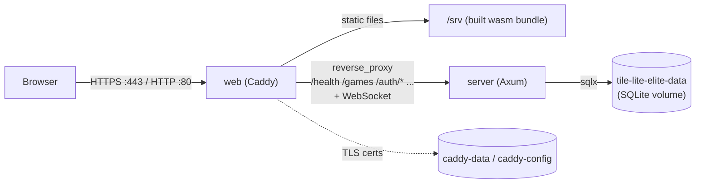
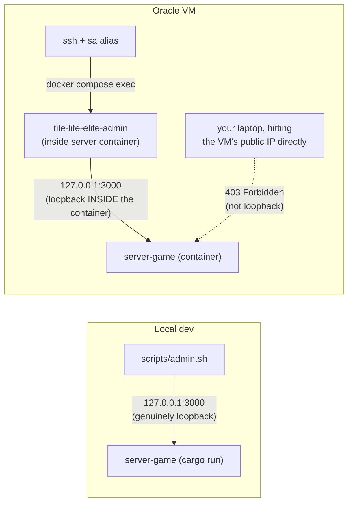

# Production Environment & Operations

How the live system is built, what runs on it, and how it is inspected and
maintained between releases. Shipping a release is
[3.3](3.3-testing-ci-and-release.md#1-what-to-type); the artefacts outside git
are registered in [4.8](4.8-artefacts.md).

## Building a host

Production and rehearsal are Oracle Cloud VMs on the **Always Free** tier. To
build one:

1. **Sign up** at `cloud.oracle.com`; phone and card verification is an
   identity check, not a charge.
2. **Upgrade to Pay-As-You-Go before creating the instance.** Free-tier-only
   accounts have idle instances reclaimed (95th-percentile CPU under about 20%
   over seven days), which a quiet game server is. Staying within the Always
   Free limits still costs nothing. Recheck the policy against Oracle's docs.
3. **Create the instance**: Ubuntu 24.04 LTS, shape `VM.Standard.E2.1.Micro`
   (1 OCPU, 1 GB, x86_64, so images built on an x86_64 machine run unchanged),
   a public IPv4 address, and the public half of the deploy key pasted in at
   creation. The private half stays at `~/.ssh/oracle_tile_lite_elite`.
4. **Networking**, where almost all the setup time goes and failures show only
   as timeouts:
   - the subnet needs a route to an internet gateway; the instance's
     *Networking* tab can add one, but the security group it creates has no
     inbound rules;
   - **only the security list attached to the subnet applies**, and a VCN can
     have several. Find it under *Subnet → Security*, not the subnet's
     details. Either a security list or a security group permitting traffic is
     enough;
   - ingress: TCP 22, TCP 80, TCP 443 and UDP 443. Egress: all, since a
     TCP-only egress rule blocks DNS and with it `apt-get` and image pulls.
5. **Install Docker** from Docker's apt repository, and add a swapfile
   persisted in `/etc/fstab` for headroom on 1 GB.

**HTTPS** is Caddy's: given a hostname in the `Caddyfile`, it obtains and
renews a Let's Encrypt certificate and redirects `http://` itself. Let's
Encrypt will not certify a bare IP address, so a host with no DNS name of its
own uses `<ip>.sslip.io`, which resolves to that IP with nothing to register.
Production serves `tileliteelite.com`, with its sslip.io name alongside as a
fallback that needs no DNS.

## Container Topology

`Dockerfile`, `docker-compose.yml` and `Caddyfile` at the repository root run
the app as two containers:

- **`server`**: the Axum backend (`server-game`), release-built. Not published
  to the host; reachable only from `web` over the compose network, and by
  `docker compose exec`.
- **`web`**: Caddy, serving the release web build as static files,
  reverse-proxying the API and WebSocket paths to `server`, and handling HTTPS.
  Published on `:80` and `:443`.


```mermaid
flowchart LR
    Browser -- "HTTPS :443 / HTTP :80" --> Caddy["web (Caddy)"]
    Caddy -- "static files" --> Assets["/srv (built wasm bundle)"]
    Caddy -- "reverse_proxy\n/health /games /auth/* ...\n+ WebSocket" --> Server["server (Axum)"]
    Server -- "sqlx" --> DB[("tile-lite-elite-data\n(SQLite volume)")]
    Caddy -. "TLS certs" .-> CertVol[("caddy-data / caddy-config")]
```

**One origin serves everything.** The web build is compiled with
`TILE_LITE_ELITE_API_BASE_URL=""` (explicitly empty, not unset;
[4.1](4.1-configuration.md#environment-variables)), so the client derives its
API and WebSocket target from the origin that served the page. The same bundle
works on any host or domain without a rebuild, and there is no CORS.

**Volumes.** SQLite is on `tile-lite-elite-data`, mounted at `/data` in
`server`; it survives `docker compose down` and rebuilds, but not `down -v`.
Caddy's certificates are on `caddy-data` and `caddy-config`; losing them costs
a fresh certificate request against Let's Encrypt's rate limits.

**Pinned builds.** The three base images (`rust:1-bookworm`,
`debian:bookworm-slim`, `caddy:2-alpine`) are pinned by digest, and the
compiler by `rust-toolchain.toml`, which `rustup` reads on a developer machine
and in the builder stage; `ci.yml` pins the same version explicitly, because
`dtolnay/rust-toolchain` does not read the file. Dependabot's `docker` ecosystem
opens a pull request when a base moves. The `apt-get install` in the
`Dockerfile` still resolves at build time, so an image is reproducible to the
base layer, not byte for byte (#360).

**`RESEND_API_KEY`** is read by `docker-compose.yml` as `${RESEND_API_KEY:-}`,
which Compose fills from a `.env` beside it. `deploy.sh` never copies `.env`,
so it survives every redeploy. Create it once on the VM:

```bash
ssh tile-lite-elite
cat > ~/tile-lite-elite/.env <<'EOF'
RESEND_API_KEY=re_your_real_key_here
EOF
cd ~/tile-lite-elite && docker compose up -d   # picks up the new .env immediately
```

Without it, email is logged instead of sent
([4.1](4.1-configuration.md#environment-variables)).

## Admin CLI

`tile-lite-elite-admin` (crate `crates/admin-cli`) is operator tooling for a
running server: list and delete users, reset a password, sign an account out,
list, delete and force-end games, read the daily size record (`size`), and see
each scheduled job's last pass (`scheduler-health`). It is a thin HTTP client
for `server-game`'s `/admin/*` endpoints, so it cannot drift from what the
server does.

**There is no admin account or token.** `/admin/*` accepts only requests whose
peer address is loopback, whatever `TILE_LITE_ELITE_BIND` is. Running the CLI
on the server's own machine, or inside its container, is the access control. A
request proxied from `web`, or sent to the VM's public address, gets a 403.

| environment | run | why |
| --- | --- | --- |
| dev | `sadev`, or `./scripts/admin.sh` | the server is native on `:3000`, the CLI's default. `admin.sh` builds the CLI in release mode first |
| preview | `sapre` | the server is in a container, whose loopback is not the host's |
| production | `sa`, on the VM | the same, inside the production `server` container |

`scripts/setup-dev-environment.sh` writes `sadev` and `sapre` into `~/.bashrc`,
replacing rather than appending; `sa` is set on the VM. Production reads are
the owner's to run.

```bash
sadev users list
sadev users reset-password <player_id>          # prints a generated password
sadev users reset-password <player_id> --password 'a specific one'
sadev users sign-out <player_id>                # ends every session it has
sadev users delete <player_id>

sadev games list
sadev games list --status waiting               # waiting | active | finished | aborted
sadev games list --older-than-days 30
sadev games delete <game_id>
sadev games force-end <game_id>

sadev scheduler-health                          # each job's last pass, UTC to the second
sapre size                                      # a row per day
sadev --json games list | jq '.[] | select(.status == "waiting")'
```


```mermaid
flowchart LR
    subgraph Local dev
        AdminSh["scripts/admin.sh"] -- "127.0.0.1:3000\n(genuinely loopback)" --> DevServer["server-game (cargo run)"]
    end
    subgraph Oracle VM
        SSH["ssh + sa alias"] -- "docker compose exec" --> Container["tile-lite-elite-admin\n(inside server container)"]
        Container -- "127.0.0.1:3000\n(loopback INSIDE the container)" --> ProdServer["server-game (container)"]
        Outsider["your laptop, hitting\nthe VM's public IP directly"] -. "403 Forbidden\n(not loopback)" .-> ProdServer
    end
```

The binary is the release build in the `runtime-server` image; nothing is
installed on the VM.

### Reading the output

Listings are aligned tables. Timestamps are UTC, stated once in the column
header, matching `--older-than-days` and the raw database values.

- `users list` shows each account's rating and how many rated games produced
  it. A rating of `-` means no rated game has finished, distinct from an
  account at the starting 1500. `last seen` is real activity
  ([4.2](4.2-database-schema.md#players)).
- `games list` marks seats `[bot]`, `[unclaimed]` (a human seat nobody has
  taken), or `[out]` (resigned, force-resigned or timed out). Scores appear
  once a game has started.
- `--json` prints the server's own records, timestamps as epoch seconds, on
  every command including the mutations.

**Before acting:**

- `games force-end` is refused on a game already finished or aborted, so a
  mistyped id is safe.
- `games delete` and `users delete` have no prompt and no undo. `users delete`
  keeps the player's games and unclaims their seats
  ([4.2](4.2-database-schema.md#retention-and-deletion)).
- A delete refused for a live session is unblocked by `users sign-out`, which
  ends every session the account has and nothing else. It succeeds quietly on
  an account already signed out.

## Inspecting the database

For anything the admin CLI does not cover, read the SQLite file:

```bash
dbprod                       # production, over ssh
dbpre                        # preview
dbdev                        # dev
dbpre "select count(*) from games;"    # or one query, non-interactively
```

All three are `-readonly`, so an inspection session cannot write;
`scripts/setup-dev-environment.sh` writes them into `~/.bashrc`. `dbpre` and
`dbprod` run `sqlite3` inside the running `server` container with
`docker compose exec` (with `-T` when a query is given, so it works in a
pipeline). `dbdev` reads `data/tile-lite-elite.sqlite3` in the checkout. The
database is in WAL mode ([4.1](4.1-configuration.md#sqlite)), so reading never
blocks the server.

```sql
.tables                                          -- list tables
.schema games                                    -- one table's DDL
.headers on
.mode column
select id, status, turn_number from games order by created_at desc limit 10;
select version, description from _sqlx_migrations order by version;  -- migrations applied
PRAGMA journal_mode; PRAGMA foreign_keys;        -- confirm runtime pragmas
```

The authoritative game state is the `snapshot_json` blob; the columns are
projections of it ([4.4](4.4-snapshot-json-schema.md),
[4.5](4.5-data-dictionary.md)). To avoid touching production at all, restore a
[backup](#backups) locally and query the copy.

**If the stack is stopped**, `exec` has nothing to reach. Use a throwaway
container, and exit it: one left running holds the volume.

```bash
docker run --rm -v tile-lite-elite-preview-data:/data alpine sh -c \
  'apk add --no-cache sqlite >/dev/null 2>&1 && exec sqlite3 -readonly /data/tile-lite-elite.sqlite3'
```

Use `tile-lite-elite-data` for production. Do not read the volume's host path:
it needs `sudo`, and a copy of the `.sqlite3` file without its `-wal` and
`-shm` files is silently stale.

## Logging

`server-game` logs through `tracing`. Application events (registration, login,
games created, started and finished, invitations, admin actions, move-time
retirement) log at `info`; per-request spans from `tower-http` at `debug`, off
by default. Admin actions log at `warn`, as an audit trail.

```bash
cargo run -p server-game                                              # app events
RUST_LOG=server_game=info,tower_http=debug cargo run -p server-game   # with per-request spans
RUST_LOG=debug cargo run -p server-game                               # everything
```

### Identifiers only, and how that is kept true

**No display name, email address, token or password reaches the log.**
`player_id` and `game_id` are enough to diagnose, and the admin CLI resolves an
id when somebody needs to. A failed login carries its reason only.
`player_id` is pseudonymous, not anonymous: we hold the table that resolves it.

[4.7](4.7-log-events.md) declares every field each event may carry, and
`scripts/check-log-hygiene.py` validates log lines against it: no address in
any field, nothing undeclared, and `additionalProperties: false` asserted on
the schema itself. It reads two streams:

| stream | |
| --- | --- |
| CI | the regression suite's own output, including branches production would not show in a week |
| the host, nightly | that day's journal |

### journald, not the container

Both services log through the **journald** driver, so logs survive container
recreation and deploys. They do not survive the VM: the journal is on the
instance only and nothing copies it off, so losing the instance loses its
logs, including those covering its loss (#225).

```bash
journalctl CONTAINER_TAG=tle-server -o cat            # the server, as written
journalctl CONTAINER_TAG=tle-server -o cat | jq .     # readable
journalctl CONTAINER_TAG=tle-server -o cat | jq -r 'select(.level=="WARN")'
journalctl CONTAINER_TAG=tle-web --since today        # the web container
journalctl CONTAINER_TAG=tle-server -o cat \
  | jq -r '"\(.timestamp[11:19]) \(.level) \(.message)"'   # one line each
```

**Retention is set on the host**:

```ini
# /etc/systemd/journald.conf.d/zz-tile-lite-elite.conf
[Journal]
SystemMaxUse=100M
MaxRetentionSec=7d
```

100M is a backstop: seven days needs about 100 KB. The older `50-cap.conf` sets
`SystemMaxUse=50M` and `RuntimeMaxUse=16M`; files apply in name order and a
later value wins, so `zz-` overrides its 50M, and its 16M runtime cap stands.

#### Reading an email out of preview's log

Preview sets `TILE_LITE_ELITE_LOG_EMAIL_BODIES=1`, so with no provider it logs
the whole message, which is how a link is read while testing:

```bash
journalctl CONTAINER_TAG=tle-preview-server -o cat \
  | jq -r 'select(.message | startswith("email not sent")) | .text_body' | tail -1

# just the link
journalctl CONTAINER_TAG=tle-preview-server -o cat \
  | jq -r 'select(.text_body) | .text_body' | grep -oE 'https?://[^ ]+' | tail -1
```

Production sets nothing and logs the message kind alone.
`check-log-hygiene.py --source production` fails if a body appears on a
production journal.

## Monitoring and alerting

Four alarms watch production, all publishing to the OCI Notifications topic
`tile-lite-elite-alerts`, which emails the owner. All were created in the OCI
console; nothing in the repository builds them.

| alarm | fires when |
| --- | --- |
| `tile-lite-elite-production-health-success-rate` | two of three external probes cannot get `/health`, for 3 minutes |
| `CPU 90%` | mean CPU above 90% for 5 minutes |
| `Memory 90%` | mean memory above 90% for 5 minutes |
| `Stopped` | the instance's status changes to stopped |

**The external probe** is the OCI Health Check
`tile-lite-elite-production-health`: HTTPS `GET https://tileliteelite.com/health`
every 60s with a 10s timeout, from AWS West EU 3, São Paulo and Tokyo. Its
alarm reads `oci_healthchecks` / `HTTP.isHealthy`, `mean()` with `grouping()`,
filtered to that monitor's `resourceId`, firing below 0.5, which means at least
two of three probes agree. It is the alarm that matters: the host alarms come
from an agent on the host, so a lost VM is silent.

**The host alarms** read `oci_computeagent` on
`instance-20260712-1225-production`, published by the Oracle Cloud Agent
already on the VM.

**Two settings that fail silently if wrong:**

- the Health Check targets the hostname, not the instance: over HTTPS a bare IP
  fails the TLS handshake, and the monitor reports down forever;
- the alarm's `resourceId` filter is required: without it `grouping()` averages
  every stream in the namespace, and a second monitor could hold the mean at
  exactly 0.5, which does not fire.

**Not monitored:** filesystem free space (no built-in OCI metric; deferred at
13% used); error rates, latency and volume (no baseline, and an alert must want
a response); rehearsal (a test clone, not a service). Memory is the one with a
trajectory: every game is held in RAM until deleted.

## Changing production configuration

A change to production outside the image, such as the VM's `.env`, anything in
the OCI console, DNS or firewall rules, reaches users as code does and has none
of its protection: no review, test, staging, gate, smoke test, rollback or
record. So:

- **raise an issue**; it is the only record;
- **try it on rehearsal first** where the same setting exists; it has its own
  `.env` and instance;
- **keep what you replace**: `cp .env .env.bak-$(date +%Y%m%d-%H%M%S)` is the
  only rollback;
- **check the order**: adding a hostname to `SITE_ADDRESS` before its DNS
  record resolves fails certificate issuance, and repeated failures risk a
  Let's Encrypt rate limit;
- afterwards, **record it** in the section it belongs to here and in
  [4.8](4.8-artefacts.md), and **close the issue by hand**.

Grade a change by what it can break and how quickly that would be noticed, not
by whether it is code or configuration: the `Caddyfile` decides routing and
TLS, and a mistake there takes the site down as surely as a bad commit.

## Keeping the hosts current

| layer | what updates it | on whose initiative | how often |
| --- | --- | --- | --- |
| OS packages, including the Docker daemon | `unattended-upgrades` | automatic | continuously |
| the running kernel and libc | a reboot | ours | when `/var/run/reboot-required` appears |
| GitHub Actions, Docker base images | Dependabot | a pull request appears | weekly |
| Rust crates | `cargo audit` reports; the bump is ours | ours | advisories daily, bumps as needed |
| the application | a release | ours | per release |

**`unattended-upgrades` installs and never reboots**, so a kernel or libc fix
is not live until a reboot. `scripts/check-hosts.sh` reads the reboot flag, the
kernel and the Docker version on both hosts, and `verify.sh` reports it.

**Rehearsal first, then production, as two deliveries**, each `Route: Other`
with a letter milestone ([3.6 §2.2.1](3.6-change-lifecycle.md#221-business-as-usual-updates)).
A package upgrade and a reboot are separate deliveries, because either can fail
alone. A reboot costs about 90 seconds of outage.

Phased updates differ by machine, so the hosts can legitimately differ for
days; `check-hosts.sh` does not read phased packages such as `netplan.io`.

## Backups

SQLite is on a named volume (`tile-lite-elite-data` in production,
`tile-lite-elite-preview-data` in preview;
[4.1](4.1-configuration.md#environments)). A manual backup stops the server
first, because in WAL mode a copy taken while it runs can miss the WAL entry
that completes the file:

```bash
docker compose stop server
docker run --rm -v tile-lite-elite-data:/data -v "$PWD":/backup debian \
  tar czf /backup/tile-lite-elite-data-$(date +%Y%m%d).tgz -C /data .
docker compose up -d
```

Restoring is the reverse: stop the stack, extract into the volume, start it.

### Automatic pre-deploy snapshots

`deploy.sh` snapshots the volume before every deploy, into
`~/tile-lite-elite/snapshots/`, keeping `SNAPSHOT_KEEP` (5):

```text
snapshots/pre-0.4.13-fb36f50-20260731T164500Z.tgz
```

The name is the version and commit live before that deploy. Snapshots exist
for [rolling back across a migration](3.3-testing-ci-and-release.md#112-roll-back-across-a-migration),
which `rollback.sh` does with the `:previous` images. They protect against a
bad deploy, not against losing the machine.

### The nightly copy that leaves the VM

A systemd timer copies the database nightly to `OCI bucket
tile-lite-elite-backups` (#174). **The VM can write backups and cannot read,
list or delete them**, so neither an attacker on the host nor a bug in our
script can destroy them.

| | |
| --- | --- |
| bucket | `tile-lite-elite-backups`, namespace `axbbaaptgyab`, region `uk-cardiff-1` |
| credential | a bucket-scoped pre-authenticated request (PAR): object writes only, listing off |
| on the bucket | object versioning on, since a write PAR can overwrite an existing name |
| PAR expiry | **2028-08-23**. Nothing announces it |

Deleting the PAR in the console revokes it on the next attempt.

### Restoring

A restore runs from the development machine, with a read PAR created in the
console for the occasion. There is no standing read credential, so **a restore
cannot begin without console access**, and whatever protects the Oracle account
protects the backups.

```text
1  Console → bucket tile-lite-elite-backups → Pre-Authenticated Requests → Create
     target       Bucket
     access       Permit object reads
     listing      ON — restore-backup.sh lists to find the newest object
     expiry       a day or two. It exists for one restore
```

```bash
# 2 — on the DEVELOPMENT machine, never the production host
umask 077 && printf '%s\n' 'PASTE_THE_READ_PAR' > ~/.tle-restore-par

# 3 — verify what is there, without loading it anywhere
./scripts/restore-backup.sh "$(< ~/.tle-restore-par)"

# 4 — or load it into a volume, once the output above looks right
./scripts/restore-backup.sh "$(< ~/.tle-restore-par)" --into tile-lite-elite-data

# 5 — remove the credential from this machine, then delete the PAR in the console
shred -u ~/.tle-restore-par
```

**The read PAR is never written to the production host**: while it is there,
anyone on the host can read every backup.

**Drill it about every hundred days.** A successful drill refreshes
`marker-restore-ok`, from the host, so the write PAR never reaches a command
line:

```bash
ssh tile-lite-elite 'PAR="$(< ~/.tile-lite-elite-backup-par)"
  printf "%s\n" "$(date -u +%Y%m%dT%H%M%SZ)" > /tmp/m
  curl --fail -sS -T /tmp/m "${PAR}marker-restore-ok"; rm -f /tmp/m'
```

**Nothing watches the backups yet (#201).** The scripts write
`marker-backup-ok`, `marker-logcheck-ok` and `marker-restore-ok`, meant to be
alarmed on age (26 hours, 36 hours, 100 days). OCI Object Storage publishes
only bucket size and object count, with no per-object age, so no alarm can
read them. If the backup stops, nobody is told.

## Wiping production

Migrations apply on startup, so a schema change never needs a wipe. Wiping is
only for a deliberate start-over, and backs up first:

```bash
ssh tile-lite-elite
cd ~/tile-lite-elite

# 1. Stop services; the named volumes are untouched.
docker compose down

# 2. Full backup of the data volume (see Backups above).
docker run --rm -v tile-lite-elite-data:/data -v "$PWD":/backup debian \
  tar czf /backup/tile-lite-elite-data-$(date +%Y%m%d).tgz -C /data .

# 3. Clear the database; create_if_missing recreates it, migrations included,
#    on the next start.
docker run --rm -v tile-lite-elite-data:/data debian \
  sh -c 'rm -f /data/tile-lite-elite.sqlite3 /data/tile-lite-elite.sqlite3-wal /data/tile-lite-elite.sqlite3-shm'
```
