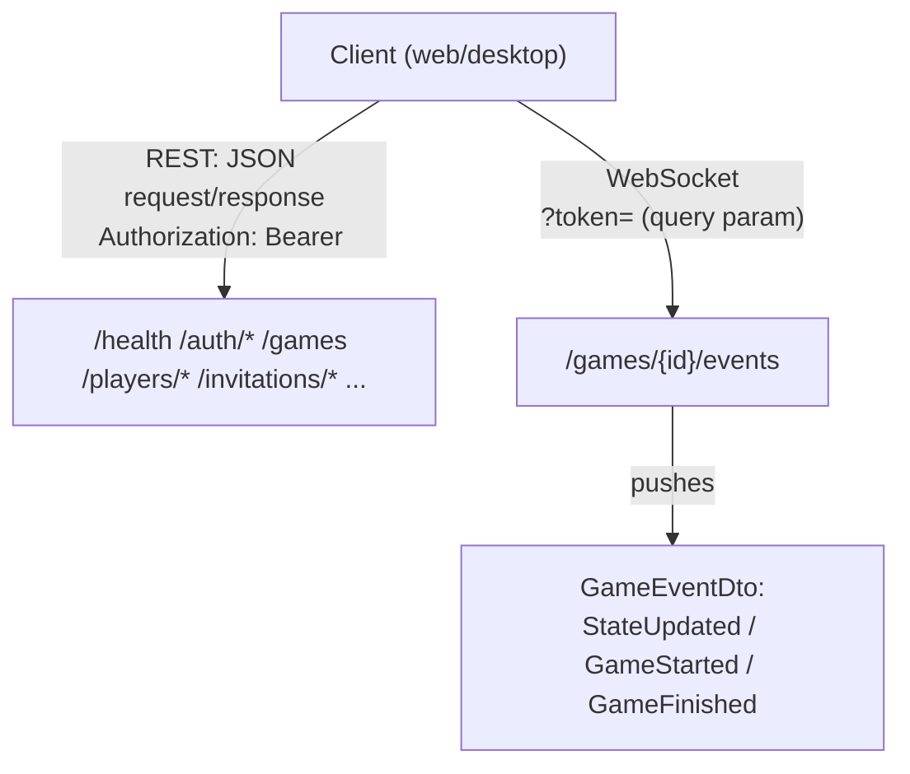
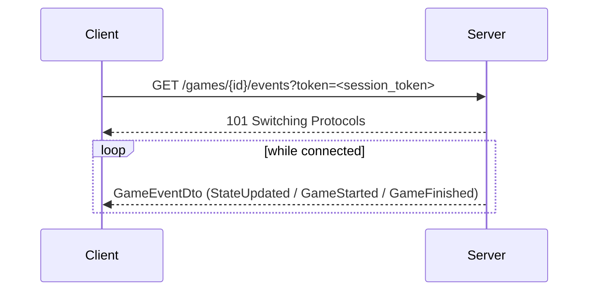
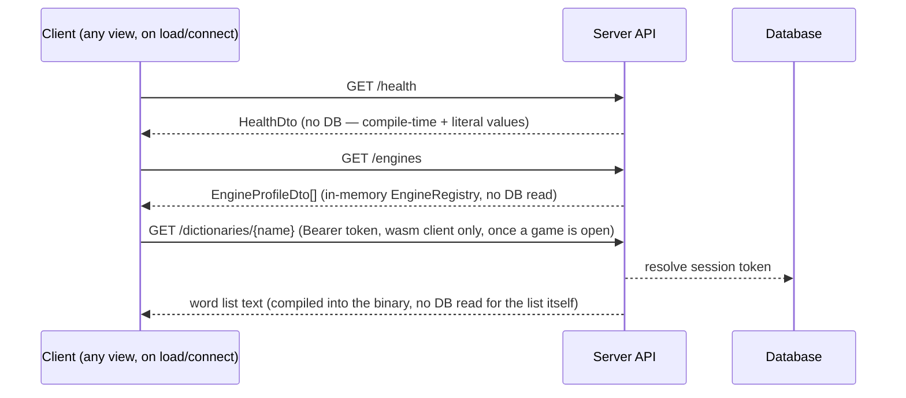
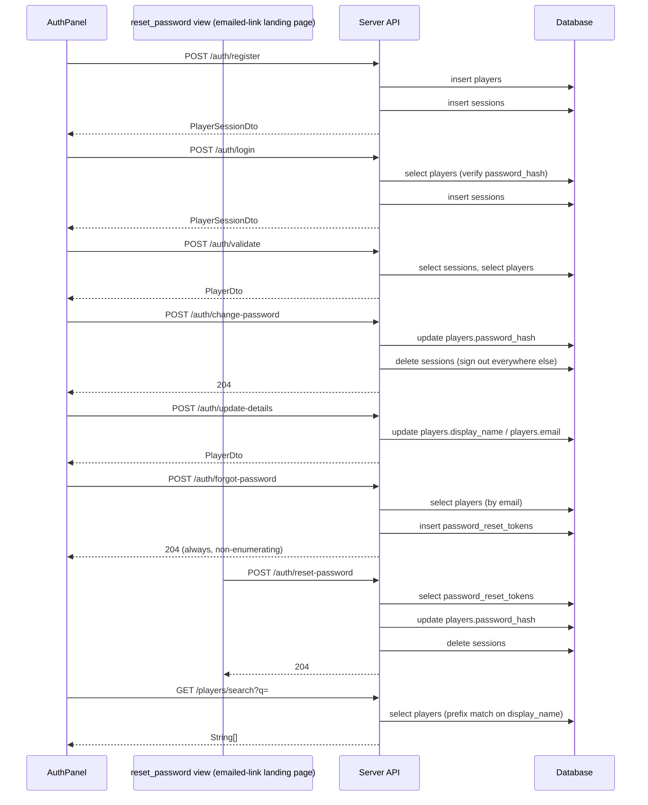
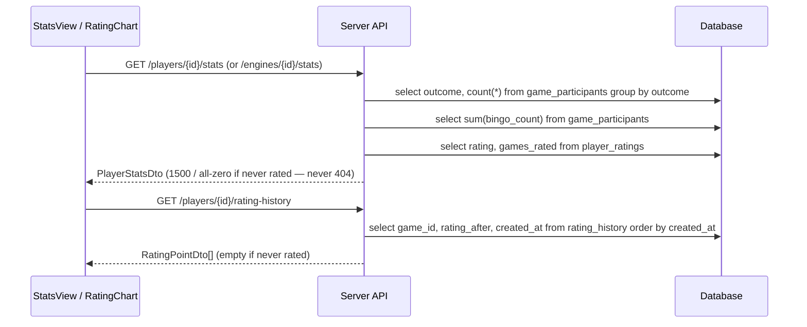
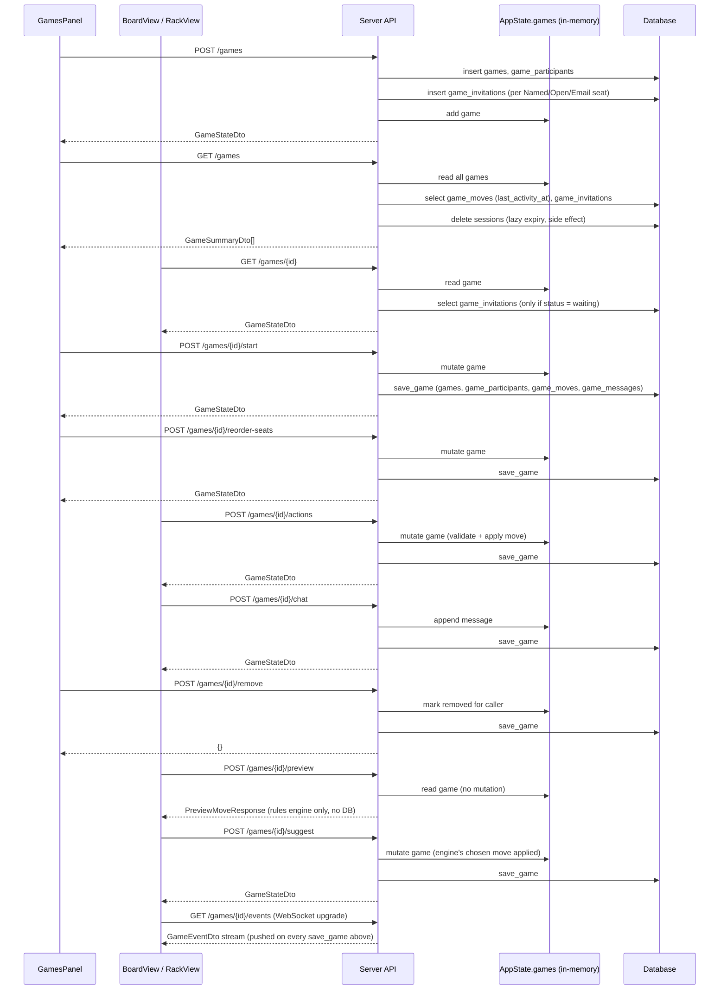
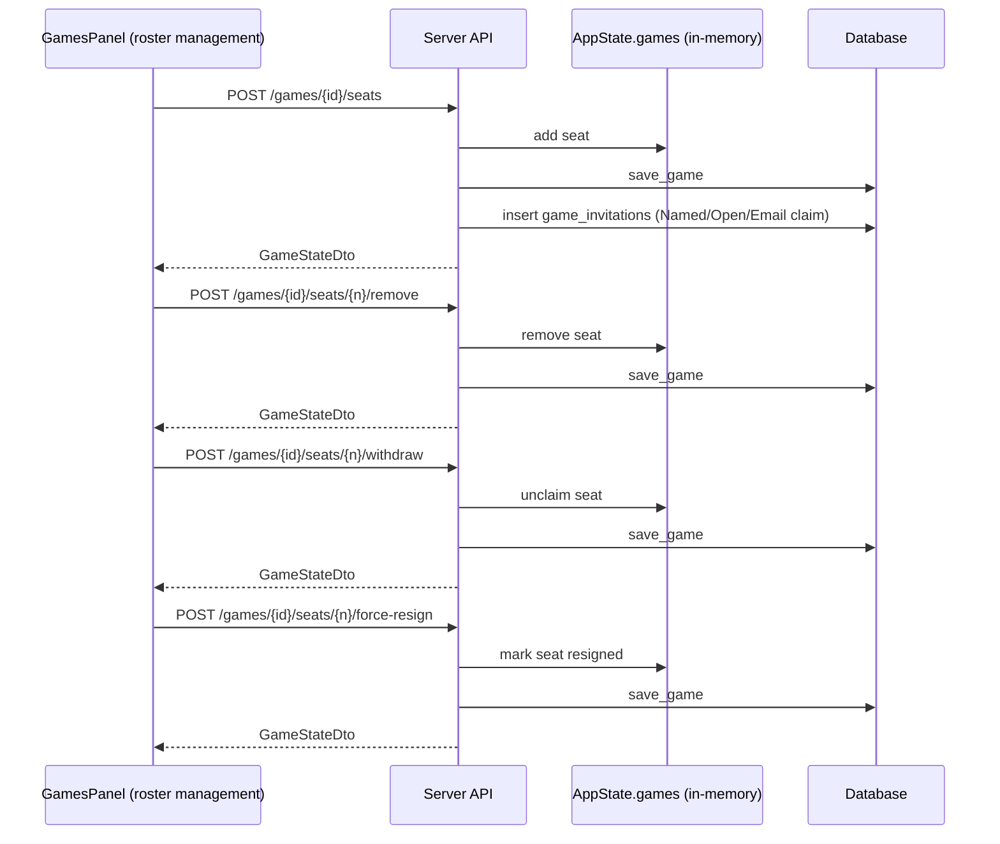
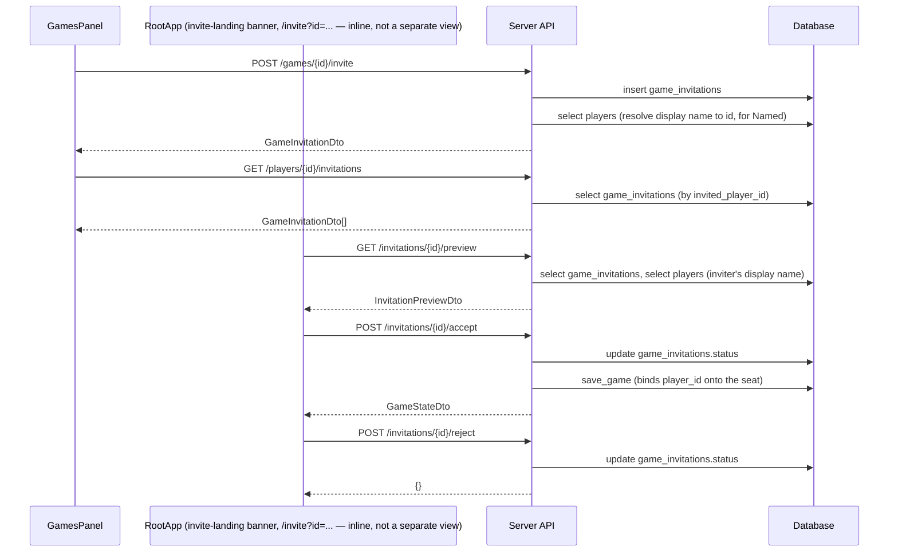
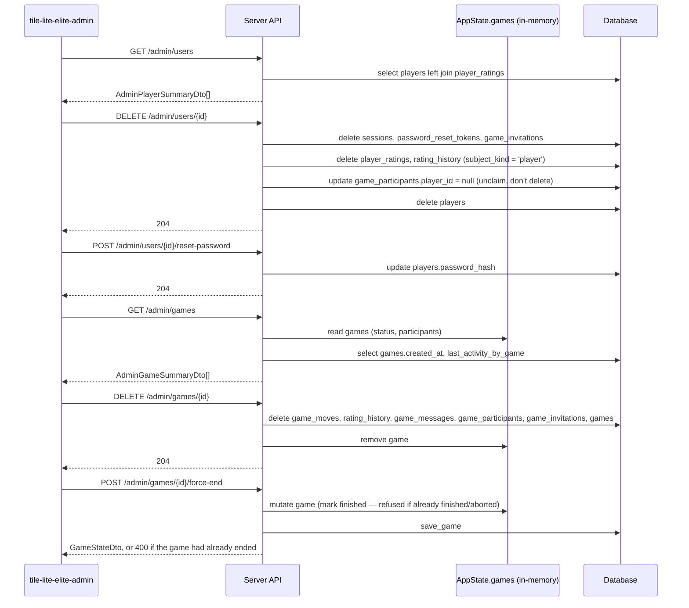

# API Schema

*Verified against the code at `3b43fab` (app 0.4.21, 2026-08-03) — the Auth column re-derived from the handlers, row by row. To see what has changed since, `git log 3b43fab..HEAD -- crates/`; for this document's own history, `git log --follow -- <this file>`.*

Every HTTP endpoint and wire type `server-game` exposes, as of `api::API_VERSION` `2.9` — generated by reading `crates/api/src/lib.rs` (every DTO) and `crates/server-game/src/app.rs`'s route table directly, not maintained by hand from memory. If this ever drifts from the code, the code wins — re-derive this doc from those two files rather than trusting stale prose here.

This is the flat, structural reference (every route, every field). For narrative walkthroughs of specific flows (register → login → play, the forgot-password round trip), see [2.6 Authentication Examples](2.6-authentication-examples.md) — that doc and this one deliberately overlap on the auth endpoints at different altitudes: this one is "what's the shape," that one is "here's a worked example."

## Protocol Overview

Two protocols, one origin: ordinary REST (JSON over HTTP) for everything except live game updates, which use one WebSocket endpoint. In production/preview both are served by Caddy from the same origin as the static web client — see [3.4 Production Environment & Operations](3.4-production-environment.md#container-topology).



**Authentication**: a bearer token (`PlayerSessionDto.session_token`, issued by `/auth/register` or `/auth/login`) sent as `Authorization: Bearer <token>` on REST calls. Some endpoints treat it as *optional* — `authenticated_player_id` resolves it to a player id if present and valid, `None` otherwise, and each handler decides whether anonymous access is acceptable for that action (anonymous play still works; seat-ownership checks are what actually require it — see [2.5 Authentication](2.5-authentication.md)). The one exception is the WebSocket endpoint: browsers can't set custom headers on the handshake, so `game_events` reads the token from a `?token=` query parameter instead of the header.

**Errors**: every failure returns a JSON body `{"message": "<string>"}` (`ApiError`) with a matching HTTP status. There's no machine-readable error code beyond the status; the message is human-readable, not meant to be pattern-matched by clients.

### Status codes: what each one means and what a caller does

Both ends are written against this table. The server picks the code from the
reason; the client decides what to do from the code, and never from the
message.

| Code | HTTP text | Reason | What the caller does |
| --- | --- | --- | --- |
| `400` | Bad Request | The request was malformed or broke a rule | Fix it. Retrying unchanged fails again |
| `401` | Unauthorized | Not signed in, or the session has expired | Sign in |
| `403` | Forbidden | Signed in, but not allowed to do this — someone else's game, a seat that is not yours, starting a game you did not create | Nothing. Not retryable |
| `404` | Not Found | No such game, player or invitation | Nothing. Not retryable |
| `429` | Too Many Requests | **You are asking too often** | Wait `Retry-After`, then retry |
| `500` | Internal Server Error | This one request failed; the service is up | Report it. Do not loop |
| `502` | Bad Gateway | Nothing is listening — mid-deploy, or the server is down | Back off and retry |
| `503` | Service Unavailable | **The service is busy** — at capacity, not your fault | Wait `Retry-After`, then retry |
| `504` | Gateway Timeout | Upstream took too long | Back off and retry |
| *(none)* | — | No response at all — DNS, connection refused, timeout | Treat as `502` |

The HTTP text is the registered reason phrase for each code (RFC 9110, and RFC
6585 for `429`). It is here to make the table searchable against anything else
that talks about status codes — Caddy's logs, a browser's network tab, the
`http` crate's own constants — not because clients see it: `401` is
"Unauthorized" in the registry and means *unauthenticated*, which is the sort
of mismatch that makes the official name worth writing down beside what we
actually mean by it.

**The two that carry `Retry-After` are the two worth distinguishing.** `429`
is the caller's own doing and is fixed by slowing down. `503` is not their
fault at all — everybody together is asking for more than there is room for —
and is fixed by waiting. Answering the second with the first tells somebody to
change their behaviour when there was nothing wrong with it, and hides a
capacity problem in a log full of what look like abusive callers.

### `x-build-id`

On **every** response, carrying the build the server was compiled from — the
same id `/health`'s `app_version` appends after the `+`.

A header rather than a field on one endpoint, because it belongs to any
response rather than to a question anybody asks. That is the point: a client
learns the server has moved from traffic it was sending anyway, instead of
polling something on a timer for an event that happens a few times a week.

**Absent on a build with no id** — a local `cargo run`. Silence is the honest
answer where a constant would be indistinguishable from "the server is running
your build".

**It is a trigger, not an authority.** It describes the *server*, while the
client bundle is served by a different container. Inside a deploy window the
server is already new while the old bundle is still being served, so a client
that reloaded on this header alone would fetch the old bundle, see the header
again, and loop. The web client uses it only to start a check against
`/version.txt`, which is served alongside the bundle and so knows what is
actually being served, and reloads only when *that* differs.

### `Retry-After`

Sent on **`429`** and on the **`503`** the service generates itself — a rate
limit, or the hashing pool being full. Not on `502` or `504`, which come from
Caddy when the server is not answering and carry nothing.

**Always an integer number of seconds**, never the HTTP-date form the standard
also permits. It is the earliest point worth trying again, not a promise that
trying then will succeed.

A client should:

- **wait at least that long**, and say so — "try again in 30 seconds" is the
  one thing a refused caller can act on
- **agree the plural with the number** — 1 second, 2 seconds. "In 1 seconds"
  reads as unfinished, and `0` is said as "now" rather than "in 0 seconds",
  a wait of none not being a wait
- **ignore a value it cannot parse**, and fall back to its own backoff. A proxy
  may rewrite the header, and a future server may send a date. **A wrong wait is
  worse than none**, because somebody will believe it

`refusal_message` in the web client implements exactly that, with tests for the
date form and the empty value.

**Where the number comes from.** It is not configured. For a rate limit it is
the time until one permit replenishes — derived from the limit itself, so
changing a limit changes the hint with it — **rounded up**, then given a random
**0 to 2 seconds** on top.

| refused by | permit every | `Retry-After` |
| --- | --- | --- |
| registration, 2/min | 30s | up to **33** |
| logins and resets, 10/min | 6s | up to **9** |
| authenticated, 240/min | 250ms | **1 to 3** |
| global floor, 1200/min | 50ms | **1 to 3** |
| the hashing pool being full | — | **1 to 3** |

**Rounded up, because obeying it exactly has to work.** The underlying wait is
a countdown from the moment of refusal, so it is almost never a whole number of
seconds, and truncating it produced a value that was always slightly too early
— a client that waited precisely as long as it was told was refused again,
every time. Both adjustments here are upward for the same reason: waiting a
little too long costs a moment, waiting a little too short costs a round trip.

**Jittered, so a crowd does not return as a crowd.** The three keyed limits
stagger themselves, each caller's allowance refreshing from its own last
request. The global floor does not — it is one allowance for the whole service,
so every caller it refuses computes the same wait and would otherwise come back
at the same instant, into a service already short of room. Rounding up without
jitter would sharpen that, by turning a spread of truncated values into a
uniform one.

**So the number is not repeatable**, and nothing should treat it as a constant
of the limit. It is the earliest sensible retry for this refusal, not a
property of the tier.

**The two fast tiers say a small number** because their true wait is under a
second, and whole seconds is the unit the header has. That is not a loss: a
caller refused by those has to wait a moment, and a moment is what they are
told. The hint carries real information exactly where waiting is worth doing —
a registration refusal genuinely means half a minute.

**`502`, `503`, `504` and no-response are one family to a client**: the
service is not there just now, so back off and retry. The client's
`backend_is_unreachable` is exactly this test, and it is what drives the
offline state and the reconnect loop. A `500` is deliberately outside it — the
service answered, this one request failed, and dropping a working session into
a reconnect loop over that would be worse than the bug.

Which codes come from where: `429` from the three keyed rate-limit tiers,
`503` from the global floor and from the hashing semaphore, `502`/`504` from
Caddy when the server is not answering. See
[4.1 Configuration](4.1-configuration.md) for the limits themselves.

**`/admin/*`**: a separate concern from the above — loopback-only (rejected for any non-`127.0.0.1`/`::1` peer, regardless of `Authorization`), not part of the player-facing auth model at all. See [3.4 Production Environment & Operations](3.4-production-environment.md#admin-cli).

## Endpoints

**The Auth column was re-derived from the handlers on 2026-08-03**, after
two rows were found wrong by accident (`/games/{id}/remove`, then `POST
/games`). Twelve were wrong in the same direction: documented `opt` but
rejecting an unauthenticated caller outright. The pattern was a stale
assumption that anonymous play meant anonymous *everything* — in fact only
reading and acting on a game you can already see is anonymous; anything that
creates, joins, or changes a roster requires an account.

Auth column: **—** none checked · **opt** bearer token read if present, several behaviors depend on it · **req** bearer token required, rejected without one · **loopback** `/admin/*`'s own guard, not bearer-based.

### Meta endpoints

| Method | Path | Auth | Request | Response |
|---|---|---|---|---|
| GET | `/health` | — | — | `HealthDto` |
| GET | `/engines` | — | — | `Vec<EngineProfileDto>` |
| GET | `/dictionaries/{name}` | req | — | `text/plain` word list (`sowpods`/`enable2k`/`german`/`spanish`) |

**The limiter answers before the handler**, so it can be returned by any endpoint rather than by a particular one.

| | |
| --- | --- |
| `You are asking too often — please slow down.` | **429**, with `Retry-After`. The per-address limit for this route |

`Retry-After` is always present on a 429 — see [above](#retry-after) for why a caller should read it rather than guess.

**`/health` and `/engines` refuse nothing.** They take no input, need no account, and answer for the server rather than for a caller.

**`GET /dictionaries/{name}`**

| | |
| --- | --- |
| `Sign in to fetch a dictionary` | no bearer token |

An unknown `{name}` is a `404` from the router, not a message from the handler — the four names are a closed set and a fifth is not a request the service understands.

`/dictionaries/{name}` is the only Meta endpoint requiring sign-in, and not because a word list is sensitive — it's the one place the server *redistributes* its word lists rather than merely using them, and SOWPODS is Collins-derived with no recoverable provenance (see [ATTRIBUTIONS.md](../ATTRIBUTIONS.md)). Only the wasm client ever calls it; native builds compile every dictionary in.

### Auth endpoints

**`display_name` is both a label and the unique key**, and the UI calls it
something else on purpose (D48, #333). A player logs in with it, is found by it
when somebody invites them by name, and is shown by it in the roster and chat —
three roles, two of which are identifier work.

| where | what it is called |
| --- | --- |
| login and registration | **`User ID`** — a credential, and the word carries *unique* and *type it exactly* |
| the invitation flow | **`Player`** — you are naming somebody to play against, and within the game a person is a player |
| roster, chat, participants | nothing. The value is shown on its own |
| the API, the DTOs, the `players` column | **`display_name`**, unchanged |

**Every message a player reads follows the same split**, which is where it went
wrong the first time. `Incorrect User ID or password` and `That User ID is
already taken` on the credential side; `Player to invite`, `a player or an
email` and `No player named '<x>'` on the person side.

**The invitation flow said `User` until 2026-09-09** and was changed by user
testing rather than by argument. Reading the form showed that `User to invite`
sat oddly beside `No player named 'simon'`, which the same flow already said —
so the flow was already using the domain word and only the field disagreed.
Owner: *"I think I like player better than user for the game invitations flow."*

**The mismatch is deliberate and recorded here rather than left to be found.**
Renaming the column means a migration and renaming the field is a breaking API
change, both paid for clarity that only the *form* delivers. The moment to
rename the data is when there are genuinely two things to name — if a display
name is ever split from the handle, which is what RFC 8266 assumes and this
schema does not have.

| Method | Path | Auth | Request | Response |
|---|---|---|---|---|
| POST | `/auth/register` | — | `RegisterPlayerRequest` | `PlayerSessionDto` |
| POST | `/auth/login` | — | `LoginPlayerRequest` | `PlayerSessionDto` |
| POST | `/auth/validate` | — | `ValidateSessionRequest` | `PlayerDto` |
| POST | `/auth/logout` | opt | — | `204 No Content` (deletes the bearer token's session) |
| POST | `/auth/change-password` | req | `ChangePasswordRequest` | `204 No Content` |
| POST | `/auth/update-details` | req | `UpdatePlayerDetailsRequest` | `PlayerDto` |
| POST | `/auth/forgot-password` | — | `RequestPasswordResetRequest` | `204 No Content` (always, non-enumerating) |
| POST | `/auth/reset-password` | — | `ResetPasswordRequest` | `204 No Content` |
| GET | `/players/search?q=` | req | — | `Vec<String>` (display names, prefix match) |

#### What each Auth call refuses, and why

*Every message below is the exact string the caller receives. The web client renders it verbatim, so these are on a player's screen — which is why they are part of the interface rather than an implementation detail (#329).*

**`POST /auth/register`** — creates an account and returns a session, so the caller is signed in on success.

| | |
| --- | --- |
| `User ID, email, and password are all required` | any of the three missing or blank |
| `That User ID is already taken` | the folded name already exists. Folding is NFC + lowercase today, so `José` and `JOSÉ` are one name |

**`POST /auth/login`** — and it is the reason this document needs behaviour and not only shapes.

| | |
| --- | --- |
| `Incorrect User ID or password` | **both** a wrong password and an account that does not exist |

**One message for two conditions, deliberately.** A caller that could tell them apart could enumerate display names. And the miss path is not merely worded alike — it verifies `DECOY_PASSWORD_HASH` against the supplied password before failing, so an unknown account costs the same time as a wrong password. Without that, the timing tells a caller what the message will not.

**`POST /auth/validate`** — exchanges a session token for the player it belongs to.

| | |
| --- | --- |
| `Session is invalid or has expired` | no such token, or it has aged out |

**`POST /auth/logout`** — deletes the bearer token's session. Refuses nothing: `204` whether or not the token was live, so signing out twice is not an error.

**`POST /auth/change-password`**

| | |
| --- | --- |
| `Sign in to change your password` | no bearer token |
| `Session is invalid or has expired` | a token that is no longer good |
| `A new password is required` | the new password is missing or blank |
| `Current password is incorrect` | the current password does not verify |

**`POST /auth/update-details`** — changes display name, email, or both.

| | |
| --- | --- |
| `Sign in to update your details` · `Session is invalid or has expired` | as above |
| `Nothing to update` | neither field supplied. Refused rather than treated as a no-op, so a caller cannot believe it changed something |
| `User ID cannot be blank` · `Email cannot be blank` | supplied but empty |
| `That User ID is already taken` | the new name collides, folded |

**`POST /auth/forgot-password`**

| | |
| --- | --- |
| `An email address is required` | the field is missing or blank |

**It answers `204` whether or not the address is known.** That is the point: a different answer for a known address makes this an oracle for which emails have accounts. The refusal above fires only on a malformed request, never on an unknown one.

**`POST /auth/reset-password`**

| | |
| --- | --- |
| `A new password is required` | missing or blank |
| `This reset link is invalid or has expired` | no such token, already used, or aged out — the three are one message, for the same reason login's two are |

**`GET /players/search?q=`**

| | |
| --- | --- |
| `Sign in to search players` | no bearer token |

**An unknown prefix is not an error**: it returns an empty list. So *nobody matched* and *you may not ask* are different answers, which is what lets the invite field say `No player named '<x>'` without guessing.

#### Two failures any password call can return

`register`, `login`, `change-password` and `reset-password` all hash or verify through a bounded permit, because Argon2 is deliberately expensive and unbounded concurrency is a denial-of-service surface (#25).

| | |
| --- | --- |
| `The server is busy — please try again.` | **503**, with `Retry-After`. Every permit is in use. A caller should retry after the header says |
| `hashing capacity unavailable` | **500**. The permit could not be acquired at all — a broken server rather than a busy one, and a caller cannot fix it by waiting |

They are two answers because the caller's action differs, which is the test [§Status codes](#status-codes-what-each-one-means-and-what-a-caller-does) applies.

### Rating & stats endpoints

A "rating subject" is a player *or* an engine — both are rated and tracked identically, so each route below exists in a `/players/{id}/…` and an `/engines/{id}/…` form over the same handler shape. These are the only read endpoints that require a bearer token outright (`req`, not `opt`): unlike game data, there's no anonymous view of them.

None of them 404 for a subject that has never been rated — stats come back as rating `1500` with every counter `0`, history as an empty list — so a client can render a brand-new player's stats page without special-casing "no rows yet".

| Method | Path | Auth | Request | Response |
|---|---|---|---|---|
| GET | `/players/{player_id}/stats` | req | — | `PlayerStatsDto` |
| GET | `/players/{player_id}/rating-history` | req | — | `Vec<RatingPointDto>` (oldest first) |
| GET | `/engines/{engine_id}/stats` | req | — | `PlayerStatsDto` (with `subject_kind: engine`) |
| GET | `/engines/{engine_id}/rating-history` | req | — | `Vec<RatingPointDto>` (oldest first) |

**All four refuse the same thing and nothing else.**

| | |
| --- | --- |
| `Sign in to view stats` | the two `/stats` calls, without a bearer token |
| `Sign in to view rating history` | the two `/rating-history` calls, without one |

**An unknown player or engine id is not an error here**: stats come back with zeroed counts and history as an empty list. A subject that has played nothing and a subject that does not exist give the same answer, which is deliberate — these read across accounts, so distinguishing them would say which ids exist.

### Games endpoints

| Method | Path | Auth | Request | Response |
|---|---|---|---|---|
| POST | `/games` | req | `CreateGameRequest` | `GameStateDto` |
| GET | `/games` | req | — | `Vec<GameSummaryDto>` |
| GET | `/games/{id}` | opt | — | `GameStateDto` |
| POST | `/games/{id}/start` | opt | `StartGameRequest` (empty) | `GameStateDto` |
| POST | `/games/{id}/reorder-seats` | opt | `SwapSeatsRequest` | `GameStateDto` |
| POST | `/games/{id}/actions` | opt | `GameActionRequest` | `GameStateDto` |
| POST | `/games/{id}/chat` | req | `PostChatMessageRequest` | `GameStateDto` |
| POST | `/games/{id}/remove` | req | — | `{"status":"removed"}` |
| POST | `/games/{id}/preview` | opt | `PreviewMoveRequest` | `PreviewMoveResponse` |
| POST | `/games/{id}/suggest` | opt | — | `GameStateDto` (engine's suggested move applied) |
| GET | `/games/{id}/events` | opt (query `?token=`) | — | WebSocket upgrade → `GameEventDto` stream |

#### What each Games call refuses, and why

**Four refusals recur across the group**, and they are worth reading once rather than at every row:

| | |
| --- | --- |
| `Game not found` | **404**. Also the answer for a game that exists but which this caller removed from their own list — a removed game is gone as far as its owner is concerned |
| `Sign in to <do the thing>` | **401**, no bearer token. The verb differs per call so the message says what was refused, not merely that something was |
| `Session is invalid or has expired` | **401**, a token that is no longer good. Distinct from the above because the remedy differs: sign in again, rather than sign in |
| `You are not part of this game` | **403** on `GET /games/{id}`. The game exists and this caller has no seat in it |

**`POST /games`** — creates a game and its seats in one call.

| | |
| --- | --- |
| `Sign in to create a game` | no bearer token |
| `A game needs at least two seats` | fewer than two supplied |
| `Every human seat needs a claim: creator, named, or open` | a human seat with no claim. A seat must say who may take it before the game exists, not afterwards |
| `Only one seat can be claimed by the creator` | two seats both claimed `creator` |

**`GET /games`** — the caller's own list.

| | |
| --- | --- |
| `Sign in to see your games` | no bearer token |

**`GET /games/{id}`** — `opt` auth, and that is the interesting part: an anonymous caller may read a game, but only a participant may read one that is not public to them.

| | |
| --- | --- |
| `Sign in to view this game` · `You are not part of this game` | as above |

**`POST /games/{id}/start`**

| | |
| --- | --- |
| `Only the game's creator can start it` | **403** |
| `A game needs at least two seats` | seats were removed after creation |
| `Every seat must be filled before the game can start` | an open or invited seat is still unclaimed |

**`POST /games/{id}/actions`** — submit a move.

| | |
| --- | --- |
| `This seat belongs to a different player` | **403**. The move names a seat this caller does not hold |

**`POST /games/{id}/preview`** and **`POST /games/{id}/suggest`**

| | |
| --- | --- |
| `This seat belongs to a different player` | **401** here rather than 403 — see the note below |
| `Game is not active` | suggest only: the game is waiting, finished or aborted |
| `Current seat missing` · `Current seat is not human-controlled` | suggest only. There is no seat to move for, or the seat is an engine's — suggesting to an engine is not a thing a caller can ask for |

**The same sentence carries two statuses**, and it is not a mistake worth hiding: `actions` returns `403` for a seat that is not yours and `preview`/`suggest` return `401`. A caller switching between them sees the same words with a different status. Worth a requirement to make consistent; recorded here rather than quietly documented as intended.

**`POST /games/{id}/chat`**

| | |
| --- | --- |
| `Sign in to chat` | no bearer token |
| `Only seated players can chat in this game` | **403**. Watching is not taking part |

**`POST /games/{id}/remove`** — takes the game off this caller's list; it does not delete it for anybody else.

| | |
| --- | --- |
| `Sign in to remove this game from your list` | no bearer token |

**`POST /games/{id}/reorder-seats`**

| | |
| --- | --- |
| `Only the game's creator can reorder seats` | **401** |

**`GET /games/{id}/events`** — the WebSocket. It refuses by **closing the upgrade** rather than by returning a message, so none of the strings above apply. The token arrives as `?token=` because a browser cannot set a header on a WebSocket handshake.

`/games/{id}/remove` hides a game from the caller's own list only — it is not broadcast, and no other player's view changes. It accepts a game whose status is `Finished` **or** `Aborted` (anything else is a 400, "Only games that are over can be removed"); `Aborted` was added at API 2.8, having previously been offered by the games panel but rejected by the server.

### Seats & Roster endpoints (pre-start only, except force-resign)

| Method | Path | Auth | Request | Response |
|---|---|---|---|---|
| POST | `/games/{id}/seats` | req | `CreateSeatRequest` | `GameStateDto` |
| POST | `/games/{id}/seats/{n}/remove` | req | — | `GameStateDto` |
| POST | `/games/{id}/seats/{n}/withdraw` | req | — | `GameStateDto` |
| POST | `/games/{id}/seats/{n}/force-resign` | req | — | `GameStateDto` (mid-game, unresponsive opponent) |
| POST | `/games/{id}/abort` | req | — | `GameStateDto` (creator cancels the whole game → `status: aborted`) |

#### What each Seats & Roster call refuses, and why

Every call here also returns `Game not found` for an unknown game, and a **401** without a bearer token whose wording names the verb rather than merely saying no:

| | |
| --- | --- |
| `Sign in to add a seat` | `POST /games/{id}/seats` |
| `Sign in to remove a seat` | `POST /games/{id}/seats/{n}/remove` |
| `Sign in to withdraw from a seat` | `POST /games/{id}/seats/{n}/withdraw` |
| `Sign in to force-resign a seat` | `POST /games/{id}/seats/{n}/force-resign` |
| `Sign in to abort a game` | `POST /games/{id}/abort` |

**`POST /games/{id}/seats`**

| | |
| --- | --- |
| `Only the game's creator can add a seat` | **401** |
| `A human seat needs a claim: named, open, or email` | a human seat with no claim — the same rule `POST /games` applies at creation, enforced again because a seat can be added later |
| `Only the original creator seat may use the Creator claim` | the `creator` claim is not a spare label. It belongs to the seat made when the game was |

**`POST /games/{id}/seats/{n}/remove`** and **`/withdraw`** — and the pair is the point.

| | |
| --- | --- |
| `Only the game's creator can remove a seat` | **401** on `remove`. The creator manages the roster |
| `Only the player holding this seat can withdraw from it` | **401** on `withdraw`. You leave your own seat; you do not remove somebody else's |

**`POST /games/{id}/seats/{n}/force-resign`** — the one call in this group that works mid-game.

| | |
| --- | --- |
| `Only the game's creator can force-resign a seat` | **401** |

**`POST /games/{id}/abort`**

| | |
| --- | --- |
| `Only the game's creator can abort a game` | **401** |

### Invitations endpoints

| Method | Path | Auth | Request | Response |
|---|---|---|---|---|
| POST | `/games/{id}/invite` | req | `InvitePlayerRequest` | `GameInvitationDto` |
| GET | `/players/{player_id}/invitations` | — | — | `Vec<GameInvitationDto>` |
| GET | `/invitations/{id}/preview` | — | — | `InvitationPreviewDto` (unauthenticated — the emailed join link's landing page) |
| POST | `/invitations/{id}/accept` | req | — | `GameStateDto` |
| POST | `/invitations/{id}/reject` | req | — | `{}` (opaque JSON) |

#### What each Invitations call refuses, and why

**`POST /games/{id}/invite`** — the richest set in the API, because a seat can be wrong in several distinct ways.

| | |
| --- | --- |
| `Sign in to invite players` · `Session is invalid or has expired` | no token, or a dead one |
| `Only the game's creator can invite players` | **401** |
| `Game must be in waiting state to invite players` | the game has started, finished or been aborted |
| `No such seat` | the seat number is not in this game |
| `That seat is not open to be invited to` | the seat exists and is already claimed, or is an engine's |
| `This seat already has a pending invitation` | one is outstanding. Refused rather than replaced, so two people are never racing for one seat |

**`GET /players/{player_id}/invitations`**

| | |
| --- | --- |
| `Database error` | **and this one should not exist as a caller-visible string.** It says nothing a caller can act on and something to anybody probing the service. Recorded rather than tidied away — #329 flagged it, and changing it is a behaviour change that wants its own requirement |

**`GET /invitations/{id}/preview`** — unauthenticated on purpose: it is the landing page an emailed join link opens, before the recipient has an account.

| | |
| --- | --- |
| `Invitation not found` | **404**, and it is the only answer. An expired, claimed or withdrawn invitation is *not found* rather than described, so the link cannot be used to learn who was invited to what |

**`POST /invitations/{id}/accept`**

| | |
| --- | --- |
| `Sign in to accept an invitation` · `Session is invalid or has expired` | as above |
| `Invitation not found` · `Game not found` | **404**. The second means the invitation outlived its game |
| `This invitation was not sent to you` | **401**. A valid invitation, addressed to somebody else |
| `This invitation is no longer available — it may already have been claimed` | somebody took the seat first. Worded as a possibility because the server does not distinguish claimed from withdrawn here, and saying which would tell a caller about a game they are not in |

**`POST /invitations/{id}/reject`**

| | |
| --- | --- |
| `Sign in to reject an invitation` | no bearer token |
| `Invitation not found` | **404** |
| `This invitation has already been responded to` | accepted or rejected already. Rejecting twice is refused rather than idempotent, because the second attempt means the caller believes something that is not true |

See [2.7 Authentication and Invitations](2.7-authentication-and-invitations.md) for the full Named/Open/Email seat-claim model these back.

### Admin endpoints (loopback only)

**What each refusal offers.** A refusal that names only a wait is not a remedy —
`sign-out` exists because the delete refusal had none (#295). The errors are
against the endpoints below rather than in a list of their own, because what a
call refuses is part of what it does.

| Method | Path | Request | Response |
|---|---|---|---|
| GET | `/admin/users` | — | `Vec<AdminPlayerSummaryDto>` (newest first) |
| DELETE | `/admin/users/{player_id}` | — | `204 No Content`. **Refused `400`** while a game still refers to the account, or while it has a live session — the two refusals are separate and each names its own remedy |
| POST | `/admin/users/{player_id}/sign-out` | — | `204 No Content`. Ends every session the account has, and nothing else. **`404`** for an id that does not exist — a mistyped id must not read as a successful sign-out. An account with no sessions is `204`: already signed out is the state being asked for |
| POST | `/admin/users/{player_id}/reset-password` | `AdminResetPasswordRequest` | `204 No Content` |
| GET | `/admin/database-size` | — | `Vec<AdminDatabaseSizeDto>`, newest day first, up to 90 days. A missing day means the service was quiet: the row is written by a sweep that only runs when somebody uses the service |
| GET | `/admin/games` | — (query: `status` = `waiting`\|`active`\|`finished`\|`aborted`, `older_than_days`) | `Vec<AdminGameSummaryDto>` (newest first) |
| DELETE | `/admin/games/{game_id}` | — | `204 No Content` |
| POST | `/admin/games/{game_id}/force-end` | — | `GameStateDto`, or `400` if the game has already finished or been aborted |

#### What each Admin call refuses, and why

**`/admin/*` is guarded before any handler runs.**

| | |
| --- | --- |
| `Admin endpoints are only reachable from the server itself` | **403**. The guard is the connection's own address, not a bearer token — `docs/3.4`. So there is no admin credential to leak, and `tile-lite-elite-admin` reaches these by running inside the container |

**`DELETE /admin/users/{player_id}`** — two refusals, each naming its own remedy, which is why they are separate rather than one *cannot delete*. `Player not found` is **404**; both of the below are **400**.

The first lists the games, so the operator can see what is holding the account:

```text
That account cannot be deleted yet. The games below still refer to it. Please wait until they are gone, then delete the account. Games are removed automatically from a week after their last activity, and an invitation goes with the game holding it.
```

The second names the command that clears it, which is the whole of #295:

```text
That account is signed in somewhere. Deleting it now would take an account that is in use, and one that is about to create the very games this command refuses to orphan. Sessions end on their own: 48 hours after they were last used, and 10 days at the outside. To act now rather than wait, sign the account out first: `tile-lite-elite-admin users sign-out <name>`.
```

**`POST /admin/users/{player_id}/sign-out`** and **`/reset-password`**

| | |
| --- | --- |
| `Player not found` | **404**. A mistyped id must not read as a successful sign-out |
| `A new password is required` | reset only: missing or blank |

**The game calls** — `DELETE /admin/games/{id}` and `POST /admin/games/{id}/force-end` — return `Game not found` for an unknown id, and `force-end` returns **400** for a game that has already finished or been aborted.

## WebSocket: `/games/{id}/events`



One event type, three tags (`#[serde(tag = "type")]`), all three carrying the full current `GameStateDto` rather than a diff — the client always replaces its local state wholesale, never patches it. Every state-changing REST call broadcasts to every connection watching that game, so any client with the socket open sees other players' moves without polling.

## DTO Reference

See `crates/api/src/lib.rs` for the doc comments explaining *why* a field exists; that source is the canonical explanation, not duplicated here. `Option<T>` fields are nullable; enums use `#[serde(rename_all = "snake_case")]` unless noted.

**Source** column convention: for a *response* field, where the value actually comes from at read time — a `table.column`, or "calculated" with a one-line note. For a *request* field, what the server does with it (which table it ends up persisted into, or how it's consumed). A recurring, load-bearing fact throughout the game-domain tables below: `GameSession`/`GameStateDto`/`GameSummaryDto`/`MoveRecordDto`/`ChatMessageDto` are built **only** from `games.snapshot_json`, deserialized once into memory — `game_participants`, `game_moves`, and `game_messages` are write-only mirrors from the API's perspective (rewritten on every save for querying/admin use, but never read back to construct a response). See [4.2 Database Schema](4.2-database-schema.md) for the columns those mirror tables actually hold.

### Core game domain DTOs

**`GameStateDto`** — built by `GameSession::to_dto` (`game_state.rs`), then `redact_game_state` zeroes/empties a couple of fields per-viewer before the response leaves the server.

| Field | Type | Source |
|---|---|---|
| `id` | `String` | `games.snapshot_json` (`PersistedGame.id`) |
| `status` | `GameStatus` | `games.snapshot_json` |
| `creator_player_id` | `Option<String>` | `games.snapshot_json` |
| `variant` | `String` | `games.snapshot_json` — a bundled edition name from `rules-shared`'s registry: `official`, `north_american`, `german`, `spanish`, `spicy`. Additive: a new edition is a new accepted value for an existing field, which is a minor API bump (`spicy` arrived at 2.6) |
| `language` | `String` | `games.snapshot_json` |
| `board_layout` | `String` | `games.snapshot_json` |
| `turn_number` | `i64` | `games.snapshot_json` |
| `current_seat` | `u8` | `games.snapshot_json` |
| `winner_seat` | `Option<u8>` | `games.snapshot_json` |
| `final_bonus_seat` | `Option<u8>` | `games.snapshot_json` |
| `final_bonus_points` | `Option<i32>` | `games.snapshot_json` |
| `bag_count` | `usize` | calculated — `bag.len()`, where `bag` is itself from `games.snapshot_json` |
| `move_time_limit_seconds` | `u64` | `games.snapshot_json` |
| `turn_started_at` | `String` | `games.snapshot_json` |
| `participants` | `Vec<ParticipantDto>` | `games.snapshot_json` (see `ParticipantDto` below for its one calculated field) |
| `board` | `Vec<BoardCellDto>` | calculated — `board_to_dto`, from `games.snapshot_json`'s board plus the compile-time premium-square layout for `board_layout` |
| `racks` | `Vec<RackDto>` | `games.snapshot_json`, **redacted**: `redact_game_state` zeroes every seat's rack except the caller's own |
| `moves` | `Vec<MoveRecordDto>` | `games.snapshot_json` (`game_moves` table is never read for this, despite existing) |
| `messages` | `Vec<ChatMessageDto>` | `games.snapshot_json`, **redacted**: emptied entirely unless the caller holds a seat in this game |

**`GameSummaryDto`** — built by `GameSession::to_summary_dto`, called per-game from the `list_games` handler, which then overwrites `relationship`/`invitation_id` per caller.

| Field | Type | Source |
|---|---|---|
| `id`, `status`, `variant`, `current_seat` | — | `games.snapshot_json` |
| `participants` | `Vec<ParticipantDto>` | `games.snapshot_json`, with `invitation_status` forced to `None` (not meaningful in a list view) |
| `last_activity_at` | `String` | calculated — `persistence::last_activity_by_game`: `max(game_moves.created_at)` for the game, falling back to `games.created_at` if no moves yet (a real read of those two tables, unlike the rest of this DTO) |
| `move_time_limit_seconds`, `turn_started_at` | — | `games.snapshot_json` |
| `last_message_at` | `Option<String>` | calculated — last element of `games.snapshot_json`'s `messages` list |
| `relationship` | `GameRelationship` | calculated in the `list_games` handler, comparing the caller's player id against `games.snapshot_json`'s participants and `game_invitations` |
| `invitation_id` | `Option<String>` | calculated in `list_games`, from `game_invitations`, set only when `relationship` is `InvitedByName`/`InvitedOpen` |

**`ParticipantDto`**

| Field | Type | Source |
|---|---|---|
| `seat_number`, `kind`, `display_name`, `player_id`, `engine_id`, `score`, `invited_email` | — | `games.snapshot_json` |
| `invitation_status` | `Option<SeatInvitationStatus>` | calculated — `attach_invitation_status`, the most recent `game_invitations` row for that seat; always `None` in `GameSummaryDto`'s context, only populated for `GameStateDto` responses where a seat is unclaimed |

`GameStatus`/`SeatKind`/`GameRelationship`/`SeatInvitationStatus`/`PremiumDto` are plain enums carried inline in the DTOs above, not separately sourced.

| DTO | Fields | Source |
|---|---|---|
| `BoardCellDto` | `premium: PremiumDto`, `letter: Option<String>`, `is_blank: bool` | calculated — `board_to_dto`; `premium` from the compile-time board layout, `letter`/`is_blank` from `games.snapshot_json` |
| `RackDto` | `counts: Vec<u8>`, `blanks: u8` | `games.snapshot_json`, redacted (see `GameStateDto.racks` above) |
| `MoveRecordDto` | `move_number`, `seat_number`, `move_type`, `main_word`, `score_delta`, `positions`, `description`, `elapsed_us` (move time in µs, `null` if not captured) | `games.snapshot_json` (`game_moves.payload_json` holds the same shape on disk, but is never read back — see the note at the top of this section) |
| `PositionDto` | `x: u8`, `y: u8` | part of `MoveRecordDto`/`MoveCandidateDto`, same source as its parent |

### Move & preview DTOs

No database involvement at all — legality/scoring is computed live by the rules engine against the in-memory `GameSession`, and a preview is never persisted.

| DTO | Fields | Source |
|---|---|---|
| `GameActionRequest` | `seat_number`, `action: PlayerActionDto` | request only — `action` is applied to the in-memory `GameSession`, then persisted into `games.snapshot_json` (and its mirror tables) by the `save_game` call at the end of the request |
| `PlayerActionDto` | `Place`\|`Pass`\|`Exchange`\|`Resign` | request only |
| `MoveCandidateDto` / `TilePlacementDto` / `TileDto` / `DirectionDto` | — | request only |
| `PreviewMoveRequest` | `seat_number`, `candidate: MoveCandidateDto` | request only, never persisted |
| `PreviewMoveResponse` | `is_legal`, `headline`, `detail`, `score` | calculated — live rules-engine evaluation against current in-memory state; not read from or written to the database |

### Game/seat creation DTOs

| DTO | Fields | Source |
|---|---|---|
| `CreateGameRequest` | `seats`, `seed`, `variant`, `language`, `board_layout`, `move_time_limit_seconds` | request only — becomes the initial `games.snapshot_json` on creation |
| `CreateSeatRequest` | `kind`, `display_name`, `engine_id`, `claim: Option<SeatClaim>` | request only — `claim` is consumed immediately: `Creator` binds `games.snapshot_json`'s `creator_player_id` directly, `Named`/`Open`/`Email` each create a `game_invitations` row instead |
| `SeatClaim` | `Creator`\|`Named`\|`Open`\|`Email` | request only, see above |
| `StartGameRequest` | *(empty)* | request only, no fields |
| `SwapSeatsRequest` | `seat_a: u8`, `seat_b: u8` | request only — reorders `games.snapshot_json`'s participant list |

### Chat DTOs

| DTO | Fields | Source |
|---|---|---|
| `PostChatMessageRequest` | `body: String` | request only — appended into `games.snapshot_json`'s `messages` list, mirrored into `game_messages` on save |
| `ChatMessageDto` | `id`, `player_id`, `display_name`, `body`, `created_at` | `games.snapshot_json` (`game_messages` table is write-only, same pattern as `game_moves` — never read back) |

### Authentication DTOs

| DTO | Fields | Source |
|---|---|---|
| `RegisterPlayerRequest` | `display_name`, `email`, `password`, `stay_logged_in` | request only — `display_name`/`email` inserted into `players`, `password` argon2-hashed into `players.password_hash`, `stay_logged_in` consumed to compute `sessions.expires_at` (never itself stored on `players`) |
| `LoginPlayerRequest` | `display_name`, `password`, `stay_logged_in` | request only — `display_name`/`password` checked against `players`, `stay_logged_in` same as above |
| `PlayerSessionDto` | `player_id` | `players.id` |
| | `session_token` | calculated — a fresh UUID v4, returned once; only its sha256 (`sessions.token_hash`) is ever persisted |
| | `display_name`, `email` | `players.display_name`, `players.email` |
| `ValidateSessionRequest` | `session_token` | request only — hashed and looked up against `sessions.token_hash` |
| `ChangePasswordRequest` | `current_password`, `new_password` | request only — `current_password` checked, `new_password` argon2-hashed into `players.password_hash` |
| `UpdatePlayerDetailsRequest` | `display_name`, `email` | request only — persisted into `players.display_name`/`players.email` (only the `Some` one(s)) |
| `RequestPasswordResetRequest` | `email` | request only — looked up against `players.email`; always `204` regardless of match (non-enumerating) |
| `ResetPasswordRequest` | `token`, `new_password` | request only — `token` hashed and matched against `password_reset_tokens.token_hash`, `new_password` hashed into `players.password_hash` |
| `PlayerDto` | `id`, `display_name`, `email`, `created_at` | `players.id`/`players.display_name`/`players.email`/`players.created_at` |
| | `last_seen_at` | `players.last_seen_at` — **always `null` in practice**, see [4.2 Database Schema](4.2-database-schema.md)'s note on that column |

### Invitation DTOs

| DTO | Fields | Source |
|---|---|---|
| `InvitePlayerRequest` | `invited_display_name`, `invited_email`, `seat_number` | request only — creates a `game_invitations` row |
| `GameInvitationDto` | `id`, `game_id`, `invited_player_id`, `inviting_player_id`, `seat_number`, `status`, `created_at`, `responded_at` | `game_invitations`, 1:1 by column name |
| | `inviting_player_display_name` | calculated — looked up from `players.display_name` for `inviting_player_id` at request time, not stored on `game_invitations` itself |
| `InvitationStatus` | `Pending`\|`Accepted`\|`Rejected`\|`Cancelled` | `game_invitations.status` |
| `InvitationPreviewDto` | `inviting_player_display_name`, `status` | same as `GameInvitationDto` above — this is the unauthenticated subset shown on the emailed join link's landing page |

### Meta / versioning DTOs

| DTO | Fields | Source |
|---|---|---|
| `HealthDto` | `status` | calculated — the literal string `"ok"` |
| | `api_version` | compile-time constant, `api::API_VERSION` |
| | `app_version` | compile-time — `Cargo.toml`'s `version` plus `TILE_LITE_ELITE_BUILD_ID` if set at build time (see [4.1 Configuration](4.1-configuration.md#versioning)) |
| | `schema_version` | `_sqlx_migrations` — the highest migration applied to this server's database, read once at startup. `Option<i64>`, `#[serde(default)]`, so a client that predates API 2.7 simply ignores it. Exists for `scripts/deploy.sh`, which compares it against the target commit's migrations and refuses to ship an image the database has already moved past |
| `ApiVersion` | `major`, `minor` | compile-time constant, part of `HealthDto`/version-check responses |
| `ApiError` | `message` | calculated — the specific error message for whatever failed; never DB-sourced |
| `EngineProfileDto` | `id`, `name`, `version`, `author`, `description` | **in-memory `EngineRegistry`**, not the database — `GET /engines` reads `state.engines.metadata()` directly. `engine_profiles` is written to (upserted once per server startup) but never read back; it exists for potential future querying, not current use |
| | `supports_timed_play`, `supports_analysis`, `supports_ranking` | same — in-memory `EngineRegistry` (mirrored into `engine_profiles.capabilities_json` on write, but that mirror is never read) |

### Admin DTOs (loopback only)

| DTO | Fields | Source |
|---|---|---|
| `AdminGameSummaryDto` | `id`, `status`, `participants` | in-memory `state.games` (itself from `games.snapshot_json`) |
| | `created_at` | calculated — `persistence::created_at_by_game`, a real `select id, created_at from games` (unlike the player-facing DTOs, admin listing does read this column back) |
| | `last_activity_at` | calculated — `persistence::last_activity_by_game`, same query as `GameSummaryDto.last_activity_at` above |
| `AdminPlayerSummaryDto` | `id`, `display_name`, `email`, `created_at`, `last_seen_at` | `players` — the same columns `PlayerDto` carries |
| | `rating`, `games_rated` | `player_ratings`, **left**-joined in `persistence::list_player_summaries`. `rating` is `null` for a subject with no row (never finished a rated game), deliberately *not* the `1500` that `PlayerStatsDto` reports — an operator listing needs "has this account ever played" to be visible, and the left join is what keeps those accounts in the list at all |
| `AdminResetPasswordRequest` | `new_password` | request only — argon2-hashed into `players.password_hash`, bypassing the normal `current_password` check (loopback-only access is the authorization instead) |

### Rating & stats DTOs

| DTO | Fields | Source |
|---|---|---|
| `RatingSubjectKind` | `player`\|`engine` | calculated — which of the two `/…/stats` routes was called |
| `PlayerStatsDto` | `subject_kind`, `subject_id` | echoed back from the route's path parameter |
| | `rating`, `games_rated` | `player_ratings`, falling back to `1500`/`0` when there's no row — this DTO never 404s for an unrated subject |
| | `wins`, `losses`, `ties`, `timeouts`, `resignations` | calculated — `select outcome, count(*) … group by outcome` over `game_participants.outcome`, which `persistence::compute_participant_outcomes` sets once a game finishes |
| | `bingo_count` | calculated — `sum(game_participants.bingo_count)` across every game this subject has played |
| `RatingPointDto` | `game_id`, `rating_after`, `created_at` | `rating_history`, ordered by `created_at` — one row per game that actually moved this subject's rating, so a skipped-for-rating ending (timeout, force-resign, abort, admin force-end) contributes no point |

See [4.1 Configuration](4.1-configuration.md#versioning) for how `ApiVersion` is checked client-side and when to bump it.

## Sequence Diagrams: Every Endpoint, With Context

One diagram per group from [Endpoints](#endpoints) above, each showing the UI side that actually calls it (`crates/ui/src/components/`/`views/`, verified by reading the client code, not assumed), the server handler, and which table(s) it reads from or writes to — matching the **Source** columns in [DTO Reference](#dto-reference). Where a call is served entirely from the in-memory `AppState.games` map rather than a real query, the diagram says so explicitly rather than drawing an arrow to a table that isn't actually touched.

### Meta sequences



### Authentication sequences



### Rating & stats sequences

`StatsView` (`crates/ui/src/views/stats.rs`) fetches both halves for whichever subject is being viewed; `RatingChart` (`crates/ui/src/components/rating_chart.rs`) plots the history series. Neither endpoint reads the in-memory games map — a rated result is settled into these tables once, when the game finishes, and every later read is pure SQL.



### Games sequences



### Seats & Roster sequences



### Invitations sequences



### Admin sequences (loopback only — no UI, `tile-lite-elite-admin` CLI)


