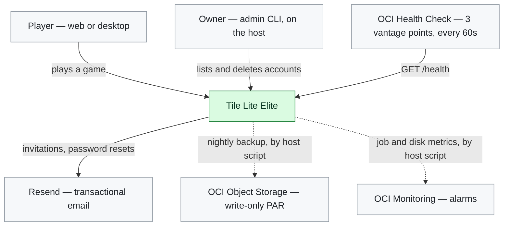
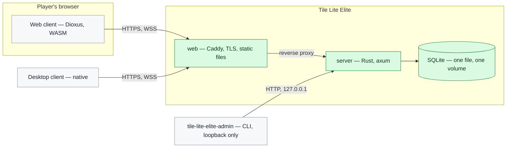
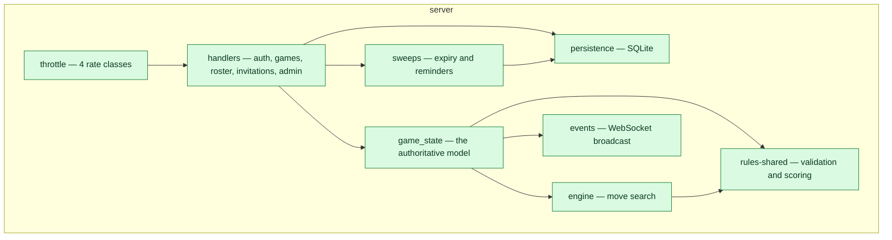
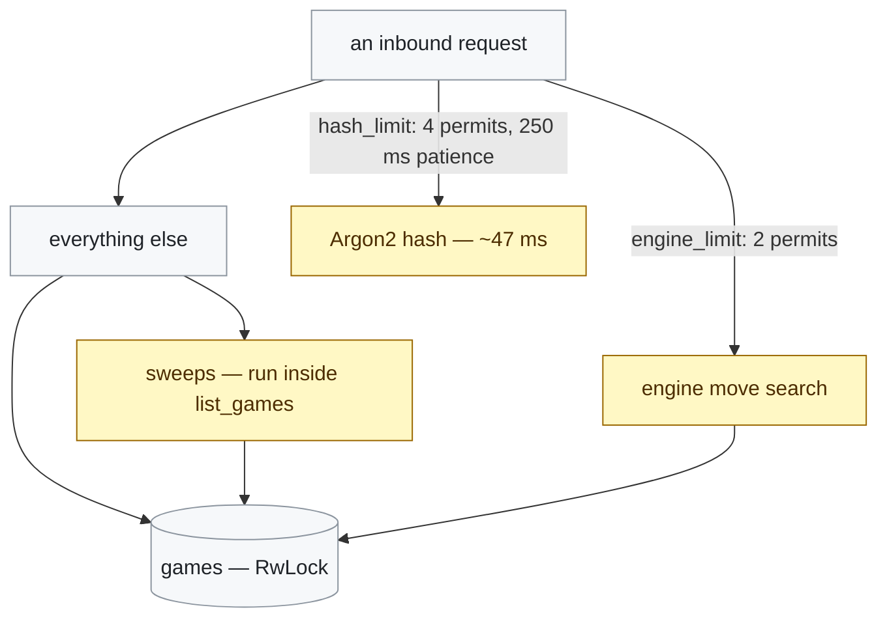

# 406 Worked Examples

**Every view in the adopted set, drawn against this system.** Owner, 2026-09-22:
*"Can I see examples of these diagrams? If it is useful to understand the
options then include diagrams we don't intend to maintain."*

**So some of these are here to be looked at and dropped.** Each says whether it
earns a permanent home, and the ones that do not are worth more as a
demonstration of what the level shows than as something to keep current. The set
itself is [in the diagrams README](../../../../diagrams/README.md#which-view-a-diagram-takes-and-saying-so).

## 1. System Context — who uses it, and what it uses

**Worth keeping.** It is the only diagram that shows the four external things
the service depends on, and three of them are invisible in every other view. The
dotted arrows are the ones D49 forces through the host rather than the
application — which is an architectural fact this level states and no other does.

## 2. Container — the deployable processes

**Worth keeping**, and it is the one `docs/1.1` should carry. Three boxes is the
whole service, which is the point: at this size the Container view is small
enough to hold in your head, and it is where *the admin CLI reaches the server
over loopback and nothing else does* becomes visible.

## 3. Component — inside the server

**Worth keeping**, and this is the level #71 changes. `docs/1.2` has a version of
it already, drawn before `rules-shared` and the sweeps split out.

## 4. Deployment — which containers run where

*Already in `docs/1.1`, with rehearsal added 2026-09-22. Not repeated here.*

**Worth keeping, and it is the roadmap's level.** It is also the view whose
omission of rehearsal went unnoticed for weeks, which is the argument for
drawing environments explicitly rather than describing them.

## 5. Dynamic — a move being submitted

*Already in `docs/1.2`. Not repeated here.*

**Worth keeping one**, not several. A Dynamic diagram per flow would be a dozen
diagrams nobody maintains; the move is the flow worth having because it is the
one where the client, the shared rules and the server all have to agree.

## 6. Concurrency — what runs at once, and what bounds it

**Worth keeping, and it is the one we did not have.** Everything amber is a
bound or a thing that happens on somebody else's request — and drawing it makes
two facts visible that are currently only in code comments: **the sweeps run
inside `list_games`**, so nothing happens unless somebody looks, and **the games
map is a single lock** that both the engine and ordinary handlers contend for.

**Sharper since #408 (2026-09-22): two of those sweeps are `O(n)` over every
resident game, under a write lock, on every call to `list_games`** —
`expire_overdue_turns` and `send_move_time_reminders` both iterate the whole
map. That is the ten-second poll every client makes, so a resident idle game
is not a passive memory cost: it is work redone on the busiest path in the
service, for every client, every poll. `expire_old_terminal_games` is the
exception — it queries the database for what is stale first and only touches
the map for the rows it removes.

**#400 changes this diagram more than any other**, which is a good test of
whether the view earns its place: a scheduler moves `Lazy` off the request
arrow entirely.

## What we would not maintain

**A Code-level diagram.** C4's fourth level, and its own author advises against
it. Nothing here is complex enough that a class diagram beats reading the file.

**A System Landscape diagram.** It shows several systems in an organisation. We
have one.

**A Dynamic diagram per endpoint.** Thirty-odd diagrams that go stale the first
time a handler changes. `docs/4.3` documents each endpoint in prose and that is
enough.

**A Deployment diagram per environment.** Tried mentally and rejected: four
near-identical pictures whose only differences are a hostname and a TLS port.
The single diagram with one subgraph per environment shows the same thing and
makes a missing environment obvious, which four separate files would not.
