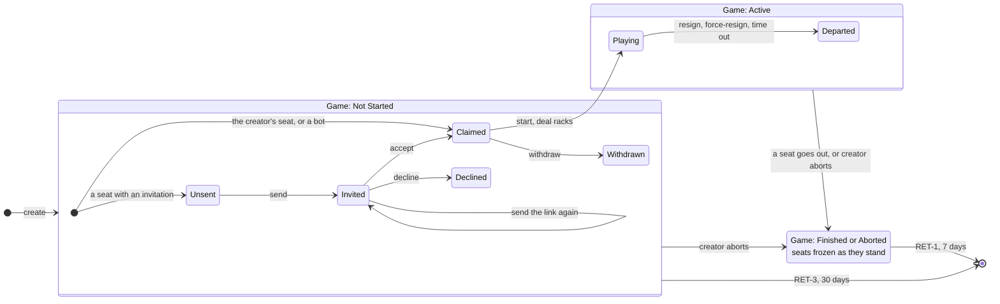
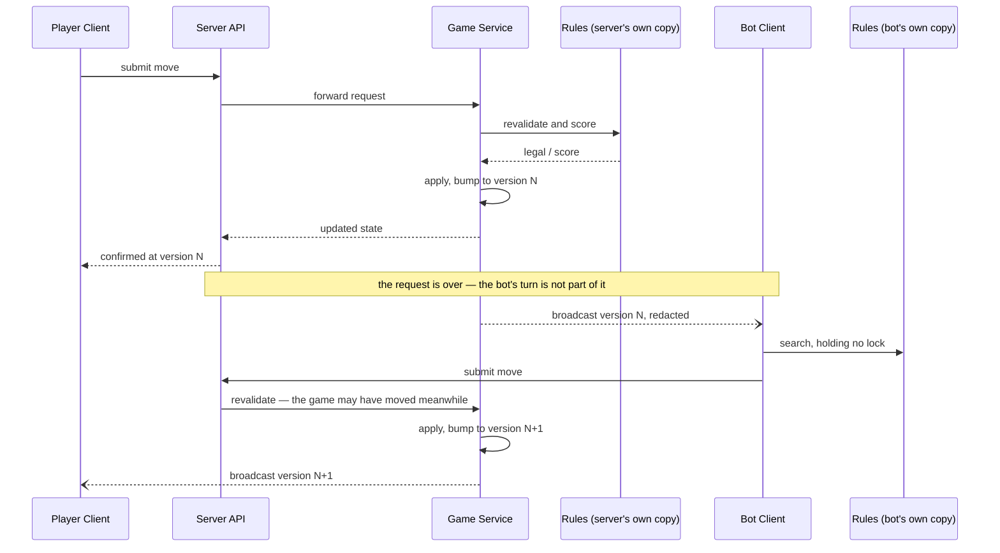
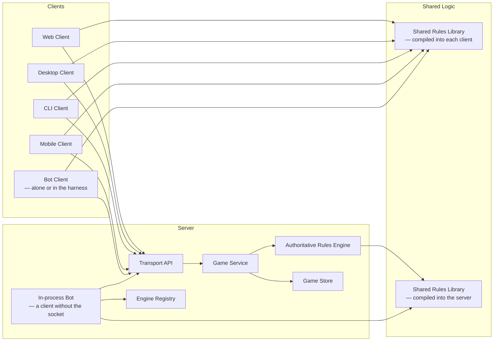

# One Game Model

Design note for issues #9, #10, #26, #71 and #75, and the undo work in #73
that depends on them. **Not yet implemented** — this records the shape agreed
before code.

**The concrete shapes are in [`71-data-model.md`](71-data-model.md)** — the
types as they would be written, the DTOs, the schema, which module changes, the
message flows, the client's state and how the engine is invoked. This note
argues what must be true; that one says what gets written. Where they differ,
this one is right.

**Pending decisions.** Where the text below is not final it says so and names
the Decision issue that will settle it. The open ones, as of 2026-10-02:

| decision | what it settles | where it bites |
| --- | --- | --- |
| [#461](https://github.com/delphside/tile-lite-elite/issues/461) D61 | whether Core writes an append-only event log | *Open questions*, the log; `game_moves` in the data model §5 |
| [#462](https://github.com/delphside/tile-lite-elite/issues/462) D62 | what bounds engine searches running in parallel | *The engine is a client*; *Non-functional design* |
| [#463](https://github.com/delphside/tile-lite-elite/issues/463) D63 | whether #10's harness is a work package of this project | *The harness runs the bots* |
| [#464](https://github.com/delphside/tile-lite-elite/issues/464) D64 | branches and milestones per delivery | `71-delivery.md` |
| [#465](https://github.com/delphside/tile-lite-elite/issues/465) D65 | the standard response header and error body (#380 R8) | `ApplyError` on the wire |
| [#466](https://github.com/delphside/tile-lite-elite/issues/466) D66 | whether bot sessions are exempt from ACC-1 | *A client authenticates as a person* |
| [#467](https://github.com/delphside/tile-lite-elite/issues/467) D67 | which package carries the requirements not yet allocated | #71's body |
| [#468](https://github.com/delphside/tile-lite-elite/issues/468) D68 | what aborting does to seats that have no player | *The two lifecycles together* |
| [#469](https://github.com/delphside/tile-lite-elite/issues/469) D69 | what a failed save leaves in memory | *One version, moved in one place* |
| [#470](https://github.com/delphside/tile-lite-elite/issues/470) D70 | whether this project or #408 owns the games map | *Locking is per game* |

The design map this project starts from, in the format #406 is agreeing, is
not drawn yet; it waits on #406's open questions.

One goal, from which everything here follows:

> **Engine code cannot tell whether it is running in the server or in a
> client.**

Two things have to be true for that. The engine must be handed the same
objects wherever it runs, and it must be driven the same way. Neither is true
today, and the reasons turn out to be the same reasons a client sometimes
never hears that a game changed.

## What is wrong now

**The version does not move for everything a client can see.** `version` lives
on `GameSession` and is the only freshness signal a client has —
`should_apply_update` takes an incoming state only when its version is higher.
A seat's invitation status is rendered as part of the game but stored in
`game_invitations`, so writing a row changes what every tab should show and
moves nothing any tab can detect. Sending and declining an invitation both did
exactly that, and only a full page reload noticed.

**Seat state is derived from history.** `attach_invitation_status` folds a
seat's state out of the most recent invitation row on every read. The seat
holds nothing, which is why changing it touches no version.

**The wire and the domain disagree.** `ParticipantDto` carries
`invitation_status` and `ParticipantState` has no field for it, so
`DTO → domain → DTO` loses it. A client cannot build an object that sees what
the server sees, however carefully the conversion is written.

**Only the server can read the wire.** `board_from_dto`, `tile_from_dto` and
`move_candidate_from_dto` live in `server-game`, so any other client either
does without them or writes a second implementation.

**Bots are not clients.** `run_engine_turns` loops up to
`MAX_ENGINE_TURNS_PER_TRIGGER` inside whichever request triggered it, holding
the global games write lock across each engine search. An all-engine game
plays to completion inside one `/start`.

## One version, moved in one place

Every change to a game goes through a single handler taking an enum:

```rust
pub enum GameMessage {
    Place { seat: u8, candidate: MoveCandidate },
    Pass { seat: u8 },
    Exchange { seat: u8, tiles: Vec<Tile> },
    Resign { seat: u8 },
    ForceResign { seat: u8 },
    TimeOut { seat: u8 },
    Abort,
    AdminForceEnd,
    SeatAdded { .. },
    SeatRemoved { seat: u8 },
    SeatInvited { seat: u8, .. },
    InvitationAccepted { seat: u8, .. },
    InvitationDeclined { seat: u8 },
    SeatWithdrawn { seat: u8 },
    KeepRequested,
    UpdateUserDetails { player: PlayerId },
    Start,
    SeatsSwapped { a: u8, b: u8 },
    ChatPosted { player: PlayerId, body: String },
    Hide { seat: u8 },
    ReminderSent { seat: u8 },
}
```

`Start` deals the racks and drops the spent seats in one step. Undo and redo
join the enum with #272. Anything that changes what a client of the game could
be shown is a variant; there is no other way in.

The handler applies the change, advances the version, records the event and
broadcasts — in that order, in one place. Nothing else writes to a game.

**A rejected message changes nothing.** The handler validates against the game
as it stands and applies only a message that will succeed, so a refused
exchange or placement leaves the racks and the bag as they were. What happens
when the change is applied in memory and the save then fails is
[Decision #469](https://github.com/delphside/tile-lite-elite/issues/469) (D69).

That is the whole of the fix for the freshness problem. There is no obligation
to remember, because there is nowhere else to write. The current stopgap,
`announce_invitation_change`, is a convention with nothing enforcing it, and
conventions of that kind have already been forgotten twice.

**The version is a counter, not a description.** A game can return to a state
it already held — a seat invited, declined, and invited again — so anything
derived from state repeats and a client comparing with `>` silently ignores
the update. A timestamp is the same counter with worse properties. This also
constrains undo: undo cannot set the version back, it produces a *new, higher*
version whose content is an earlier state.

**Locking is per game.** `AppState.games` becomes
`HashMap<String, Arc<RwLock<GameSession>>>`, so the map lock guards insertion
and removal and each game has its own. One game's work stops blocking every
other game, which is what makes an engine search off the request path
affordable. No lock is held across an await on anything slow — an engine
search, a database write of another game. #408 rewrites the same map, and which
project owns it is
[Decision #470](https://github.com/delphside/tile-lite-elite/issues/470) (D70).

**Ordering does not need more than that**, and the reason is not that
out-of-turn messages commute. It is that there is no order to preserve.

An in-turn move cannot be made until the previous one has been applied and
broadcast, because that is how a client learns it is its turn — so in-turn
moves arrive in an order the game itself created. Everything else is
independent action by separate clients, and which reaches the server first is
luck. **Any order the handler sees is a valid one**, because no other order
was ever the true one.

That is a weaker claim than commutativity and an easier one to keep: the
server owes nobody a reconstruction of what "really" happened first, since
nothing did.

The one place a real order exists is a single client sending two messages back
to back — a move, then resigning out of turn. Those were genuinely ordered by
the person, and two requests in flight together can be processed either way
round.

It costs little. Applied as sent, the move lands and then the seat goes.
Reversed, the seat goes first and the move is refused, because taking a turn
requires it to be your turn and that seat no longer has one. Either way the
player resigns and is ranked identically — a resigner's place depends on when
they left, not on what they scored. What differs is the board: one order plays
the tiles, the other returns them to the bag, and the other players draw from
a different bag as a result.

**Closed by the client waiting, and the server makes waiting worth doing.**
Every message is answered with the resulting state and its version, so a
client knows the change landed rather than merely that it was accepted. A
client that waits for that before sending its next message never has two in
flight, and the window above does not exist for it.

The same version then earns a second keep. The client sees each change twice —
once in the response to its own message, once in the broadcast that goes to
everybody — and the second is discarded as already held, because it carries a
version no higher than the one just applied. Without that the client would
apply its own move twice, or need to recognise its own echo some other way.

**Every update goes to every client.** Filtering by who a change affects would
be fragile and buys nothing — no change to a game is invisible to everybody,
and the cost of not filtering is a refetch nobody needed. Per-viewer concerns
stay where they are: redaction decides what each connection may see, and
hiding a game is a flag on a seat.

## Seat state belongs to the seat

A seat's invitation state moves onto the seat. `game_invitations` remains the
record of who was asked and when — accept and decline are addressed by
invitation id, and email links carry it — but the seat carries where it has
got to.

That single change removes the reason the version does not move: altering a
seat is altering the game.

**The whole state is composite.** The game has four states of its own — not
started, active, finished, aborted — and every seat has its own lifecycle,
running independently. A roster can hold a claimed seat, one asked and
waiting, one asked and refused, and one never asked, all at once. Nothing may
assume a game is in a single "invitation phase".

```rust
pub struct Seat {
    pub number: u8,
    pub name: String,                    // a label until claimed, the player's name after
    pub invitation: Option<Invitation>,  // fixed when the seat is created
    pub state: SeatState,
}

/// How this seat is to be filled. `None` for the creator's own seat and for a
/// bot's — they are filled on the spot and never invited.
pub enum Invitation {
    ByName  { player: PlayerId },
    ByEmail { email: String },
    Open,
}

pub enum SeatState {
    Unsent,                                                     // staged, nothing sent
    Invited   { id: InvitationId },
    Claimed   { player: PlayerId },
    Declined  { player: PlayerId },                             // terminal
    Withdrawn { player: PlayerId },                             // terminal
    Playing   { player: PlayerId, rack: SeatRack, score: i32 },
    Departed  { player: PlayerId, score: i32, how: Departure },
}

pub enum Departure { Resigned, ForceResigned, TimedOut }

pub enum SeatRack {
    Visible(Rack),   // the viewer's own seat
    Hidden(u8),      // everyone else's: how many tiles, not which
}
```

**One lifecycle, three ways of filling a seat.** Send, accept, decline are the
same three transitions whether the seat was aimed at a player, at an address,
or at anyone. Only the mechanics differ — what "send" does, and who is allowed
to accept — so the difference is a field the states are read against, not a
set of states.

An earlier draft of this note split them: `UnsentToName → InvitedByName`,
`UnsentToEmail → InvitedByEmail`, `UnsentOpen → Open`. Drawn out, those are
three parallel lanes that never touch, which is the signature of a dimension
that wants factoring out rather than three lifecycles. The three things that
looked like they justified separate states are all predicates on the field:

| | is a |
| --- | --- |
| who may accept — that player, whoever holds the link, anyone | guard |
| which invitations appear in your list — `ByName { you }` | query |
| which may be re-sent — `ByEmail` | guard |
| declining an open seat, which nobody was asked for | guard |

None of them is a transition. The test for a separate state is whether the
legal *moves* differ, and they do not.

**Immutable is what makes the field safe.** The objection to a field like this
before was that it would be a second copy of what the state already held, free
to disagree with it. Fixed at creation it cannot: the seat's purpose is
settled when the seat exists, and a seat aimed somewhere else is a different
seat — which is exactly what "a spent seat is spent" already established.

That does mean **a name is resolved to a player when the seat is added**,
rather than when the invitation is sent. Better feedback anyway: staging a
seat for somebody who does not exist should fail there, not two clicks later.
`create_game` already does this — it resolves every named invitee up front,
*"so a typo'd name fails cleanly instead of leaving a half-built game
behind"* — and `add_seat_to_game` now refuses an unknown name the same way.
What changes is that the resolved player is kept on the seat, rather than
resolved again when the invitation is sent.

The client picking the name from a list of registered players is what stops
anybody meeting that error in normal use, and it is where a typo should be
caught — but it is help, not enforcement. The server resolves the name itself,
because a client is not the only thing that can call it, and an unresolvable
name has to be refused wherever it comes from. The list is currently not
appearing, which is its own defect rather than a reason to soften this.

**`None` starts at `Claimed`.** The creator's own seat and a bot's are filled
on the spot, so they have no invitation and never pass through `Unsent`. The
`Option` says so once, instead of every caller checking for a seat kind.

### What each state carries, and what it cannot

- `Unsent` has no invitation id, because no invitation exists yet — it is the
  one state before there is anything to address an acceptance to.
- `Departed` has no rack, because TIME-3 returns the tiles to the bag.
- `Claimed` has neither rack nor score, because the deal has not happened.

**There is no empty seat.** A seat is added as one of five kinds — the
creator's own, a bot, by name, by email, or open — and a human seat without
one is refused outright: *"A human seat needs a claim: named, open, or
email."*

**But adding a seat does not send anything.** That is deliberate — the creator
can stage several additions and send them together — and it means a seat spends
real time knowing exactly who it is for while nothing has gone out. `Unsent`
is that state. It is not "not invited": the name or the address is already on
the seat.

This was visible before it was modelled. A creator looking at a staged seat
sees "an invitation that hasn't been sent", and pressing Send changed the
status without the game's version moving, so the screen did not update.

**An emailed invitation binds to an account when it is accepted, and not
before.** The email route exists to reach somebody who has no account, or
whose name the creator does not know; accepting is the first moment an account
is known for certain. From then on the seat is about a player and the address
is finished with.

**The address invited need not be the address the account uses.** Somebody
invited at a work address may already have an account under a personal one, so
the address alone never decides who may accept. The link does.

**Binding earlier, when they follow the link and sign in, is not done.** It
would trade a recoverable mistake for an unrecoverable one: signing in as the
wrong account is fixed today by signing in properly and clicking again, because
the **link is the credential, not the address**. Bind at sign-in and the same
slip fixes the seat to an account that cannot then accept it.

**Binding by address.** The invitation records the address it was sent to. When
that address is a *verified* address of an account at the moment of sending,
the invitation also records that player as its addressee, which lists it for
them without restricting who may accept.[^d59] An unverified address never
matches, so until verification exists (#439) nothing binds by address and an
emailed invitation binds on acceptance alone.

**An address change rebinds nothing.** The match is made once, at send time, and
stored on the invitation as `addressee_id`. If the addressee later changes
their address, the invitation stays theirs; if somebody else later takes the old
address, the invitation does not move to them. So one address can name
different players on different invitations, each unambiguous, because which
player an address named is a fact about the moment it was sent.

**What waits on #439.** The `addressee_id` column is in Core's migration. Unique
and verified addresses, and login by email, are #439's, and they decide only
whether a match is ever made. #71 does not wait for them, and #439 builds on
this rule rather than redefining it.

[^d59]: Decision #445 (D59): the core design settles how an emailed invitation
    binds, including by address.

**A spent seat is spent.** Declining and withdrawing are both terminal: the
seat keeps the name of whoever said no or walked away, and nothing re-invites
it. A creator who wants somebody else adds a seat for them.

That is what lets `Claimed` carry nothing but the player. Three earlier
attempts at this section were answers to "where does a withdrawn seat go back
to" — an invitation id on `Claimed`, a `claim` field, a `Filled` enum. The
question was wrong. Nothing goes back, so nothing has to be remembered, and
**the pre-start lifecycle is acyclic**: a seat only ever moves forward.

It also keeps what a creator wants to see. A seat reading "Bob declined" or
"Carol withdrew" says what happened; one that quietly reverted to unsent does
not.

**Starting clears the spent seats.** A game begins with only the seats that
are going to play, so `Declined` and `Withdrawn` are dropped rather than
blocking the start or waiting for the creator to tidy them away. Adding a
replacement stays optional: a creator short of a player can add a seat and
invite somebody, or start with fewer.

That makes `can_start` a statement about what is still *pending* rather than
about every seat: no seat may be `Unsent` or `Invited`, because those might
still be filled, and everything that is not spent must be `Claimed`. Spent and
pending stop being the same thing — one is never coming, the other might.

**Start is the last moment renumbering is free.** Dropping seats renumbers the
ones that remain, and seat numbers are the turn order. Before the start no
move has been recorded against a seat number, so nothing refers to the old
ones; a moment later the log does, and the same tidy-up would be a rewrite.

It follows that **a game must still have two seats left** (GAME-3), checked
when it is created and again at start, after the spent seats are dropped. A
roster whose seats turned out to be spent, down to one or none, cannot start.
GAME-3 is what lets GAME-2's finish condition — at most one seat still playing —
read one remaining seat as everybody else having left.

Who declined is not lost. `game_invitations` keeps the record of who was asked
and what they said, which is what DEL-2 reads: an account that turned down a
game still cannot be deleted while that game exists, even though the seat has
gone.

And the diagram stops approximating. `Declined` and `Withdrawn` are drawn
inside **Game: Not Started**, which was true of where they can be *reached*;
with this rule it is true of where they can *exist*.

**Whose turn it is stays an integer on the game**, not a flag on the seat.
Marking the seat would mean every seat changing on every turn, all of them
having to agree, and no fact recorded that `current_seat` does not already
hold. "Is it mine" is a comparison.

**This all matters for DEL-2**, which blocks deleting an account a game still
refers to. `Declined`, `Withdrawn` and every state from `Claimed` on name a
player. `Invitation::ByEmail` names no account at all, which is correct: there
is nothing to protect, and the link keeps working whether or not anybody has
registered.

A game exposes an iterator over its seats, and the questions callers actually
ask are answered from it:

```rust
game.seats()                                   // Iterator<Item = &Seat>
game.any_seat_is(Unsent)                       // → offer Send
game.count_of(Declined)
game.can_start()                               // nothing pending, a seat left
```

**Bots are users.** A bot has an account like anyone else, and a seat it holds
is `Claimed` then `Playing` — so `SeatKind::Engine`, `engine_id` on the seat,
and any separate "engine is ready" state all go. What engine a bot runs is a
fact about that user, not about the seat, and `can_start` stops special-casing
them.

One account per engine, so a rating stays what it is now: today the rated
subject is the `engine_id`, and "Greedy 1" and "Greedy 2" are seat labels
sharing one rating row. Keeping one account per engine preserves that meaning
exactly, and makes a bot-versus-bot game one account holding two seats — the
same shape as a person doing it, per GAME-4, rather than a case of its own.
`player_ratings.subject_kind` then has one kind and can go.

Without that, every caller writes `kind == Human && player_id.is_none()` and
remembers that engines are exempt.

### The two lifecycles together

Seat states are not free of the game's. Each one belongs inside a particular
game state, which is why they are drawn nested rather than side by side.



Two simplifications, both deliberate. **Finished and Aborted share a box**
because they do not differ in seat terms — either way the seats stop where
they are, and this diagram is about seats. Where they differ is rating, which
is below. And **seats leaving the roster are not drawn** — removed by the
creator, or dropped as spent when the game starts. They cease to exist rather
than reaching a state.

Aborting gives up every seat (GAME-1): every `Playing` seat ends `Departed`,
and a game also finishes when only one seat is left `Playing`. **Pending:**
what abort does to a seat that has no player yet, `Unsent` or `Invited`, is
[Decision #468](https://github.com/delphside/tile-lite-elite/issues/468) (D68);
the recommendation is that they freeze as they stand, which is what the
diagram's *seats frozen* already draws. Either way, aborting cancels every
invitation still pending, so nobody can accept a seat in a game that is over.

Three things are worth reading off it.

**One arrow crosses the boundary.** Starting refuses while any seat is still
pending and drops the spent ones, so at the moment a game begins every seat
left is `Claimed` and there is nothing else to carry across. Starting deals
the racks, which is the same event as `Claimed → Playing`, and that is why the
two are one arrow rather than two facts that have to agree.

**The invitation states exist only before the start**, and `Playing` and
`Departed` only after it. A seat cannot be invited into a game in progress:
adding a player mid-game is not a small extension of this model but a
different one, and the diagram is where that shows up. So the handler refuses
any seat message — inviting, accepting, claiming — once the game has left
`Waiting`, with `ApplyError::GameNotWaiting`, and `Start` refuses a game that
has already started rather than doing nothing.

**Finished and Aborted freeze the seats** rather than giving them states of
their own. Which seats are `Playing` and which are `Departed` when the game
ends is exactly what RATE-2 and RATE-3 turn on — who played to the end, and
who left early — so the final seat states are the game's result, not
bookkeeping to be cleared away.

### Do the arrows match the messages?

No, and it is worth being precise about how they fail to, because two of the
four mismatches are the reason this note exists.

**One command, several arrows.** Creating a game sets up every seat at once,
and each may land in a different state depending on its invitation. Starting
moves every `Claimed` seat to `Playing`. Aborting departs every seat. A
command is not an arrow; it is a set of them.

**Several commands, one arrow.** Resigning through `/actions`, being
force-resigned through its own route, and timing out through no command at all
are one arrow, `Playing → Departed`. They differ only in `how`, which is
exactly why `Departure` is a field rather than three states.

**Commands with no arrow at all.** Placing, passing, exchanging, reordering
seats, chatting. These change the game — the board, the racks, the scores —
without moving any seat between states. **This is the class of change that was
invisible to clients**, because change was tied to writing a seat or
invitation row. It is the defect the whole note is about, and the diagram is
where it becomes obvious: most of what happens in a game is not on it.

**Arrows with no command.** Timing out and being swept away are the clock, not
a caller. Any design built on "state changes because somebody asked" gets
these wrong — which is why the sweeps and the scheduler's jobs have to bump the
version and broadcast through the same path a request does, rather than quietly
writing a row.

So the alignment worth having is not arrow-to-message. It is one level up, and
it is the only invariant that covers all four cases:

> Everything that changes a game — command, sweep, scheduled job or clock —
> bumps the one version and publishes the result.

**One arrow does align exactly, and it is the one to watch.** `Invited →
Claimed` is a single command changing a single seat, and it is the case that
has been wrong in production twice: the seat changed, the game's version did
not, and nobody heard.

**State is derived from what is there, never from the history.** The log
exists for undo and audit; behaviour reads the current state. This is the rule
that keeps the seat enum honest: a seat's state is a field, not a fold over
rows.

It also disposes of a habit worth naming, because two documents currently
encode it. Both this note's predecessor in 2.4 and the user-deletion test plan
classify an unstarted game into one of four roster situations, ordered so that
exactly one applies. That was a convenience for arguing about retention and
for making a test partition clean. It is not a description of the system, and
nothing should be written against it.

## DTOs are invisible

The requirement is an identity:

```text
state → DTO → state'        state' == state
```

Not "the conversion is careful" — an equality, testable as a property, over
`GameState`, `Rack`, `Tile`, `MoveCandidate` and the seat and game state
described above. It fails today for anything the client cannot rebuild, which
is how the gap went unnoticed: the server converts one way, the client
reconstructs what it can and does without the rest, and nothing compares the
two ends.

**Redaction has to be expressible in the model, not applied by blanking.** A
client does not receive the whole game: other players' racks and chat it may
not read are removed. So the identity holds over *what the recipient is
entitled to see*, and the objects have to be able to say "not visible" —
distinctly from "empty".

They cannot today. `redact_game_state` replaces a rack it is hiding with
`counts: Vec::new(), blanks: 0`, which is an empty rack. A client cannot tell a
hidden rack from a seat that has run out of tiles, and neither can an engine
reading the same object.

Two variants are enough, because how many tiles a seat holds is public:

```rust
pub enum SeatRack {
    Visible(Rack),   // your own seat, or the server's own view
    Hidden(u8),      // somebody else's — the count, which is public
}
```

An engine still gets what it needs: the board, its own rack, the rules. What it
must not get is a confident wrong answer about somebody else's.

**The count is UI work, not just a data fix.** How many tiles each opponent
holds is public information in this game and players use it — it is how you
know the bag is empty, who is about to go out, and whether an endgame is worth
blocking. The board currently cannot show it because the server does not send
it. Once it does, the seat list has somewhere to put it, and the change is
worth listing as its own piece of work rather than assumed to fall out of the
type: a number nobody displays is the same as no number.

**Access is a set of seats, not a tier.** `ViewerAccess` is currently
`Rejected | Creator | Participant { seat_number }` — one seat, found with
`.find(...)`. A player holding two seats therefore sees one of their own racks
and has the other hidden from them, which is a live defect and the reason this
has to be modelled rather than patched.

GAME-4 says a player may hold more than one seat, so what a viewer may see is
the union of what their seats may see, plus whether they created the game.
Creator stops being a rank below participant: somebody can be the creator and
hold two seats at once.

Three units, easily blurred and worth keeping apart. A **seat** plays: it
holds tiles, takes turns, is invited. An **account** is entitled: what may be
seen is a function of which seats it holds. A **connection** is addressed: it
is where a message is delivered. An account may have several connections and
they all see the same thing — a client is always an account, never a seat.

**One message per recipient, carrying every seat they hold.** Not one message
per seat: a player with two seats would otherwise receive the same board
twice. The message names which seat is on turn, so "your turn" is unambiguous
without being addressed seat by seat.

**What a viewer may see depends on who they are, not on whose turn it is.**
Showing only the on-turn seat's rack would make redaction depend on game
progress — the same state redacting differently as the turn moves — and would
protect nothing, since the holder sees each rack on its own turn and can
simply remember it. Entitlement is a function of identity; which rack to *show*
is the client's choice, and showing the seat about to play is the sensible
default.

In practice a person who wants to play twice registers two accounts and runs
two clients, which keeps the seats genuinely independent. The multi-seat path
exists chiefly because a bot account holds every seat its engine plays, and
humans inherit it rather than being expected to use it.

Somebody who does hold two seats gets view-switching without it being built:
each client chooses which seat to show, so two windows on one account can show
one seat each.

**The conversion lives in an interface layer.** Not in `api`, which depends on
`serde` alone and should not acquire the rules engine for everyone who wants a
wire shape; and not by collapsing wire and domain into one crate. A layer that
depends on both presents the same internal objects on each side, and the DTOs
are the bridge it hides.

The client environment is then an extension of the server environment rather
than a translation of it. Our client already runs part of the rules engine to
validate and score a move before sending it; this makes that the normal case
rather than the exception, with the same objects reaching the same code.

**Third-party clients are not served by this and should not be.** They convert
the wire format into whatever objects suit them, as any HTTP client would. The
interface layer is for clients that share our Rust types — which is a smaller
claim than "the DTOs are a public model", and a more honest one.

## The engine is a client

An engine seat is told it is its turn and returns a move when ready. It is not
driven by a loop inside somebody else's request.

- The request that triggers a bot's turn returns as soon as the human's move
  is applied. `MAX_ENGINE_TURNS_PER_TRIGGER` stops being needed: it bounds a
  loop that no longer exists, and a bot that never answers is already handled
  by the move time limit, exactly as a silent human is.
- The search runs without holding anything. The engine takes the per-game lock
  only to submit its chosen move.
- **How many searches run at once is bounded.** Today they are serialised by
  accident, because each holds the games write lock; once they hold nothing,
  that accident goes. The bound is
  [Decision #462](https://github.com/delphside/tile-lite-elite/issues/462)
  (D62), recommended as the existing `engine_limit`, acquired by the search
  task.
- **A search that fails stays the bot's problem.** An engine error, a panic or
  a search past its budget leaves the seat on turn, as a silent human's would,
  and the move time limit deals with it. It is logged, and never returned to
  the human whose move set it off.
- **Every change can put a bot on turn**, not only a move: a timeout, a
  force-resign or a seat leaving each hand the turn on, and `apply` reports the
  seat now on turn whichever it was.
- **The submitted move is re-validated on arrival**, because the game may have
  moved while the engine was thinking — aborted, or its seat retired. A human
  gets that check today; a bot searching off the lock needs the same one. That
  is what makes it a client rather than a special case: it proposes a move and
  may be told no.

Notification goes through the same broadcast every other client uses, so an
in-process engine and an external one differ only by whether a socket sits in
the middle. That is what makes the external harness a plug-in rather than a
second way to play — and stops the two drifting, which is the real cost of
leaving the loop in place.

## The client has the same defect

The server's problem is that many writers may move the version and only some
remember to. The client's is the same sentence with different nouns: many
handlers change what is on screen, and only some remember to refresh the panes
that depended on it.

**There is no selection state.** Which game is selected is read back out of the
loaded DTO:

```rust
selected_id: game().as_ref().map(|current| current.id.clone()),   // app.rs
```

So `game: Signal<Option<GameStateDto>>` is doing two jobs — *what is selected*
and *what has been loaded* — and they are not the same fact. There is no way to
say "game X is selected, not loaded yet", and the only way to say "nothing is
selected" is to throw the DTO away. Deselecting and clearing the panes are
therefore the same action, which is exactly why one can happen without the
other.

The board pane is never unmounted. With nothing selected the view falls back to
a placeholder game, and `is_live` is carried separately:

```rust
let game_for_view = game().clone().unwrap_or_else(empty_live_game);
```

Reasonable as a landing view, but it means nothing *forces* a dependent pane to
be recomputed when the selection changes. Only a remembered call does.

### The same job, solved five times

| what | clears | called from |
| --- | --- | --- |
| `reset_composer_state` | 7 signals | **10 sites** |
| `clear_session_state` | those 7, plus session, game, summaries, socket | 3 |
| `on_clear_staged`, inline | 5 of the 7 — omits `exchange_mode`, `exchange_selected` | 1 |
| `on_remove_game` | `game.set(None)` and nothing else | 1 |
| `rack_order` reset | a bare `if` in the render body | — |

`clear_session_state` is already the right shape — deselect *and* reset,
together — because the bug that prompted it was visible: the login modal
appeared over the previous player's board. The other paths never adopted it.

And nothing on the *update* path resets anything. `apply_game_update` compares
versions and swaps the DTO; it never touches the composer. So every
server-pushed change — including one that ends the game — leaves a
half-composed move in place.

### The state, grouped by what makes it invalid

- **Selection** — `selected_game: Option<GameId>`. Intent, and nothing else.
- **Server cache** — `game`, `game_summaries`. Replaced, never edited. Valid
  only for the current selection.
- **Composition** — the seven composer signals. **Valid only against one game,
  and only while it is still that player's turn in it.**
- **Session**, **transport** (`IS_ONLINE`, `websocket_game_id`), and
  **presentation** (`rack_order`, chat visibility) — orthogonal to all of it.

Composition is the only category that goes stale, and it has a key. So rather
than rely on discipline, give it that key:

```rust
selected_game: Option<GameId>,
composition:   Option<Composition>,   // { key: CompositionKey, staged, cursor, exchange, … }
```

### Stop clearing; start matching

The instinct here is the server's answer again — one event type, one handler,
every change through it. It is the wrong answer on this side, and not because
the client deserves less rigour. Dioxus already *is* an update mechanism, so a
reducer would not replace anything; it would sit on top of the framework's own
propagation and duplicate it, at the cost of rewriting a 5,500-line component.

What Dioxus gives free, and what it does not, is worth separating:

- **Propagation — free.** Read a signal in the render body and the component
  re-runs when it changes. This client already leans on that: 80 `use_signal`,
  3 `use_effect`, and **no `use_memo` at all**. Almost everything is recomputed
  on render, which is the idiomatic thing.
- **Invalidation — not free.** Dioxus will faithfully re-render a stale value.
  Nothing tells it `staged_placements` stopped meaning anything when `game`
  changed, because nothing in the code says the two are related.

So the change is to stop clearing and start matching. Store the composition
with its key, and filter it on read:

```rust
let live = composition().filter(|c| c.key == current_key(&selected_game(), &game()));
```

**Clearing is a push model**: every writer must participate, and one that does
not is a defect found in testing — which is precisely how we got here, ten
remembered calls and an eleventh site that forgot. **Matching is a pull
model**: nobody participates, and a writer that forgets *cannot* cause the
failure. `on_remove_game` sets the selection to `None` and is finished; the
staged tile disappears because it no longer matches, not because anyone
remembered it.

This is not a new idea in this codebase — it is already done once, inline:

```rust
if rack_order().len() != unordered_rack_tiles.len() {
    rack_order.set((0..unordered_rack_tiles.len()).collect());   // app.rs
}
```

Crude, and the right instinct. It is why `rack_order` is not on the list above.

What survives of the "one transition per invariant" idea is small, and that is
the point:

| kind | where it lives | who maintains it |
| --- | --- | --- |
| derived (`selected_id`, `can_stage_moves`, …) | not stored — computed on render | Dioxus |
| keyed (the composition) | stored with its key, filtered on read | Dioxus |
| side effects (token storage, socket teardown) | one function each | us, and there are about two |

**One consequence, taken deliberately.** Under matching a stale composition is
ignored, not destroyed — so leaving a game mid-turn to check another and coming
back restores the half-typed word. That is better behaviour than clearing it,
and it costs nothing. The bug fix and the small feature are the same change.

### What the composition is keyed on

The key is **the game and the seat**, and nothing else. A composition stays
live while its cells are still empty and its tiles are still in the seat's
rack; it is discarded when a tile is played in one of its cells or a tile it
uses leaves the rack (owner, 2026-08-29). Both are comparisons against the
state the client already holds, so nothing is stored or bumped to maintain
them. `71-data-model.md` §1 has the code.

`version` cannot serve. It moves for any change, including an opponent's chat
message, and keying on it would wipe a half-typed word every time somebody
typed in the panel. That is the same failure as clearing, arrived at from the
other direction. `turn` cannot serve either: undo takes it back, so a
composition keyed on turn 8 would match again after an undo and redo, against a
board that has moved on.

**Composing does not need the turn; submitting does.** A player can arrange a
word while waiting (#88), and the client offers Submit only on that seat's
turn. The server refuses a move out of turn whatever the client does.

`turn` still comes back as game state, separate from `version`: undo walks it,
the scoreless rule reads it and the player is shown it.

### How we will know the client is right

`e2e/tests/ui-state.spec.ts` states the rule from outside the client: **after
any event that changes which game is selected, every dependent pane matches the
new selection — including when the new selection is nothing.** Eight cases,
written against the intended behaviour rather than the current one. Six pass
today. Two fail, and they are the bug that prompted this section:

- *aborting a game clears the move being composed* — it does not; the staged
  tile survives onto a game that is over.
- *Remove after composing a move leaves nothing behind* — it does not; the
  staged tile is left drawing on an empty board with no game selected.

The Remove case was mutation-tested: deleting `game.set(None)` from
`on_remove_game` turns *Remove clears the board and rack* red with seven rack
tiles still on screen, so the passing tests are holding something up rather
than passing vacuously.

### This is delivered in Core Client UI

Raised as **#157**, which carries the reproduction and the two handlers it
lands in. Client-only: no server change, no API version move, no migration. The
staged tile left behind after a game is removed is a symptom of how state
changes are managed today, so the fix is this section's, the composition key,
delivered in #269 (Core Client UI) rather than as a separate release.[^d57] The
fault stays live until #269 ships, and the two `test.fixme` cases in
`e2e/tests/ui-state.spec.ts` are #269's acceptance tests.

[^d57]: Decision #443 (D57): fixed in #269 by the composition key.

## What this makes possible

**Undo.** With one sequence covering every change, the history is keyed and
undo becomes "return the game to the state it held at version N", published as
a new higher version. The events already exist in substance; what they lack is
a key that orders *every* change rather than only the ones that write a row.
Undo is not in this change, but this change is what it waits for.

**A benchmark and a load generator over the real path**, once an engine can
run as an external client, and the option of running bots off the server
entirely — which is the largest CPU cost the server currently carries.

## Migration

The schema and the shape of `snapshot_json` both change. **Existing games are
deleted rather than migrated.** Users, ratings and rating history are kept:
they belong to the player rather than the game, and they are what makes
deleting games acceptable at all.

Before the migration runs, check that nobody else is mid-game:

```bash
./scripts/admin.sh games list --status active
```

It shows every game still in play with its seats and their players. Waiting
games matter less — nobody is mid-move — but they are visible the same way.

This is a **breaking wire change**, so the api major version moves: an old
client cannot read the new shapes, and should be told to update rather than
left to fail.

### So that this is the last deletion

`snapshot_json` gains a **schema version**: a small integer naming the shape
of the blob, written by whatever wrote it and read before anything tries to
interpret it.

It is deliberately not the `version` already in there. That one counts state
changes within a game and answers "is this snapshot newer than the one I am
showing". This one identifies the *shape*, changes only when we change it, and
answers "can this reader understand this blob at all".

Without it, a reader meeting an old blob has no way to know that is what
happened — it deserializes into something plausible and wrong, or fails with
an error about a missing field that says nothing about the real cause. With
it, a future change can branch on the number and convert, so the games survive
the change instead of being thrown away.

Which is the point: this deletion is licensed because nobody else is mid-game
today, and that will not be true forever. Adding the field costs a line now
and is impossible to add retrospectively — an unversioned blob stays
unversioned, and version 1 can only be declared while we are already
rewriting every row.

The habit exists in a weaker form already: 4.4 records `#[serde(default)]` on
fields added since, which recovers a single missing field but cannot express
a change of shape, and gives a reader no way to tell an old blob from a new
one with a field omitted.

## Open questions

**The log is for undo, and undo is parked.** Current state stays
authoritative; behaviour never reads the log. Whether Core already writes the
log, as an append-only table replacing the `game_moves` rewrite on every save,
is [Decision #461](https://github.com/delphside/tile-lite-elite/issues/461)
(D61). When it arrives it holds the
same serialised messages that go over the wire, so there is one serialisation
rather than a second format to keep in step.

**The freshness counter is `version`**, on `GameSession`, moved by any change —
a resignation, an abort and a timeout each take one, and none is a move. Records
carry the version they happened at. `move_number` stays what it is, the
sequence number of a move record, and `turn` is game state alongside them (see
*What the composition is keyed on*).

**State fields and message fields are different things**, which resolves the
ratings. `rating_before` and `rating_after` describe what *this game did* to a
seat's rating, and are populated only once it is settled: they are facts about
an event, so they belong on the message, not in the state and not in the
identity. `current_rating` is neither — it is the player's standing now, read
from another table and joined in for display. That is a projection, and a game
object should not carry it at all.

**And a display name is the same kind of thing**, which makes it a rule rather
than two observations:

> **User details — name, email, rating — are always a lookup, never copied into
> game data.** A game holds a `player_id` and nothing else about the person.

`ParticipantState` holds a `String` today, copied in when the seat is claimed
and written into `snapshot_json`. Renaming yourself changes one row and leaves
a stale copy in every game you are in, which a freshly started client shows too
— the copy is what the server sends. That is how the rule was found: in
production, by somebody renaming herself and nobody else seeing it.

Three things go, and the third is the work:

- `ParticipantState.display_name`
- `ChatMessageRecord.display_name`, whose `player_id` is already there
- **prose descriptions.** `format!("{display_name} was retired for exceeding the
  move time limit")` cannot be re-resolved by anybody, because by then it is a
  sentence. Descriptions become structured — a kind, and the ids it refers to —
  and are rendered where they are displayed.

That last one earns its cost twice. It is the same principle as the rest of
this note (a client should be handed facts, not the server's rendering of
them), and it is the only way a description is ever readable in a language
other than the one the server was written in — which matters for a service
already shipping Spanish dictionaries.

**A change to user details is a `GameMessage` like any other**, sent once per
game that player is in. It bumps the version, records the event and broadcasts,
through the same handler as a move.

**It carries nothing to apply**, and that is the point rather than a wrinkle.
The game never stored the name, so there is nothing in the game to update — the
message exists only to say *the rendering of this game is out of date*. The
fresh name arrives because building the DTO resolves it, which is what the
lookup rule bought.

So the fan-out lives in `update_player_details`: find the player's games, send
one message to each. Nothing new in the handler, no "reload" signal, and
nothing for a client to learn — it receives the same update it receives when
somebody passes.

It also leaves the log honest. A version bump with no event behind it would be
unexplained the next time anybody reads the history; `UpdateUserDetails` says
why the number moved without saying what changed, which is all anybody needs.
And it does not disturb undo, which walks back the last *move* rather than the
last event.

An earlier draft of this note said the opposite — a bare reload, and the
version must *not* move because the game had not changed. That contradicts the
first thing this note argues. The complaint at the top is precisely that *the
version does not move for everything a client can see*, and a name is
something a client can see. Once names resolve at the point the DTO is built,
a rename genuinely changes the state a client should be showing, and saying so
is what the version is for.

It is also required rather than tidy. `should_apply_update` takes an incoming
state only when its version is higher, so a broadcast carrying the same version
is a broadcast every client correctly ignores. Sending the data without moving
the version would be sending nothing.

**And it scales the right way, which is the reverse of what I assumed.** A
bare reload is work proportional to *everyone connected*, arriving as a
request storm from clients that mostly did not care. Bumping the affected
games is work proportional to *the games that one player is in* — a handful,
touched at the rate people rename themselves, which is rarely. The targeted
version is the cheap one at any population worth worrying about, and it is
also the one that needs no round trip: the client is handed the answer rather
than told to go and ask.

**The harness runs the bots — there is no proxy.** An earlier draft of this
note put a "bot proxy" between the server and the bots. That was a mistake in
its own terms: if the DTOs are invisible and the environment is the same
wherever an engine runs, then nothing mediates, and naming a layer implies one
this design specifically removes. The harness is a process that runs one or
more bot clients, each a client in its own right.

Running several in one process is an operational convenience — one thing to
start, one place for logs — and not a tier in the architecture. A bot run
singly from somebody's laptop is the same bot.

It answers the reloaded-game question, though: a game whose bot is on turn is
picked up by the harness rather than by whoever happens to touch the game
next, which is what covers it today by accident.

It learns of a turn the way any client does — from the message carrying the
previous move, or the game starting. Polling is for starting up: a game left
waiting for a bot while the harness was down is picked up on the first sweep,
and not otherwise. Polling as the normal path would make bots slower than they
are today, since they currently move inside the triggering request.

**A bot plays as a bot account, wherever the engine runs.** The harness
authenticates as the bot, not as the person running it — so a bot's moves move
a bot's rating, and nothing has to declare after the fact which moves were
whose. A server-run bot's seat carries the same kind of account id; the server
writes it without authenticating, because it is the server.

That keeps where the engine runs out of the data model entirely, which is the
note's whole purpose. A bot playing from a client and a bot playing in the
server are the same game.

**A client authenticates as a person before it can assume a bot.** Everything
but `/health`, registering and logging in requires a session, and a bot
session is taken on top of a human one. Rating follows the bot; accountability
follows the person, so a bot behaving badly has an owner to disable.

It is worth being plain that this is revocation and not prevention:
registration is open, so anybody can create a throwaway account and a bot
beneath it. What it buys is a name against every bot session and something to
switch off — which is the point, because that is how bad behaviour is dealt
with. Shutting out an account is its own piece of work and this feeds it: a
bot has an owner, and the owner is who you stop.

Rate limiting is a separate concern and answers a different question. It
protects the service from load, not from anybody in particular. It exists
(`app/throttle.rs`, 4.1), and a harness meets it like any client: its retry
policy against 429 and `Retry-After` is #10's.

**Anybody may register a bot** and run it through the harness or their own
client. A bot account is an ordinary account with an owner and an engine, so
"my own bot with its own rating" needs no new concept — and the owner is who
you revoke.

**Pending:** a session lasts ten days at most and ends after forty-eight hours
unused (ACC-1), so a long-running harness logs in again as routine, or bot
accounts are exempt.
[Decision #466](https://github.com/delphside/tile-lite-elite/issues/466) (D66)
settles it; the recommendation is no exemption.

**Pending:** whether #10's harness is built as a work package of this project,
or stays separate with #268 building only the test client it grows from, is
[Decision #463](https://github.com/delphside/tile-lite-elite/issues/463) (D63).

## Non-functional design

**Capacity.** One process on a two-core VM. Engine searches are the largest CPU
cost the server carries, and moving them off the request path removes the
accidental bound on them, so a bound replaces it: `engine_limit`, default 2
because the VM has two cores ([D62](https://github.com/delphside/tile-lite-elite/issues/462),
pending). Memory is unchanged in kind: every live game is held in the map as
today, one lock each. The whole-state-per-update wire costs a few kilobytes per
message per connection, which is what is sent today.

**Failure.** A refused message changes nothing. An engine that errors, panics
or overruns leaves its seat on turn for the move time limit. A failed save is
[D69](https://github.com/delphside/tile-lite-elite/issues/469), pending. A
client that misses a broadcast catches up on reconnect, because every message
carries the whole state and its version.

**Limits and timeouts.** `ENGINE_TURN_TIMEOUT` (5 s) bounds a search, as today;
`MAX_ENGINE_TURNS_PER_TRIGGER` goes with the loop it bounded. The move time
limit is the game's own setting. Request throttling is unchanged
(`app/throttle.rs`).

**Secrets and access.** No new secret. A bot is an account with an owner and
authenticates as one, so a harness holds a session token like any client; how
long that session lives is
[D66](https://github.com/delphside/tile-lite-elite/issues/466), pending. What a
connection may see is the union over the seats its account holds; a broadcast
event never names who acted on a seat beyond the seat itself.

## Documents this changes

Each of these is edited on this branch, in the commit that makes it true, so
no commit describes a system that does not exist. The two diagrams below are
the exception the change-note convention allows: they are the agreed design
before there is code, and they move into 1.2 as it lands.

### 1.2 — the move sequence

Today's diagram has the engine's turn happening *inside* the human's request,
which is the arrangement this change exists to undo. The bot's move is no
longer part of anybody else's request:



The confirmation to `P` matters as much as the broadcast: a client that has
submitted a move waits for its own answer before submitting another, which is
what makes concurrent submissions from one client a non-question.

### 1.2 — the component diagram

`Engine Proxy` goes. An engine reaches the game through the API like anything
else, whether it is in the harness, on somebody's laptop, or in the server
process skipping the socket:



The registry stays, resolving which engine an account runs, but it is reached
from the in-process bot rather than sitting between the game and the engines.

### The reference documents

| Document | What changes |
| --- | --- |
| [4.2 Database Schema](../../../../4.2-database-schema.md) | seat state columns; `game_invitations` reduced to the record of who was asked; `player_ratings.subject_kind` removed; `game_moves`; foreign keys and the delete behaviour they enforce, with `rating_history.game_id` set null when its game goes |
| [4.3 API Schema](../../../../4.3-api-schema.md) | the seat and rack DTOs, `ViewerAccess`, structured events, `RatingPointDto.game_id` optional, the api major version |
| [4.4 snapshot_json](../../../../4.4-snapshot-json-schema.md) | the schema version field, seat shape, the event log |
| [4.5 Data Dictionary](../../../../4.5-data-dictionary.md) | every game field that moves between snapshot, DB and DTO |

Each carries a freshness stamp, so each needs re-verifying against the code
rather than editing from this note — the note says what was agreed, and the
stamp claims what was checked.

Four documents describe the current arrangement and will contradict this one
until they are revised: [1.1 Architecture](../../../../1.1-architecture.md)'s
*Engines*, which says engines run only on the server, in-process;
[2.3 Engine Interface](../../../../2.3-engine-interface.md), which already
points to this change for taking the engine out of the server;
[2.4 Persistence](../../../../2.4-persistence.md) on how game state is written,
and foreign keys and the snapshot's schema version; and
[2.7 Seats And Invitations](../../../../2.7-authentication-and-invitations.md)
on invitations as their own lifecycle.

And [1.0 Rules](../../../../1.0-rules.md) gains what this settles:

- user details — name, email, rating — are always a lookup, never copied into
  game data, and changing them bumps and republishes every game that player is
  in
- a seat invited by name must name a registered account, checked when the seat
  is added rather than when the invitation is sent
- declining and withdrawing are final for that seat, and starting the game
  clears them
- bots hold accounts, and a client authenticates as a person before assuming
  a bot
- how many tiles each opponent holds is public
- aborting cancels every pending invitation, and nothing about a seat can be
  invited, accepted or claimed once the game has started

Undo's rules wait for the undo work itself.

## What does not change

The rules engine, the dictionaries, the scoring, the rating algorithm, and how
a move is validated. This note is about who holds the state, who is told when
it changes, and how a turn reaches the thing that takes it.

## How we will know

- **A round-trip property test** over every type crossing the wire. Written
  first: it states what "invisible" means precisely enough to know when the
  move is finished.
- **An engine run both ways** against the same position, in the server and as
  a client, producing the same move.
- **The existing lifecycle suite**, which already walks a game from creation
  through resignation, abort, timeout and retention, and should pass unchanged
  except where it asserts a behaviour this note deliberately alters — **plus a
  game holding every kind of seat at once**, which it has never had.

The mixed roster belongs *in* the lifecycle suite rather than beside it, and
that is a decision rather than a filing convenience. Every scenario there
builds a uniform roster, so the composite case — the ordinary one in a game
with more than two players — is the one nothing has ever walked. Making it a
separate test would leave the lifecycle suite still proving the uniform case
and nothing else; putting it inside means creation, resignation, abort, timeout
and retention are each exercised against a roster that is genuinely mixed.

It is also the test that checks the claim this note rests on. *The whole state
is composite* — the game has four states of its own and every seat has its own
lifecycle, running independently — and nothing may assume a game is in a single
invitation phase. A suite that only ever sees uniform rosters cannot tell
whether that holds.

`issue-71-mixed-roster-coverage` covered part of this against the old seat
model and was dropped on 2026-08-17, since `SeatState` replaces what it
asserted. The gap it found is real and gets wider here: there are now more
states to mix.
