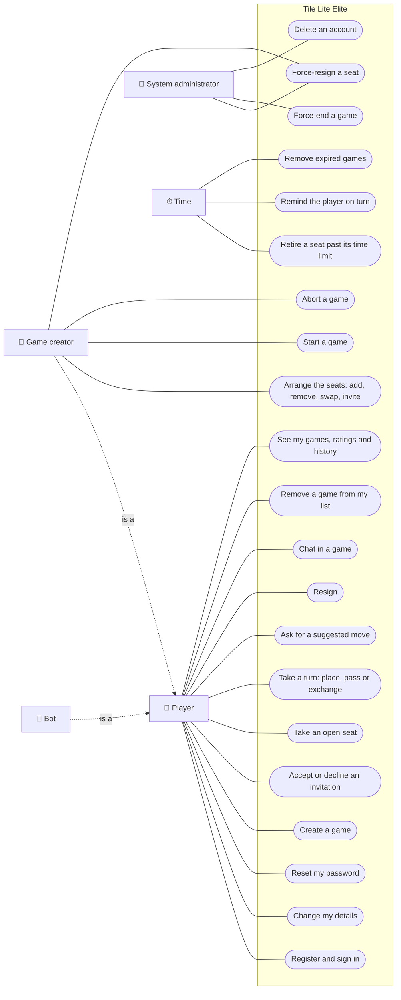

# 71 Functional views

**Draft, under [Decision #472](https://github.com/delphside/tile-lite-elite/issues/472)
(D71), option 1.** This file is the functional set for #71: who uses the
service, what each may do, and the journeys and lifecycles that follow from
that. It comes before [`71-design.md`](71-design.md) and
[`71-data-model.md`](71-data-model.md), and the requirements it surfaces are
raised on #71 before any technical decision they touch.

It is the **to-be**: the service as #71 leaves it. The views follow
[docs/diagrams/README.md](../../../../diagrams/README.md). Rule ids are
[docs/1.0](../../../../1.0-rules.md)'s.

## Use case

One diagram for the service. Each line is a permission: auth (2.5) and seats
and invitations (2.7) enforce it. A game's creator is a role one player holds
in one game, so it is drawn as a kind of player. A bot is an account, and plays
through the same use cases a player does. Time stands for what nobody asks for.

## Journeys

One activity diagram per use case, still to be drawn. Each step either causes a
transition in a lifecycle below or only reads state, and cites the rules it
exercises, so the end-to-end scenarios come from the journeys and coverage is
read against them.

| use case | actor | rules it exercises |
| --- | --- | --- |
| Register and sign in | player | ACC-1, ACC-2, LIMIT-1 to LIMIT-5 |
| Change my details | player | the lookup rule in `71-design.md` |
| Reset my password | player | ACC-1 |
| Create a game | player | GAME-3, TIME-1, TIME-2 |
| Arrange the seats | creator | GAME-3, GAME-4, DEL-3 |
| Start a game | creator | GAME-3 |
| Abort a game | creator | GAME-1, RET-1 |
| Force-resign a seat | creator, administrator | GAME-2, RATE-3 |
| Accept or decline an invitation | player | DEL-3 |
| Take an open seat | player | GAME-4 |
| Take a turn | player, bot | GAME-2, TIME-3 |
| Ask for a suggested move | player | |
| Resign | player, bot | GAME-2, RATE-2 |
| Chat in a game | player | |
| Remove a game from my list | player | DEL-5 |
| See my games, ratings and history | player | ACC-3, DEL-10, RET-2, CLOCK-4 |
| Force-end a game | administrator | RATE-1 |
| Delete an account | administrator | DEL-1 to DEL-10 |
| Retire a seat past its time limit | time | TIME-3, RATE-3, GAME-2 |
| Remind the player on turn | time | TIME-4 |
| Remove expired games | time | RET-1, RET-3, RET-4 |

## Lifecycles

The state machines for the game, the seat and the invitation are in
[`71-design.md`](71-design.md), *Seat state belongs to the seat*, and move here
when D71 is agreed. Each journey step is checked against them: a step that
changes something with no matching transition is a missing transition, and a
transition no step reaches is internal, like a sweep, or not needed.
