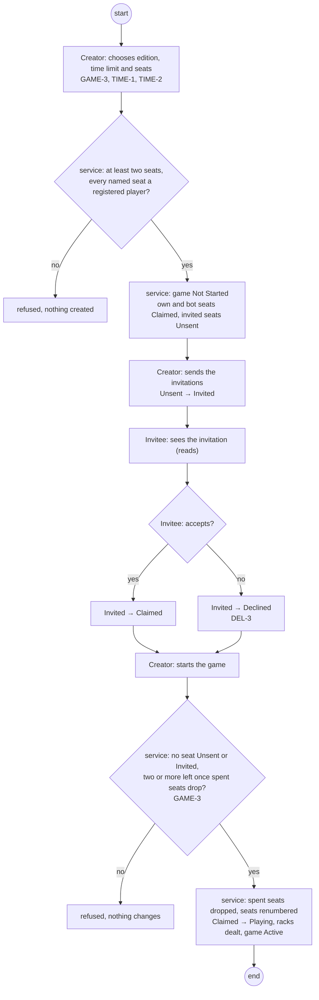
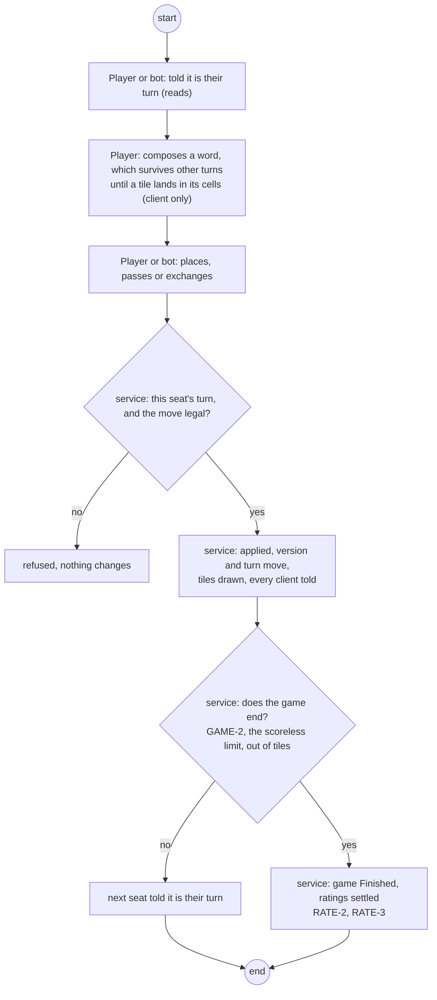
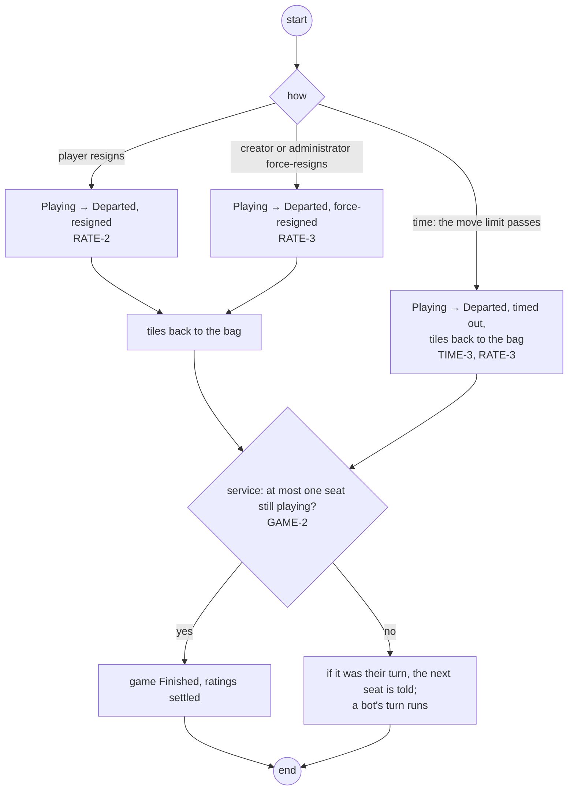
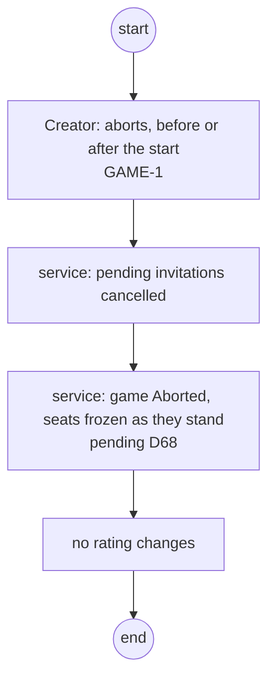
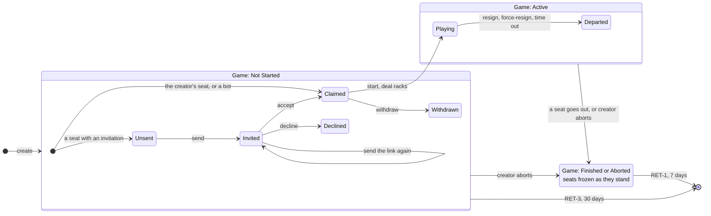

# 71 Functional views

**The first stage of #71's design**, as
[Decision #472](https://github.com/delphside/tile-lite-elite/issues/472) (D71)
settled it on 2026-10-02: one file per stage, functional views before the
technical design. This file is the functional set for #71: who uses the
service, what each may do, and the journeys and lifecycles that follow from
that. It comes before [`71-design.md`](71-design.md) and
[`71-data-model.md`](71-data-model.md), and the requirements it surfaces are
raised on #71 before any technical decision they touch.

It is the **to-be**: the service as #71 leaves it. The views follow
[docs/diagrams/README.md](../../../../diagrams/README.md). Rule ids are
[docs/1.0](../../../../1.0-rules.md)'s.

## Use case

One diagram for the service. Each line is a permission: auth (2.5) and seats
and invitations (2.7) enforce it. A game's creator is a role one player holds
in one game, so it is drawn as a kind of player. A bot is an account, and plays
through the same use cases a player does. Time stands for what nobody asks for.

## Journeys

One activity diagram per use case. Each step either causes a transition in a
lifecycle below or only reads state, and cites the rules it exercises, so the
end-to-end scenarios come from the journeys and coverage is read against them.
A step's swimlane is its actor; *service* is the server acting on a request.
Four are drawn; the rest are listed after them.

### Set up a game and fill its seats

### Take a turn

### Leave a game in play

### Abort a game

### Still to draw

| use case | actor | rules it exercises |
| --- | --- | --- |
| Register and sign in | player | ACC-1, ACC-2, LIMIT-1 to LIMIT-5 |
| Change my details | player | the lookup rule in `71-design.md` |
| Reset my password | player | ACC-1 |
| Arrange the seats: add, remove, swap | creator | GAME-3, GAME-4 |
| Take an open seat | player | GAME-4 |
| Ask for a suggested move | player | |
| Chat in a game | player | |
| Remove a game from my list | player | DEL-5 |
| See my games, ratings and history | player | ACC-3, DEL-10, RET-2, CLOCK-4 |
| Force-end a game | administrator | RATE-1 |
| Delete an account | administrator | DEL-1 to DEL-10 |
| Remind the player on turn | time | TIME-4 |
| Remove expired games | time | RET-1, RET-3, RET-4 |

### Questions the journeys raise

Functional, so answered before the technical decisions:

1. **Aborting changes nobody's rating**, which is what the code does, but
   docs/1.0 does not say so. RATE-1 covers only an administrator's force-end.
   Proposed: a rule beside GAME-1.
2. **Who may force-resign a seat.** Both the creator and an administrator can
   today, and RATE-3 says how it is rated but not who may do it. Proposed: a
   rule naming both, since the use case diagram draws both.
3. **A departing seat's tiles go back to the bag.** The code does this for
   every departure (`finish_via_resignation`, `apply_move_timeout`), but
   docs/1.0 states it only for a timeout (TIME-3). Proposed: one rule for
   every departure.

## Lifecycles

The state machines for the game and its seats. Each journey step above is
checked against them: a step that changes something with no matching
transition is a missing transition, and a transition no step reaches is
internal, like a sweep, or not needed. The types behind the states are in
[`71-design.md`](71-design.md), *Seat state belongs to the seat*, and in
[`71-data-model.md`](71-data-model.md) §1.

### The game and its seats

Seat states are not free of the game's. Each one belongs inside a particular
game state, which is why they are drawn nested rather than side by side.

Two simplifications, both deliberate. **Finished and Aborted share a box**
because they do not differ in seat terms — either way the seats stop where
they are, and this diagram is about seats. Where they differ is rating, which
`71-design.md` covers. And **seats leaving the roster are not drawn** — removed by the
creator, or dropped as spent when the game starts. They cease to exist rather
than reaching a state.

Aborting gives up every seat (GAME-1): every `Playing` seat ends `Departed`,
and a game also finishes when only one seat is left `Playing`. **Pending:**
what abort does to a seat that has no player yet, `Unsent` or `Invited`, is
[Decision #468](https://github.com/delphside/tile-lite-elite/issues/468) (D68);
the recommendation is that they freeze as they stand, which is what the
diagram's *seats frozen* already draws. Either way, aborting cancels every
invitation still pending, so nobody can accept a seat in a game that is over.

Three things are worth reading off it.

**One arrow crosses the boundary.** Starting refuses while any seat is still
pending and drops the spent ones, so at the moment a game begins every seat
left is `Claimed` and there is nothing else to carry across. Starting deals
the racks, which is the same event as `Claimed → Playing`, and that is why the
two are one arrow rather than two facts that have to agree.

**The invitation states exist only before the start**, and `Playing` and
`Departed` only after it. A seat cannot be invited into a game in progress:
adding a player mid-game is not a small extension of this model but a
different one, and the diagram is where that shows up. So the handler refuses
any seat message — inviting, accepting, claiming — once the game has left
`Waiting`, with `ApplyError::GameNotWaiting`, and `Start` refuses a game that
has already started rather than doing nothing.

**Finished and Aborted freeze the seats** rather than giving them states of
their own. Which seats are `Playing` and which are `Departed` when the game
ends is exactly what RATE-2 and RATE-3 turn on — who played to the end, and
who left early — so the final seat states are the game's result, not
bookkeeping to be cleared away.

### Do the arrows match the messages?

No, and it is worth being precise about how they fail to, because two of the
four mismatches are the reason this note exists.

**One command, several arrows.** Creating a game sets up every seat at once,
and each may land in a different state depending on its invitation. Starting
moves every `Claimed` seat to `Playing`. Aborting departs every seat. A
command is not an arrow; it is a set of them.

**Several commands, one arrow.** Resigning through `/actions`, being
force-resigned through its own route, and timing out through no command at all
are one arrow, `Playing → Departed`. They differ only in `how`, which is
exactly why `Departure` is a field rather than three states.

**Commands with no arrow at all.** Placing, passing, exchanging, reordering
seats, chatting. These change the game — the board, the racks, the scores —
without moving any seat between states. **This is the class of change that was
invisible to clients**, because change was tied to writing a seat or
invitation row. It is the defect the whole note is about, and the diagram is
where it becomes obvious: most of what happens in a game is not on it.

**Arrows with no command.** Timing out and being swept away are the clock, not
a caller. Any design built on "state changes because somebody asked" gets
these wrong — which is why the sweeps and the scheduler's jobs have to bump the
version and broadcast through the same path a request does, rather than quietly
writing a row.

So the alignment worth having is not arrow-to-message. It is one level up, and
it is the only invariant that covers all four cases:

> Everything that changes a game — command, sweep, scheduled job or clock —
> bumps the one version and publishes the result.

**One arrow does align exactly, and it is the one to watch.** `Invited →
Claimed` is a single command changing a single seat, and it is the case that
has been wrong in production twice: the seat changed, the game's version did
not, and nobody heard.

**State is derived from what is there, never from the history.** The log
exists for undo and audit; behaviour reads the current state. This is the rule
that keeps the seat enum honest: a seat's state is a field, not a fold over
rows.

It also disposes of a habit worth naming, because two documents currently
encode it. Both this note's predecessor in 2.4 and the user-deletion test plan
classify an unstarted game into one of four roster situations, ordered so that
exactly one applies. That was a convenience for arguing about retention and
for making a test partition clean. It is not a description of the system, and
nothing should be written against it.
