# 71 Functional views

**The first stage of #71's design**, as
[Decision #472](https://github.com/delphside/tile-lite-elite/issues/472) (D71)
settled it on 2026-10-02: one file per stage, functional views before the
technical design. This file is the functional set for #71: who uses the
service, what each may do, and the journeys and lifecycles that follow from
that. It comes before [`71-design.md`](71-design.md) and
[`71-data-model.md`](71-data-model.md), and the requirements it surfaces are
raised on #71 before any technical decision they touch.

It is the **to-be**: the service as #71 leaves it. The views follow
[docs/diagrams/README.md](../../../../diagrams/README.md). Rule ids are
[docs/1.0](../../../../1.0-rules.md)'s.

## Use case

One diagram for the service. Each oval is a use case, a goal an actor comes to
the service for; each labelled line names the journeys below by which the
actor pursues it, and is a permission: auth (2.5) and seats and invitations (2.7) enforce it. A
game's creator is a role one player holds in one game, separate from any seat
they hold (GAME-8), so it is drawn as a kind of player. A bot is an account,
and plays through the same use cases a player does. Time stands for what
nobody asks for.

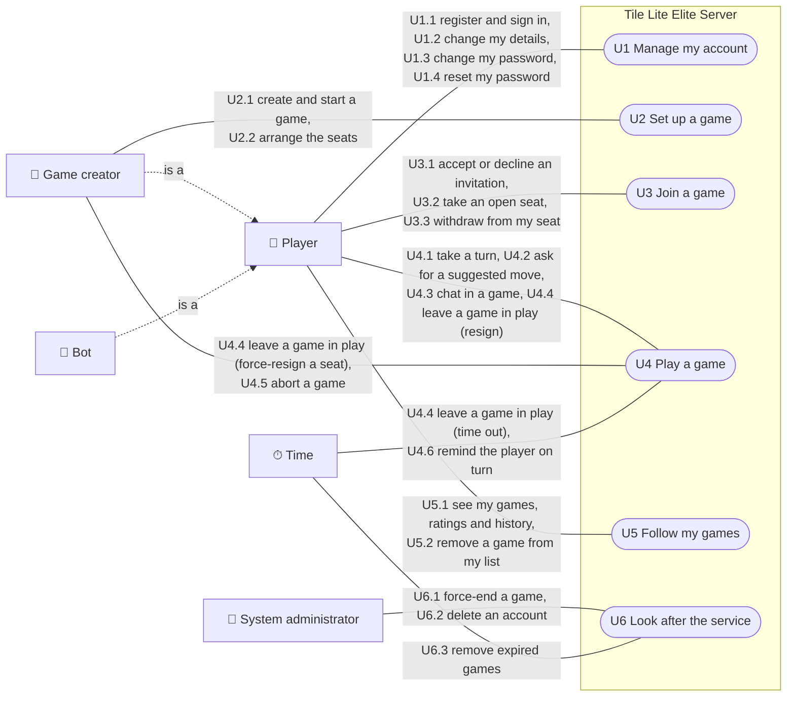
```mermaid
flowchart LR
  player["👤 Player"]
  creator["👤 Game creator"]
  bot["👤 Bot"]
  admin["👤 System administrator"]
  time["⏱ Time"]

  creator -. "is a" .-> player
  bot -. "is a" .-> player

  subgraph service["Tile Lite Elite Server"]
    account(["U1 Manage my account"])
    setup(["U2 Set up a game"])
    join(["U3 Join a game"])
    play(["U4 Play a game"])
    follow(["U5 Follow my games"])
    administer(["U6 Look after the service"])
  end

  player -- "U1.1 register and sign in, U1.2 change my details,<br/>U1.3 change my password, U1.4 reset my password" --- account
  creator -- "U2.1 create and start a game,<br/>U2.2 arrange the seats" --- setup
  player -- "U3.1 accept or decline an invitation,<br/>U3.2 take an open seat, U3.3 withdraw from my seat" --- join
  player -- "U4.1 take a turn, U4.2 ask for a suggested move,<br/>U4.3 chat in a game, U4.4 leave a game in play (resign)" --- play
  creator -- "U4.4 leave a game in play (force-resign a seat),<br/>U4.5 abort a game" --- play
  time -- "U4.4 leave a game in play (time out),<br/>U4.6 remind the player on turn" --- play
  player -- "U5.1 see my games, ratings and history,<br/>U5.2 remove a game from my list" --- follow
  admin -- "U6.1 force-end a game, U6.2 delete an account" --- administer
  time -- "U6.3 remove expired games" --- administer
```

- [U1 Manage my account](#u1-manage-my-account): [U1.1](#u11-register-and-sign-in) Register and sign in, [U1.2](#u12-change-my-details) Change my details, [U1.3](#u13-change-my-password) Change my password, [U1.4](#u14-reset-my-password) Reset my password
- [U2 Set up a game](#u2-set-up-a-game): [U2.1](#u21-create-and-start-a-game) Create and start a game, [U2.2](#u22-arrange-the-seats) Arrange the seats
- [U3 Join a game](#u3-join-a-game): [U3.1](#u31-accept-or-decline-an-invitation) Accept or decline an invitation, [U3.2](#u32-take-an-open-seat) Take an open seat, [U3.3](#u33-withdraw-from-my-seat) Withdraw from my seat
- [U4 Play a game](#u4-play-a-game): [U4.1](#u41-take-a-turn) Take a turn, [U4.2](#u42-ask-for-a-suggested-move) Ask for a suggested move, [U4.3](#u43-chat-in-a-game) Chat in a game, [U4.4](#u44-leave-a-game-in-play) Leave a game in play, [U4.5](#u45-abort-a-game) Abort a game, [U4.6](#u46-remind-the-player-on-turn) Remind the player on turn
- [U5 Follow my games](#u5-follow-my-games): [U5.1](#u51-see-my-games-ratings-and-history) See my games, ratings and history, [U5.2](#u52-remove-a-game-from-my-list) Remove a game from my list
- [U6 Look after the service](#u6-look-after-the-service): [U6.1](#u61-force-end-a-game) Force-end a game, [U6.2](#u62-delete-an-account) Delete an account, [U6.3](#u63-remove-expired-games) Remove expired games

## Journeys

Each use case above expands into an activity diagram showing how its actions
fit together, and each action, or a few that share a path, expands again into
its own journey beneath it. In a journey each step either causes a transition in a
lifecycle below or only reads state, and cites the rules it exercises, so the
end-to-end scenarios come from the journeys and coverage is read against them.
A step's swimlane is its actor; *Server* is the server acting on a request.
Every action is drawn. Steps cite the rules in docs/1.0, the living documents these diagrams will
move into; a design document that covers a whole journey is named above it,
and a question still open is cited as Q and its number, which is a heading
under [Questions the journeys raise](#questions-the-journeys-raise). Technical refusals,
such as rate limits, are left out. A step that changes something no lifecycle
covers, such as a session or a version, is marked *(no transition)*.

### U1 Manage my account

A player comes to the service to have an account and keep it theirs. Every
action here is one sitting; none depends on a game.

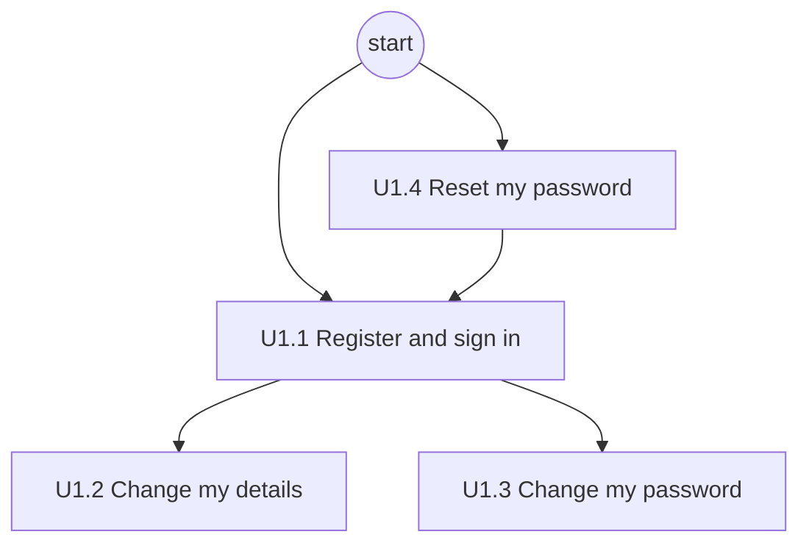
```mermaid
flowchart TD
  s0((start)) --> a1["U1.1 Register and sign in"]
  s0 --> a2["U1.4 Reset my password"]
  a2 --> a1
  a1 --> a3["U1.2 Change my details"]
  a1 --> a4["U1.3 Change my password"]
```

Journeys: [U1.1 Register and sign in](#u11-register-and-sign-in), [U1.2 Change my details](#u12-change-my-details), [U1.3 Change my password](#u13-change-my-password), [U1.4 Reset my password](#u14-reset-my-password).

#### U1.1 Register and sign in

A new account is active once its email is verified, and every email is
unique. Registering and signing in share the end of the journey.

References: User IDs, [docs/2.5](../../../../2.5-authentication.md). Emails:
their rules are not yet in docs/1.0, [Q5](#q5-the-email-rules-are-not-in-docs10).

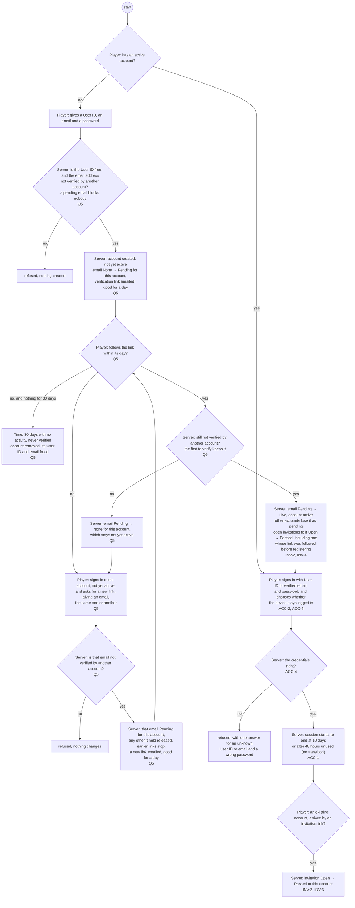
```mermaid
flowchart TD
  s0((start)) --> d0{"Player: has an active account?"}
  d0 -- no --> p1["Player: gives a User ID, an email and a password"]
  p1 --> v2{"Server: is the User ID free, and the email address<br/>not verified by another account?<br/>a pending email blocks nobody<br/>Q5"}
  v2 -- no --> r2["refused, nothing created"]
  v2 -- yes --> t1["Server: account created, not yet active<br/>email None → Pending for this account,<br/>verification link emailed, good for a day<br/>Q5"]
  t1 --> d1{"Player: follows the link within its day?<br/>Q5"}
  d1 -- no --> p3["Player: signs in to the account, not yet active,<br/>and asks for a new link, giving an email,<br/>the same one or another<br/>Q5"]
  p3 --> v5{"Server: is that email not verified by another account?<br/>Q5"}
  v5 -- no --> r5["refused, nothing changes"]
  v5 -- yes --> t7["Server: that email Pending for this account,<br/>any other it held released, earlier links stop,<br/>a new link emailed, good for a day<br/>Q5"]
  t7 --> d1
  d1 -- "no, and nothing for 30 days" --> t6["Time: 30 days with no activity, never verified<br/>account removed, its User ID and email freed<br/>Q5"]
  d1 -- yes --> v4{"Server: still not verified by another account?<br/>the first to verify keeps it<br/>Q5"}
  v4 -- no --> t2["Server: email Pending → None for this account,<br/>which stays not yet active<br/>Q5"]
  t2 --> p3
  v4 -- yes --> t3["Server: email Pending → Live, account active<br/>other accounts lose it as pending<br/>open invitations to it Open → Passed, including one<br/>whose link was followed before registering<br/>INV-2, INV-4"]
  d0 -- yes --> p2["Player: signs in with User ID or verified email,<br/>and password, and chooses whether<br/>the device stays logged in<br/>ACC-2, ACC-4"]
  t3 --> p2
  p2 --> v3{"Server: the credentials right?<br/>ACC-4"}
  v3 -- no --> r3["refused, with one answer for an unknown<br/>User ID or email and a wrong password"]
  v3 -- yes --> t4["Server: session starts, to end at 10 days<br/>or after 48 hours unused (no transition)<br/>ACC-1"]
  t4 --> d2{"Player: an existing account, arrived by an invitation link?"}
  d2 -- yes --> t5["Server: invitation Open → Passed to this account<br/>INV-2, INV-3"]
```

#### U1.2 Change my details

References: User IDs, [docs/2.5](../../../../2.5-authentication.md). A game
holds no copy of a player's details, [71-design.md](71-design.md#open-questions)
*User details are always a lookup*. Emails, [Q5](#q5-the-email-rules-are-not-in-docs10).

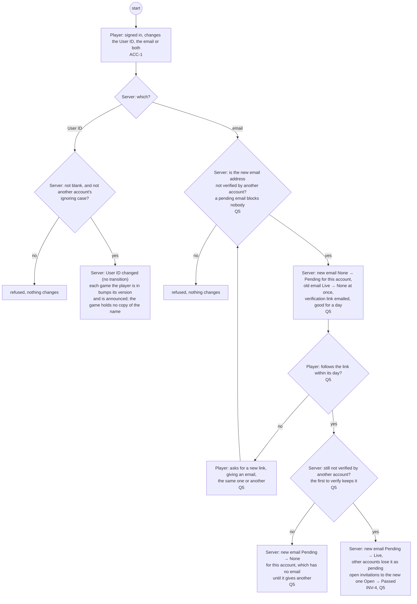
```mermaid
flowchart TD
  s0((start)) --> p1["Player: signed in, changes the User ID, the email or both<br/>ACC-1"]
  p1 --> d0{"Server: which?"}
  d0 -- "User ID" --> v1{"Server: not blank, and not another account's<br/>ignoring case?"}
  v1 -- no --> r1["refused, nothing changes"]
  v1 -- yes --> t1["Server: User ID changed (no transition)<br/>each game the player is in bumps its version<br/>and is announced; the game holds no copy of the name"]
  d0 -- "email" --> v2{"Server: is the new email address<br/>not verified by another account?<br/>a pending email blocks nobody<br/>Q5"}
  v2 -- no --> r2["refused, nothing changes"]
  v2 -- yes --> t2["Server: new email None → Pending for this account,<br/>old email Live → None at once,<br/>verification link emailed, good for a day<br/>Q5"]
  t2 --> d1{"Player: follows the link within its day?<br/>Q5"}
  d1 -- no --> p3["Player: asks for a new link, giving an email,<br/>the same one or another<br/>Q5"]
  p3 --> v2
  d1 -- yes --> v3{"Server: still not verified by another account?<br/>the first to verify keeps it<br/>Q5"}
  v3 -- no --> t3["Server: new email Pending → None<br/>for this account, which has no email<br/>until it gives another<br/>Q5"]
  v3 -- yes --> t4["Server: new email Pending → Live,<br/>other accounts lose it as pending<br/>open invitations to the new one Open → Passed<br/>INV-4, Q5"]
```

#### U1.3 Change my password

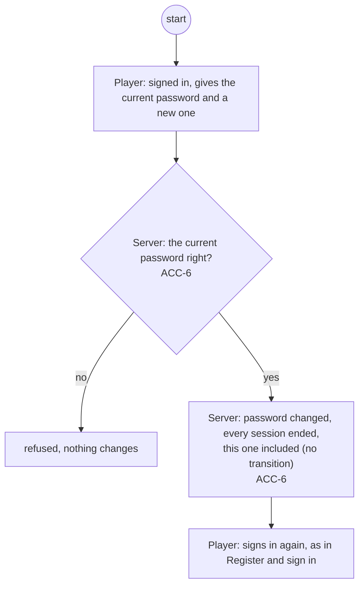
```mermaid
flowchart TD
  s0((start)) --> p1["Player: signed in, gives the current password and a new one"]
  p1 --> v1{"Server: the current password right?<br/>ACC-6"}
  v1 -- no --> r1["refused, nothing changes"]
  v1 -- yes --> t1["Server: password changed, every session ended,<br/>this one included (no transition)<br/>ACC-6"]
  t1 --> p2["Player: signs in again, as in Register and sign in"]
```

#### U1.4 Reset my password

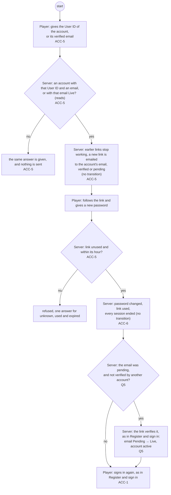
```mermaid
flowchart TD
  s0((start)) --> p1["Player: gives the User ID of the account,<br/>or its verified email<br/>ACC-5"]
  p1 --> v2{"Server: an account with that User ID and an email,<br/>or with that email Live? (reads)<br/>ACC-5"}
  v2 -- no --> a1["the same answer is given, and nothing is sent<br/>ACC-5"]
  v2 -- yes --> t1["Server: earlier links stop working, a new link is emailed<br/>to the account's email, verified or pending<br/>(no transition)<br/>ACC-5"]
  t1 --> p2["Player: follows the link and gives a new password"]
  p2 --> v3{"Server: link unused and within its hour?<br/>ACC-5"}
  v3 -- no --> r2["refused, one answer for unknown, used and expired"]
  v3 -- yes --> t2["Server: password changed, link used,<br/>every session ended (no transition)<br/>ACC-6"]
  t2 --> d3{"Server: the email was pending,<br/>and not verified by another account?<br/>Q5"}
  d3 -- yes --> t3["Server: the link verifies it, as in Register and sign in:<br/>email Pending → Live, account active<br/>Q5"]
  d3 -- no --> p3["Player: signs in again, as in Register and sign in<br/>ACC-1"]
  t3 --> p3
```

### U2 Set up a game

The creator comes to the service to get a game under way with the people they
want. Seats fill independently until the creator starts with the claimed ones
(GAME-9); the invitees' side of it is [U3 Join a game](#u3-join-a-game), and aborting is in
[U4 Play a game](#u4-play-a-game), since it can happen before or after the start.

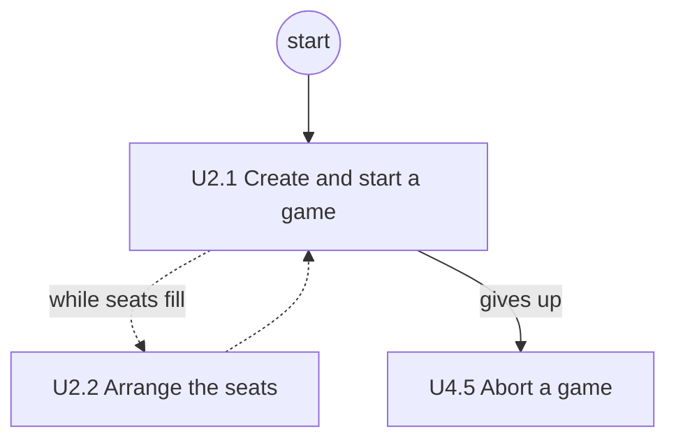
```mermaid
flowchart TD
  s0((start)) --> a1["U2.1 Create and start a game"]
  a1 -. "while seats fill" .-> a2["U2.2 Arrange the seats"]
  a2 -.-> a1
  a1 -- "gives up" --> a4["U4.5 Abort a game"]
```

Journeys: [U2.1 Create and start a game](#u21-create-and-start-a-game), [U2.2 Arrange the seats](#u22-arrange-the-seats), and [U4.5 Abort a game](#u45-abort-a-game) under Play a game.

#### U2.1 Create and start a game

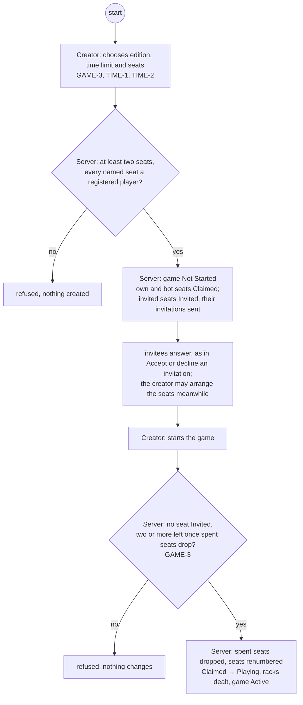
```mermaid
flowchart TD
  s0((start)) --> c1["Creator: chooses edition, time limit and seats<br/>GAME-3, TIME-1, TIME-2"]
  c1 --> v1{"Server: at least two seats,<br/>every named seat a registered player?"}
  v1 -- no --> r1["refused, nothing created"]
  v1 -- yes --> t1["Server: game Not Started<br/>own and bot seats Claimed;<br/>invited seats Invited, their invitations sent"]
  t1 --> i1["invitees answer, as in Accept or decline an invitation;<br/>the creator may arrange the seats meanwhile"]
  i1 --> c3["Creator: starts the game"]
  c3 --> v2{"Server: no seat Invited,<br/>two or more left once spent seats drop?<br/>GAME-3"}
  v2 -- no --> r2["refused, nothing changes"]
  v2 -- yes --> t4["Server: spent seats dropped, seats renumbered<br/>Claimed → Playing, racks dealt, game Active"]
```

#### U2.2 Arrange the seats

An invited seat's invitation is sent as the seat is added, as in [U2.1 Create and start a game](#u21-create-and-start-a-game). The creator can also hide `Declined` and `Withdrawn` seats
so the list shows only the seats still in play. Hiding is the client's alone:
the service keeps those seats until the start drops them.

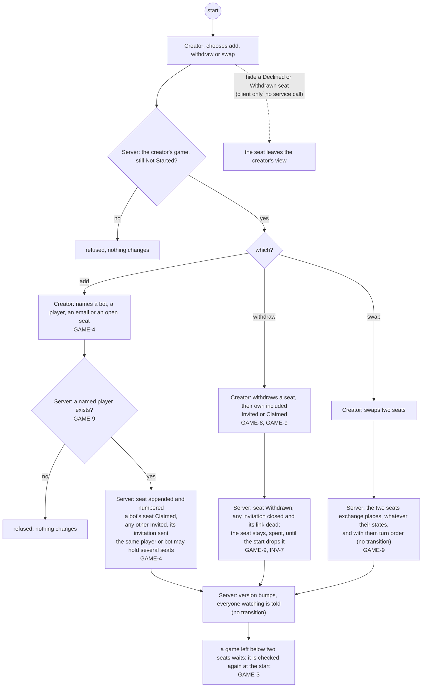
```mermaid
flowchart TD
  s0((start)) --> c1["Creator: chooses add, withdraw or swap"]
  c1 --> v1{"Server: the creator's game, still Not Started?"}
  v1 -- no --> r1["refused, nothing changes"]
  v1 -- yes --> d0{"which?"}
  d0 -- add --> c2["Creator: names a bot, a player, an email or an open seat<br/>GAME-4"]
  c2 --> v2{"Server: a named player exists?<br/>GAME-9"}
  v2 -- no --> r2["refused, nothing changes"]
  v2 -- yes --> t1["Server: seat appended and numbered<br/>a bot's seat Claimed,<br/>any other Invited, its invitation sent<br/>the same player or bot may hold several seats<br/>GAME-4"]
  c1 -. "hide a Declined or Withdrawn seat<br/>(client only, no service call)" .-> h1["the seat leaves the creator's view"]
  d0 -- withdraw --> c3["Creator: withdraws a seat, their own included<br/>Invited or Claimed<br/>GAME-8, GAME-9"]
  c3 --> t2["Server: seat Withdrawn, any invitation closed and its link dead;<br/>the seat stays, spent, until the start drops it<br/>GAME-9, INV-7"]
  d0 -- swap --> c4["Creator: swaps two seats"]
  c4 --> t3["Server: the two seats exchange places, whatever their states,<br/>and with them turn order (no transition)<br/>GAME-9"]
  t1 --> t4["Server: version bumps, everyone watching is told<br/>(no transition)"]
  t2 --> t4
  t3 --> t4
  t4 --> n0["a game left below two seats waits: it is checked again at the start<br/>GAME-3"]
```

### U3 Join a game

A player comes to the service to take part in somebody else's game. They
answer an invitation, or take a seat open to anyone, and may leave a claimed
seat before the start.

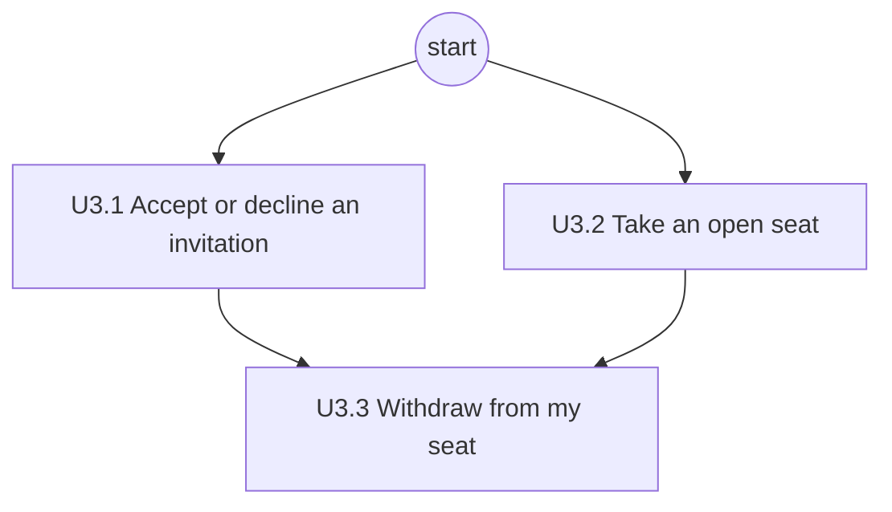
```mermaid
flowchart TD
  s0((start)) --> a1["U3.1 Accept or decline an invitation"]
  s0 --> a2["U3.2 Take an open seat"]
  a1 --> a3["U3.3 Withdraw from my seat"]
  a2 --> a3
```

Journeys: [U3.1 Accept or decline an invitation](#u31-accept-or-decline-an-invitation), [U3.2 Take an open seat](#u32-take-an-open-seat), [U3.3 Withdraw from my seat](#u33-withdraw-from-my-seat).

#### U3.1 Accept or decline an invitation

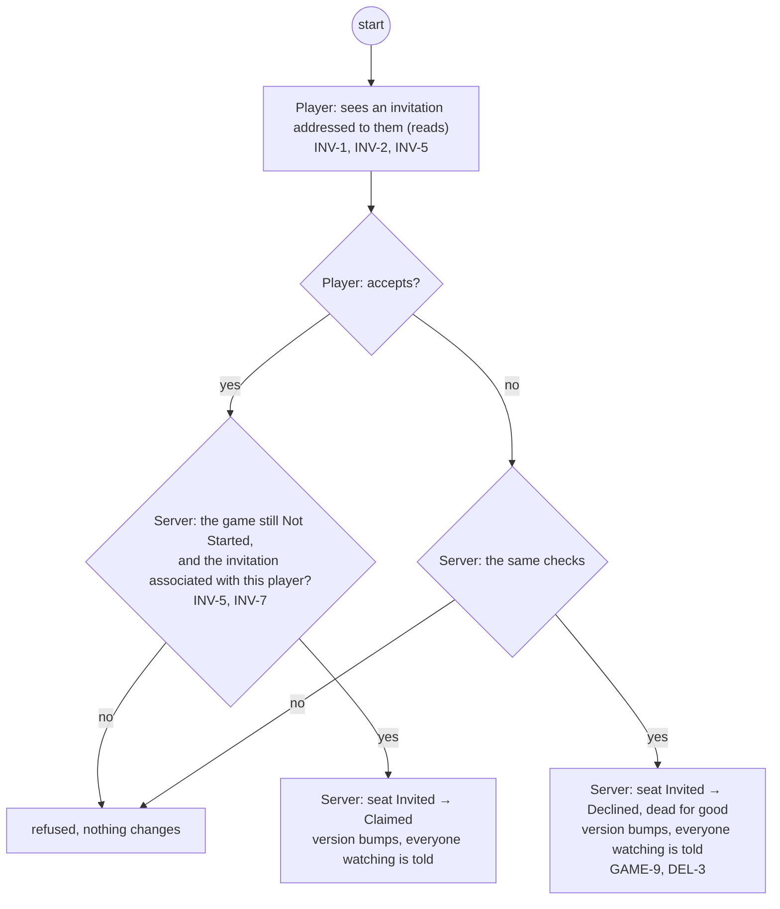
```mermaid
flowchart TD
  s0((start)) --> p1["Player: sees an invitation addressed to them (reads)<br/>INV-1, INV-2, INV-5"]
  p1 --> d1{"Player: accepts?"}
  d1 -- yes --> v1{"Server: the game still Not Started,<br/>and the invitation associated with this player?<br/>INV-5, INV-7"}
  d1 -- no --> v2{"Server: the same checks"}
  v1 -- no --> r1["refused, nothing changes"]
  v2 -- no --> r1
  v1 -- yes --> t1["Server: seat Invited → Claimed<br/>version bumps, everyone watching is told"]
  v2 -- yes --> t2["Server: seat Invited → Declined, dead for good<br/>version bumps, everyone watching is told<br/>GAME-9, DEL-3"]
```

#### U3.2 Take an open seat

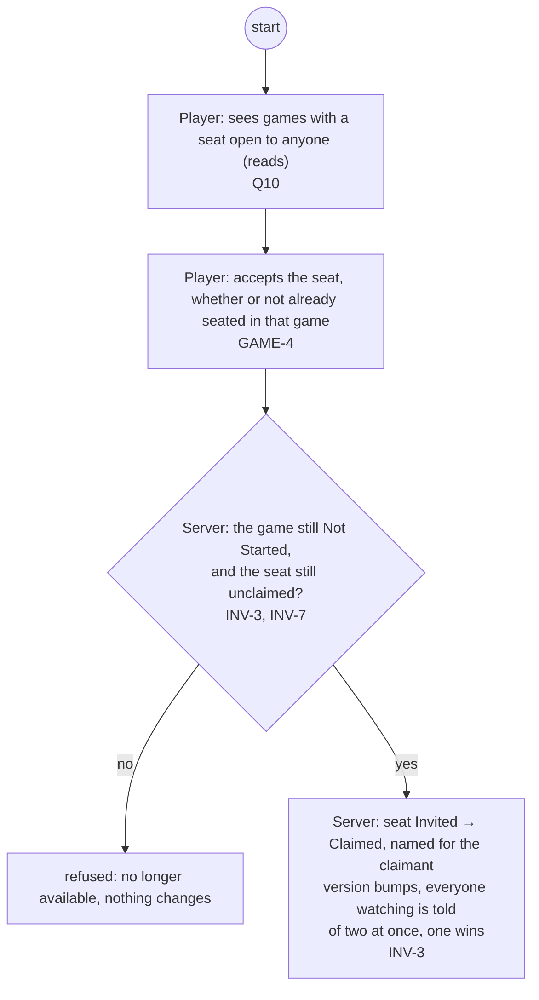
```mermaid
flowchart TD
  s0((start)) --> p1["Player: sees games with a seat open to anyone (reads)<br/>Q10"]
  p1 --> p2["Player: accepts the seat, whether or not already seated in that game<br/>GAME-4"]
  p2 --> v1{"Server: the game still Not Started,<br/>and the seat still unclaimed?<br/>INV-3, INV-7"}
  v1 -- no --> r1["refused: no longer available, nothing changes"]
  v1 -- yes --> t1["Server: seat Invited → Claimed, named for the claimant<br/>version bumps, everyone watching is told<br/>of two at once, one wins<br/>INV-3"]
```

#### U3.3 Withdraw from my seat

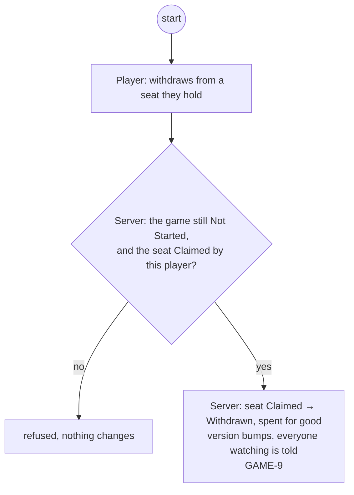
```mermaid
flowchart TD
  s0((start)) --> p1["Player: withdraws from a seat they hold"]
  p1 --> v1{"Server: the game still Not Started,<br/>and the seat Claimed by this player?"}
  v1 -- no --> r1["refused, nothing changes"]
  v1 -- yes --> t1["Server: seat Claimed → Withdrawn, spent for good<br/>version bumps, everyone watching is told<br/>GAME-9"]
```

### U4 Play a game

Every seated player comes to the service to play the game through. Turns go
round until at most one seat is still playing (GAME-2); the creator and the
clock can each end a seat's part early.

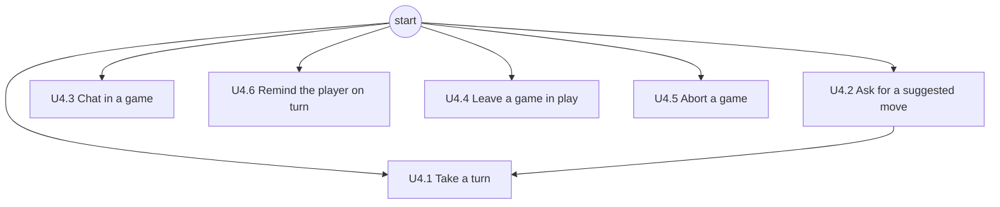
```mermaid
flowchart TD
  s0((start)) --> a1["U4.1 Take a turn"]
  s0 --> a2["U4.2 Ask for a suggested move"]
  a2 --> a1
  s0 --> a3["U4.3 Chat in a game"]
  s0 --> a4["U4.6 Remind the player on turn"]
  s0 --> a5["U4.4 Leave a game in play"]
  s0 --> a6["U4.5 Abort a game"]
```

Journeys: [U4.1 Take a turn](#u41-take-a-turn), [U4.2 Ask for a suggested move](#u42-ask-for-a-suggested-move), [U4.3 Chat in a game](#u43-chat-in-a-game), [U4.4 Leave a game in play](#u44-leave-a-game-in-play), [U4.5 Abort a game](#u45-abort-a-game), [U4.6 Remind the player on turn](#u46-remind-the-player-on-turn).

#### U4.1 Take a turn

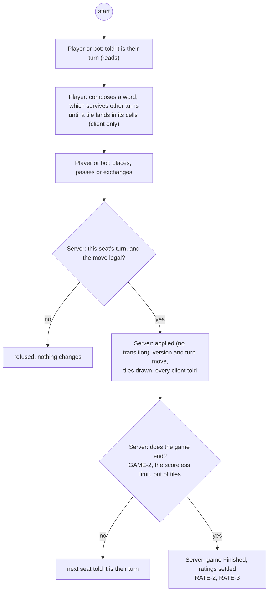
```mermaid
flowchart TD
  s0((start)) --> p1["Player or bot: told it is their turn (reads)"]
  p1 --> p2["Player: composes a word, which survives other turns<br/>until a tile lands in its cells (client only)"]
  p2 --> p3["Player or bot: places, passes or exchanges"]
  p3 --> v1{"Server: this seat's turn, and the move legal?"}
  v1 -- no --> r1["refused, nothing changes"]
  v1 -- yes --> t1["Server: applied (no transition), version and turn move,<br/>tiles drawn, every client told"]
  t1 --> v2{"Server: does the game end?<br/>GAME-2, the scoreless limit, out of tiles"}
  v2 -- no --> p4["next seat told it is their turn"]
  v2 -- yes --> t2["Server: game Finished, ratings settled<br/>RATE-2, RATE-3"]
```

#### U4.2 Ask for a suggested move

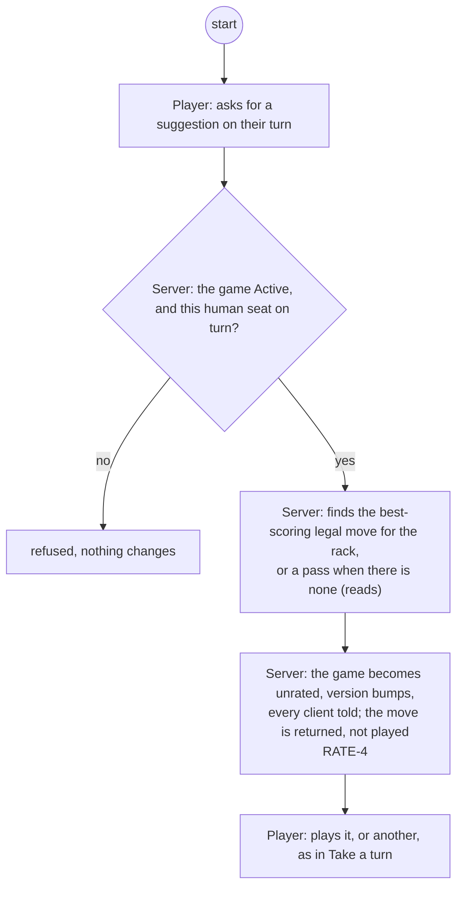
```mermaid
flowchart TD
  s0((start)) --> p1["Player: asks for a suggestion on their turn"]
  p1 --> v1{"Server: the game Active, and this human seat on turn?"}
  v1 -- no --> r1["refused, nothing changes"]
  v1 -- yes --> v2["Server: finds the best-scoring legal move for the rack,<br/>or a pass when there is none (reads)"]
  v2 --> t1["Server: the game becomes unrated, version bumps,<br/>every client told; the move is returned, not played<br/>RATE-4"]
  t1 --> p2["Player: plays it, or another, as in Take a turn"]
```

#### U4.3 Chat in a game

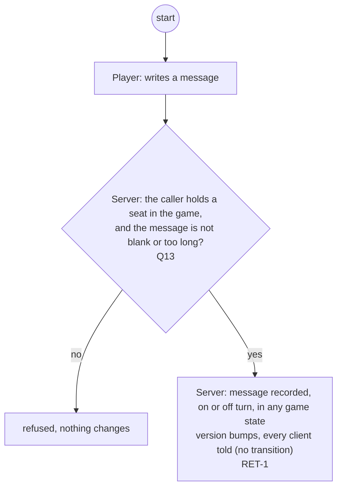
```mermaid
flowchart TD
  s0((start)) --> p1["Player: writes a message"]
  p1 --> v1{"Server: the caller holds a seat in the game,<br/>and the message is not blank or too long?<br/>Q13"}
  v1 -- no --> r1["refused, nothing changes"]
  v1 -- yes --> t1["Server: message recorded, on or off turn, in any game state<br/>version bumps, every client told (no transition)<br/>RET-1"]
```

#### U4.4 Leave a game in play

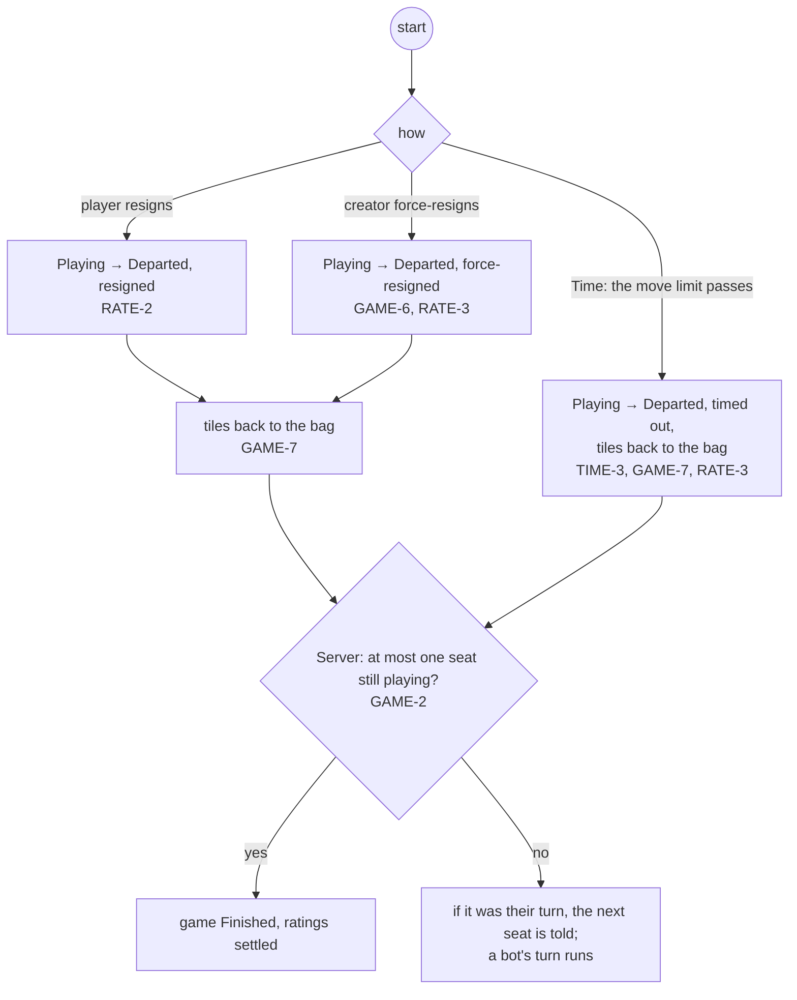
```mermaid
flowchart TD
  s0((start)) --> d0{"how"}
  d0 -- "player resigns" --> a1["Playing → Departed, resigned<br/>RATE-2"]
  d0 -- "creator force-resigns" --> a2["Playing → Departed, force-resigned<br/>GAME-6, RATE-3"]
  d0 -- "Time: the move limit passes" --> a3["Playing → Departed, timed out,<br/>tiles back to the bag<br/>TIME-3, GAME-7, RATE-3"]
  a1 --> b1["tiles back to the bag<br/>GAME-7"]
  a2 --> b1
  b1 --> v1{"Server: at most one seat still playing?<br/>GAME-2"}
  a3 --> v1
  v1 -- yes --> t1["game Finished, ratings settled"]
  v1 -- no --> t2["if it was their turn, the next seat is told;<br/>a bot's turn runs"]
```

#### U4.5 Abort a game

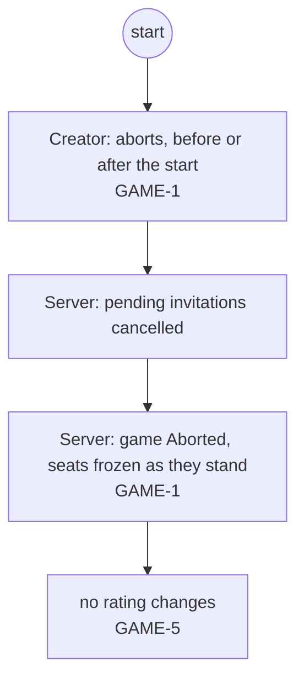
```mermaid
flowchart TD
  s0((start)) --> c1["Creator: aborts, before or after the start<br/>GAME-1"]
  c1 --> t1["Server: pending invitations cancelled"]
  t1 --> t2["Server: game Aborted, seats frozen as they stand<br/>GAME-1"]
  t2 --> t3["no rating changes<br/>GAME-5"]
```

#### U4.6 Remind the player on turn

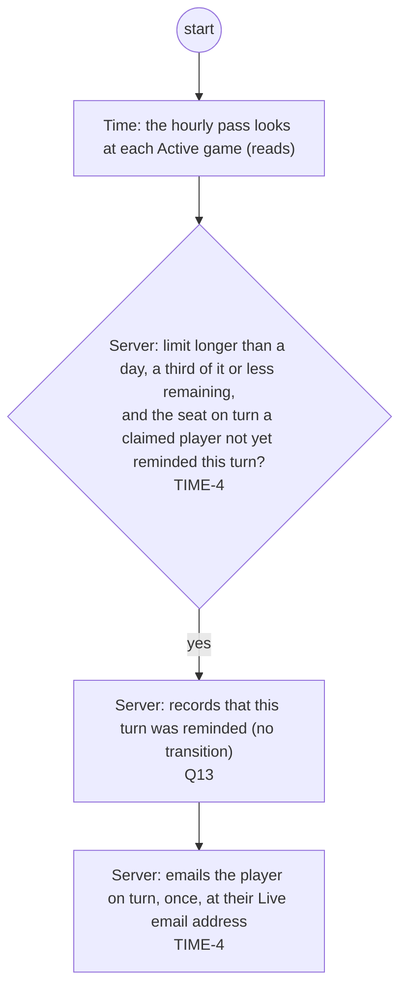
```mermaid
flowchart TD
  s0((start)) --> t0["Time: the hourly pass looks at each Active game (reads)"]
  t0 --> v1{"Server: limit longer than a day, a third of it or less remaining,<br/>and the seat on turn a claimed player not yet reminded this turn?<br/>TIME-4"}
  v1 -- yes --> t1["Server: records that this turn was reminded (no transition)<br/>Q13"]
  t1 --> t2["Server: emails the player on turn, once, at their Live email address<br/>TIME-4"]
```

### U5 Follow my games

A player comes to the service to see where they stand: their games, their
ratings and their history, and to clear what they no longer want listed.

```mermaid
flowchart TD
  s0((start)) --> a1["U5.1 See my games, ratings and history"]
  a1 --> a2["U5.2 Remove a game from my list"]
```

Journeys: [U5.1 See my games, ratings and history](#u51-see-my-games-ratings-and-history), [U5.2 Remove a game from my list](#u52-remove-a-game-from-my-list).

#### U5.1 See my games, ratings and history

```mermaid
flowchart TD
  s0((start)) --> p1["Player: opens their list"]
  p1 --> v1{"Server: signed in?<br/>ACC-1"}
  v1 -- no --> r1["refused, asked to sign in"]
  v1 -- yes --> t1["Server: finished and aborted games over 7 days old<br/>Over → removed, with their invitations<br/>RET-1, RET-4"]
  t1 --> v2["Server: lists the games the player is seated in, was invited to<br/>or created, less those they hid, newest activity first (reads)<br/>DEL-5"]
  v2 --> p2["Player: opens a rating or a rating history, their own or another's (reads)<br/>ACC-3, DEL-10, RET-2, Q14"]
  p2 --> p3["Player: reads times in local time (reads)<br/>CLOCK-4"]
```

#### U5.2 Remove a game from my list

```mermaid
flowchart TD
  s0((start)) --> p1["Player: removes a game from their list<br/>DEL-5"]
  p1 --> v1{"Server: the game Finished or Aborted,<br/>and the player seated in it or its creator?"}
  v1 -- no --> r1["refused, nothing changes"]
  v1 -- yes --> t1["Server: the game is marked hidden for this player alone<br/>(no transition); the game, its seats and every other<br/>player's list are untouched, and it still refers to the player<br/>DEL-5, DEL-2, Q13"]
```

### U6 Look after the service

The administrator and the clock keep the service in order: ending games
that cannot end, removing old games, and deleting accounts.

```mermaid
flowchart TD
  s0((start)) --> a1["U6.1 Force-end a game"]
  s0 --> a2["U6.2 Delete an account"]
  s0 --> a3["U6.3 Remove expired games"]
```

Journeys: [U6.1 Force-end a game](#u61-force-end-a-game), [U6.2 Delete an account](#u62-delete-an-account), [U6.3 Remove expired games](#u63-remove-expired-games).

#### U6.1 Force-end a game

```mermaid
flowchart TD
  s0((start)) --> a1["Administrator: names a game, on the machine hosting the service<br/>Q11"]
  a1 --> v1{"Server: the game exists, and is not already<br/>Finished or Aborted?"}
  v1 -- no --> r1["refused, nothing changes"]
  v1 -- yes --> t1["Server: game Not Started or Active → Finished<br/>seats frozen as they stand, a record of the force-end kept<br/>Q11"]
  t1 --> t2["Server: no rating changes<br/>RATE-1"]
  t2 --> t3["Server: version bumps, every client told (no transition)"]
```

#### U6.2 Delete an account

```mermaid
flowchart TD
  s0((start)) --> a1["Administrator: names an account or gives its id, in the admin CLI<br/>on the machine hosting the service<br/>DEL-1, DEL-9"]
  a1 --> v1{"Server: the account exists? (reads)<br/>DEL-8"}
  v1 -- no --> r1["reported as not found"]
  v1 -- yes --> v2{"Server: does any game refer to it: created, seated or invited,<br/>in any state, hidden by the player or not? (reads)<br/>DEL-2, DEL-3, DEL-5"}
  v2 -- yes --> r2["refused, naming the games<br/>DEL-6"]
  r2 --> d3{"Administrator: waits, or deletes the blocking games?"}
  d3 -- waits --> w1["Administrator: waits, because every game goes eventually<br/>DEL-4, RET-1, RET-3, TIME-2"]
  d3 -- deletes --> g1["Server: each blocking game removed, with its chat,<br/>moves and invitations<br/>any state → removed, Q12"]
  g1 --> a1
  w1 --> a1
  v2 -- no --> v3{"Server: a live session? (reads)<br/>Q12"}
  v3 -- yes --> r3["refused until the session ends or the administrator signs it out"]
  r3 --> w1
  v3 -- no --> t1["Server: sessions, invitations sent and received,<br/>rating and rating history removed, nothing of anyone else's<br/>email Live → None, account closed<br/>DEL-7, ACC-3, DEL-10"]
```

#### U6.3 Remove expired games

```mermaid
flowchart TD
  s0((start)) --> d0{"Time: which game?"}
  d0 -- "ended over 7 days ago" --> t1["Server: Over → removed: game, seats, chat, moves and invitations go,<br/>found while the service is in use; rating history stays<br/>RET-1, RET-2, RET-4, ACC-3, DEL-10"]
  d0 -- "not started, idle 7 days" --> t2["Time: the creator is asked what to do (not built)<br/>RET-3, Q15"]
  t2 --> c1["Creator: answers delete, keep or nothing<br/>RET-3"]
  c1 --> d1{"answer"}
  d1 -- delete --> t3["Server: Not Started → removed, the game goes at once<br/>RET-3"]
  d1 -- keep --> t4["Server: counts as activity, thirty days start again (no transition)<br/>RET-3"]
  d1 -- nothing --> t5["Time: the countdown carries on, and thirty days after the last activity<br/>Not Started → removed<br/>RET-3"]
```

### Questions the journeys raise

Functional, so answered before the technical decisions:

#### Q1 Aborting changes nobody's rating

Answered: GAME-5 (owner,
2026-10-14).

#### Q2 Who may force-resign a seat

Answered: the creator alone, GAME-6
(owner, 2026-10-14), as the code does (`caller_may_manage_game`,
common.rs). An administrator ends a stuck game with force-end instead.

#### Q3 A departing seat's tiles go back to the bag

Answered: one rule for
every departure, GAME-7 (owner, 2026-10-14).

#### Q4 A suggested move is played, not suggested

Answered: the service shows
it and does not play it, and asking makes the game unrated, RATE-4 (owner,
2026-10-15). What follows is the question as raised. `suggest_move` (games.rs)
enumerates the legal moves, applies the best-scoring one with
`apply_place_move` (or `apply_pass` when there is none), runs any bot turns
and returns the new state. docs/1.0 has no rule for it, and `preview_move`,
which only reports a candidate's legality and score, has no use case.
Proposed: decide whether the use case is "play the best move for me" or
"show me a suggestion". If it plays, a rule says the move is the seat's own
for scoring and rating; if it only shows, the code changes.

#### Q5 The email rules are not in docs/1.0

Uniqueness (#439 R2), verification and activating an account are #439's
(R3); how they meet invitations is INV-1 to INV-8. The code differs: `register_player` (auth.rs) creates an
active account and a session at once and takes any email;
`update_player_details` (auth.rs:301-303) and `get_player_by_email`
(persistence.rs:856) say duplicates are allowed, and the former changes the
email with no check. Settled by the owner on 2026-10-15, superseding #439 R7
and R3's short code:

- a pending email blocks nobody, so several accounts may hold it pending, and
  the first to verify keeps it while the others lose it;
- verification is by a link good for a day;
- asking for a new verification link always gives an email, the same one
  or another, so it is also how an email is changed before verification;
- an account not yet active may, signed in, ask for a new link, and may
  reset its password; nothing else;
- a password reset link also verifies a pending email if no other account has
  verified it;
- a reset is asked for, and sign-in made, by User ID or by a verified email,
  since only a verified email is unique (ACC-4, ACC-5);
- an account never verified is removed after 30 days with no activity;
- a changed-from email is released at the change, not when the new one is
  verified.

Proposed: these rules go to docs/1.0 when #439 lands.

#### Q6 A User ID is unique, ignoring case

Withdrawn: docs/2.5 already says a
display name is unique after folding, and #301 owns the fuller User ID rules
(mapping, 2 to 30 characters, permitted characters, reserved names, the NFKC
fold), which #363 builds. This question missed both. `register_player` and
`update_player_details` refuse a name another account holds, through
`get_player_by_name` on the folded name. docs/1.0 does not say so. Proposed:
a rule beside ACC-1.

#### Q7 Sign-in and reset reveal nothing about who has an account, and a reset ends every session

Answered: ACC-4 to ACC-6, and "Change my password"
joins Manage my account (owner, 2026-10-15). docs/2.5 already described it; the
rules make it testable. What follows is the question as raised. `login_player` gives one answer for an unknown User ID
and a wrong password; `request_password_reset` answers the same for an
unknown email; the link works once, within an hour
(`PASSWORD_RESET_TOKEN_TTL_SECS`), a new request voids older links, and
`reset_password` and `change_password` end every session. ACC-1 says only
that signing in starts a new one, and changing a password is in no use case.
Proposed: rules beside ACC-1, and "Change my password" added to the use
cases.

#### Q8 Withdrawing from a seat has a lifecycle arrow and no use case

Answered:
a withdrawn seat is spent, an invitation is never sent again, and a new seat
re-invites, GAME-9; "withdraw from my seat" joins Join a game (owner,
2026-10-15). What follows is the question as raised.
`withdraw_from_seat` (roster.rs) lets the holder of a claimed seat other than
the creator's give it up before the start. The lifecycle makes `Withdrawn`
terminal, but the code unclaims the seat and sets its invitation to
`rejected`, so the creator can send it again. Proposed: a use case, "Withdraw
from a seat", with its own journey, and the code made to match the spent
seat.

#### Q9 Roster limits that only the code states

In part answered: the
creator's own seat is withdrawn like any other, GAME-8 (owner, 2026-10-15).
The rest by GAME-9: a named seat must name an existing account, and the
creator may reorder seats in any state until the start (owner, 2026-10-15,
designed for the new lifecycle rather than read from the code). The creator's own seat cannot
be removed, withdrawn or force-resigned (`remove_seat`, `withdraw_seat`,
`force_resign`, game_state.rs); seats can be swapped only once every human
seat is claimed (`swap_seats`); a named seat for an unknown player is refused
(`add_seat_to_game`). GAME-3 and GAME-4 are silent. Proposed: one rule for
the three limits.

#### Q10 A seat open to anyone

`create_game` and `add_seat_to_game` accept an
open claim, an invitation with neither a name nor an email has no invitee,
`list_games` shows every such invitation to every signed-in player
(`get_open_invitations`, relationship `InvitedOpen`), and
`claim_invitation` lets the first accepter win. docs/1.0 has INV-2 for a
link and INV-3 for it working once, and nothing for a seat open to every
player. Proposed: decide whether the open seat survives D72. If it does, a
rule says who sees it and that the first to accept wins; if not, the journey
goes.

#### Q11 An administrator's force-end has no arrow, and only DEL-1 says admin actions need the host

`admin_force_finish` (game_state.rs) takes a game
`Waiting` or `Active` to `Finished`, so a game never started can finish
with no racks dealt. The game lifecycle has no arrow for a force-end.
`require_loopback` (admin.rs) restricts every admin route, while DEL-1 says
it for deletion alone. Proposed: an arrow from Not Started and Active for
the force-end, or the code refusing a game not started, and a rule beside
DEL-1 for the host restriction.

#### Q12 Administrator actions with no use case

The admin CLI deletes a game
(`admin_delete_game`, admin.rs:379, `DELETE /admin/games/{id}`), resets a
player's password (`admin_reset_password`, admin.rs:266) and signs a player
out (`admin_sign_out_user`). `admin_delete_user` refuses while the account
has a live session (`has_live_session`) and names signing out as the remedy,
and for games its refusal says only to wait (admin.rs:159-162), though its
comment names deleting them first as the alternative (admin.rs:94-96).
`admin_delete_game` removes a game in any state, Active included, and the
game lifecycle has no arrow for it, as question 11 finds for a force-end.
DEL-1 to DEL-10 mention none of this. Proposed: use cases "Delete a game",
"Reset a player's password" and "Sign a player out" for the administrator,
a rule beside DEL-2 for the live session, and either an arrow from every
game state for an administrator's deletion or a refusal to delete a game
still in play.

#### Q13 Some steps change a game's record and move no seat, and the invariant does not treat them alike

Chat and hiding a game bump the version
(`mark_changed`), hiding without a broadcast on purpose; the reminder
(`send_move_time_reminders`, sweeps_game.rs) sets `reminder_sent_turn` and
saves without bumping it. Only seated players may chat (`post_chat_message`,
game_state.rs) and the unseated creator may not; the length limit is 1000
characters. docs/1.0 states neither. Proposed: say beside the "everything
that changes a game bumps the one version" invariant that per-viewer flags
and the record of a reminder sent are exempt, and a rule for who may chat.

#### Q14 Who may read a rating

`get_player_stats` and
`get_player_rating_history`, and for a bot `get_engine_stats` and
`get_engine_rating_history` (ratings.rs), require only a signed-in caller.
ACC-3 says the history belongs to the player and not who may see it.
Proposed: a rule that any signed-in player may read any player's or bot's
rating and history.

#### Q15 RET-3 has no definition of "last activity" for a game not started, and nothing implements it

`expire_old_terminal_games` (sweeps_capacity.rs)
removes only Finished and Aborted games, seven days after `ended_at`;
`last_activity_by_game` is the latest move, or the creation time when there
is none, so editing the roster is not activity. RET-3 says it is not built.
Proposed: define last activity as any change to the game, roster edits and
a keep included, except a chat, a hide or a reminder, which #460 found should
not count. `games.last_activity_at` records it (`71-design.md`).

## Lifecycles

The state machines for the game and its seats, and for an email and its
invitations. Each journey step above is
checked against them: a step that changes something with no matching
transition is a missing transition, and a transition no step reaches is
internal, like a sweep, or not needed. The types behind the states are in
[`71-design.md`](71-design.md), *Seat state belongs to the seat*, and in
[`71-data-model.md`](71-data-model.md) §1.

### The game and its seats

Seat states are not free of the game's. Each one belongs inside a particular
game state, which is why they are drawn nested rather than side by side.

```mermaid
stateDiagram-v2
    direction LR
    [*] --> NotStarted: create

    state "Game: Not Started" as NotStarted {
        [*] --> Claimed: the creator's seat, or a bot
        [*] --> Invited: a seat with an invitation, sent as it is added
        Invited --> Invited: pass it to a claimant<br/>or a verifier (INV-2, INV-4)
        Invited --> Withdrawn: the creator withdraws
        Invited --> Claimed: accept
        Invited --> Declined: decline
        Claimed --> Withdrawn: the holder or the creator withdraws
    }

    state "Game: Active" as Active {
        Playing --> Departed: resign, force-resign, time out
    }

    state "Game: Finished or Aborted<br/>seats frozen as they stand" as Over

    Claimed --> Playing: start, deal racks
    NotStarted --> Over: creator aborts
    Active --> Over: a seat goes out, or creator aborts
    NotStarted --> [*]: RET-3, 30 days
    Over --> [*]: RET-1, 7 days
```

Two simplifications, both deliberate. **Finished and Aborted share a box**
because they do not differ in seat terms — either way the seats stop where
they are, and this diagram is about seats. Where they differ is rating, which
`71-design.md` covers. And **seats leaving the roster are not drawn** — removed by the
creator, or dropped as spent when the game starts. They cease to exist rather
than reaching a state.

Aborting gives up every seat (GAME-1) by making the game `Aborted`, not by
moving any seat: every seat freezes as it stands, whether `Playing`,
`Departed`, `Claimed` or `Invited`, and no seat can act in an aborted
game.[^d68] An aborted game settles nothing, so nothing is lost by leaving its
seats where they were. Aborting also cancels every invitation still pending, so
nobody can accept a seat in a game that is over. A game also finishes when only
one seat is left `Playing`.

Three things are worth reading off it.

**One arrow crosses the boundary.** Starting refuses while any seat is still
pending and drops the spent ones, so at the moment a game begins every seat
left is `Claimed` and there is nothing else to carry across. Starting deals
the racks, which is the same event as `Claimed → Playing`, and that is why the
two are one arrow rather than two facts that have to agree.

**The invitation states exist only before the start**, and `Playing` and
`Departed` only after it. A seat cannot be invited into a game in progress:
adding a player mid-game is not a small extension of this model but a
different one, and the diagram is where that shows up. So the handler refuses
any seat message — inviting, accepting, claiming — once the game has left
`Waiting`, with `ApplyError::GameNotWaiting`, and `Start` refuses a game that
has already started rather than doing nothing.

**Finished and Aborted freeze the seats** rather than giving them states of
their own. Which seats are `Playing` and which are `Departed` when the game
ends is exactly what RATE-2 and RATE-3 turn on — who played to the end, and
who left early — so the final seat states are the game's result, not
bookkeeping to be cleared away.

### An email and its invitations

An email has two uses that change independently, so they are drawn as
two parallel regions.[^d72f] **Its use by an account** has one state at a time;
the states and their rules are #439's (R3), with [Q5](#q5-the-email-rules-are-not-in-docs10). **Its use by emailed
invitations** has one state per invitation, and there may be several. A
`Passed` invitation is the seat's `Invited` with an addressee
([`71-design.md`](71-design.md), *Who may accept*).

```mermaid
stateDiagram-v2
    state "An email" as EA {
        state "Use by an account" as AU {
            [*] --> None
            None: None, never seen, or released
            Pending: Pending, on one or more accounts, blocking none
            Live: Live, verified by one active account
            None --> Pending: register, or change to it
            Pending --> None: every account holding it picks another, or is removed
            Pending --> Live: verified first by one of them, the rest lose it
            Live --> None: changed away (at once), or account closed
        }
        --
        state "Each emailed invitation to it" as IU {
            [*] --> Open: invited, account use not Live
            Open: Open, the link is the credential
            Passed: Passed, waiting for its addressee
            Open --> Passed: link claimed, or email verified
            Open --> Closed: withdrawn, or the game goes
            Passed --> Closed: accepted, declined, withdrawn, or the game goes
            Closed --> [*]
        }
    }
```

An invitation to a Live email never enters the second region: it is made
in-game for the holder with an addressee from the start (INV-1).

**What each invitation event does, by the email's account use.** No
invitation event ever changes the account use.

| invitation event | account use None | account use Pending | account use Live |
| --- | --- | --- | --- |
| creator invites the email | an Open invitation, sent to the email address with a link (INV-2) | the same: a pending email passes nothing (INV-4) | an in-game invitation to the holder, notified with no link (INV-1) |
| link claimed | Passed to the account that signs in or activates (INV-2, INV-3) | the same, even when that account is not the pending one (INV-4) | cannot happen: no invitation is Open once the email is Live |
| withdrawn, or the game goes | Closed, seat spent, link dead (INV-7, GAME-9) | the same | the same |
| a Passed invitation accepted or declined | nothing for the email; the seat moves on | the same | the same |

**What each account event does, by the invitation's state.** Verification is
the only account event that reaches an invitation.

| account event | invitation Open | invitation Passed | invitation Closed |
| --- | --- | --- | --- |
| registered, or changed to (None to Pending, or another account joins Pending) | stays Open | unchanged | nothing |
| registering or changing to a Live email | refused ([Q5](#q5-the-email-rules-are-not-in-docs10)), so no event | | |
| verified first (Pending to Live), by its link or a reset link | Passed to the verifier, link dead (INV-4) | unchanged: a claimed link won | nothing |
| every account holding it picks another, or is removed unverified (Pending to None) | stays Open | unchanged | nothing |
| changed away, or account closed (Live to None) | cannot exist while Live | unchanged: the addressee keeps it | nothing |

Two consequences. Open invitations and a Live email never coexist, because
going Live passes every Open one. And an email lapsing or being released
never touches an invitation: only a claimed link, a verification, a withdrawal
or the game going does.

[^d72f]: Decision #479 (D72), the owner's design of 2026-10-04 and 2026-10-11.

### Do the arrows match the messages?

No, and it is worth being precise about how they fail to, because two of the
four mismatches are the reason this note exists.

**One command, several arrows.** Creating a game sets up every seat at once,
and each may land in a different state depending on its invitation. Starting
moves every `Claimed` seat to `Playing`. A
command is not an arrow; it is a set of them.

**Several commands, one arrow.** Resigning through `/actions`, being
force-resigned through its own route, and timing out through no command at all
are one arrow, `Playing → Departed`. They differ only in `how`, which is
exactly why `Departure` is a field rather than three states.

**Commands with no arrow at all.** Placing, passing, exchanging, reordering
seats, chatting. These change the game — the board, the racks, the scores —
without moving any seat between states. **This is the class of change that was
invisible to clients**, because change was tied to writing a seat or
invitation row. It is the defect the whole note is about, and the diagram is
where it becomes obvious: most of what happens in a game is not on it.

**Arrows with no command.** Timing out and being swept away are the clock, not
a caller. Any design built on "state changes because somebody asked" gets
these wrong — which is why the sweeps and the scheduler's jobs have to bump the
version and broadcast through the same path a request does, rather than quietly
writing a row.

So the alignment worth having is not arrow-to-message. It is one level up, and
it is the only invariant that covers all four cases:

> Everything that changes a game — command, sweep, scheduled job or clock —
> bumps the one version and publishes the result.

**One arrow does align exactly, and it is the one to watch.** `Invited →
Claimed` is a single command changing a single seat, and it is the case that
has been wrong in production twice: the seat changed, the game's version did
not, and nobody heard.

**State is derived from what is there, never from the history.** The log
exists for undo and audit; behaviour reads the current state. This is the rule
that keeps the seat enum honest: a seat's state is a field, not a fold over
rows.

It also disposes of a habit worth naming, because two documents currently
encode it. Both this note's predecessor in 2.4 and the user-deletion test plan
classify an unstarted game into one of four roster situations, ordered so that
exactly one applies. That was a convenience for arguing about retention and
for making a test partition clean. It is not a description of the system, and
nothing should be written against it.
[^d68]: Decision #468 (D68): aborting freezes the seats as they stand.
