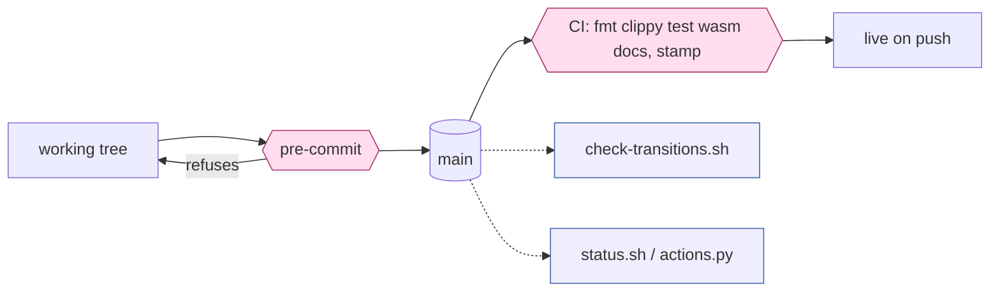
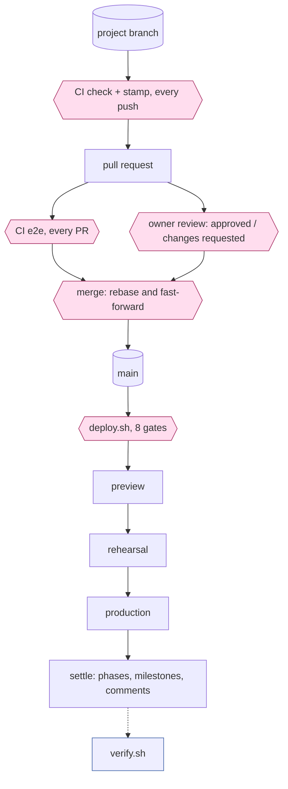
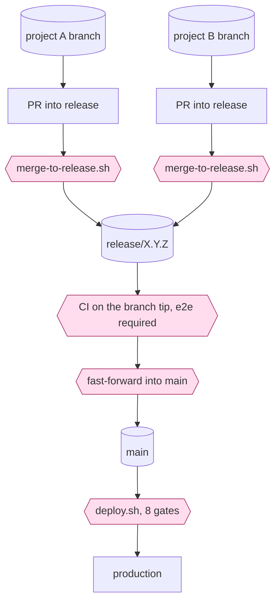
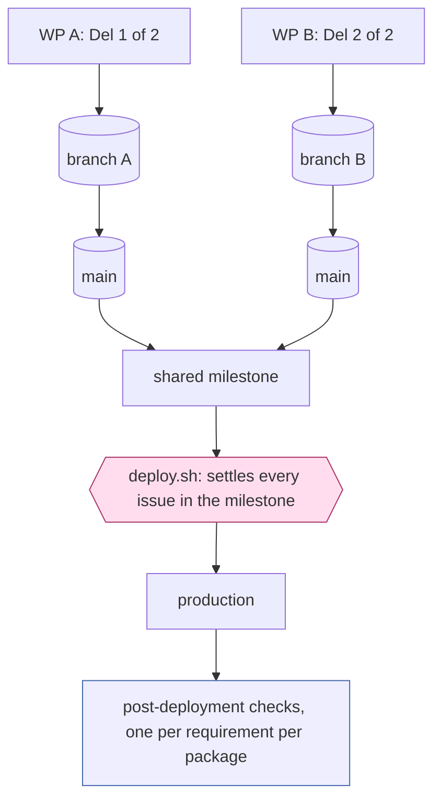
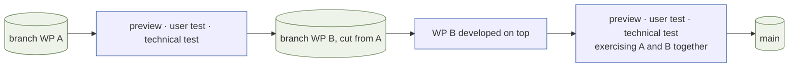
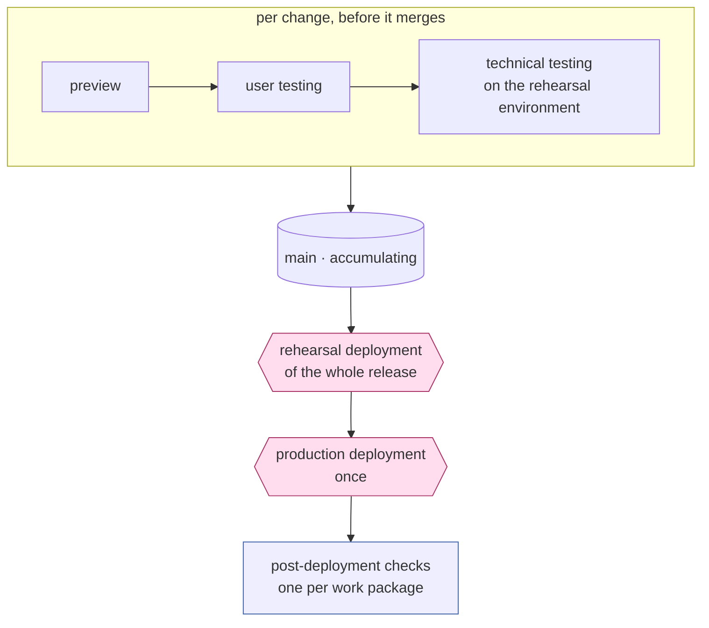

<!-- markdownlint-disable-file MD013 -->
# Delivery flows: what is checked, when, and what it is for

For #383. Owner, 2026-09-16:

> I would like to see flow charts with information flows, checks and gates detailed. What conditions are we checking when? That would have a table of checks and get methods. **This becomes the interface between Claude and Steve for tooling changes.**

So this document is the contract. A tooling change that alters a gate, a check, or what one reads should show up here as a diff, and a proposal expressible here is one that has been thought through.

## How to read it

**A gate refuses and work stops. A check reports and a person decides.** That is CLAUDE.md's distinction and it is drawn in the diagrams: gates are the diamond shapes, checks are the rectangles hanging off the side.

**Purpose before criteria.** Owner, 2026-09-16: *"The requirements should specify what each action, check, decision or gate is trying to achieve and only then the criteria used."* Every row in the tables below names what it is for first. Where a criterion is wider than its purpose — checking on rehearsal what is really a statement about a mechanism — that is a defect, and #252 is a live instance.

**Latency is a property of the consumer.**

| class | tolerance | when the picture is stale |
| --- | --- | --- |
| **gate** | current, and re-read after any write | refuse |
| **verification** | minutes | warn, and print the age |
| **report** | hours | serve it, and print the age |

A stale board makes a report mildly wrong and makes a gate ship the wrong thing.

## The shapes, as examples

A delivery is `{ route, branches }`. The branches say where the change travels; an arrow is a merge into what follows.

**Examples, rather than a catalogue.** Other shapes are legitimate; these are the ones that have happened.

| route | branches | delivered by | pull request | milestone | delivery-log row |
| --- | --- | --- | --- | --- | --- |
| Repository | `None` | the push | — | `pre-approved` | — |
| Repository | `Project -> main` | the merge | one | previous semver plus a letter | one |
| Release | `Project -> main` | the release | one | semver | one |
| Release | `WP A -> main, WP B -> main` | the release | one each | one, shared | one each |
| Release | `WP A -> WP B -> main` | the release | one each | one, shared | one each |
| Release | `WP A -> Release, WP B -> Release` | the release | one each, plus the release | semver | one each |

**Every row is a delivery, and the release is part of it.** Owner, 2026-09-17:

> All of these rows are deliveries so there is no later release. For the release route this is all the changes reaching `main`, together or separately, and then being released together.

So a Release row describes the whole thing: the changes reach `main` — as one branch, as several, or built on each other — and that set is then released. One production deployment ends it.

**`Project -> main` means two different things, and the route is what separates them.** For a Repository change the merge *is* the delivery and nothing follows. For a Release change the merge is a step inside the delivery, which ends at the release. Same branches, different ending, which is why the route column comes first.

### Repository · `None`

Everything is live on push, so the gates are local. The commit is the record.

**`pre-commit` is the whole of this shape's protection**, and it carries three refusals:

| refuses | purpose |
| --- | --- |
| an image change committed on `main` | the image is what production runs, so it reaches main reviewed |
| a new artefact absent from `docs/3.0-tools.md` | a script nobody registered is a script nobody maintains |
| Rust that `rustfmt` would change | a red build and a refused release gate, moved to the cheapest moment |

It also runs `check-docs.sh` when markdown is staged, which is the one place the documents are gated rather than merely checked.

### `Project -> main` · Repository, then Release

**e2e runs on every pull request today, whatever it touches — #348.** For a repository change confined to documents and scripts, that is around seven minutes proving the game still works.

**The diagram above is the Repository ending: the merge delivers and the lap stops there.** A Release change runs the same branch and the same gates, and the delivery continues past the merge to its release — `main` holds it meanwhile, and the deploy gates below are what it must pass.

**Since D55 (#388) this is the default for an image change.** A release-route change merges to `main` once user and technical testing pass, and `main` is the accumulating next release. The owner's reason:

> Releases are simpler if we have a next release branch that accumulates changes. Because of doc and tooling changes it is easier if that is `main`.

**What makes it safe lives in the emergency path.** `main` now carries tested-but-unshipped image changes, so an emergency release cut from `main` ships all of them. `docs/3.3` now says to cut from the last released tag instead. That is a documented procedure today; #387 R2 asks for the report and R3 for the enforcement that would make it a gate.

### Release · `WP A -> Release, WP B -> Release`

**`merge-to-release.sh` asks two questions**: the incoming pull request's own run, and *the release branch tip's* run, both requiring a real `e2e` verdict. The second is why e2e runs on a release branch however little a merge touches — the next merge is judged against the tip this one creates.

### Release · `WP A -> main, WP B -> main`, one milestone

### Release · `WP A -> WP B -> main`

Sequential, and the arrow is doing more work here than a merge. **WP A is tested first; WP B is then developed and tested on top of it, in its own branch.** So B's branch carries A's work, B's testing exercises both, and main receives them together.

Reach for it where B depends on A and A is unready to land alone. Where A can land by itself, the shape is `Project -> main` twice and main carries the sequencing.

## A release delivers once

**One Release delivery is one deployment to production**, whatever it carries, and the deployment is the end of that delivery rather than an event after it.

The testing divides along that line, and the two halves are easy to confuse because they use the same machine:

| | scope | when |
| --- | --- | --- |
| user testing and **technical testing** | one change | before that change merges to main |
| **rehearsal deployment** | the whole release | once, after main is assembled and before production |
| **production deployment** | the whole release | once |
| post-deployment checks | one per work package | after production |

**Technical testing happens to run on the rehearsal environment; the rehearsal deployment is a different act.** The first asks *does this change behave correctly on hardware like production's?* The second asks *does deploying this release work?* — and it can only be asked of the assembled thing, which is why it happens once and late.

Under D55 this is what main accumulating buys: each change is proven on its own, and the release pays for one rehearsal and one deployment rather than one of each per change.

**The milestone is the only thing identifying the group** — there is no issue for it. So *"move out what is not shipping before deploying"* is the whole control: the deploy settles everything in the milestone.

## The table of checks, and how each one gets its answer

Get methods matter because they are where the nine pictures come from. The right-hand column is what the model replaces.

### Gates — `deploy.sh`, in order

| gate | purpose | criteria | get method | latency |
| --- | --- | --- | --- | --- |
| `on-remote` | the build can fetch what it is told to build | sha present on `origin` | `git ls-remote` | current |
| `ci` | the exact tree shipping was tested | push run passed; `--require e2e` on a release | `gh run list --commit` | current |
| `pull-request` | the review's own run agreed | PR run passed; absence said aloud | `gh run list --commit`, filtered to `pull_request` | current |
| `schema` | the image can boot against the live database | target migrations ⊇ database's | `git show` + `/health` | current |
| `version` | what ships is the version claimed | semver agrees across tree, milestone, tag | `git` + `gh api milestones` | current |
| `milestone` | everything shipping was meant to | every open issue in it is built by a commit | `gh api milestones --paginate` + `git log --grep` | current |
| `preview` | the image ran somewhere first | preview answers on the target version | `curl /health` | current |
| `rehearsal` | the image ran under production's shape | rehearsal answers on the target version | `curl /health` | current |
| *settle* | the record matches what shipped | phases, milestones and comments written | `gh` mutations | **re-read after write** |

### Content obligations — `check-transitions.sh`, `verify.sh`, `actions.py`

Grouped by obligation rather than by grep, because the obligation is what the model owes and the greps are today's expression of it.

| obligation | purpose | asked by | get method |
| --- | --- | --- | --- |
| triage complete | a requirement can be scheduled | `check-transitions` | issue fields |
| on hold justified | a stall names something actionable | `check-transitions` | body text |
| scoped | effort known before queueing | `check-transitions` | issue fields |
| project shaped | the seven headings exist to be filled | `check-transitions` | body headings |
| provenance intact | folding a requirement keeps it findable | `check-transitions` | sub-issues + body table |
| route known | something can say whether this reaches users | `check-transitions` | issue fields |
| parent stays a parent | oversight is a design role | `check-transitions` | field + `is_parent` |
| testable | a test approach exists before building | `check-transitions`, `verify` | body headings + checkbox counts |
| built | a milestone's issues are backed by commits | `verify`, `deploy` | `git log --grep` + parentage |
| deliverable | deliveries and their checks are written down | `check-transitions` | body headings |
| closable | the lesson is captured before closing | `check-transitions` | body text + unticked boxes |
| whose turn | what needs the owner is brought to him | `actions.py` | decision state + `reviewDecision` |

**`testable`, `built` and `closable` are each asked by more than one script, in more than one way.** That is the issue in one line.

## What the model must therefore supply

Reading the tables rather than designing from scratch, the snapshot owes exactly:

| | because |
| --- | --- |
| `is_parent`, `is_work_package` | four gates and three checks branch on it, and two copies disagreed — #370 |
| fields resolved **by name** | every consumer matches option ids today |
| `commits` — naming it, and naming its parent, kept apart | the `built` obligation, and #375 |
| `owes` — the obligation list above, per issue | three scripts asking one question three ways |
| `waiting_on` | `actions.py`'s whole purpose |
| `age` on the snapshot itself | so a gate can refuse what a report may serve |

## Still open

| | |
| --- | --- |
| **partial failure** | what the snapshot says when GitHub answers and git stays silent. Today each script decides for itself, mostly by exiting 0 |
| **the obligation table per issue type** | the rows above are the union; the owner's *"each issue type has defined requirements for each lifecycle step"* means a grid, and closedown is its last row |
| **where the exception lives** | *"associated doc changes might go with a release"* is the case that produced the heaviest-artefact fudge; it needs writing as an exception rather than left to erode the branch-chain rule |
