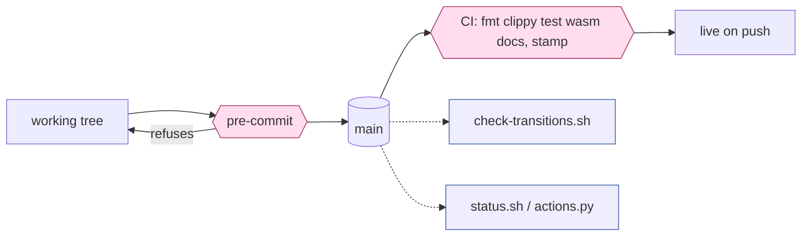
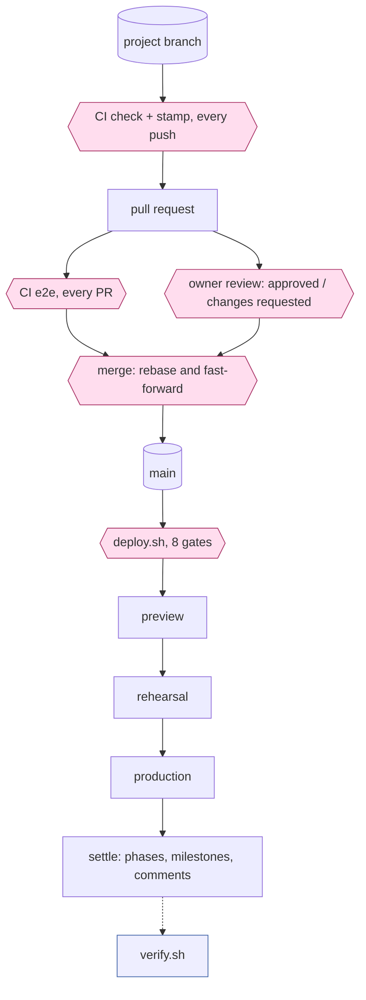
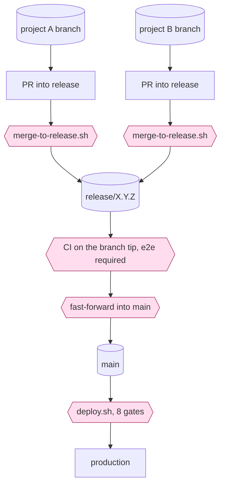
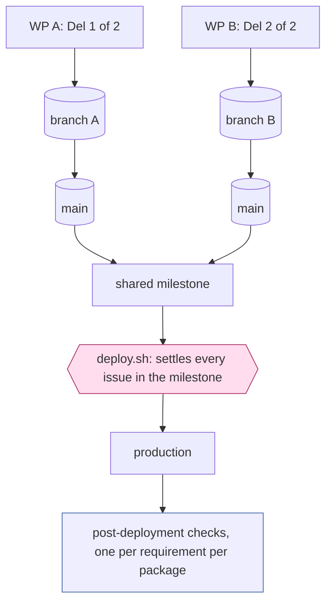

<!-- markdownlint-disable-file MD013 -->
# Delivery flows: what is checked, when, and what it is for

For #383. Owner, 2026-09-16:

> I would like to see flow charts with information flows, checks and gates detailed. What conditions are we checking when? That would have a table of checks and get methods. **This becomes the interface between Claude and Steve for tooling changes.**

So this document is the contract. A tooling change that alters a gate, a check, or what one reads should show up here as a diff, and a proposal that cannot be expressed here is a proposal that has not been thought through.

## How to read it

**A gate refuses and work stops. A check reports and a person decides.** That is CLAUDE.md's distinction and it is drawn in the diagrams: gates are the diamond shapes, checks are the rectangles hanging off the side.

**Purpose before criteria.** Owner, 2026-09-16: *"The requirements should specify what each action, check, decision or gate is trying to achieve and only then the criteria used."* Every row in the tables below names what it is for first. Where a criterion is wider than its purpose — checking on rehearsal what is really a statement about a mechanism — that is a defect, and #252 is a live instance.

**Latency is a property of the consumer, not of the board.**

| class | tolerance | when the picture is stale |
| --- | --- | --- |
| **gate** | current, and re-read after any write | refuse |
| **verification** | minutes | warn, and print the age |
| **report** | hours | serve it, and print the age |

A stale board makes a report mildly wrong and makes a gate ship the wrong thing.

## The lanes

A delivery is `{ route, branches }`, and the branch chain is what decides which lane it runs in.

| branches | lane | pull request | milestone | delivery-log row |
| --- | --- | --- | --- | --- |
| `None` | straight to main | no | `pre-approved` | no |
| `[Project]` | project branch | yes | letter or semver | yes |
| `[Project, Release]` | project into release | yes, twice | semver | yes |
| `[WP_A, WP_B]` | work packages sharing a milestone | one each | one, shared | one each |

### Lane 1 — straight to main

Nothing is held back, so the only gates are local. The commit is the record.

**`pre-commit` is the whole of this lane's protection**, and it carries three refusals:

| refuses | purpose |
| --- | --- |
| an image change committed on `main` | the image is what production runs; it cannot reach main unreviewed |
| a new artefact absent from `docs/3.0-tools.md` | a script nobody registered is a script nobody maintains |
| Rust that `rustfmt` would change | a red build and a refused release gate, moved to the cheapest moment |

It also runs `check-docs.sh` when markdown is staged, which is the one place the documents are gated rather than merely checked.

### Lane 2 — a project branch

**e2e runs on every pull request today, whatever it touches — #348.** For a repository change that reaches nothing in the image, that is around seven minutes proving a document has not broken the game.

**This lane has a hazard for image changes, and the diagram above draws it as legitimate — #387.** Owner, 2026-09-16:

> It shouldn't really be merged to main, but go via a release branch, otherwise any emergency release will ship it.

`main` is the deploy source, so merging an image change into it is not *finished*, it is **queued for whoever deploys next** — including an emergency release cut to restore service, whose author is in no position to audit what else has accumulated. Lane 3 exists partly to avoid this and nothing obliges an image change to use it.

Until #387 settles that, the honest reading of this lane is: **safe for a repository change, and a deliberate decision for an image one.**

### Lane 3 — a project into a release branch

**`merge-to-release.sh` asks two questions, not one**: the incoming pull request's own run, and *the release branch tip's* run, both requiring a real `e2e` verdict. The second is why e2e cannot be skipped on a release branch however little a merge touches — the next merge is judged against the tip this one creates.

### Lane 4 — work packages sharing a milestone

**The milestone is the only thing identifying the group** — there is no issue for it. So *"move out what is not shipping before deploying"* is not advice, it is the only control: the deploy settles everything in the milestone.

## The table of checks, and how each one gets its answer

Get methods matter because they are where the nine pictures come from. The right-hand column is what the model replaces.

### Gates — `deploy.sh`, in order

| gate | purpose | criteria | get method | latency |
| --- | --- | --- | --- | --- |
| `on-remote` | the build can fetch what it is told to build | sha present on `origin` | `git ls-remote` | current |
| `ci` | the exact tree shipping was tested | push run passed; `--require e2e` on a release | `gh run list --commit` | current |
| `pull-request` | the review's own run agreed | PR run passed; absence said aloud | `gh run list --commit`, filtered to `pull_request` | current |
| `schema` | the image can boot against the live database | target migrations ⊇ database's | `git show` + `/health` | current |
| `version` | what ships is the version claimed | semver agrees across tree, milestone, tag | `git` + `gh api milestones` | current |
| `milestone` | nothing ships that was not meant to | every open issue in it is built by a commit | `gh api milestones --paginate` + `git log --grep` | current |
| `preview` | the image ran somewhere first | preview answers on the target version | `curl /health` | current |
| `rehearsal` | the image ran under production's shape | rehearsal answers on the target version | `curl /health` | current |
| *settle* | the record matches what shipped | phases, milestones and comments written | `gh` mutations | **re-read after write** |

### Content obligations — `check-transitions.sh`, `verify.sh`, `actions.py`

Grouped by obligation rather than by grep, because the obligation is what the model owes and the greps are today's expression of it.

| obligation | purpose | asked by | get method |
| --- | --- | --- | --- |
| triage complete | a requirement can be scheduled | `check-transitions` | issue fields |
| on hold justified | a stall names something actionable | `check-transitions` | body text |
| scoped | effort known before queueing | `check-transitions` | issue fields |
| project shaped | the seven headings exist to be filled | `check-transitions` | body headings |
| provenance intact | folding a requirement does not lose it | `check-transitions` | sub-issues + body table |
| route known | something can say whether this reaches users | `check-transitions` | issue fields |
| parent stays a parent | oversight is a design role, not a build one | `check-transitions` | field + `is_parent` |
| testable | a test approach exists before building | `check-transitions`, `verify` | body headings + checkbox counts |
| built | a milestone's issues are backed by commits | `verify`, `deploy` | `git log --grep` + parentage |
| deliverable | deliveries and their checks are written down | `check-transitions` | body headings |
| closable | the lesson is captured before closing | `check-transitions` | body text + unticked boxes |
| whose turn | the owner is not made to scan the board | `actions.py` | decision state + `reviewDecision` |

**`testable`, `built` and `closable` are each asked by more than one script, in more than one way.** That is the issue in one line.

## What the model must therefore supply

Reading the tables rather than designing from scratch, the snapshot owes exactly:

| | because |
| --- | --- |
| `is_parent`, `is_work_package` | four gates and three checks branch on it, and two copies disagreed — #370 |
| fields resolved **by name** | every consumer matches option ids today |
| `commits` — naming it, and naming its parent, kept apart | the `built` obligation, and #375 |
| `owes` — the obligation list above, per issue | three scripts asking one question three ways |
| `waiting_on` | `actions.py`'s whole purpose |
| `age` on the snapshot itself | so a gate can refuse what a report may serve |

## What this does not yet settle

| | |
| --- | --- |
| **partial failure** | what the snapshot says when GitHub answers and git does not. Today each script decides for itself, mostly by exiting 0 |
| **the obligation table per issue type** | the rows above are the union; the owner's *"each issue type has defined requirements for each lifecycle step"* means a grid, and closedown is its last row |
| **where the exception lives** | *"associated doc changes might go with a release"* is the case that produced the heaviest-artefact fudge; it needs writing as an exception rather than left to erode the branch-chain rule |
