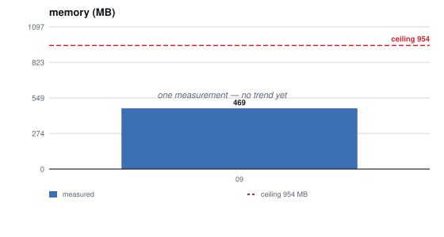
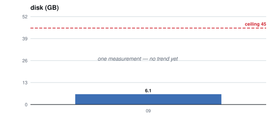
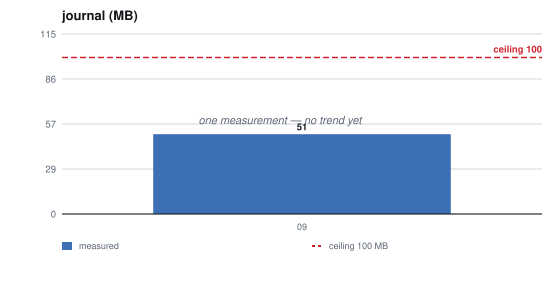
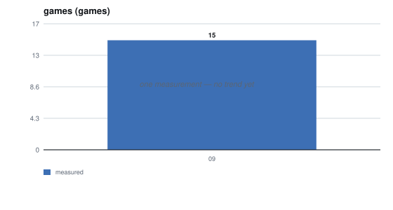
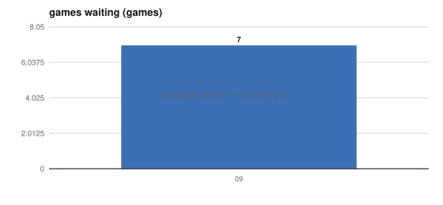
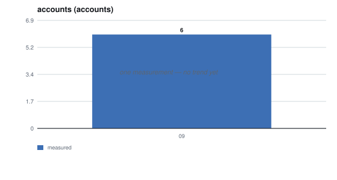

# Capacity plan, September 2026

`TLE_CP_2026_09`

**Measured on production, 2026-09-21.** The first of these. It answers #291 R1 —
what is consumed, against what ceiling, and what would have to change before the
ceiling is reached — and it is re-made monthly rather than when somebody
remembers.

## What is consumed, against what ceiling

| | consumed | ceiling | headroom |
| --- | --- | --- | --- |
| **memory** | 469 MB | 954 MB | 51% |
| — server container | 75 MB | | |
| — web container | 34 MB | | |
| **disk** | 6.1 GB | 45 GB | 86% |
| **journal** | 51 MB | 100 MB / 7 days | 49% |
| **CPU** | load 0.00 | 2 vCPU | effectively all of it |
| **games in the database** | 15 | *unbounded — see below* | not knowable |
| **accounts** | 6 | none set | not knowable |

**Nothing is close to a ceiling.** That is the useful result of measuring rather
than arguing: what this month's plan owes is not relief, it is knowing *which*
number moves first and what moves it.

## Which number moves first

**The games table, and it is the only unbounded thing here.** `AppState::new`
loads every game into a map at boot — `persistence.rs:448`,
`select id from games order by created_at desc`, no `where` clause — so boot
time and resident memory scale with the row count.

| status | swept by | bounded |
| --- | --- | --- |
| `finished`, `aborted` | `expire_old_terminal_games`, a week after `ended_at` | **yes** |
| `active` | `expire_overdue_turns` retires a seat past its move limit | **yes, eventually** |
| **`waiting`** | **nothing today** | **no** |

**Seven of the fifteen games are `waiting`, idle 46 to 62 days.** A waiting game
has no current seat, so the move-timeout sweep never looks at it, and it is not
terminal, so the terminal sweep never looks at it either. Each is loaded at every
boot for the life of the service.

**RET-3 is the answer and it is not built.** *A game that never started runs a
thirty-day countdown from its last activity; seven days in, its creator is asked
what to do with it.* The build is #68, closed into #270. Until it lands, this row
grows with every abandoned game — which is the common case, because abandoning
costs nothing.

## What would have to change before a ceiling is reached

| ceiling | reached by | what would have to change |
| --- | --- | --- |
| memory, 954 MB | the games map growing without RET-3 | build RET-3, or load games on demand — the second costs a cache policy and an eviction rule |
| journal, 100 MB / 7 days | logging per request rather than per domain event | it is at half now on domain events alone; per-request logging is a volume decision, not a capability one (#402) |
| disk, 45 GB | nothing currently on a slope | — |
| CPU, 2 vCPU | engine search under concurrent games | unmeasured. #91 is what would measure it |

## History, and where it is heading

**One column, because this is the first.** The table below is the shape the next
one fills in, and it is the reason each report carries a window rather than only
its own figures.

| | 2026-09 |
| --- | --- |
| memory | 469 MB |
| disk | 6.1 GB |
| journal | 51 MB |
| games | 15 |
| — of them `waiting` | 7 |
| accounts | 6 |

### What the forecast says, and how much to believe it

| metric | forecast | value at +6 | peak | RRMSE | meets ceiling |
| --- | --- | --- | --- | --- | --- |
| **memory** | not enough data | | | | |
| **disk** | not enough data | | | | |
| **journal** | not enough data | | | | |
| **games** | not enough data | | | | |
| **games waiting** | not enough data | | | | |
| **accounts** | not enough data | | | | |

**Every row says the same thing and it is the right answer**, not an empty
table. A trend needs two points and a reliability needs three, so this report
can state what is consumed and cannot state where it is going. The December
report is the first that can fill this in.

### Each metric, against its ceiling

Generated by `scripts/capacity-chart.py --write` from `measurements.csv`, never
drawn by hand. The bars are measurements and the dashed red line is the ceiling.
A green trend appears once there are two points to fit, and its prediction
interval once there are three — a band that widens with distance, because six
periods out is a worse guess than one.

| | |
| --- | --- |
|  |  |
|  |  |
|  |  |

**Nothing can be extrapolated from one column**, and saying so is the honest
report rather than a gap in it. What can be said now, from the account dates
rather than from a trend:

- **accounts are flat.** Six, and the newest was created 2026-08-10 — six weeks
  before this measurement. Nothing is growing here yet
- **games will grow with `waiting` until RET-3 is built**, because nothing
  removes a game that never started. Seven of fifteen are already in that state
- **no row has a ceiling within reach**, so no date can be given for one

**The next report is the first that can say anything about direction.** Two
columns turn every line above from an assertion into an observation.

## What is not known, and is the next thing worth measuring

**Where the service breaks.** #91 asks for it and nothing has measured it. Every
number above is a *resting* figure taken from a service nobody was using at the
time, so none of them says what happens under load. The plan is worth more once
there is a row saying *registrations fail at N per minute* beside the ceiling
that N is forty times away from.

**Account growth has no ceiling set.** Six accounts, and nothing says what number
would be a problem or at what rate. #291 R3 owes that rate.

## How this was measured

Memory, disk, journal and load: read on the production host. Games by status and
account count: the admin CLI over loopback, run by the owner —
`sa games list`, `sa users list`. Container figures: `docker stats`.

**Nothing here was posted by the application.** D49: the application holds no OCI
credential, and a capacity figure is read by a person or by the host, never
reached out for by the service.
